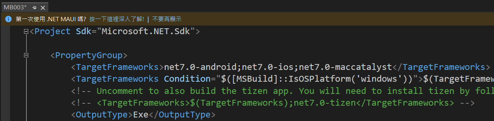

# 將原生 .NET MAUI 專案轉換成為 .NET MAUI Blazor Hybrid 開發模式?


傳統上要開發一個 [.NET MAUI] 行動應用專案，需要使用 [XAML] 來描述與設計出螢幕畫面的內容，若是想要使用 [HTML + CSS] (更簡單的講，就是使用 Blazor 方式來進行行動應用專案開發) 方式來進行行動應用程式專案，就需要使用 [.NET MAUI Blazor Hybrid] 方式來開發。

若當初採用 [.NET MAUI] + [XAML] 方式進行行動應用程式開發的專案，想要部分功能或者頁面要採用 [Blazor : HTML + CSS] 方式來進行混合式開發，又或者想要把全部原本採用 XAML 方式開發的頁面，全部都改寫成 [Blazor] 方式，此時，對於原先專案要做那些修改便可以直接轉換成為 XAML + HTML 的混合模式開發。

在這篇文章中，將會建立兩個 .NET MAUI 專案，一個是屬於專案範本內的 [.NET MAUI 應用程式]，這種類型的專案將會使用 [XAML] 來進行開發，另外一種則是專案範本內的 [.NET MAUI Blazor 應用程式]，這種類型的專案將會採用混合模式進行開發，而主要的畫面則是採用 [Blazor] 來宣告，最後來比較與分析這兩種專案的差異在哪裡，要如何把純 XAML 類型的專案，變更成為具有 Blazor 方式開發的專案。

為了要觀察這樣的差異與變化，首先需要來分別從專案範本中來選擇這兩種項目來建立專案，並且，為了簡化過程，這兩個的專案名稱都是相同的。接著，嘗試把 [.NET MAUI 應用程式] 改寫成為具有 [.NET MAUI Blazor 應用程式] 開發效果的專案，從此，便可以得到一個在 .NET MAUI 專案內，可以使用 Blazor 開發的專案了。

## 建立 .NET MAUI 應用程式 專案

為了要了解甚麼是 Razor Component，現在來由 Blazor 專案範本建立一個專案，實際觀察 Razor Component 樣貌。

* 打開 Visual Studio 2022 IDE 應用程式
* 從 [Visual Studio 2022] 對話窗中，點選右下方的 [建立新的專案] 按鈕
* 在 [建立新專案] 對話窗右半部
  * 切換 [所有語言 (L)] 下拉選單控制項為 [C#]
  * 切換 [所有專案類型 (T)] 下拉選單控制項為 [MAUI]
* 在中間的專案範本清單中，找到並且點選 [.NET MAUI 應用程式] 專案範本選項
  > 此專案可用於建立適用於 iOS、Android、Mac Catalyst、Tizen 和 WinUI 的 .NET MAUI 應用程式。

  
* 點選右下角的 [下一步] 按鈕
* 在 [設定新的專案] 對話窗
* 找到 [專案名稱] 欄位，輸入 `MB003` 作為專案名稱
* 在剛剛輸入的 [專案名稱] 欄位下方，確認沒有勾選 [將解決方案與專案至於相同目錄中] 這個檢查盒控制項
* 點選右下角的 [下一步] 按鈕
* 現在將會看到 [其他資訊] 對話窗
* 在 [架構] 欄位中，請選擇最新的開發框架，這裡選擇的 [架構] 是 : `.NET 7.0 (標準字詞支援)`
* 請點選右下角的 [建立] 按鈕
* 稍微等候一下，這個 [.NET MAUI 應用程式] 專案將會建立完成
* 底下將會是產生出來的 [.NET MAUI 應用程式] 專案結構

  

* 在底下的文章中，將會稱這個專案為 [MAUI 專案]

## 建立 .NET MAUI 應用程式 專案

為了要了解甚麼是 Razor Component，現在來由 Blazor 專案範本建立一個專案，實際觀察 Razor Component 樣貌。

* 打開 Visual Studio 2022 IDE 應用程式
* 從 [Visual Studio 2022] 對話窗中，點選右下方的 [建立新的專案] 按鈕
* 在 [建立新專案] 對話窗右半部
  * 切換 [所有語言 (L)] 下拉選單控制項為 [C#]
  * 切換 [所有專案類型 (T)] 下拉選單控制項為 [MAUI]
* 在中間的專案範本清單中，找到並且點選 [.NET MAUI Blazor 應用程式] 專案範本選項
  > 此專案可用於建立適用於 iOS、Android、Mac Catalyst、Tizen 和使用 Blazor的 WinUI 的 .NET MAUI 應用程式。

  
* 點選右下角的 [下一步] 按鈕
* 在 [設定新的專案] 對話窗
* 找到 [專案名稱] 欄位，輸入 `MB003` 作為專案名稱
* 在剛剛輸入的 [專案名稱] 欄位下方，確認沒有勾選 [將解決方案與專案至於相同目錄中] 這個檢查盒控制項
* 點選右下角的 [下一步] 按鈕
* 現在將會看到 [其他資訊] 對話窗
* 在 [架構] 欄位中，請選擇最新的開發框架，這裡選擇的 [架構] 是 : `.NET 7.0 (標準字詞支援)`
* 請點選右下角的 [建立] 按鈕
* 稍微等候一下，這個 [.NET MAUI Blazor 應用程式] 專案將會建立完成
* 底下將會是產生出來的 [.NET MAUI Blazor 應用程式] 專案結構

  

* 在底下的文章中，將會稱這個專案為 [MAUI Blazor 專案]

## 將 .NET MAUI 專案轉換成為 .NET MAUI Blazor 專案

* 根據剛剛建立的兩個專案在方案總管視窗上看到的差異
* 現在需要在 [MAUI 專案] 轉換成為能夠使用 Blazor 技術來開發
* 因此，需要在 [MAUI 專案] 上建立一些資料夾
* 切換到 [MAUI 專案] 的 Visual Studio 2022 視窗上
* 使用滑鼠雙擊 [MB003] 專案節點
* 將會看到底下的內容

  
* 請將第一行的 `<Project Sdk="Microsoft.NET.Sdk">` 修改成為 `<Project Sdk="Microsoft.NET.Sdk.Razor">`
* 找到 `<ImplicitUsings>enable</ImplicitUsings>` 屬性宣告，並且在其下方加入 `<EnableDefaultCssItems>false</EnableDefaultCssItems>` 這樣的屬性宣告
* 修改完成後，這個專案設定檔案將會成為底下螢幕截圖

  
* 為了要讓剛剛修正能夠生效
* 關閉這個專案，並且重新開啟這個專案
* 一旦這個 [MAUI 專案] 開啟之後
* 滑鼠右擊專案節點
* 從彈出功能表，點選 [加入] > [新增資料夾] 功能選項項目
* 將剛剛產生的資料夾重新命名為 [wwwroot]
* 滑鼠右擊專案節點
* 從彈出功能表，點選 [加入] > [新增資料夾] 功能選項項目
* 將剛剛產生的資料夾重新命名為 [Pages]
* 滑鼠右擊專案節點
* 從彈出功能表，點選 [加入] > [新增資料夾] 功能選項項目
* 將剛剛產生的資料夾重新命名為 [Shared]
* 滑鼠右擊 [MAUI 專案] 內的 [Shared] 資料夾
* 從彈出功能表視窗中，點選 [加入] > [Razor 元件]
  >若操作到這裡沒有看到 [Razor 元件] 功能表選項，請重新確認上面提到的設定檔案內容是否修正完成，最後，是否有重新關閉、開啟 Visual Studio 2022
* 當 [新增項目] 對話視窗顯示之後
* 在該對話窗下方的名稱欄位，輸入 `MainLayout.razor` 做為這個 Razor 元件的檔案名稱
* 點選對話窗右下方的 [新增] 按鈕
* 將底下的 Razor 內容取代剛剛建立的檔案

```html
@inherits LayoutComponentBase

<div class="page">
    <div class="sidebar">
        <NavMenu />
    </div>

    <main>
        <div class="top-row px-4">
            <a href="https://docs.microsoft.com/aspnet/" target="_blank">About</a>
        </div>

        <article class="content px-4">
            @Body
        </article>
    </main>
</div>
```

* 滑鼠右擊 [MAUI 專案] 內的 [Shared] 資料夾
* 從彈出功能表視窗中，點選 [加入] > [新增項目]
* 當 [新增項目] 對話視窗顯示之後
* 點選最左方選項清單的 [已安裝] > [C# 項目] > [Web] > [樣式表]
* 在該對話窗下方的名稱欄位，輸入 `MainLayout.razor.css` 做為這個 Razor 元件的檔案名稱

  
* 點選對話窗右下方的 [新增] 按鈕
* 將底下的 css 內容取代剛剛建立的檔案

```css
.page {
    position: relative;
    display: flex;
    flex-direction: column;
}

main {
    flex: 1;
}

.sidebar {
    background-image: linear-gradient(180deg, rgb(5, 39, 103) 0%, #3a0647 70%);
}

.top-row {
    background-color: #f7f7f7;
    border-bottom: 1px solid #d6d5d5;
    justify-content: flex-end;
    height: 3.5rem;
    display: flex;
    align-items: center;
}

    .top-row ::deep a, .top-row ::deep .btn-link {
        white-space: nowrap;
        margin-left: 1.5rem;
        text-decoration: none;
    }

    .top-row ::deep a:hover, .top-row ::deep .btn-link:hover {
        text-decoration: underline;
    }

    .top-row ::deep a:first-child {
        overflow: hidden;
        text-overflow: ellipsis;
    }

@media (max-width: 640.98px) {
    .top-row:not(.auth) {
        display: none;
    }

    .top-row.auth {
        justify-content: space-between;
    }

    .top-row ::deep a, .top-row ::deep .btn-link {
        margin-left: 0;
    }
}

@media (min-width: 641px) {
    .page {
        flex-direction: row;
    }

    .sidebar {
        width: 250px;
        height: 100vh;
        position: sticky;
        top: 0;
    }

    .top-row {
        position: sticky;
        top: 0;
        z-index: 1;
    }

    .top-row, article {
        padding-left: 2rem !important;
        padding-right: 1.5rem !important;
    }
}
```

* 滑鼠右擊 [MAUI 專案] 內的 [Shared] 資料夾
* 從彈出功能表視窗中，點選 [加入] > [Razor 元件]
* 當 [新增項目] 對話視窗顯示之後
* 在該對話窗下方的名稱欄位，輸入 `NavMenu.razor` 做為這個 Razor 元件的檔案名稱
* 點選對話窗右下方的 [新增] 按鈕
* 將底下的 Razor 內容取代剛剛建立的檔案

```html
<div class="top-row ps-3 navbar navbar-dark">
    <div class="container-fluid">
        <a class="navbar-brand" href="">MB003</a>
        <button title="Navigation menu" class="navbar-toggler" @onclick="ToggleNavMenu">
            <span class="navbar-toggler-icon"></span>
        </button>
    </div>
</div>

<div class="@NavMenuCssClass" @onclick="ToggleNavMenu">
    <nav class="flex-column">
        <div class="nav-item px-3">
            <NavLink class="nav-link" href="" Match="NavLinkMatch.All">
                <span class="oi oi-home" aria-hidden="true"></span> Home
            </NavLink>
        </div>
        <div class="nav-item px-3">
            <NavLink class="nav-link" href="counter">
                <span class="oi oi-plus" aria-hidden="true"></span> Counter
            </NavLink>
        </div>
        <div class="nav-item px-3">
            <NavLink class="nav-link" href="fetchdata">
                <span class="oi oi-list-rich" aria-hidden="true"></span> Fetch data
            </NavLink>
        </div>
    </nav>
</div>

@code {
    private bool collapseNavMenu = true;

    private string NavMenuCssClass => collapseNavMenu ? "collapse" : null;

    private void ToggleNavMenu()
    {
        collapseNavMenu = !collapseNavMenu;
    }
}
```

* 滑鼠右擊 [MAUI 專案] 內的 [Shared] 資料夾
* 從彈出功能表視窗中，點選 [加入] > [新增項目]
* 當 [新增項目] 對話視窗顯示之後
* 點選最左方選項清單的 [已安裝] > [C# 項目] > [Web] > [樣式表]
* 在該對話窗下方的名稱欄位，輸入 `NavMenu.razor.css` 做為這個 Razor 元件的檔案名稱
* 點選對話窗右下方的 [新增] 按鈕
* 將底下的 css 內容取代剛剛建立的檔案

```css
.navbar-toggler {
    background-color: rgba(255, 255, 255, 0.1);
}

.top-row {
    height: 3.5rem;
    background-color: rgba(0,0,0,0.4);
}

.navbar-brand {
    font-size: 1.1rem;
}

.oi {
    width: 2rem;
    font-size: 1.1rem;
    vertical-align: text-top;
    top: -2px;
}

.nav-item {
    font-size: 0.9rem;
    padding-bottom: 0.5rem;
}

    .nav-item:first-of-type {
        padding-top: 1rem;
    }

    .nav-item:last-of-type {
        padding-bottom: 1rem;
    }

    .nav-item ::deep a {
        color: #d7d7d7;
        border-radius: 4px;
        height: 3rem;
        display: flex;
        align-items: center;
        line-height: 3rem;
    }

.nav-item ::deep a.active {
    background-color: rgba(255,255,255,0.25);
    color: white;
}

.nav-item ::deep a:hover {
    background-color: rgba(255,255,255,0.1);
    color: white;
}

@media (min-width: 641px) {
    .navbar-toggler {
        display: none;
    }

    .collapse {
        /* Never collapse the sidebar for wide screens */
        display: block;
    }
}
```

* 滑鼠右擊 [MAUI 專案] 節點
* 從彈出功能表視窗中，點選 [加入] > [新增項目]
* 當 [新增項目] 對話視窗顯示之後
* 確認中間預設為 [Razor 元件] 項目
  >若沒有看到這個 [Razor 元件] 這個項目，點選左方的 [已安裝] > [C# 項目]，就會看到這個項目出現在中間區域的第一個
* 在該對話窗下方的名稱欄位，輸入 `Main.razor` 做為這個 Razor 元件的檔案名稱

  
* 點選對話窗右下方的 [新增] 按鈕
* 將底下的 Razor 內容取代剛剛建立的檔案

```html
<Router AppAssembly="@typeof(Main).Assembly">
    <Found Context="routeData">
        <RouteView RouteData="@routeData" DefaultLayout="@typeof(MainLayout)" />
        <FocusOnNavigate RouteData="@routeData" Selector="h1" />
    </Found>
    <NotFound>
        <LayoutView Layout="@typeof(MainLayout)">
            <p role="alert">Sorry, there's nothing at this address.</p>
        </LayoutView>
    </NotFound>
</Router>
```

* 滑鼠右擊 [MAUI 專案] 節點
* 從彈出功能表視窗中，點選 [加入] > [新增項目] > [Razor 元件]
* 當 [新增項目] 對話視窗顯示之後
* 在該對話窗下方的名稱欄位，輸入 `_Imports.razor` 做為這個 Razor 元件的檔案名稱
* 點選對話窗右下方的 [新增] 按鈕
* 將底下的 Razor 內容取代剛剛建立的檔案

```html
@using System.Net.Http
@using Microsoft.AspNetCore.Components.Forms
@using Microsoft.AspNetCore.Components.Routing
@using Microsoft.AspNetCore.Components.Web
@using Microsoft.AspNetCore.Components.Web.Virtualization
@using Microsoft.JSInterop
@using MB003
@using MB003.Shared
```

* 最後要來處理 [wwwroot] 資料夾內的檔案內容
* 由於這個資料下有很多的檔案，所以，在這裡將會採用另外一種做法，直接從 [MAUI Blazor 專案] 專案內，把 [wwwroot] 下的檔案，複製到 [MAUI 專案] 內。
* 切換到 [MAUI Blazor 專案] 下
* 滑鼠右擊專案節點下的 [wwwroot] 節點
* 從彈出功能表中找到並且點選 [複製] 功能表選項，複製 [wwwroot] 資料夾目錄到剪貼簿內
 
  

* 切換到 [MAUI 專案] 下
* 滑鼠右擊專案節點
* 從彈出功能表中找到並且點選 [貼上] 功能表選項，將剪貼簿內的檔案內容，複製到這個 [MAUI 專案] 專案內。 
* 由於現在專案內已經有存在 [wwwroot] 資料夾，所以會出現底下的 [合併資料夾] 對話窗

  

* 從這個對話窗中，勾選 [套用至所有項目] 檢查盒，接著，點選 [是] 按鈕

* 滑鼠右擊 [MAUI 專案] 專案節點下的 [Pages] 資料夾
* 從彈出功能表視窗中，點選 [加入] > [Razor 元件]
* 當 [新增項目] 對話視窗顯示之後
* 在該對話窗下方的名稱欄位，輸入 `Index.razor` 做為這個 Razor 元件的檔案名稱
* 點選對話窗右下方的 [新增] 按鈕
* 將底下的 Razor 內容取代剛剛建立的檔案

```html
@page "/"

<h1>Hello, world!</h1>

Welcome to your new app.
```

* 滑鼠右擊 [MAUI 專案] 專案節點
* 從彈出功能表視窗中，點選 [加入] > [新增項目]
* 當 [新增項目] 對話視窗顯示之後
* 在該對話窗的左方的新增項目選項清單中
* 點選 [已安裝] > [C# 項目] > [.NET MAUI]
* 在對話窗中間找到 [.NET MAUI ContentPage (XAML)] 這個項目
* 在對話窗下方的名稱欄位輸入 `HelloBlazor.xaml`
* 點選對話窗右下方的 [新增] 按鈕
* 將底下的 XAML 內容取代剛剛建立的檔案

```html
<?xml version="1.0" encoding="utf-8" ?>
<ContentPage xmlns="http://schemas.microsoft.com/dotnet/2021/maui"
             xmlns:x="http://schemas.microsoft.com/winfx/2009/xaml"
             xmlns:local="clr-namespace:MB003"
             x:Class="MB003.HelloBlazor"
             Title="HelloBlazor">

    <BlazorWebView x:Name="blazorWebView" HostPage="wwwroot/index.html">
        <BlazorWebView.RootComponents>
            <RootComponent Selector="#app" ComponentType="{x:Type local:Main}" />
        </BlazorWebView.RootComponents>
    </BlazorWebView>

</ContentPage>
```

* 在專案根目錄下，找到 [AppShell.xaml] 並且打開這個檔案
* 找到這行 `ContentTemplate="{DataTemplate local:MainPage}"` 標記
* 將其替換成為 `ContentTemplate="{DataTemplate local:HelloBlazor}"`

* 在專案根目錄下，找到 [MauiProgram.cs] 並且打開這個檔案
* 找到這行 `#if DEBUG` 敘述
* 在這行敘述上方加入 `builder.Services.AddMauiBlazorWebView();` C# 敘述

## 測試結果

經過一連串的修正動作，現在已經把原先使用 [.NET MAUI 應用程式] 建立好的專案，修正能夠在這個專案內跑 Blazor UI Toolkit 工具集

現在執行這個專案，看看執行結果

* 在 Windows 下執行結果

  

* 在 Android 下執行結果

  

