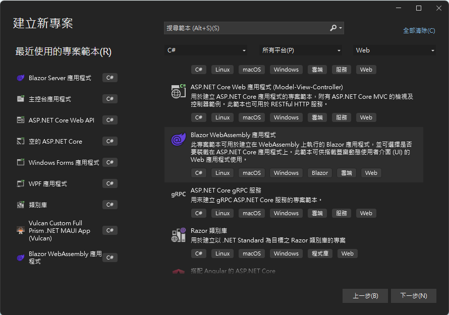
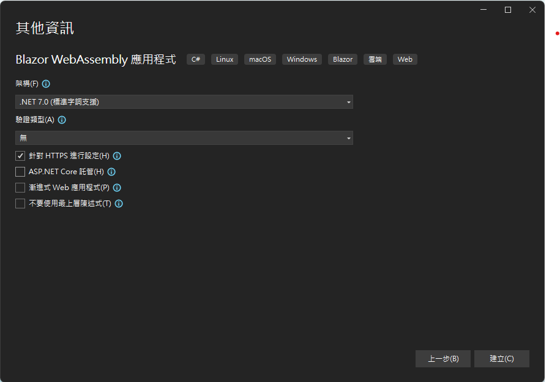
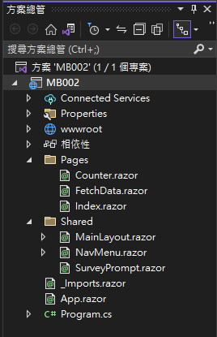
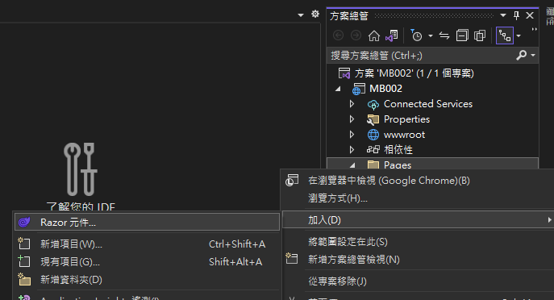
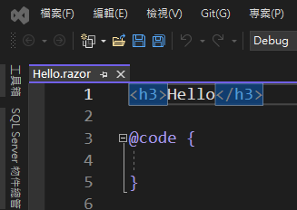
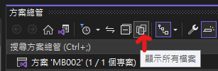
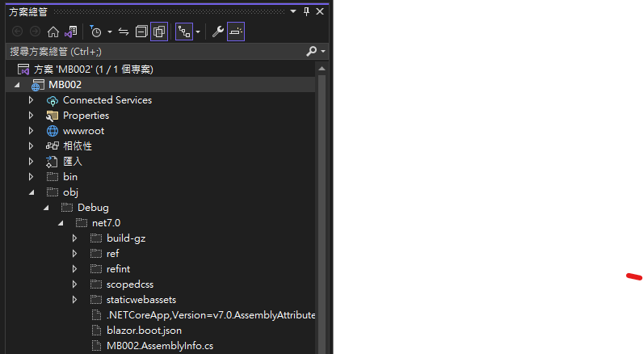
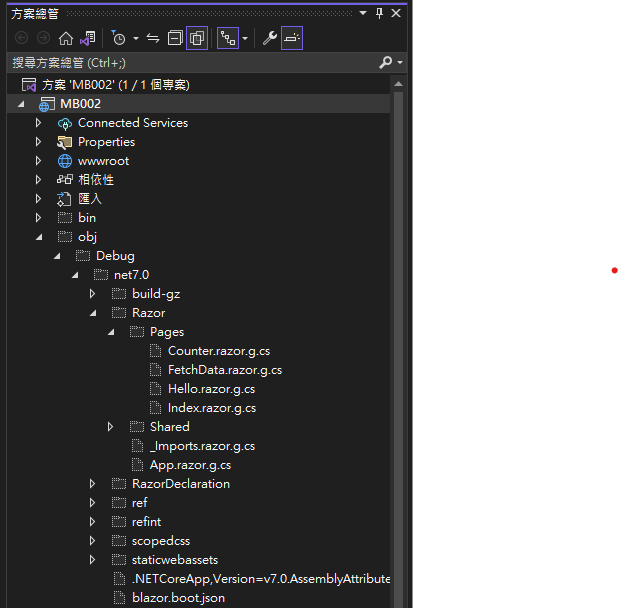
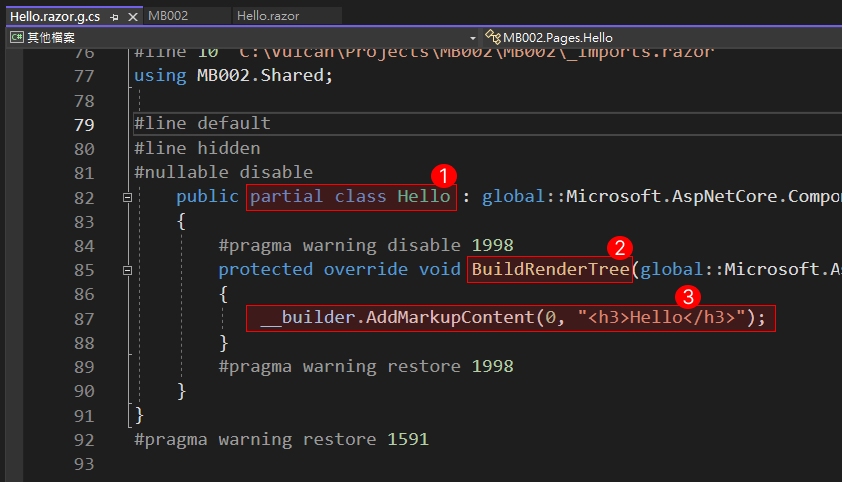
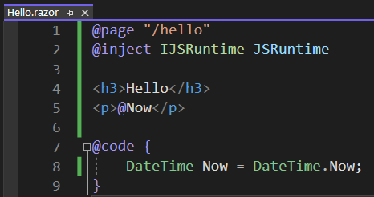

# 觀察 Razor Directive 做了甚麼事情?


Razor 是 ASP.NET Core 中用來撰寫動態網頁的標記語法，它可以讓我們在 HTML 中嵌入 C# 程式碼，並在伺服器端執行，透過這樣機制來設計出來的網站服務，當瀏覽器端需要取得一個使用 Razor 語法設計的網頁時候，此時，在後端伺服器上便會開始執行該網頁上的 C# 程式碼，將執行後的結果與當前的 HTML 結合，如此，便會看到一個動態、具有最新狀態的網頁了，因此，當後端伺服器的網頁上有了 Razor 語法這樣優秀的能這樣優秀的能力之後，就不再是單純的靜態內容網站了。

Razor Directive 指示詞是一種特殊的 Razor 標記，以 **@** 符號開頭，後面接一個保留的關鍵字，用來控制 Razor 編譯器的行為或設定 Razor 頁面的屬性。若是採用傳統採的 MVC 與 Razor Page 方式開發出來的網站服務，在這裡所用到的 Razor 語法，將會與採用 Blazor UI 工具集開發方式所用到的 Razor Component / Blazor Component 組件做法，這兩種情境下所使用到的 Razor 語法將會有一點點差異，可是，絕大部分的用法都是相同的，而在這一系列的文章中，將會假設是在使用 Blazor Component 下來進行開發，並且介紹 Razor Syntax 語法在 Blazor Component 內的使用方式。

Razor 指示詞是一種用於控制 Razor 引擎的語法元素，可以影響頁面或元件的行為或輸出。一般用法將會是加上 @ 標記的 Razor ，緊接著會使用相關保留關鍵字，這樣將會形成 Razor 指示詞分為 [指示詞] 和 [指示詞屬性] 這兩大類，更多這方面的資訊，可以參考 [https://learn.microsoft.com/zh-tw/aspnet/core/blazor/components/](https://learn.microsoft.com/zh-tw/aspnet/core/blazor/components/?WT.mc_id=DT-MVP-5002220)。

* 指示詞

  將原有的 HTML 標記宣告用法，切換到 C# 程式語言下來執行特定工作。 例如， @page 指示詞會指定具有路由範本的可路由元件，而且可以透過使用者在瀏覽器中的特定 URL 要求直接連線。這裡列出可以使用的保留字：attribute，code，functions，implements，inherits，inject，layout，namespace，page，preservewhitespace，using
* 指示詞屬性

  將會是由隱含運算式所表示，其具有符號後面的 @ 保留關鍵字。這裡列出可以使用的保留字：attributes，bind，bind:culture，on{EVENT}，on{EVENT}:preventDefault，@on{EVENT}:stopPropagation，key，ref，typeparam
* 不適用於 Razor Component(.razor) 的指示詞

  這裡列出僅能夠在 Razor Page(.cshtml) 下可以使用的保留字：model，section，addTagHelper，removeTagHelper，tagHelperPrefix

現在來了解有沒有使用指示詞，對於所指定 HTML 內容會有甚麼影響？

## 建立 Blazor Wasm 專案，觀察 Razor Directive 做了甚麼事情?

為了要了解觀察 Razor Directive 做了甚麼事情?現在來由 Blazor 專案範本建立一個專案，實際觀察 Razor Directive 指示詞存在與否，對於整體專案背後，造成了甚麼變化。

* 打開 Visual Studio 2022 IDE 應用程式
* 從 [Visual Studio 2022] 對話窗中，點選右下方的 [建立新的專案] 按鈕
* 在 [建立新專案] 對話窗右半部
  * 切換 [所有語言 (L)] 下拉選單控制項為 [C#]
  * 切換 [所有專案類型 (T)] 下拉選單控制項為 [Web]
* 在中間的專案範本清單中，找到並且點選 [Blazor WebAssembly 應用程式] 專案範本選項
  > 此專案範本可用於建立在 WebAssembly 上執行的 Blazor 應用程式，並可以選擇是否要裝載在 ASP.NET Core 應用程式上。此範本可供搭載豐富動態使用者介面(UI)的 Web 應用程式使用。

  
* 點選右下角的 [下一步] 按鈕
* 在 [設定新的專案] 對話窗
* 找到 [專案名稱] 欄位，輸入 `MB002` 作為專案名稱
* 在剛剛輸入的 [專案名稱] 欄位下方，確認沒有勾選 [將解決方案與專案至於相同目錄中] 這個檢查盒控制項
* 點選右下角的 [下一步] 按鈕
* 現在將會看到 [其他資訊] 對話窗
* 在 [架構] 欄位中，請選擇最新的開發框架，這裡選擇的 [架構] 是 : `.NET 7.0 (標準字詞支援)`
* 在這個練習中，不需要勾選 [ASP.NET Core 託管] 這個檢查盒控制項
* 在這個練習中，不需要勾選 [不要使用最上層陳述式(T)] 這個檢查盒控制項

  
* 請點選右下角的 [建立] 按鈕

稍微等候一下，這個主控台專案將會建立完成

## 建立一個 Hello World 文字的 Razor Component

一旦這個專案成功建立之後，將會看到 Visual Studio 2022 這個工具顯示在螢幕上，從 Visual Studio 2022 中看到如下圖的 [方案總管] 視窗



*滑鼠專案節點內的 [Pages] 資料夾
* 從彈出功能表清單內，點選 [加入] > [Razor 元件]

  

* 當出現 [新增項目] 對話窗視窗
* 在該對話窗下方的 [名稱] 文字輸入盒內，輸入 `Hello.razor`

  >對於一個 Razor Component 元件檔案名稱，必須第一個字母要為大寫
* 點選該對話窗右下方的 [新增] 按鈕

現在，可以從 [方案總管] 視窗內的 [Pages] 資料夾內，看到有一個 [Hello.razor] 項目建立起來

在 Visual Studio 2022 內，將會看到一個新的 [Hello.razor] 視窗出現，在這個檔案內僅會有一個 HTML 標記 : `<h3>Hello</h3>` 和一個 code 指示詞 : `@code { }`，如底下螢幕截圖



* 按下 [Shift] + [f6] 或者
* 使用滑鼠右擊專案節點，從彈出功能表中點選 [建置]
* 建置成功之後
* 點選 [方案總管] 視窗最上方的 [顯示所有檔案] 按鈕，以便可以看到這個專案內的所有檔案，包含自動生成與建置後的所有檔案

  
* 依序展開專案節點內的 [obj] > [debug] > [net7.0]
* 在 [net7.0] 節點內，將會看到如底下螢幕截圖

  

在 .NET 6 之後，對於 .razor 這裡 Razor 元件檔案的處理方式，都是透過了 [來源產生器 Source Generators](https://learn.microsoft.com/zh-tw/dotnet/csharp/roslyn-sdk/source-generators-overview?WT.mc_id=DT-MVP-5002220) 來根據這個 .razor 檔案內容，產生出一個與該檔案名稱相同的 C# 類別；可是，整個產生最終內容沒有明碼可以看到，必須透過 .NET IL 反組譯器來看到。

在這裡將會在這個專案設定檔案內(也就是 MB002.csproj 這個檔案)，加入一個參數宣告，如此，便可以從 [obj] 目錄下看到編譯器對於 [Hello.razor] 檔案做了甚麼處理。

* 滑鼠雙擊 [MB002] 專案節點
* 底下剛剛建立好的這個專案設定檔案內容

```xml
<Project Sdk="Microsoft.NET.Sdk.BlazorWebAssembly">

	<PropertyGroup>
		<TargetFramework>net7.0</TargetFramework>
		<Nullable>enable</Nullable>
		<ImplicitUsings>enable</ImplicitUsings>
	</PropertyGroup>

	<ItemGroup>
		<PackageReference Include="Microsoft.AspNetCore.Components.WebAssembly" Version="7.0.4" />
		<PackageReference Include="Microsoft.AspNetCore.Components.WebAssembly.DevServer" Version="7.0.4" PrivateAssets="all" />
	</ItemGroup>

</Project>
```

* 找到 `<PropertyGroup>` 節點
* 在這個節點內加入 `<UseRazorSourceGenerator>false</UseRazorSourceGenerator>` 宣告
* 現在編譯器將不會透過 [來源產生器] 來產生這個 Razor 元件的 C# 類別檔案
* 完成後的專案設定檔案如下

```xml
<Project Sdk="Microsoft.NET.Sdk.BlazorWebAssembly">

	<PropertyGroup>
		<TargetFramework>net7.0</TargetFramework>
		<Nullable>enable</Nullable>
		<ImplicitUsings>enable</ImplicitUsings>

		<UseRazorSourceGenerator>false</UseRazorSourceGenerator>
	</PropertyGroup>

	<ItemGroup>
		<PackageReference Include="Microsoft.AspNetCore.Components.WebAssembly" Version="7.0.4" />
		<PackageReference Include="Microsoft.AspNetCore.Components.WebAssembly.DevServer" Version="7.0.4" PrivateAssets="all" />
	</ItemGroup>

</Project>
```

* 使用滑鼠右擊專案節點，從彈出功能表中點選 [重建]
* 重新建置成功之後
* 依序展開專案節點內的 [obj] > [debug] > [net7.0]
* 在 [net7.0] 節點內，將會看到如底下螢幕截圖

  
* 切換到 [Razor] > [Pages] 資料夾內
* 現在將會看到一個 [Hello.razor.g.cs] 檔案
* 這就是編譯器依據 [Hello.razor] 檔案所編譯後產生的新類別檔案
* 滑鼠雙擊 [Hello.razor.g.cs]  這個檔案，將會看到如下內容

```csharp
#pragma checksum "C:\Vulcan\Projects\MB002\MB002\Pages\Hello.razor" "{ff1816ec-aa5e-4d10-87f7-6f4963833460}" "d2c60b8b619b27c5cc4f0f7f0e8b23df05fb127b"
// <auto-generated/>
#pragma warning disable 1591
namespace MB002.Pages
{
    #line hidden
    using System;
    using System.Collections.Generic;
    using System.Linq;
    using System.Threading.Tasks;
    using Microsoft.AspNetCore.Components;
#nullable restore
#line 1 "C:\Vulcan\Projects\MB002\MB002\_Imports.razor"
using System.Net.Http;

#line default
#line hidden
#nullable disable
#nullable restore
#line 2 "C:\Vulcan\Projects\MB002\MB002\_Imports.razor"
using System.Net.Http.Json;

#line default
#line hidden
#nullable disable
#nullable restore
#line 3 "C:\Vulcan\Projects\MB002\MB002\_Imports.razor"
using Microsoft.AspNetCore.Components.Forms;

#line default
#line hidden
#nullable disable
#nullable restore
#line 4 "C:\Vulcan\Projects\MB002\MB002\_Imports.razor"
using Microsoft.AspNetCore.Components.Routing;

#line default
#line hidden
#nullable disable
#nullable restore
#line 5 "C:\Vulcan\Projects\MB002\MB002\_Imports.razor"
using Microsoft.AspNetCore.Components.Web;

#line default
#line hidden
#nullable disable
#nullable restore
#line 6 "C:\Vulcan\Projects\MB002\MB002\_Imports.razor"
using Microsoft.AspNetCore.Components.Web.Virtualization;

#line default
#line hidden
#nullable disable
#nullable restore
#line 7 "C:\Vulcan\Projects\MB002\MB002\_Imports.razor"
using Microsoft.AspNetCore.Components.WebAssembly.Http;

#line default
#line hidden
#nullable disable
#nullable restore
#line 8 "C:\Vulcan\Projects\MB002\MB002\_Imports.razor"
using Microsoft.JSInterop;

#line default
#line hidden
#nullable disable
#nullable restore
#line 9 "C:\Vulcan\Projects\MB002\MB002\_Imports.razor"
using MB002;

#line default
#line hidden
#nullable disable
#nullable restore
#line 10 "C:\Vulcan\Projects\MB002\MB002\_Imports.razor"
using MB002.Shared;

#line default
#line hidden
#nullable disable
    public partial class Hello : global::Microsoft.AspNetCore.Components.ComponentBase
    {
        #pragma warning disable 1998
        protected override void BuildRenderTree(global::Microsoft.AspNetCore.Components.Rendering.RenderTreeBuilder __builder)
        {
            __builder.AddMarkupContent(0, "<h3>Hello</h3>");
        }
        #pragma warning restore 1998
    }
}
#pragma warning restore 1591
```

在這個 [Hello.razor.g.cs] 檔案的第 82 行，將會看到編譯器產生了一個部分類別，這個部分類別的名稱為 [Hello]，這正是這個 Razor Component 元件的名稱(請參考下圖中的編號1區塊)

這個新建立的 [Hello] 類別內，僅有一個 [BuildRenderTree] 方法，這個方法被觸發的時機將會是這個 Razor 元件有需要更新到最新狀態的時候，這也就是 Razor 元件所支援資料綁定的運作方式(請參考下圖中的編號2區塊)

最後，當 [BuildRenderTree] 方法被觸發之後，將會依據原先 Razor 元件內的 HTML 內容，使用 [__builer] 物件，產生出這些 HTML 內容



## 加入 Razor Directive 指示詞，觀察 Hello 類別的變化

* 再度回到 [Hello.razor] 視窗下
* 加入一些 Razor 指示詞到這個 Razor 元件內
* 請將底下 Razor 內容，替換掉原先檔案內的內容

```html
@page "/hello"
@inject IJSRuntime JSRuntime

<h3>Hello</h3>
<p>@Now</p>

@code {
    DateTime Now = DateTime.Now;
}
```

這裡使用了 `@page` , `@inject` , `@Now` , `@code` 這四個指示詞，因為他們都是使用 **@** 開頭的。



* 使用滑鼠右擊專案節點，從彈出功能表中點選 [重建]
* 重新建置成功之後
* 依序展開專案節點內的 [obj] > [debug] > [net7.0] > [Razor] > [Pages] 資料夾內
* 現在將會看到一個 
* 這就是編譯器依據最新 [Hello.razor] 檔案所編譯後產生的新類別檔案
* 滑鼠雙擊 [Hello.razor.g.cs] 這個檔案，將會看到如下內容

```csharp
#pragma checksum "C:\Vulcan\Projects\MB002\MB002\Pages\Hello.razor" "{ff1816ec-aa5e-4d10-87f7-6f4963833460}" "24c8d7f4cbc6e2e31aac2d131d20ee5f30716c7e"
// <auto-generated/>
#pragma warning disable 1591
namespace MB002.Pages
{
    #line hidden
    using System;
    using System.Collections.Generic;
    using System.Linq;
    using System.Threading.Tasks;
    using Microsoft.AspNetCore.Components;
#nullable restore
#line 1 "C:\Vulcan\Projects\MB002\MB002\_Imports.razor"
using System.Net.Http;

#line default
#line hidden
#nullable disable
#nullable restore
#line 2 "C:\Vulcan\Projects\MB002\MB002\_Imports.razor"
using System.Net.Http.Json;

#line default
#line hidden
#nullable disable
#nullable restore
#line 3 "C:\Vulcan\Projects\MB002\MB002\_Imports.razor"
using Microsoft.AspNetCore.Components.Forms;

#line default
#line hidden
#nullable disable
#nullable restore
#line 4 "C:\Vulcan\Projects\MB002\MB002\_Imports.razor"
using Microsoft.AspNetCore.Components.Routing;

#line default
#line hidden
#nullable disable
#nullable restore
#line 5 "C:\Vulcan\Projects\MB002\MB002\_Imports.razor"
using Microsoft.AspNetCore.Components.Web;

#line default
#line hidden
#nullable disable
#nullable restore
#line 6 "C:\Vulcan\Projects\MB002\MB002\_Imports.razor"
using Microsoft.AspNetCore.Components.Web.Virtualization;

#line default
#line hidden
#nullable disable
#nullable restore
#line 7 "C:\Vulcan\Projects\MB002\MB002\_Imports.razor"
using Microsoft.AspNetCore.Components.WebAssembly.Http;

#line default
#line hidden
#nullable disable
#nullable restore
#line 8 "C:\Vulcan\Projects\MB002\MB002\_Imports.razor"
using Microsoft.JSInterop;

#line default
#line hidden
#nullable disable
#nullable restore
#line 9 "C:\Vulcan\Projects\MB002\MB002\_Imports.razor"
using MB002;

#line default
#line hidden
#nullable disable
#nullable restore
#line 10 "C:\Vulcan\Projects\MB002\MB002\_Imports.razor"
using MB002.Shared;

#line default
#line hidden
#nullable disable
    [global::Microsoft.AspNetCore.Components.RouteAttribute("/hello")]
    public partial class Hello : global::Microsoft.AspNetCore.Components.ComponentBase
    {
        #pragma warning disable 1998
        protected override void BuildRenderTree(global::Microsoft.AspNetCore.Components.Rendering.RenderTreeBuilder __builder)
        {
            __builder.AddMarkupContent(0, "<h3>Hello</h3>\r\n");
            __builder.OpenElement(1, "p");
#nullable restore
#line (5,5)-(5,8) 24 "C:\Vulcan\Projects\MB002\MB002\Pages\Hello.razor"
__builder.AddContent(2, Now);

#line default
#line hidden
#nullable disable
            __builder.CloseElement();
        }
        #pragma warning restore 1998
#nullable restore
#line 7 "C:\Vulcan\Projects\MB002\MB002\Pages\Hello.razor"
       
    DateTime Now = DateTime.Now;

#line default
#line hidden
#nullable disable
        [global::Microsoft.AspNetCore.Components.InjectAttribute] private IJSRuntime JSRuntime { get; set; }
    }
}
#pragma warning restore 1591
```

在這裡將會把一些註解移除掉，並且僅留下有類別宣告的程式碼，讓整個程式碼比較好閱讀

```csharp
namespace MB002.Pages
{
    public partial class Hello : global::Microsoft.AspNetCore.Components.ComponentBase
    {
        protected override void BuildRenderTree(global::Microsoft.AspNetCore.Components.Rendering.RenderTreeBuilder __builder)
        {
            __builder.AddMarkupContent(0, "<h3>Hello</h3>\r\n");
            __builder.OpenElement(1, "p");
            __builder.AddContent(2, Now);

            __builder.CloseElement();
        }
       
        DateTime Now = DateTime.Now;
        [global::Microsoft.AspNetCore.Components.InjectAttribute]   
        private IJSRuntime JSRuntime { get; set; }
    }
}
```

從上面精簡後的程式碼可以看出，這裡產生一個 partial 部分 Hello 類別，這個類別內有兩個欄位，一個是 Now 另外一個是 JSRuntime，其中對於後者，JSRuntime，這個欄位，將會透過相依性注入方式來取得這個物件。

可以看出原先在 `@code{ }` 內的程式碼，其實就是這個類別的相關成員宣告的地方。

對於 [BuildRenderTree] 方法內，為了因應現在的 [Hello.razor] Blazor Component 檔案內，多了一些 Razor 指示詞與 HTML 標記，因此，這個方法多了一些程式碼：

這個 `__builder.AddMarkupContent(0, "<h3>Hello</h3>\r\n");` 與之前相同，所以，沒有變化

因為在新的 Razor 元件內加入了 `<p>@Now</p>` ，所以，將會產生底下的三行程式碼

```csharp
__builder.OpenElement(1, "p");
__builder.AddContent(2, Now);
__builder.CloseElement();
```

這三行程式碼可以從方法名稱看的出來要做到甚麼事情，首先，建立一個開放的 `p` 標籤，接著，設定這個 `p` 標籤的內容值為 `Now` 這個 C# 物件內容值，最後將這個 `p` 標籤封閉起來。

## 結論

從以上的內容與操作過程，可以得到，所謂的 Razor 指示詞，就是可以用於插入到 HTML 標記語言的一種擴充用法，這個 Razor 元件檔案，將會透過 Razor 編譯器或者來源產生器轉換成為一個 C# 類別，對於這些 Razor 指示詞，將會成為該類別內的成員或者轉換成為 C# 敘述或者表示式，在 [BuildRenderTree] 方法內來呼叫。
