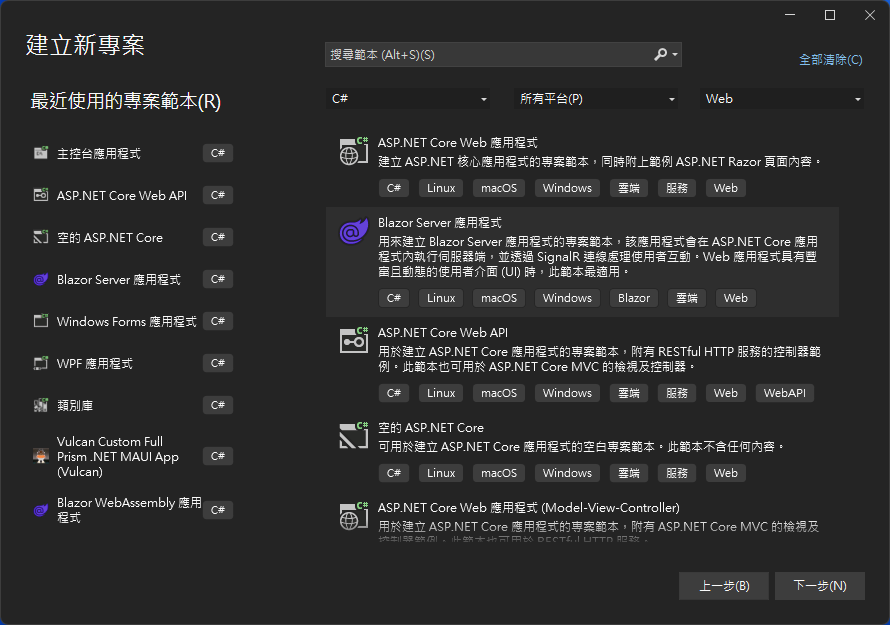
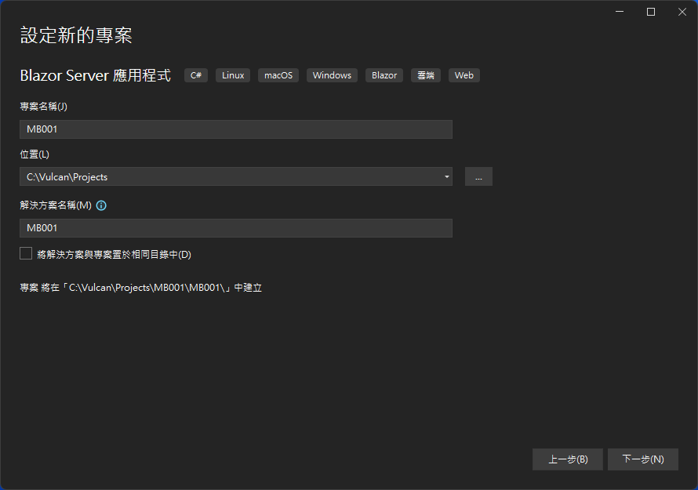
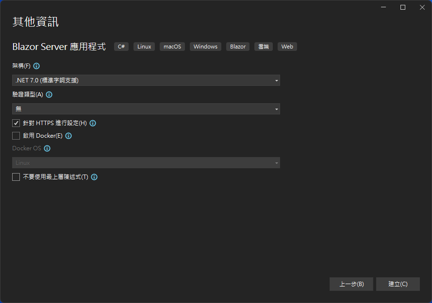
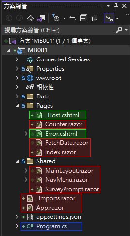
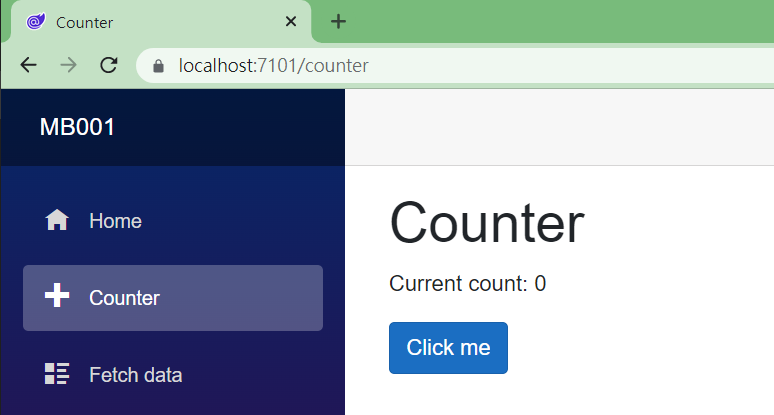
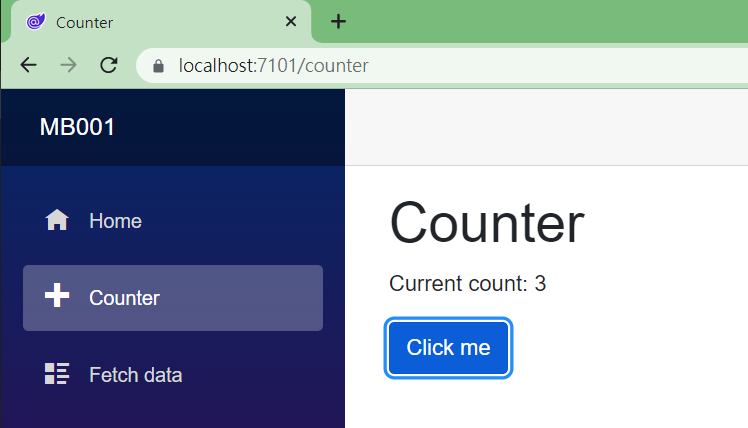

# 甚麼是 Razor Component - 從Blazor Server專案範本來觀察 Razor 組件 Component


在了解甚麼是 Blazor Component 之前，要先知道甚麼是 [ASP.NET Core](https://learn.microsoft.com/zh-tw/aspnet/core/introduction-to-aspnet-core?WT.mc_id=DT-MVP-5002220) ?

ASP.NET Core 是一個開源的、跨平台的 Web 應用程式框架，由微軟（Microsoft）開發和維護。它是 ASP.NET 的下一代版本，旨在提供更為現代化、模組化和高效的 Web 開發體驗。ASP.NET Core 支持在 Windows、macOS 和 Linux 平台上運行，並且具有以下特點：

* 跨平台：可在 Windows、macOS 和 Linux 上運行和開發 Web 應用程式。
* 高性能：ASP.NET Core 使用 Kestrel Web 伺服器，它的性能非常出色，可以與 Node.js 和 Go 等主流框 架相媲美。
* 開源：ASP.NET Core 的源代碼托管在 GitHub 上，允許開發者查看代碼、提出問題和提交修復建議。
* 模組化：ASP.NET Core 提供了一個輕量級的、可擴展的核心，開發者可以根據需要添加功能和組件。
* 靈活的部署：ASP.NET Core 應用程式可以部署在 IIS、Apache、Nginx 或作為獨立的應用程式運行。
* 支持容器：ASP.NET Core 原生支持 Docker 容器，方便應用程式的部署和擴展。
* 統一的 MVC 和 Web API：ASP.NET Core 將 MVC 和 Web API 框架結合在一起，讓開發者可以使用一個統一的模型來開發 Web 應用程式和 RESTful API 服務。

ASP.NET Core 使用 C# 程式語言進行開發，並支持 Razor 語法來編寫動態的 HTML。它是一個適合開發現代 Web 應用程式、RESTful API 和實時通訊應用程式的框架。

接著再來了解甚麼是 [Blazor](https://learn.microsoft.com/zh-tw/aspnet/core/blazor/?WT.mc_id=DT-MVP-5002220) ?

Blazor，也稱之為 ASP.NET Core Blazor， 是在 ASP.NET Core 框架下的一個 Web UI 工具集 Toolkit，也可以說是一個由 Microsoft 開發的開源 Web 應用程式框架，它允許開發者使用 C# 和 HTML/CSS 構建交互式的客戶端 Web 應用程式，而無需使用 JavaScript。

Blazor 的核心思想是使用 WebAssembly 技術將 C# 代碼編譯成可以在瀏覽器中運行的二進制格式，從而實現高性能的客戶端應用程式開發。

Blazor 有兩個主要的應用模式，也就是託管 (Hosted) 模式：

* Blazor Server：在這個模式下，應用程式的主要邏輯運行在伺服器上，客戶端與伺服器之間通過 SignalR 進行實時雙向通信。當用戶與應用程式互動時，伺服器會計算出 UI 的變更，然後將變更發送到客戶端進行更新。這種模式的優點是降低了客戶端的資源需求，但可能會增加網絡延遲。
* Blazor WebAssembly：在這個模式下，應用程式的主要邏輯運行在客戶端的瀏覽器中，完全不依賴伺服器。C# 代碼被編譯成 WebAssembly 並在瀏覽器中運行，與 JavaScript 相似。這種模式可以實現真正的無伺服器運行，並提供更好的應用程式性能，但可能會增加應用程式的初始加載時間。

最後，要來了解一下，甚麼是 Razor Component?

在 Blazor 這個 UI 開發環境下，供了一個組件化的開發模型，允許開發者將 UI 和邏輯封裝成可重用的組件，也就是通稱的 [Component]。這些組件可以像搭积木一樣組合起來構建 Web 應用程式`。

這個用於開發 Blazor 專案下組件稱之為 Razor Component 組件，也稱為 Blazor Component 組件。組件 Component 是一個獨立的用戶界面（UI）部分，具有處理邏輯以實現動態行為。組件可以嵌套、重用、在項目之間共享，並且可以在 MVC 和 Razor Pages 應用程序中使用。組件類通過結合 C# 和 HTML 標記在帶有 .razor 文件擴展名的 Razor 組件文件中實現。

Razor Component 是一種用於構建 Blazor 應用程序的 Razor 組件，也稱為 Blazor 組件。組件是一個獨立的用戶界面（UI）部分，具有處理邏輯以實現動態行為。組件可以嵌套、重用、在項目之間共享，並且可以在 MVC 和 Razor Pages 應用程序中使用1。

在 ASP.NET Core 開發框架下也會聽到的 Razor Page ，他於 Razor Component 或者 Blazor Component 有些不同，不同點在於 Razor Page 用於 ASP.NET Core Web App 中用於在服務器上生成 HTML 頁面並將其發送到客戶端的頁面。它是一個 cshtml 文件（模板）加上一個 cs 文件（行為），相同點則是，雙方使用的 Razor 語法是相同的。

## 建立使用 Azure OpenAI client library for .NET 測試用的專案

為了要了解甚麼是 Razor Component，現在來由 Blazor 專案範本建立一個專案，實際觀察 Razor Component 樣貌。

* 打開 Visual Studio 2022 IDE 應用程式
* 從 [Visual Studio 2022] 對話窗中，點選右下方的 [建立新的專案] 按鈕
* 在 [建立新專案] 對話窗右半部
  * 切換 [所有語言 (L)] 下拉選單控制項為 [C#]
  * 切換 [所有專案類型 (T)] 下拉選單控制項為 [Web]
* 在中間的專案範本清單中，找到並且點選 [Blazor Server 應用程式] 專案範本選項
  > 用來建立 Blazor Server 應用程式專案範本，該應用程式會在 ASP.NET Core 應用程式內執行伺服器端，並透過 SignalR 連線處理使用者互動。Web 應用程式具有豐富且動態的使用者介面(UI)時，此範本最適用。

  
* 點選右下角的 [下一步] 按鈕
* 在 [設定新的專案] 對話窗
* 找到 [專案名稱] 欄位，輸入 `MB001` 作為專案名稱
* 在剛剛輸入的 [專案名稱] 欄位下方，確認沒有勾選 [將解決方案與專案至於相同目錄中] 這個檢查盒控制項

  
* 點選右下角的 [下一步] 按鈕
* 現在將會看到 [其他資訊] 對話窗
* 在 [架構] 欄位中，請選擇最新的開發框架，這裡選擇的 [架構] 是 : `.NET 7.0 (標準字詞支援)`
* 在這個練習中，不需要勾選 [不要使用最上層陳述式(T)] 這個檢查盒控制項

  
* 請點選右下角的 [建立] 按鈕

稍微等候一下，這個主控台專案將會建立完成

## 觀察 Blazor Server 專案

一旦這個專案成功建立之後，將會看到 Visual Studio 2022 這個工具顯示在螢幕上，從 Visual Studio 2022 中看到如下圖的 [方案總管] 視窗



在這個 [方案總管] 視窗內，將會看到有三種顏色的矩形框，分別是藍色(代表這個檔案為這個專案的程式進入點，也就是這個專案一啟動之後，就需要執行的程式碼)、綠色(代表這個檔案是一個 Razor Page 頁面，也就是會用於 ASP.NET Core Web 應用程式 或者是 ASP.NET Core Web 應用程式(Model-View-Control)，其主要特徵為這類型的檔案副檔名為 .cshtml)、紅色(代表這個檔案為一個 Razor Component 組件，也就是 Blazor Component，其主要特徵為這類型的檔案副檔名為 .razor)

### 專案進入點程式 Program.cs

* 在這個專案根目錄下，找到並且打開 [Program.cs] 檔案
* 底下將會是這個檔案內容

```csharp
using MB001.Data;
using Microsoft.AspNetCore.Components;
using Microsoft.AspNetCore.Components.Web;

var builder = WebApplication.CreateBuilder(args);

// Add services to the container.
builder.Services.AddRazorPages();
builder.Services.AddServerSideBlazor();
builder.Services.AddSingleton<WeatherForecastService>();

var app = builder.Build();

// Configure the HTTP request pipeline.
if (!app.Environment.IsDevelopment())
{
    app.UseExceptionHandler("/Error");
    // The default HSTS value is 30 days. You may want to change this for production scenarios, see https://aka.ms/aspnetcore-hsts.
    app.UseHsts();
}

app.UseHttpsRedirection();

app.UseStaticFiles();

app.UseRouting();

app.MapBlazorHub();
app.MapFallbackToPage("/_Host");

app.Run();
```

可以看到這個 [Program.cs] 檔案就是一個 C# 程式碼，將會開始進行這個專案會用到的相關服務註冊、宣告要使用到的中介軟體，最後啟動這個 Web 服務。

### Razor Page 頁面

雖然這是一個 Blazor 專案，但是也是會用到 Razor Page 這樣的檔案，這是因為雖然 Blazor 專案會由許多的 Razor Component (或稱 Blazor Component)所組成，但是，還是需要透過其他檔案將這些 Blazor 組件可以啟動與使用，這個時候， Razor Page 就扮演這樣的角色。

* 在這個專案根目錄下，找到 [Pages] 資料夾
* 在這個資料夾內找到並且打開 [_Host.cshtml] 檔案
* 底下將會是這個檔案內容

```html
@page "/"
@using Microsoft.AspNetCore.Components.Web
@namespace MB001.Pages
@addTagHelper *, Microsoft.AspNetCore.Mvc.TagHelpers

<!DOCTYPE html>
<html lang="en">
<head>
    <meta charset="utf-8" />
    <meta name="viewport" content="width=device-width, initial-scale=1.0" />
    <base href="~/" />
    <link rel="stylesheet" href="css/bootstrap/bootstrap.min.css" />
    <link href="css/site.css" rel="stylesheet" />
    <link href="MB001.styles.css" rel="stylesheet" />
    <link rel="icon" type="image/png" href="favicon.png"/>
    <component type="typeof(HeadOutlet)" render-mode="ServerPrerendered" />
</head>
<body>
    <component type="typeof(App)" render-mode="ServerPrerendered" />

    <div id="blazor-error-ui">
        <environment include="Staging,Production">
            An error has occurred. This application may no longer respond until reloaded.
        </environment>
        <environment include="Development">
            An unhandled exception has occurred. See browser dev tools for details.
        </environment>
        <a href="" class="reload">Reload</a>
        <a class="dismiss">🗙</a>
    </div>

    <script src="_framework/blazor.server.js"></script>
</body>
</html>
```


乍看之下，這個檔案內容似乎是一個 HTML 格式的內容，不過，卻看到許多奇怪的內容，這些內容都是由 `@` 符號開頭，這樣的用法就是所謂 Razor 語法。

Razor Pages 利用 Razor Syntax 語法，這是一種基於 C# 的標記語言，用於在 HTML 中嵌入服務器端代碼，有了 C# 程式碼可以內嵌於 HTML 程式碼之後，就可以做到一個簡單而高效的方式來建立動態Web應用程式。

* @page

  這是一個指示詞，@page 會將檔案轉換成 MVC 動作，這表示其會直接處理要求，不用透過控制器。 
* @using

  這是一個指示詞，這裡將會將 C# using 指示詞新增至產生的檢視
* @namespace

  這是一個指示詞，設定所 Razor 產生頁面、MVC 檢視或 Razor 元件類別的命名空間。
* @addTagHelper

  這是一個指示詞，讓標籤協助程式可供檢視使用(在 Razor Component 內，則是不支援這樣的用法)

在這個檔案內的第 19 行，也就是 `<body>` 標籤下一行，將會看到這樣的宣告

```html
<component type="typeof(App)" render-mode="ServerPrerendered" />
```

這裡的標記將會是宣告要在這個 Razor Page 頁面 (_Host.cshtml) 內，想要把 Razor Component 組件(也就是具有 .razor 副檔名) 渲染到這個網頁內，這個時候就會使用 `component` 這個標記，而在 `type` 屬性內宣告的是要渲染的 Razor Component 類別名稱。

### Razor Component 組件

最後來了解 Razor Component 用法

* 在這個專案根目錄下，找到 [Pages] 資料夾
* 在這個資料夾內找到並且打開 [Counter.razor] 檔案
* 底下將會是這個檔案內容

```html
@page "/counter"

<PageTitle>Counter</PageTitle>

<h1>Counter</h1>

<p role="status">Current count: @currentCount</p>

<button class="btn btn-primary" @onclick="IncrementCount">Click me</button>

@code {
    private int currentCount = 0;

    private void IncrementCount()
    {
        currentCount++;
    }
}
```

首先，這個檔案的副檔名為 `.razor` ，因此，這是一個 Blazor Component。

在這個 [Counter.razor] 檔案內第一行，將會看到一個 @page 指示詞，這個指示詞在 Blazor 組件將會宣告要顯示這個組件到網頁上的路由文字，例如，這台主機是 localhost，若在瀏覽器上輸入 `https://localhost/counter` ，此時，就可以在網頁上看到這個 Blazor 組件上的 HTML 標記內容。

仔細看一下這個檔案內的內容，這裡將會有4個標記元素 (Element)，分別是 `<PageTitle>`， `<h1>`， `<p>`， `<button>`，其中第一個 PageTitle 是 Blazor UI 工具集 Toolkit 內建的元件，用來使用指定的參數用來使用指定的參數來更新這個網頁上的頁面標題名稱，剩下的三個則是 HTML 這個標記語言中基本的標記元素。

若是僅觀察這些 HTML 內容，應該可以想像出網頁執行後的結果，底下截圖將會是執行結果。



此時，若點選 [Click me] 按鈕三次，網頁畫面會變成底下截圖



為什麼會造成這樣的結果，此時，可以觀察第 9 行的宣告

```html
<button class="btn btn-primary" @onclick="IncrementCount">Click me</button>
```

在這裡看到一個基本 HTML Button 標記，其實就是宣告要顯示一個按鈕，然而，在這裡並沒有使用到任何 JavaScript 語言功能，為什麼會造成點選按鈕之後，造成一個動態網頁效果，也就是網頁上的計數器數值不斷增加。

重點在於這裡使用到一個 Razor Component 功能，使用了 `@onclick="IncrementCount"` 宣告了當使用者點選這個按鈕之後，就需要觸發 [IncrementCount] 這個 C# 方法，記住，這裡指的是 C# 方法，不是 JavaScript 方法，另外，這裡需要使用 `@onclick` 這樣的宣告方式，不能使用 `click` 這樣的宣告用法，後者將是最原始的 HTML 要綁定一個事件到 JavaScript 的用法。

而這個 [IncrementCount] C# 方法，將會定義在第11行到第18行，這裡的 `@code{...}` 也是 Razor Component 語法一部分，可以在這裡寫出許多的 C# 程式碼。

```html
@code {
    private int currentCount = 0;

    private void IncrementCount()
    {
        currentCount++;
    }
}
```

從程式碼看到，這個 [IncrementCount] 方法每次被呼叫之後，會將 [currentCount] 物件加一，而加總之後的內容，將會透過資料綁定機制，更新到網頁上，因此，對於底下的 HTML 標記而言，只要 [currentCount] 物件值有變動，這裡 `<p>` 標記內的 `@currentCount` 內容將會動態更新。

```html
<p role="status">Current count: @currentCount</p>
```


