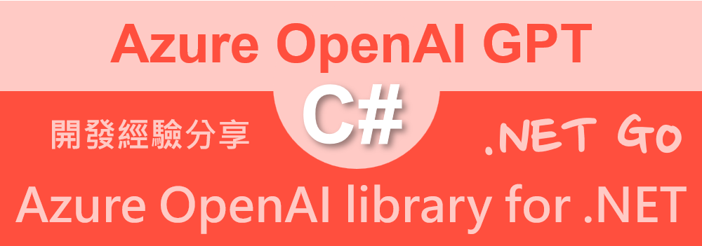
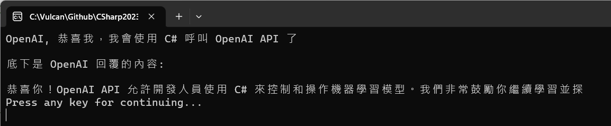

# 體驗使用 Azure OpenAI client library for .NET 套件之驗經驗分享 - 開發教學



上一篇文章 [第一次使用 C# 來體驗 Azure OpenAI Embedding 內嵌 API 驗經驗分享 - 開發教學](https://csharpkh.blogspot.com/2023/04/c-azure-openai-embedding-api.html)

前兩篇文章說明了如何使用了 [Betalgo.OpenAI.GPT3] 套件來呼叫 Azure OpenAI GPT 相關 API，還是同樣的話，市面上對於展示呼叫 OpenAI API 的程式碼，絕大多數使用 Python 這個程式語言來展示，身為 .NET 資深開發者，當然需要使用 C# 程式語言來演練。

這裡將會回到微軟官方的 [Azure.AI.OpenAI 1.0.0-beta.5] 套件，說明如何用於 Azure OpenAI API 的用法。

Azure OpenAI client library for .NET 是一個適用於 .NET 的客戶端程式庫，它將 OpenAI 的 REST API 轉換為符合 .NET 風格的介面，並與 Azure SDK 生態系統進行豐富的整合。它可以連接到 Azure OpenAI 資源或非 Azure OpenAI 推論端點，因此即使是非 Azure OpenAI 開發也是一個很好的選擇。

Azure OpenAI client library for .NET 可以讓您使用 Azure OpenAI 服務的功能，例如：

- 建立文字完成：根據指定的模型和提示，產生符合上下文和模式的輸出文字。
- 建立文字嵌入：將文字轉換為數值向量，以便進行比較或分析。
- 管理模型部署：在 Azure 上部署、調整和刪除 OpenAI 模型。

## 取得 Azure OpenAI Key 並且儲存為系統環境變數

* 打開 Azure 網頁，並且登入該服務
* 切換到你自己建立 [Azure OpenAI] 服務
* 在 Overview 儀表板頁面中，將會看到 [Manage keys] 欄位
* 點選該欄位名稱右邊的 [Click here to manage keys] 文字

  
* 現在將會看到 [Keys and Endpoint] 這個頁面
* 你可以點選 [Show Keys] 來看到 API Key 的內容，又或者點選最右方的複製按鈕，將 API Key 複製到剪貼簿內

  
* 開啟命令提示字元視窗
* 使用底下命令將建立 OpenAI Key 永久性的環境變數

```
setx OpenAIKey "剪貼簿內的 OpenAI Key 值" /M
```

## 建立使用 Azure OpenAI client library for .NET 測試用的專案

為了簡化測試用專案的複雜度，因此，在這裡將會建立一個 Console 主控台應用類型的專案。

* 打開 Visual Studio 2022 IDE 應用程式
* 從 [Visual Studio 2022] 對話窗中，點選右下方的 [建立新的專案] 按鈕
* 在 [建立新專案] 對話窗右半部
  * 切換 [所有語言 (L)] 下拉選單控制項為 [C#]
  * 切換 [所有專案類型 (T)] 下拉選單控制項為 [主控台]
* 在中間的專案範本清單中，找到並且點選 [主控台應用程式] 專案範本選項
  > 專案，用於建立可在 Windows、Linux 及 macOS 於 .NET 執行的命令列應用程式
* 點選右下角的 [下一步] 按鈕
* 在 [設定新的專案] 對話窗
* 找到 [專案名稱] 欄位，輸入 `AzureOpenAIClientLibrary` 作為專案名稱
* 在剛剛輸入的 [專案名稱] 欄位下方，確認沒有勾選 [將解決方案與專案至於相同目錄中] 這個檢查盒控制項
* 點選右下角的 [下一步] 按鈕
* 現在將會看到 [其他資訊] 對話窗
* 在 [架構] 欄位中，請選擇最新的開發框架，這裡選擇的 [架構] 是 : `.NET 7.0 (標準字詞支援)`
* 在這個練習中，需要去勾選 [不要使用最上層陳述式(T)] 這個檢查盒控制項
  > 這裡的這個操作，可以由讀者自行決定是否要勾選這個檢查盒控制項
* 請點選右下角的 [建立] 按鈕

稍微等候一下，這個主控台專案將會建立完成

## 安裝要用到的 NuGet 開發套件

因為開發此專案時會用到這些 NuGet 套件，請依照底下說明，將需要用到的 NuGet 套件安裝起來。

### 安裝 Azure.AI.OpenAI 套件

* 滑鼠右擊 [方案總管] 視窗內的 [專案節點] 下方的 [相依性] 節點
* 從彈出功能表清單中，點選 [管理 NuGet 套件] 這個功能選項清單
* 此時，將會看到 [NuGet: AzureOpenAIClientLibrary] 視窗
* 切換此視窗的標籤頁次到名稱為 [瀏覽] 這個標籤頁次
* 在左上方找到一個搜尋文字輸入盒，在此輸入 `Azure.AI.OpenAI`
* 對於這個套件，現在尚在 Preview 階段，因此，請勾選 [包括搶鮮版] 這個檢查盒控制項
* 稍待一會，將會在下方看到這個套件被搜尋出來
* 點選 [Azure.AI.OpenAI] 套件名稱
* 在視窗右方，將會看到該套件詳細說明的內容，其中，右上方有的 [安裝] 按鈕
* 點選這個 [安裝] 按鈕，將這個套件安裝到專案內

### 安裝 Azure.Identity 套件

* 滑鼠右擊 [方案總管] 視窗內的 [專案節點] 下方的 [相依性] 節點
* 從彈出功能表清單中，點選 [管理 NuGet 套件] 這個功能選項清單
* 此時，將會看到 [NuGet: AzureOpenAIClientLibrary] 視窗
* 切換此視窗的標籤頁次到名稱為 [瀏覽] 這個標籤頁次
* 在左上方找到一個搜尋文字輸入盒，在此輸入 `Azure.Identity`
* 稍待一會，將會在下方看到這個套件被搜尋出來
* 點選 [Azure.Identity] 套件名稱
* 在視窗右方，將會看到該套件詳細說明的內容，其中，右上方有的 [安裝] 按鈕
* 點選這個 [安裝] 按鈕，將這個套件安裝到專案內

## 修正主程序 Program.cs 的程式碼

* 在此專案節點下，找到並且打開 [Program.cs] 這個檔案
* 使用底下 C# 程式碼替換掉 [Program.cs] 檔案內所有程式碼內容

```csharp
using Azure.AI.OpenAI;
using Azure;

namespace AzureOpenAIClientLibrary;

/// <summary>
/// 使用微軟官方 Azure OpenAI client library for .NET 套件來呼叫相關 API
/// </summary>
internal class Program
{
    static async Task Main(string[] args)
    {
        #region 使用 Azure.AI.OpenAI 套件來 OpenAIClient 物件
        var apiKey = Environment.GetEnvironmentVariable("OpenAIKey");
        string endpoint = "https://vulcan-openai.openai.azure.com/";
        var client = new OpenAIClient(new Uri(endpoint), new AzureKeyCredential(apiKey));
        #endregion

        #region 準備使用 OpenAI GPT 的 Prompt / Completion 模式呼叫 API
        string prompt = "OpenAI, 恭喜我，我會使用 C# 呼叫 OpenAI API 了\n";
        await Console.Out.WriteLineAsync(prompt);

        var completionsOptions = new CompletionsOptions()
        {
            Prompts = { prompt },
            MaxTokens = 100,
            Temperature = 0.5f,
        };

        string deploymentName = "text-davinci-003";

        Response<Completions> completionsResponse = await client
            .GetCompletionsAsync(deploymentName, completionsOptions);
        if (completionsResponse != null)
        {
            string completion = completionsResponse.Value.Choices[0].Text;
            await Console.Out.WriteLineAsync($"底下是 OpenAI 回覆的內容:");
            Console.WriteLine($"{completion}");
        }
        #endregion

        Console.WriteLine("Press any key for continuing...");
        Console.ReadKey();
    }
}
```

在這個進入點程式碼內，首先會先呼叫 `Environment.GetEnvironmentVariable("OpenAIKey")` 敘述，取得剛剛設定在系統環境變數中的 OpenAI Key 值，並且將 Key 儲存到 [apiKey] 這個物件內。會想要這麼設計的理由是很單純的，就是不想把 OpenAI Key 內容寫在程式碼內，並且 Commit 到版控系統內，如果是這樣的話，那麼，大家都會知道你的 OpenAI Key 內容，當然，也就可以透過這個 Key 來存取你的 Azure OpenAI Service，最後將是你需要負擔這些呼叫 API 的費用。

緊接著使用 `OpenAIClient` 類別來建立一個物件，這個類別建構函式將會需要 Azure OpenAI Service 的服務端點與 Azure OpenAI Key 這兩個資訊，使用 `new OpenAIClient(new Uri(endpoint), new AzureKeyCredential(apiKey))` 這樣方式，建立起這個物件。

這個敘述 `string prompt = "OpenAI, 恭喜我，我會使用 C# 呼叫 OpenAI API 了\n";` 將會指定要對 GPT 提問問題提示內容。

現在需要建立一個 [CompletionsOptions] 類別的物件，在此將會把要提示文字指定給 Prompts 這個屬性，使用 MaxTokens 指定最大使用的 Token 數量，使用 Temperature 指定溫度值。

有了這個 [CompletionsOptions] 物件之後，便可以使用 `await client.GetCompletionsAsync(deploymentName, completionsOptions)` 這樣呼叫方式，對後端 Azure OpenAI Service API 送出請求，其中，deploymentName為指定要用到的模型名稱，這裡將會設定為 [text-davinci-003]

一旦呼叫 API 完成之後，將會得到型別為 [Response<Completions>] 物件，便可以得到來自於達文西模組計算得到的結果。

底下是執行這個專案的結果



```
OpenAI, 恭喜我，我會使用 C# 呼叫 OpenAI API 了

底下是 OpenAI 回覆的內容:

恭喜你！OpenAI API 允許開發人員使用 C# 來控制和操作機器學習模型。我們非常鼓勵你繼續學習並探
Press any key for continuing...
```


