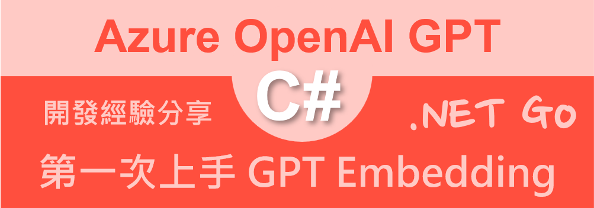
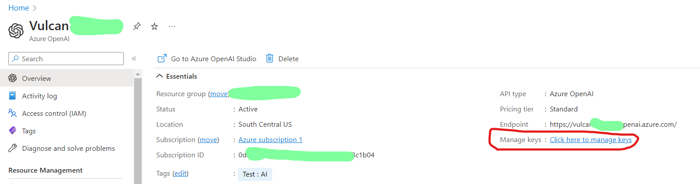
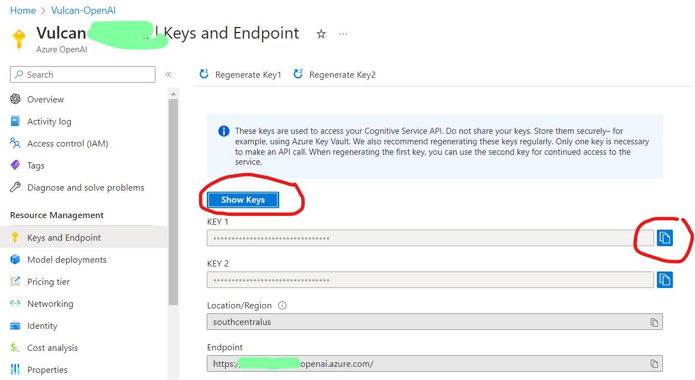
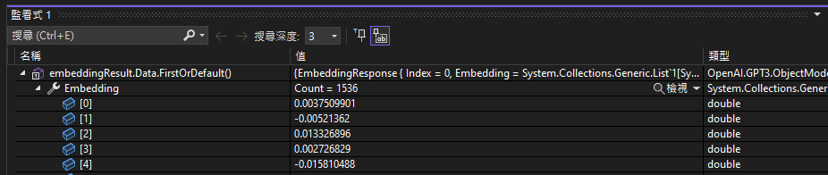

# 第一次使用 C# 來體驗 Azure OpenAI Embedding 內嵌 API 驗經驗分享 - 開發教學
CSharp-Betalgo-Azure-OpenAI-GPT3-API-Embedding-OpenAIKey-Embedding-Cosine-similarity.md


上一篇文章 [第一次使用 C# 來呼叫 Azure OpenAI API 初體驗經驗分享 - 開發教學](https://csharpkh.blogspot.com/2023/04/CSharp-Betalgo-Azure-OpenAI-GPT3-API-Prompt-OpenAIKey-Completion-Davinci.html)

在這裡將會想要來使用 C# 程式語言 來使用 GPT [Embedding 內嵌](https://learn.microsoft.com/zh-tw/azure/cognitive-services/openai/concepts/understand-embeddings#embedding-models?WT.mc_id=DT-MVP-5002220) 功能來做出一些實驗性的測試，有別於傳統文章的寫法，這裡將會先來使用 [OpenAI ChatGPT] 工具，先來理解甚麼是 GPT Embedding，所以，在此先對 ChatGPT 提出底下提問:

```
甚麼是 GPT Embedding
```

此時，ChatGPT 將會回應底下內容

```
GPT Embedding 是指從 GPT（Generative Pre-trained Transformer）語言模型中提取的特徵向量。語言模型，如 OpenAI 的 GPT 系列，通過對大量文本進行訓練，學會了對自然語言進行表示和生成。

當將一段文本輸入 GPT 模型時，該文本在經過模型內部的多個層次運算後，最終產生一個向量表示。這個向量表示捕捉了文本的語義和語境信息，通常被稱為 "embedding"。

GPT Embedding 可以用於多種自然語言處理任務，如文本分類、命名實體識別、情感分析等。它們通常作為下游模型的輸入，幫助提高模型的性能。
```

然後，再度向 ChatGPT 提出底下問題

```
舉出一個實際例子，說明 GPT Embedding 是如何使用，與解決了甚麼問題？說明過程越詳盡越好
```

ChatGPT 給予了底下的回應內容

```
在此，我將提供一個情感分析的實際例子，說明 GPT Embedding 是如何使用的，以及它如何解決了問題。

情感分析是自然語言處理 (NLP) 中的一個常見任務，它通常涉及對文本（如評論、意見或推文）中的情感表達進行分類，例如正面、負面或中性。在此示例中，我們將使用 GPT Embedding 來提取文本的特徵，然後使用這些特徵來訓練一個情感分析分類器。

* 數據收集和預處理：首先，我們需要收集一個包含標籤的情感分析數據集，例如電影評論或產品評論。每個評論都有相應的標籤，表示評論的情感是正面、負面或中性。我們將對這些文本進行一些基本的預處理，例如去除停用詞、標點符號和不相關的字符。

* 提取 GPT Embedding：接下來，我們將使用預先訓練好的 GPT 模型（例如 GPT-4）來提取文本的 Embedding。我們將每個處理後的評論輸入到 GPT 模型中，並獲取相應的向量表示。這些向量表示捕捉了評論的語義和語境信息，對於情感分析來說非常有用。

* 分類器訓練：有了 GPT Embedding，我們現在可以使用它們來訓練一個情感分析分類器。我們可以選擇多種監督學習算法，如支持向量機（SVM）、邏輯回歸或深度神經網絡（DNN）。將 GPT Embedding 作為特徵輸入到所選擇的分類器中，並使用標籤的情感作為目標輸出進行訓練。

* 模型評估與優化：在訓練完成後，我們可以使用交叉驗證、混淆矩陣等方法來評估模型的性能。根據評估結果，我們可以對模型進行優化，例如調整超參數或使用其他分類算法。
```

透過 ChatGPT 的回應，大致可以知道 Embedding 內嵌的作法與可能的應用領域，接下來，就來看看如何使用 C# 程式語言來將這些動作串接起來，自動執行起來。

## 取得 Azure OpenAI Key 並且儲存為系統環境變數

* 打開 Azure 網頁，並且登入該服務
* 切換到你自己建立 [Azure OpenAI] 服務
* 在 Overview 儀表板頁面中，將會看到 [Manage keys] 欄位
* 點選該欄位名稱右邊的 [Click here to manage keys] 文字

  
* 現在將會看到 [Keys and Endpoint] 這個頁面
* 你可以點選 [Show Keys] 來看到 API Key 的內容，又或者點選最右方的複製按鈕，將 API Key 複製到剪貼簿內

  
* 開啟命令提示字元視窗
* 使用底下命令將建立 OpenAI Key 永久性的環境變數

```
setx OpenAIKey "剪貼簿內的 OpenAI Key 值" /M
```

## 建立 OpenAI GPT Hello World 測試用的專案

為了簡化測試用專案的複雜度，因此，在這裡將會建立一個 Console 主控台應用類型的專案。

* 打開 Visual Studio 2022 IDE 應用程式
* 從 [Visual Studio 2022] 對話窗中，點選右下方的 [建立新的專案] 按鈕
* 在 [建立新專案] 對話窗右半部
  * 切換 [所有語言 (L)] 下拉選單控制項為 [C#]
  * 切換 [所有專案類型 (T)] 下拉選單控制項為 [主控台]
* 在中間的專案範本清單中，找到並且點選 [主控台應用程式] 專案範本選項
  > 專案，用於建立可在 Windows、Linux 及 macOS 於 .NET 執行的命令列應用程式
* 點選右下角的 [下一步] 按鈕
* 在 [設定新的專案] 對話窗
* 找到 [專案名稱] 欄位，輸入 `OpenAIHelloEmbedding` 作為專案名稱
* 在剛剛輸入的 [專案名稱] 欄位下方，確認沒有勾選 [將解決方案與專案至於相同目錄中] 這個檢查盒控制項
* 點選右下角的 [下一步] 按鈕
* 現在將會看到 [其他資訊] 對話窗
* 在 [架構] 欄位中，請選擇最新的開發框架，這裡選擇的 [架構] 是 : `.NET 7.0 (標準字詞支援)`
* 在這個練習中，需要去勾選 [不要使用最上層陳述式(T)] 這個檢查盒控制項
  > 這裡的這個操作，可以由讀者自行決定是否要勾選這個檢查盒控制項
* 請點選右下角的 [建立] 按鈕

稍微等候一下，這個主控台專案將會建立完成

## 安裝要用到的 NuGet 開發套件

因為開發此專案時會用到這些 NuGet 套件，請依照底下說明，將需要用到的 NuGet 套件安裝起來。

### 安裝 Betalgo.OpenAI.GPT3 套件

為了要能夠使用 GPT API，對於 .NET C# 開發者，可以使用 [Betalgo.OpenAI.GPT3] 套件，Betalgo.OpenAI.GPT3 是一個非官方的 .Net SDK，用於 OpenAI 的 Chat GPT，Whisper，GPT-3 和 DALL·E。它可以通過安裝 Betalgo.OpenAI.GPT3 軟件包來使用。該 SDK 提供了許多功能，包括聊天 GPT，Azure OpenAI 支持，圖像 DALL·E 模型，完成，編輯，嵌入，文件，微調和調節等。您可以在其 Github 頁面上查看更多信息：https://github.com/betalgo/openai。

* 滑鼠右擊 [方案總管] 視窗內的 [專案節點] 下方的 [相依性] 節點
* 從彈出功能表清單中，點選 [管理 NuGet 套件] 這個功能選項清單
* 此時，將會看到 [NuGet: OpenAIHelloEmbedding] 視窗
* 切換此視窗的標籤頁次到名稱為 [瀏覽] 這個標籤頁次
* 在左上方找到一個搜尋文字輸入盒，在此輸入 `Betalgo.OpenAI.GPT3`
* 稍待一會，將會在下方看到這個套件被搜尋出來
* 點選 [Betalgo.OpenAI.GPT3] 套件名稱
* 在視窗右方，將會看到該套件詳細說明的內容，其中，右上方有的 [安裝] 按鈕
* 點選這個 [安裝] 按鈕，將這個套件安裝到專案內

### 安裝 MathNet.Numerics 套件

在這個專案內，會需要將一段文字轉換成為 Embedding 內嵌，Embedding 是一種將高維數據（如文本、圖像等）映射到低維空間的表示方法。在自然語言處理中，詞嵌入將單詞或短語映射到固定大小的向量空間，以便在數學上更容易處理。這些向量表示能捕捉單詞或短語的語義和語境信息。而 Cosine 相似度是一種衡量兩個向量之間相似度的方法，它通過計算兩個向量之間的夾角的餘弦值來達成。Cosine 相似度的值範圍在 -1（完全不相似）到 1（完全相似）之間。當用於 Embedding，Cosine 相似度能夠有效地捕捉到不同單詞或短語之間的語義相似性。

在實際應用中，我們可以使用 Cosine 相似度來計算 Embedding 向量之間的相似度。例如，在文本搜索、推薦系統或詞語相似性任務中，我們可以通過計算用戶查詢的 Embedding 和搜尋結果 Embedding 之間的 Cosine 相似度，來確定哪些結果與查詢最相關。

因此就會需要用到 MathNet.Numerics ，這是一個.NET的開源數學庫，包含了.NET平台上的面向對像數字計算的基礎類，透過這個類別庫提供的各種數學計算能力，使用 Cosine 被用來計算 Embedding 向量之間的相似度。

* 滑鼠右擊 [方案總管] 視窗內的 [專案節點] 下方的 [相依性] 節點
* 從彈出功能表清單中，點選 [管理 NuGet 套件] 這個功能選項清單
* 此時，將會看到 [NuGet: OpenAIHelloEmbedding] 視窗
* 切換此視窗的標籤頁次到名稱為 [瀏覽] 這個標籤頁次
* 在左上方找到一個搜尋文字輸入盒，在此輸入 `MathNet.Numerics`
* 稍待一會，將會在下方看到這個套件被搜尋出來
* 點選 [MathNet.Numerics] 套件名稱
* 在視窗右方，將會看到該套件詳細說明的內容，其中，右上方有的 [安裝] 按鈕
* 點選這個 [安裝] 按鈕，將這個套件安裝到專案內

## 修正主程序 Program.cs 的程式碼

* 在此專案節點下，找到並且打開 [Program.cs] 這個檔案
* 使用底下 C# 程式碼替換掉 [Program.cs] 檔案內所有程式碼內容

```csharp
using OpenAI.GPT3.Managers;
using OpenAI.GPT3.ObjectModels.RequestModels;
using OpenAI.GPT3.ObjectModels;
using OpenAI.GPT3;
using System.Reflection.Metadata;
using MathNet.Numerics.LinearAlgebra;

namespace OpenAIHelloEmbedding;

/// <summary>
/// 使用 OpenAI Embedding 技術，進行文字內容搜尋
/// </summary>
internal class Program
{
    static async Task Main(string[] args)
    {
        #region 建立 OpenAiOptions 物件，用來標明此次呼叫 API 的類型與授權資訊
        // 這邊使用 Environment.GetEnvironmentVariable() 來取得環境變數，也可以直接使用字串
        var apiKey = Environment.GetEnvironmentVariable("OpenAIKey");
        var openAITextEmbedding = new OpenAIService(new OpenAiOptions()
        {
            ProviderType = ProviderType.Azure,
            ApiKey = apiKey,
            DeploymentId = "text-embedding-ada-002",
            ResourceName = "vulcan-openai"
        });
        #endregion

        #region 建立 查詢問題文字的 Embedding
        string question = "哪句話是關於動物的？";
        //string question = "哪句話是關於健康的？";
        //string question = "哪句話是關於哲學的？";
        //string question = "What is the animal that jumps over the dog?";
        var questionEmbedding = await GetEmbedding(openAITextEmbedding, question);
        #endregion

        #region 建立文件庫文字的 Embedding
        List<string> allLibrary = new List<string>()
        {
            "敏捷的棕色狐狸跳過了懶狗",
            "一天一蘋果，醫生遠離我",
            "存在還是不存在，這是個問題",
            //"The quick brown fox jumps over the lazy dog",
            //"An apple a day keeps the doctor away",
            //"To be or not to be, that is the question" ,
        };
        Dictionary<string, Vector<double>> allDocumentsEmbedding = new();
        foreach (var library in allLibrary)
        {
            var docEmbedding = await GetEmbedding(openAITextEmbedding, library);
            allDocumentsEmbedding.Add(library, docEmbedding);
        }
        #endregion

        #region 問題與文件的內嵌 Cosine Similarity 計算
        foreach (var item in allDocumentsEmbedding)
        {
            // calculate cosine similarity
            var v2 = item.Value;
            var v1 = questionEmbedding;
            var cosineSimilarity = v1.DotProduct(v2) / (v1.L2Norm() * v2.L2Norm());

            Console.WriteLine($"Cosine similarity: {cosineSimilarity}");
        }
        #endregion

        Console.WriteLine("Press any key for continuing...");
        Console.ReadKey();
    }

    static async Task<Vector<double>> GetEmbedding(OpenAIService openAITextEmbedding, string doc)
    {
        var embeddingResult = await openAITextEmbedding.Embeddings
            .CreateEmbedding(new EmbeddingCreateRequest()
            {
                Input = doc,
                Model = Models.TextEmbeddingAdaV2,
            });

        if (embeddingResult.Successful)
        {
            Vector<double> theEmbedding;

            var embeddingResponse = embeddingResult.Data.FirstOrDefault();
            var allValues = embeddingResponse.Embedding.ToArray();
            theEmbedding = Vector<double>.Build.DenseOfArray(allValues);
            return theEmbedding;
        }
        else
        {
            if (embeddingResult.Error == null)
            {
                throw new Exception("Unknown Error");
            }
            Console.WriteLine($"{embeddingResult.Error.Code}: {embeddingResult.Error.Message}");
            return null;
        }

    }
}
```

在這個進入點程式碼內，首先會先呼叫 `Environment.GetEnvironmentVariable("OpenAIKey")` 敘述，取得剛剛設定在系統環境變數中的 OpenAI Key 值，並且將 Key 儲存到 [apiKey] 這個物件內。會想要這麼設計的理由是很單純的，就是不想把 OpenAI Key 內容寫在程式碼內，並且 Commit 到版控系統內，如果是這樣的話，那麼，大家都會知道你的 OpenAI Key 內容，當然，也就可以透過這個 Key 來存取你的 Azure OpenAI Service，最後將是你需要負擔這些呼叫 API 的費用。

緊接著使用 `OpenAiOptions` 類別來建立一個物件，這個物件將會

* 用 [ProviderType] 屬性來指定要呼叫的 API 是 [OpenAI] 提供的相關服務，還是使用 [Azure OpenAI Server] 的 GPT API 服務
* 透過 [ApiKey] 屬性將從 Azure 上取得的 OpenAI Key 內容，指定到這個屬性內
* 對於 [DeploymentId] 欄位，則是用來指定要使用的 GPT 模型名稱，這裡將會展示使用 內嵌-Ada 這個模型 [text-embedding-ada-002]
* 最後的 [ResourceName] 欄位則是用來指定在 Azure 上用到的資源名稱

完成 [OpenAiOptions] 物件建立之後，緊接著在建立一個 [OpenAIService] 類別的物件，並且把剛剛建立的 [OpenAiOptions] 物件，傳入到此類別 [OpenAIService] 建構式內，所得到的物件將會存入到變數名為 [gpt3] 內；有了這個 [gpt3] 物件，接下來就可以對 GPT API 進行呼叫了

這個敘述 `string question = "哪句話是關於動物的？";` 將會透過 GPT 將此提示問題內容轉為 Embedding 內容。這裡將會透過自行開發的 [GetEmbedding] 方法。

這個 [GetEmbedding] 方法將會需要一個 OpenAIService 類別生成的物件，在上面的程式碼，將會把這個物件儲存到 openAITextEmbedding 變數內，另外一個參數就是提示文字，這裡將會把 question 傳入進來。

現在，先來看看關於 [GetEmbedding] 方法做了哪些事情:

在這個方法一開始，將會使用 [openAITextEmbedding.Embeddings.CreateEmbedding] 方法，要來建立一個物件，並且將傳入的提示文字 ([doc]) 設定給 [EmbeddingCreateRequest.Input] 屬性，如底下程式碼

```csharp
var embeddingResult = await openAITextEmbedding.Embeddings
    .CreateEmbedding(new EmbeddingCreateRequest()
    {
        Input = doc,
        Model = Models.TextEmbeddingAdaV2,
    });
```

此時這個提示文字已經送到 Azure OpenAI API 內，一旦有結果回傳，就可以透過 [embeddingResult.Successful] 屬性來判斷是否有成功。

若取得 Embedding 過程是成功的，將要執行底下程式碼

```csharp
Vector<double> theEmbedding;
var embeddingResponse = embeddingResult.Data.FirstOrDefault();
var allValues = embeddingResponse.Embedding.ToArray();
theEmbedding = Vector<double>.Build.DenseOfArray(allValues);
```

首先利用 `embeddingResult.Data.FirstOrDefault()` 取得第一個列舉值到 [embeddingResponse] 內，接著透過 [embeddingResponse] 物件內的 [Embedding] 屬性，取得其陣列型別的物件。從底下監看式視窗內可以看到 Embedding 內其實就是存在著許多浮點數值。



現在可以使用這個 `Vector<double>.Build.DenseOfArray(allValues)` 工廠方法，把剛剛取得的陣列物件，產生出型別為 `Vector<double>` 物件，最後會將這個物件回傳回去，完成了這個 [GetEmbedding] 方法的執行，將一個提示文字或者本文內容，成功取的 GPT Embedding 且轉換成為 `Vector<double>`。

接下來使用同樣的作法，把 "敏捷的棕色狐狸跳過了懶狗", "一天一蘋果，醫生遠離我", "存在還是不存在，這是個問題" 這三個文字內容，轉換成為 GPT Embedding，且是 `Vector<double>` 型別的物件。

```
#region 問題與文件的內嵌 Cosine Similarity 計算
foreach (var item in allDocumentsEmbedding)
{
    // calculate cosine similarity
    var v2 = item.Value;
    var v1 = questionEmbedding;
    var cosineSimilarity = v1.DotProduct(v2) / (v1.L2Norm() * v2.L2Norm());
    Console.WriteLine($"Cosine similarity: {cosineSimilarity}");
}
#endregion
```

有了這些向量數據，就可以使用底下程式碼進行相似性的比較，底下將會說明 內嵌 Cosine Similarity 計算方式。

內嵌 Cosine Similarity 是一種衡量兩個向量相似度的方法，主要運用在多維空間。它通過計算兩個向量之間的夾角的餘弦值來衡量它們的相似度。夾角越小，兩個向量越相似；夾角越大，兩個向量越不相似。Cosine Similarity 的取值範圍為 -1 到 1，1 表示兩個向量完全相同，0 表示兩個向量獨立無關，而 -1 表示兩個向量完全相反。

計算內嵌 Cosine Similarity 的公式如下：

Cosine Similarity = (A * B) / (||A|| * ||B||)

其中：

A 和 B 分別代表兩個向量

A * B 是 A 和 B 的點積

||A|| 和 ||B|| 分別是 A 和 B 的範數

現在讓我們舉個例子來說明。

假設我們有兩個向量 A 和 B：

A = (1, 2, 3)

B = (3, 2, 1)

首先，我們計算 A 和 B 的點積（A * B）：

A * B = (1 * 3) + (2 * 2) + (3 * 1) = 3 + 4 + 3 = 10

接著，我們計算 A 和 B 的範數：

||A|| = √(1² + 2² + 3²) = √(1 + 4 + 9) = √14

||B|| = √(3² + 2² + 1²) = √(9 + 4 + 1) = √14

最後，我們使用公式計算 Cosine Similarity：

Cosine Similarity = (A * B) / (||A|| * ||B||) = 10 / (14) ≈ 0.71

所以，向量 A 和 B 的 Cosine Similarity 約為 0.71，表示它們具有一定程度的相似性。

看到這裡，相信對於數學不是很專精的程式開發者一定都已經暈頭轉向了，此時，就可以使用一開始安裝的 [MathNet.Numerics] 這個套件內的 [MathNet.Numerics.LinearAlgebra] 命名空間內提供的各種線性代數方法來幫忙做到這樣需求。

透過底下的 `var cosineSimilarity = v1.DotProduct(v2) / (v1.L2Norm() * v2.L2Norm())` 敘述，就可以把剛剛描述的這麼複雜的過程做法，使用一行敘述就做到了，得到的計算結果就是這兩個文字相似性比較值，原則上，若計算後的值大於 0.8 以上，可以說這樣兩個文字內容的語意可以說很相近。

底下是執行這個專案的結果


```
Cosine similarity: 0.8171042396787981
Cosine similarity: 0.7646814014871786
Cosine similarity: 0.8046383144984719
Press any key for continuing...
```

最後，找到 `List<string> allLibrary = new List<string>()` 

```
List<string> allLibrary = new List<string>()
{
    //"敏捷的棕色狐狸跳過了懶狗",
    //"一天一蘋果，醫生遠離我",
    //"存在還是不存在，這是個問題",
    "The quick brown fox jumps over the lazy dog.",
    "Lorem ipsum dolor sit amet, consectetur adipiscing elit.",
    "The cat in the hat."
};
```

重新再來執行一次，得到底下結果，你看到甚麼了呢？

```
Cosine similarity: 0.7479545285615407
Cosine similarity: 0.7001252758148513
Cosine similarity: 0.740802985336561
Press any key for continuing...
```


