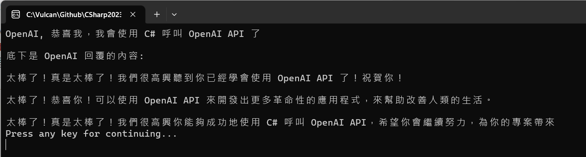

# 第一次使用 C# 來呼叫 Azure OpenAI API 初體驗經驗分享 - 開發教學


OpenAI 推出的 ChatGPT 應用，無疑是 2023 初最熱門的一個新聞，不管你是否有從事程式設計相關或者技術相關工作的人，也都加入了這場 AI 市集內，一同在共同歡樂與樂鬧在一起。

身為一個資深程式設計師而言，僅是單純的透過一個網頁來使用 ChatGPT 所提供的功能，似乎沒有任何成就感，最重要的來，這樣的應用實在有非常大的侷限性。

因此，就在開春的第二季一開頭，就來嘗試透過 C# 程式語言，來呼叫 Azure OpenAI Server 提供出來的各種 GPT API，畢竟，網路上絕大多數的文章，都在討論使用 GPT API 的時候，使用的都為 Python，說實在的，個人對於這個語言並不是十分孰悉，所以，還是想使用本身專業的 .NET C#

## 取得 Azure OpenAI Key 並且儲存為系統環境變數

* 打開 Azure 網頁，並且登入該服務
* 切換到你自己建立 [Azure OpenAI] 服務
* 在 Overview 儀表板頁面中，將會看到 [Manage keys] 欄位
* 點選該欄位名稱右邊的 [Click here to manage keys] 文字

  
* 現在將會看到 [Keys and Endpoint] 這個頁面
* 你可以點選 [Show Keys] 來看到 API Key 的內容，又或者點選最右方的複製按鈕，將 API Key 複製到剪貼簿內

  
* 開啟命令提示字元視窗
* 使用底下命令將建立 OpenAI Key 永久性的環境變數

```
setx OpenAIKey "剪貼簿內的 OpenAI Key 值" /M
```

## 建立 OpenAI GPT Hello World 測試用的專案

為了簡化測試用專案的複雜度，因此，在這裡將會建立一個 Console 主控台應用類型的專案。

* 打開 Visual Studio 2022 IDE 應用程式
* 從 [Visual Studio 2022] 對話窗中，點選右下方的 [建立新的專案] 按鈕
* 在 [建立新專案] 對話窗右半部
  * 切換 [所有語言 (L)] 下拉選單控制項為 [C#]
  * 切換 [所有專案類型 (T)] 下拉選單控制項為 [主控台]
* 在中間的專案範本清單中，找到並且點選 [主控台應用程式] 專案範本選項
  > 專案，用於建立可在 Windows、Linux 及 macOS 於 .NET 執行的命令列應用程式
* 點選右下角的 [下一步] 按鈕
* 在 [設定新的專案] 對話窗
* 找到 [專案名稱] 欄位，輸入 `OpenAIHelloWordByBetalgo` 作為專案名稱
* 在剛剛輸入的 [專案名稱] 欄位下方，確認沒有勾選 [將解決方案與專案至於相同目錄中] 這個檢查盒控制項
* 點選右下角的 [下一步] 按鈕
* 現在將會看到 [其他資訊] 對話窗
* 在 [架構] 欄位中，請選擇最新的開發框架，這裡選擇的 [架構] 是 : `.NET 7.0 (標準字詞支援)`
* 在這個練習中，需要去勾選 [不要使用最上層陳述式(T)] 這個檢查盒控制項
  > 這裡的這個操作，可以由讀者自行決定是否要勾選這個檢查盒控制項
* 請點選右下角的 [建立] 按鈕

稍微等候一下，這個主控台專案將會建立完成

## 安裝要用到的 NuGet 開發套件

因為開發此專案時會用到這些 NuGet 套件，請依照底下說明，將需要用到的 NuGet 套件安裝起來。

### 安裝 Betalgo.OpenAI.GPT3 套件

* 滑鼠右擊 [方案總管] 視窗內的 [專案節點] 下方的 [相依性] 節點
* 從彈出功能表清單中，點選 [管理 NuGet 套件] 這個功能選項清單
* 此時，將會看到 [NuGet: EFCoreUsingDbContextPoolSize] 視窗
* 切換此視窗的標籤頁次到名稱為 [瀏覽] 這個標籤頁次
* 在左上方找到一個搜尋文字輸入盒，在此輸入 `Betalgo.OpenAI.GPT3`
* 稍待一會，將會在下方看到這個套件被搜尋出來
* 點選 [Betalgo.OpenAI.GPT3] 套件名稱
* 在視窗右方，將會看到該套件詳細說明的內容，其中，右上方有的 [安裝] 按鈕
* 點選這個 [安裝] 按鈕，將這個套件安裝到專案內

## 修正主程序 Program.cs 的程式碼

* 在此專案節點下，找到並且打開 [Program.cs] 這個檔案
* 使用底下 C# 程式碼替換掉 [Program.cs] 檔案內所有程式碼內容

```csharp
using OpenAI.GPT3;
using OpenAI.GPT3.Interfaces;
using OpenAI.GPT3.Managers;
using OpenAI.GPT3.ObjectModels.RequestModels;
using OpenAI.GPT3.ObjectModels;

namespace OpenAIHelloWordByBetalgo
{
    /// <summary>
    /// 第一次使用 C# 來呼叫 Azure OpenAI API
    /// 使用套件 : Betalgo.OpenAI.GPT3
    /// 
    /// 建立 OpenAI Key 永久性的環境變數
    /// setx OpenAIKey "Azure OpenAI 儀表板看到的 Key" /M
    /// 刪除系統變數
    /// reg delete "HKLM\SYSTEM\CurrentControlSet\Control\Session Manager\Environment" /v OpenAIKey /f
    /// </summary>
    internal class Program
    {
        static async Task Main(string[] args)
        {
            #region 建立 OpenAiOptions 物件，用來標明此次呼叫 API 的類型與授權資訊
            // 這邊使用 Environment.GetEnvironmentVariable() 來取得環境變數，也可以直接使用字串
            var apiKey = Environment.GetEnvironmentVariable("OpenAIKey");
            var gpt3 = new OpenAIService(new OpenAiOptions()
            {
                ProviderType = ProviderType.Azure,
                ApiKey = apiKey,
                DeploymentId = "text-davinci-003",
                ResourceName = "vulcan-openai"
            });
            #endregion

            #region 使用 Completions 物件，呼叫 OpenAI API 並取得回傳結果
            string prompt = "OpenAI, 恭喜我，我會使用 C# 呼叫 OpenAI API 了\n";
            await Console.Out.WriteLineAsync(prompt);
            var completionResult = await gpt3.Completions
                .CreateCompletion(new CompletionCreateRequest()
            {
                Prompt = prompt,
                Model = Models.TextDavinciV3,
                Temperature = 0.5F,
                MaxTokens = 100,
                N = 3
            });
            #endregion

            #region 判斷回傳結果是否成功，並將結果印出
            if (completionResult.Successful)
            {
                await Console.Out.WriteLineAsync($"底下是 OpenAI 回覆的內容:");
                foreach (var choice in completionResult.Choices)
                {
                    Console.WriteLine(choice.Text);
                }
            }
            else
            {
                if (completionResult.Error == null)
                {
                    throw new Exception("Unknown Error");
                }
                Console.WriteLine($"{completionResult.Error.Code}: {completionResult.Error.Message}");
            }
            #endregion

            Console.WriteLine("Press any key for continuing...");
            Console.ReadKey();
        }
    }
}
```

在這個進入點程式碼內，首先會先呼叫 `Environment.GetEnvironmentVariable("OpenAIKey")` 敘述，取得剛剛設定在系統環境變數中的 OpenAI Key 值，並且將 Key 儲存到 [apiKey] 這個物件內。會想要這麼設計的理由是很單純的，就是不想把 OpenAI Key 內容寫在程式碼內，並且 Commit 到版控系統內，如果是這樣的話，那麼，大家都會知道你的 OpenAI Key 內容，當然，也就可以透過這個 Key 來存取你的 Azure OpenAI Service，最後將是你需要負擔這些呼叫 API 的費用。

緊接著使用 `OpenAiOptions` 類別來建立一個物件，這個物件將會

* 用 [ProviderType] 屬性來指定要呼叫的 API 是 [OpenAI] 提供的相關服務，還是使用 [Azure OpenAI Server] 的 GPT API 服務
* 透過 [ApiKey] 屬性將從 Azure 上取得的 OpenAI Key 內容，指定到這個屬性內
* 對於 [DeploymentId] 欄位，則是用來指定要使用的 GPT 模型名稱，這裡將會展示使用達文西 [text-davinci-003]
* 最後的 [ResourceName] 欄位則是用來指定在 Azure 上用到的資源名稱

完成 [OpenAiOptions] 物件建立之後，緊接著在建立一個 [OpenAIService] 類別的物件，並且把剛剛建立的 [OpenAiOptions] 物件，傳入到此類別 [OpenAIService] 建構式內，所得到的物件將會存入到變數名為 [gpt3] 內；有了這個 [gpt3] 物件，接下來就可以對 GPT API 進行呼叫了

這個敘述 `string prompt = "OpenAI, 恭喜我，我會使用 C# 呼叫 OpenAI API 了\n";` 將會指定要對 GPT 提問問題提示內容。

接下來，先建立一個 [CompletionCreateRequest] 物件，在這裡將剛剛的提示問題文字指定改該物件的 [Prompt] 屬性，接者指定 [Model] , [Temperature] , [MaxTokens] 這三個屬性內容值，分別代表用到的模型、處理提示問題的溫度、最多用到的 Token 數量(這裡包含 Prompt 文字產生的 Token 數量)，最後一個 N 屬性，則表示會有幾個回應。

現在可以使用 [gpt3.Completions.CreateCompletion()] 方法，把剛剛產生的物件傳入到 [CreateCompletion] 方法內，這個方法將會呼叫遠端的 [Azure OpenAI Server] 指定的相關 API

最後當呼叫 API 有結果回傳，並且結果是成功的，就可以透過 [completionResult.Choices] 這個列舉物件，顯示相關 GPT API 回應結果

底下是執行這個專案的結果



```
OpenAI, 恭喜我，我會使用 C# 呼叫 OpenAI API 了

底下是 OpenAI 回覆的內容:

太棒了！真是太棒了！我們很高興聽到你已經學會使用 OpenAI API 了！祝賀你！

太棒了！恭喜你！可以使用 OpenAI API 來開發出更多革命性的應用程式，來幫助改善人類的生活。

太棒了！真是太棒了！我們很高興你能夠成功地使用 C# 呼叫 OpenAI API，希望你會繼續努力，為你的專案帶來
Press any key for continuing...
```
