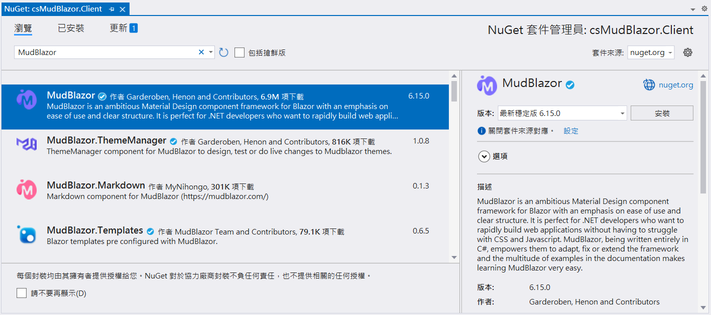
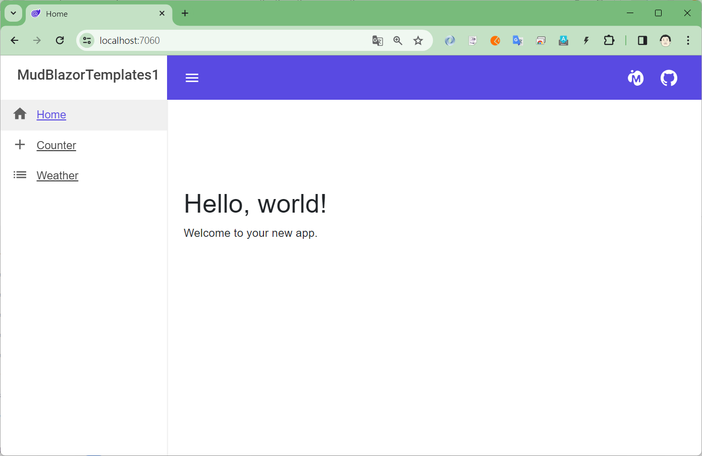
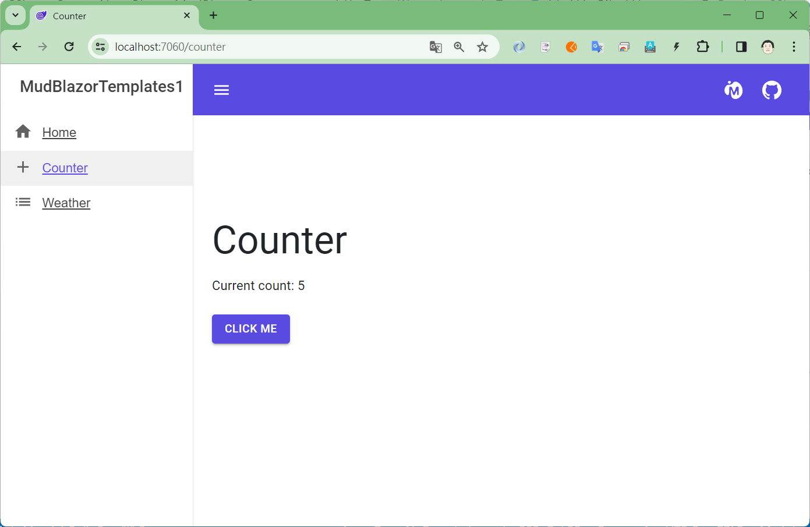
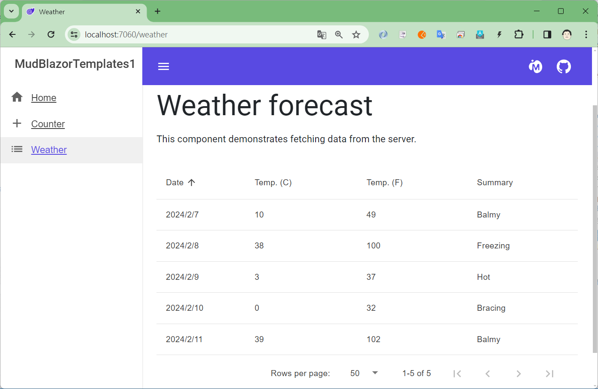

# 使用 MudBlazor 元件 建立 Blazor 專案


## 建立 .NET 8 MAUI 專案

> **為了能夠完成這份文件所提到的事情，需要將電腦上的 Visual Studio 2022 升級到 17.8 以上的版本，也就是，這台電腦上必須要有安裝 .NET 8 SDK。**

* 打開 Visual Studio 2022 IDE 應用程式
* 從 [Visual Studio 2022] 對話窗中，點選右下方的 [建立新的專案] 按鈕
* 在 [建立新專案] 對話窗右半部
  * 切換 [所有語言 (L)] 下拉選單控制項為 [C#]
  * 切換 [所有專案類型 (T)] 下拉選單控制項為 [Web]
* 在中間的專案範本清單中，找到並且點選 [Blazor Web App] 專案範本選項
  > A project template for creating a Blazor web app that supports both server-side rendering and client interactivity. This template can be ued for web apps with rich dynamic user interfaces (UIs).
* 點選右下角的 [下一步] 按鈕
* 在 [設定新的專案] 對話窗
  * 找到 [專案名稱] 欄位，輸入 `csMudBlazor` 作為專案名稱
  * 在剛剛輸入的 [專案名稱] 欄位下方，確認沒有勾選 [將解決方案與專案至於相同目錄中] 這個檢查盒控制項
* 點選右下角的 [下一步] 按鈕
* 現在將會看到 [其他資訊] 對話窗
  * 在 [架構] 欄位中，請選擇最新的開發框架，這裡選擇的 [架構] 是 : `.NET 8.0 (長期支援)`
  * [驗證類型] 請選擇預設值 [無]
  * 在 [Interactive render mode] 欄位中，請選擇預設值 [Auto (Server and WebAssembly)]
  * 在 [Interactivity location] 欄位中，請選擇預設值 [Per page/component]
  * 若想要看到範例頁面，可以依照自己的需求，勾選 [Include sample pages] 這個檢查盒控制項
* 請點選右下角的 [建立] 按鈕

稍微等候一下，這個主控台專案將會建立完成


## 安裝要用到的 NuGet 開發套件

因為開發此專案時會用到這些 NuGet 套件，請依照底下說明，將需要用到的 NuGet 套件安裝起來。

### 安裝 MudBlazor 套件

請依照底下說明操作步驟，將這個套件安裝到專案內

* 滑鼠右擊 [方案總管] 視窗內的 [csMudBlazor.Client] 之 [專案節點] 下方的 [相依性] 節點
* 從彈出功能表清單中，點選 [管理 NuGet 套件] 這個功能選項清單
* 此時，將會看到 [NuGet: csMudBlazor] 視窗
* 切換此視窗的標籤頁次到名稱為 [瀏覽] 這個標籤頁次
* 在左上方找到一個搜尋文字輸入盒，在此輸入 `MudBlazor`
* 稍待一會，將會在下方看到這個套件被搜尋出來
* 點選 [MudBlazor] 套件名稱
  
* 在視窗右方，將會看到該套件詳細說明的內容，其中，右上方有的 [安裝] 按鈕
* 點選這個 [安裝] 按鈕，將這個套件安裝到專案內

## 修正 csMudBlazor.Client 專案 (WebAssembly)

### 修正 Program.cs

* 在 [csMudBlazor.Client] 專案內，找到並打開 [Program.cs]
* 找到 `var builder = WebAssemblyHostBuilder.CreateDefault(args);` 敘述之後，加入底下兩行敘述

```csharp
builder.Services.AddScoped(sp => new HttpClient { BaseAddress = new Uri(builder.HostEnvironment.BaseAddress) });
builder.Services.AddMudServices();
```

* 這裡將會註冊 HttpClient 與 MudBlazor 會用到的相關服務

### 修正 _Imports.razor
* 在 [csMudBlazor.Client] 專案內，找到並打開 [_Imports.razor]
* 在這個檔案的最後，加入底下兩行敘述
    
```csharp
@using MudBlazor
@using MudBlazor.Services
```

### 建立 Components 資料夾與相關檔案

* 滑鼠右擊 [csMudBlazor.Client] 專案節點
* 從彈出功能表中，點選 [加入] > [新增資料夾]
* 使用 [Components] 名稱作為剛剛建立資料夾的名稱
* 滑鼠右擊 [Components] 資料夾
* 從彈出功能表中，點選 [加入] > [新增項目]
* 在 [新增項目] 對話窗中
  * 在左邊的 [已安裝] > [C#] 節點下，選擇 [Razor 元件] 範本
  * 在下方的 [名稱] 文字輸入盒中，輸入 `MyMudProviders.razor`
  * 點選 [新增] 按鈕
* 使用底下內容，替換掉這個檔案原有內容

```html
@inject ISnackbar Snackbar

<MudPopoverProvider></MudPopoverProvider>
<MudDialogProvider />
<MudSnackbarProvider />

@code {
    protected override void OnInitialized()
    {
        Snackbar.Clear();
        Snackbar.Configuration.PositionClass = Defaults.Classes.Position.TopCenter;
        Snackbar.Configuration.MaxDisplayedSnackbars = 5;
        Snackbar.Configuration.SnackbarVariant = Variant.Filled;
        Snackbar.Configuration.PreventDuplicates = true;
    }
}
```

* 滑鼠右擊 [Components] 資料夾
* 從彈出功能表中，點選 [加入] > [新增項目]
* 在 [新增項目] 對話窗中
  * 在左邊的 [已安裝] > [C#] 節點下，選擇 [Razor 元件] 範本
  * 在下方的 [名稱] 文字輸入盒中，輸入 `MyMudThemeProvider.razor`
  * 點選 [新增] 按鈕
* 使用底下內容，替換掉這個檔案原有內容

```html
<CascadingValue Value=false Name="UsePopoverProvider">
    <MudThemeProvider Theme="MyTheme"></MudThemeProvider>
</CascadingValue>

@code {
    public static MudTheme MyTheme => new()
        {
            Palette = new PaletteLight()
            {
                Primary = "#594AE2",
                AppbarBackground = "#594AE2"
            },
            PaletteDark = new PaletteDark()
            {
                Primary = "#594AE2",
                AppbarBackground = "#594AE2"
            }
        };
}
```

### 修正 Counter.razor 

* 在 [csMudBlazor.Client] 專案節點下，展開 [Pages] 資料夾
* 找到並打開 [Counter.razor] 檔案
* 將底下的內容，替換掉這個檔案內容

```html
@page "/counter"
@rendermode InteractiveAuto

<PageTitle>Counter</PageTitle>

<MudText Typo="Typo.h3" GutterBottom="true">Counter</MudText>
<MudText Class="mb-4">Current count: @currentCount</MudText>
<MudButton Color="Color.Primary" Variant="Variant.Filled" @onclick="IncrementCount">Click me</MudButton>

@code {
    private int currentCount = 0;

    private void IncrementCount()
    {
        currentCount++;
    }
}
```

## 修正 csMudBlazor 專案

### 修正 Program.cs

* 在 [csMudBlazor.Client] 專案內，找到並打開 [Program.cs]
* 找到 `var builder = WebAssemblyHostBuilder.CreateDefault(args);` 敘述之後，加入底下兩行敘述

```csharp
builder.Services.AddMudServices();
```

* 這裡將會註冊 MudBlazor 會用到的相關服務

### 修正 MainLayout.razor 檔案

### 修正 _Imports.razor
* 在 [csMudBlazor] 專案節點下，展開 [Components] 資料夾
* 找到並打開 [_Imports.razor] 檔案
* 在這個檔案的最後，加入底下兩行敘述
    
```csharp
@using MudBlazor
@using MudBlazor.Services
@using csMudBlazor.Client.Components
```

### 修正 MainLayout.razor 與 NavMenu.razor 檔案

* 在 [csMudBlazor] 專案節點下，展開 [Components] > [Layouts] 資料夾
* 找到並且打開 [MainLayout.razor] 檔案
* 使用底下內容，替換掉這個檔案原有內容

```html
@inherits LayoutComponentBase

<MyMudThemeProvider />
<MyMudProviders />

<MudLayout>
    <MudAppBar Elevation="0">
		<MudIconButton Icon="@Icons.Material.Filled.Menu" Color="Color.Inherit" Edge="Edge.Start" OnClick="@((e) => DrawerToggle())" />
        <MudSpacer />
        <MudIconButton Icon="@Icons.Custom.Brands.MudBlazor" Color="Color.Inherit" Link="https://mudblazor.com/" Target="_blank" />
        <MudIconButton Icon="@Icons.Custom.Brands.GitHub" Color="Color.Inherit" Link="https://github.com/MudBlazor/MudBlazor/" Target="_blank" />
    </MudAppBar>
    <MudDrawer @bind-Open="_drawerOpen" Elevation="1">
        <MudDrawerHeader>
            <MudText Typo="Typo.h6">MudBlazorTemplates1</MudText>
        </MudDrawerHeader>
        <NavMenu />
    </MudDrawer>
    <MudMainContent>
        <MudContainer MaxWidth="MaxWidth.Large" Class="my-16 pt-16">
            @Body
        </MudContainer>
    </MudMainContent>
</MudLayout>

@code {
    bool _drawerOpen = true;

    void DrawerToggle()
    {
        _drawerOpen = !_drawerOpen;
    }
}
```

* 在 [csMudBlazor] 專案節點下，展開 [Components] > [Layouts] 資料夾
* 找到並且打開 [MainLayout.razor.css] 檔案
* 使用底下內容，替換掉這個檔案原有內容

```css
.page {
    position: relative;
    display: flex;
    flex-direction: column;
}

main {
    flex: 1;
}

.navbar-brand {
    font-size: 1.1rem;
    color: white;
}

.top-row {
    border-bottom: 1px solid #d6d5d5;
    justify-content: flex-end;
    height: 3.5rem;
    display: flex;
    align-items: center;
    background: var(--mud-palette-appbar-background);
}

.top-row ::deep a, .top-row ::deep .btn-link {
    white-space: nowrap;
    margin-left: 1.5rem;
    text-decoration: none;
}

.top-row ::deep a:hover, .top-row ::deep .btn-link:hover {
    text-decoration: underline;
}

.top-row ::deep a:first-child {
    overflow: hidden;
    text-overflow: ellipsis;
}

@media (max-width: 640.98px) {
    .top-row {
        justify-content: space-between;
    }

    .top-row ::deep a, .top-row ::deep .btn-link {
        margin-left: 0;
    }
}

@media (min-width: 641px) {
    .page {
        flex-direction: row;
    }

    .sidebar {
        width: 250px;
        height: 100vh;
        position: sticky;
        top: 0;
    }

    .top-row {
        position: sticky;
        top: 0;
        z-index: 1;
    }

    .top-row.auth ::deep a:first-child {
        flex: 1;
        text-align: right;
        width: 0;
    }
}

.navbar-toggler {
    appearance: none;
    cursor: pointer;
    width: 3.5rem;
    height: 2.5rem;
    color: white;
    position: absolute;
    top: 0.5rem;
    right: 1rem;
    border: 1px solid rgba(255, 255, 255, 0.1);
    background: url("data:image/svg+xml,%3csvg xmlns='http://www.w3.org/2000/svg' viewBox='0 0 30 30'%3e%3cpath stroke='rgba%28255, 255, 255, 0.55%29' stroke-linecap='round' stroke-miterlimit='10' stroke-width='2' d='M4 7h22M4 15h22M4 23h22'/%3e%3c/svg%3e") no-repeat center/1.75rem rgba(255, 255, 255, 0.1);
}

    .navbar-toggler:checked {
        background-color: rgba(255, 255, 255, 0.5);
    }

.nav-scrollable {
    display: none;
}

.navbar-toggler:checked ~ .nav-scrollable {
    display: block;
}

@media (min-width: 641px) {
    .navbar-toggler {
        display: none;
    }

    .nav-scrollable {
        /* Never collapse the sidebar for wide screens */
        display: block;
        /* Allow sidebar to scroll for tall menus */
        height: calc(100vh - 3.5rem);
        overflow-y: auto;
    }
}
```

* 在 [csMudBlazor] 專案節點下，展開 [Components] > [Layouts] 資料夾
* 找到並且打開 [NavMenu.razor] 檔案
* 使用底下內容，替換掉這個檔案原有內容

```html
<MudNavMenu>
    <MudNavLink Href="" Match="NavLinkMatch.All" Icon="@Icons.Material.Filled.Home">Home</MudNavLink>
    <MudNavLink Href="counter" Match="NavLinkMatch.Prefix" Icon="@Icons.Material.Filled.Add">Counter</MudNavLink>
    <MudNavLink Href="weather" Match="NavLinkMatch.Prefix" Icon="@Icons.Material.Filled.List">Weather</MudNavLink>

</MudNavMenu>
```

### 修正 App.razor 檔案
* 在 [csMudBlazor] 專案節點下，展開 [Components] 資料夾
* 找到並且打開 [App.razor] 檔案
* 在 `<head>` 區段內，加入底下兩行宣告

```html
<link href="https://fonts.googleapis.com/css?family=Roboto:300,400,500,700&display=swap" rel="stylesheet" />
<link href="_content/MudBlazor/MudBlazor.min.css" rel="stylesheet" />
```

* 找到 `<script src="_framework/blazor.web.js"></script>` 內容
* 在其下方加入底下宣告內容

```html
<script src="_content/MudBlazor/MudBlazor.min.js"></script>
```

### 修正 Weather.razor 

* 在 [csMudBlazor] 專案節點下
* 展開 [Components] > [Pages] 資料夾
* 找到並打開 [Weather.razor] 檔案
* 將底下的內容，替換掉這個檔案內容

```html
@page "/weather"
@attribute [StreamRendering]

<MyMudProviders />

<PageTitle>Weather</PageTitle>

<MudText Typo="Typo.h3" GutterBottom="true">Weather forecast</MudText>
<MudText Class="mb-8">This component demonstrates fetching data from the server.</MudText>

@if (forecasts == null)
{
    <MudProgressCircular Color="Color.Default" Indeterminate="true" />
}
else
{
    <MudTable Items="forecasts" Hover="true" SortLabel="Sort By" Elevation="0">
        <HeaderContent>
            <MudTh><MudTableSortLabel InitialDirection="SortDirection.Ascending" SortBy="new Func<WeatherForecast, object>(x=>x.Date)">Date</MudTableSortLabel></MudTh>
            <MudTh><MudTableSortLabel SortBy="new Func<WeatherForecast, object>(x=>x.TemperatureC)">Temp. (C)</MudTableSortLabel></MudTh>
            <MudTh><MudTableSortLabel SortBy="new Func<WeatherForecast, object>(x=>x.TemperatureF)">Temp. (F)</MudTableSortLabel></MudTh>
            <MudTh><MudTableSortLabel SortBy="new Func<WeatherForecast, object>(x=>x.Summary!)">Summary</MudTableSortLabel></MudTh>
        </HeaderContent>
        <RowTemplate>
            <MudTd DataLabel="Date">@context.Date</MudTd>
                <MudTd DataLabel="Temp. (C)">@context.TemperatureC</MudTd>
                <MudTd DataLabel="Temp. (F)">@context.TemperatureF</MudTd>
                <MudTd DataLabel="Summary">@context.Summary</MudTd>
            </RowTemplate>
            <PagerContent>
                <MudTablePager PageSizeOptions="new int[]{50, 100}" />
            </PagerContent>
        </MudTable>
}

@code {
    private WeatherForecast[]? forecasts;

    protected override async Task OnInitializedAsync()
    {
        // Simulate asynchronous loading to demonstrate streaming rendering
        await Task.Delay(500);

        var startDate = DateOnly.FromDateTime(DateTime.Now);
        var summaries = new[] { "Freezing", "Bracing", "Chilly", "Cool", "Mild", "Warm", "Balmy", "Hot", "Sweltering", "Scorching" };
        forecasts = Enumerable.Range(1, 5).Select(index => new WeatherForecast
            {
                Date = startDate.AddDays(index),
                TemperatureC = Random.Shared.Next(-20, 55),
                Summary = summaries[Random.Shared.Next(summaries.Length)]
            }).ToArray();
    }

    private class WeatherForecast
    {
        public DateOnly Date { get; set; }
        public int TemperatureC { get; set; }
        public string? Summary { get; set; }
        public int TemperatureF => 32 + (int)(TemperatureC / 0.5556);
    }
}
```

## 驗證成果

到現在為止，已經將預設的 Blazor 範本所建立的專案，修正可以使用 MudBlazor 這個套件，所以說，此時便可以在這個 Blazor 專案內，使用 MudBlazor 所提供的各項豐富功能與服務。

* 執行這個專案，將會看到底下畫面







