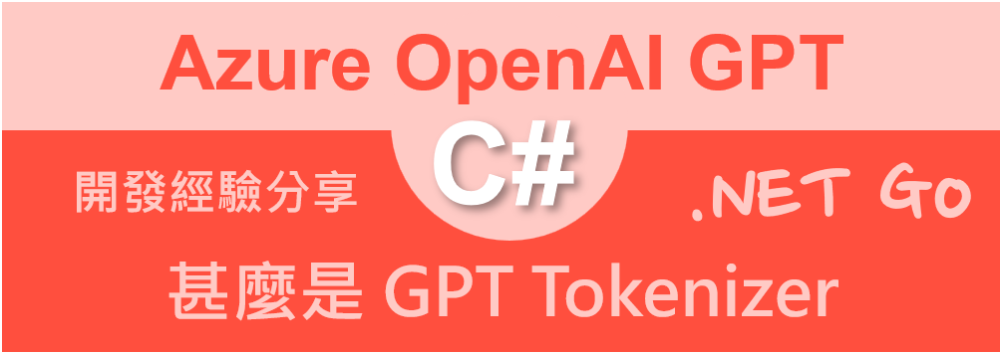
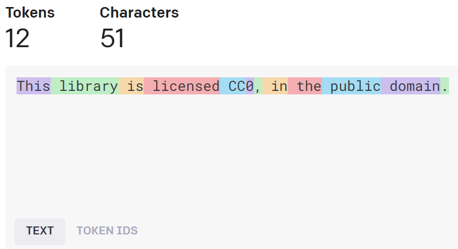
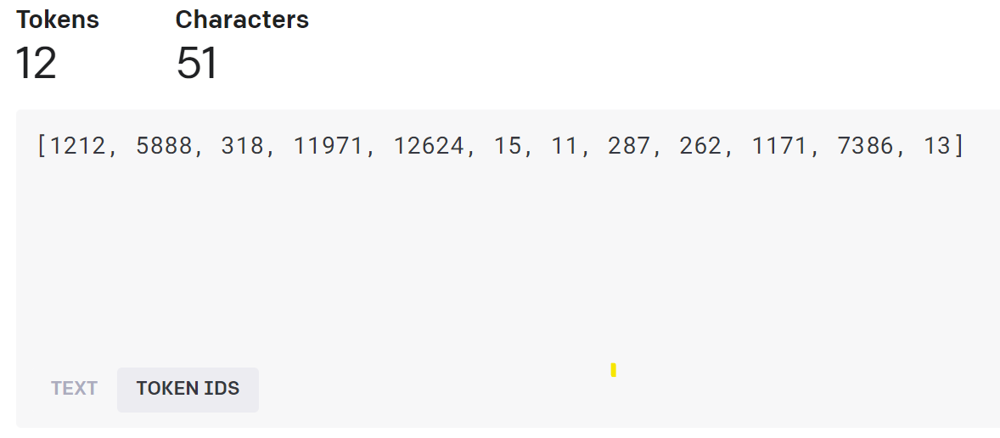
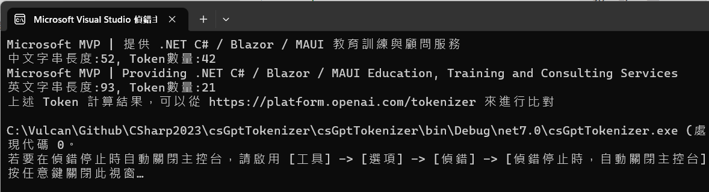

# 甚麼是 GPT 分詞器 Tokenizer 



GPT Tokenizer 是一個專門用於 Generative Pre-trained Transformer（GPT）模型的分詞器（Tokenizer）。它將文本輸入分解為一系列單詞、子詞或字符，稱為 tokens。這些 tokens 是 GPT 模型進行自然語言處理任務時的基本輸入單位。在 GPT 模型中，文本的表示和生成 (可以說 GPT 的輸入與輸出) 都是基於這些 tokens 進行的。

GPT Tokenizer 的具體實現基於 Byte Pair Encoding（BPE）算法。BPE 是一種無監督的文本壓縮算法，可以將文本中的頻繁出現的字符序列合併為單個 tokens。該算法根據字符在文本中出現的頻率將字符進行聚合，最終生成一個詞彙表（vocabulary），其中包括單詞、子詞和字符。

GPT Tokenizer 的主要用途如下：

1. 文本預處理：在將文本輸入 GPT 模型之前，需要使用 GPT Tokenizer 對文本進行預處理，將其轉換為一系列 tokens。這些 tokens 是 GPT 模型接受的輸入格式。

2. 文本生成：當 GPT 模型生成文本時，它實際上是生成一系列 tokens。GPT Tokenizer 可以將這些生成的 tokens 轉換回可讀的文本格式。

3. 計算 token 使用量：在使用 GPT 模型進行文本生成時，我們需要控制生成的 token 數量，以避免過長的輸出或超出模型的最大序列長度。GPT Tokenizer 可以幫助我們計算輸入文本中的 token 數量，以便我們確定生成過程中的限制條件。

總之，GPT Tokenizer 是 GPT 模型進行文本表示、生成和相關計算的重要組件。它可以幫助我們將文本轉換為 GPT 模型所需的格式，並將生成的 tokens 轉換回可讀的文本。

例如，當輸入了這串文字

```
This library is licensed CC0, in the public domain.
```

經過 GPT 分詞器 Tokenizer 處理之後，將會分析出這串文字共有 51 個字元，並且將會轉換成為 12 Token；而原先的文字將會如下圖不同顏色區塊，切割成為不同的 Token。



Token IDs（或 Token Indices）是指將 token（單詞、子詞或字符）映射到一個唯一的整數標識符。每個 token 在模型的詞彙表中都有一個相應的 ID。Token IDs 是模型內部使用的一種表示形式，有助於模型更有效地處理和學習文本信息。

當我們使用分詞器（如 GPT Tokenizer）將文本轉換為 token 時，下一步是將這些 token 轉換為 token IDs。這樣，模型可以根據這些 ID 進行文本信息的處理和學習。在訓練過程中，這些 token IDs 會被轉換成 token Embedding，進一步捕捉詞彙的語義信息。



了解了 GPT 分詞器 Tokenizer 是什麼之後，當在進行 GPT Prompt / Completion 或者 Embedding API 進階應用呼叫的後，將會顯得相當有幫助的。

## 建立可以使用 GPT 分詞器 Tokenizer 的測試專案

為了簡化測試用專案的複雜度，因此，在這裡將會建立一個 Console 主控台應用類型的專案。

* 打開 Visual Studio 2022 IDE 應用程式
* 從 [Visual Studio 2022] 對話窗中，點選右下方的 [建立新的專案] 按鈕
* 在 [建立新專案] 對話窗右半部
  * 切換 [所有語言 (L)] 下拉選單控制項為 [C#]
  * 切換 [所有專案類型 (T)] 下拉選單控制項為 [主控台]
* 在中間的專案範本清單中，找到並且點選 [主控台應用程式] 專案範本選項
  > 專案，用於建立可在 Windows、Linux 及 macOS 於 .NET 執行的命令列應用程式
* 點選右下角的 [下一步] 按鈕
* 在 [設定新的專案] 對話窗
* 找到 [專案名稱] 欄位，輸入 `csGptTokenizer` 作為專案名稱
* 在剛剛輸入的 [專案名稱] 欄位下方，確認沒有勾選 [將解決方案與專案至於相同目錄中] 這個檢查盒控制項
* 點選右下角的 [下一步] 按鈕
* 現在將會看到 [其他資訊] 對話窗
* 在 [架構] 欄位中，請選擇最新的開發框架，這裡選擇的 [架構] 是 : `.NET 7.0 (標準字詞支援)`
* 在這個練習中，需要去勾選 [不要使用最上層陳述式(T)] 這個檢查盒控制項
  > 這裡的這個操作，可以由讀者自行決定是否要勾選這個檢查盒控制項
* 請點選右下角的 [建立] 按鈕

稍微等候一下，這個主控台專案將會建立完成

## 安裝要用到的 NuGet 開發套件

因為開發此專案時會用到這些 NuGet 套件，請依照底下說明，將需要用到的 NuGet 套件安裝起來。

### 安裝 AI.Dev.OpenAI.GPT 套件

[AI.Dev.OpenAI.GPT](https://github.com/dluc/openai-tools) 是一個 NuGet 套件，可以在 .NET 和 C# 專案中使用 。它提供了一個 GPT3Tokenizer C# 類別，可以幫助您計算提示和收到的回應中的令牌數 。該分詞器使用字節對編碼（BPE）算法，根據頻率和合併規則將單詞拆分為子詞 。

您可以通過在 nuget.org 上運行命令 dotnet add package AI.Dev.OpenAI.GPT --version 1.0.2 來安裝 AI.Dev.OpenAI.GPT NuGet 套件 。

請依照底下說明操作步驟，將這個套件安裝到專案內

* 滑鼠右擊 [方案總管] 視窗內的 [專案節點] 下方的 [相依性] 節點
* 從彈出功能表清單中，點選 [管理 NuGet 套件] 這個功能選項清單
* 此時，將會看到 [NuGet: csGptTokenizer] 視窗
* 切換此視窗的標籤頁次到名稱為 [瀏覽] 這個標籤頁次
* 在左上方找到一個搜尋文字輸入盒，在此輸入 `AI.Dev.OpenAI.GPT`
* 稍待一會，將會在下方看到這個套件被搜尋出來
* 點選 [AI.Dev.OpenAI.GPT] 套件名稱
* 在視窗右方，將會看到該套件詳細說明的內容，其中，右上方有的 [安裝] 按鈕
* 點選這個 [安裝] 按鈕，將這個套件安裝到專案內

## 開始進行使用 GPT 分詞器 Tokenizer 來進行程式設計

* 在此專案節點下，找到並且打開 [Program.cs] 這個檔案
* 使用底下 C# 程式碼替換掉 [Program.cs] 檔案內所有程式碼內容

```csharp
using AI.Dev.OpenAI.GPT;

namespace csGptTokenizer
{
    internal class Program
    {
        static void Main(string[] args)
        {
            string text = "Microsoft MVP | 提供 .NET C# / Blazor / MAUI 教育訓練與顧問服務";
            List<int> tokens = GPT3Tokenizer.Encode(text);
            Console.WriteLine(text);
            Console.WriteLine($"中文字串長度:{text.Length}, Token數量:{tokens.Count}");
            text = "Microsoft MVP | Providing .NET C# / Blazor / MAUI Education, Training and Consulting Services";
            tokens = GPT3Tokenizer.Encode(text);
            Console.WriteLine(text);
            Console.WriteLine($"英文字串長度:{text.Length}, Token數量:{tokens.Count}");
            Console.WriteLine($"上述 Token 計算結果，可以從 https://platform.openai.com/tokenizer 來進行比對");
        }
    }
}
```


在這個測試程式碼中，將會分別把含有中文字的文字，與純粹全部都是英文字的文字，對於這兩種類型的文字，在透過 分詞器 處理過後，究竟會得到多少 Token 數量。

首先，會先準備一個含有 中英文 的文字，底下的文字將會儲存在 [text] 這個區域變數內。

```
Microsoft MVP | 提供 .NET C# / Blazor / MAUI 教育訓練與顧問服務
```

使用 [GPT3Tokenizer.Encode] 靜態方法，分析與取出這串文字的所有 Token 到 [tokens] 區域變數內，這是個 `List<int>` 型別物件。有了這些資訊，便可以得到這文字字串長度為 52 , 產生出 Token數量為 42 

若是全為中文的文字

```
近年來物價飆漲，有眼尖的網友就發現連鎖速食店「摩斯漢堡」似乎偷偷調漲
```

將會得到這文字字串長度為 34 , 產生出 Token數量為 79

會有這樣的結果，這是因為一個中文字在進行分詞過程，將會拆解出 1~3 個 Token，反觀，一個英文字(會有多個字母所組成)，通常會轉換成為一個 Token，但也有可能拆出多個 Token。

最後來看看全部都是英文的文字，經過分詞處理之後，所得甚麼樣的結果

```
Microsoft MVP | Providing .NET C# / Blazor / MAUI Education, Training and Consulting Services
```

將會得到這文字字串長度為 93 , 產生出 Token數量為 21

底下將會是執行後的螢幕截圖結果


