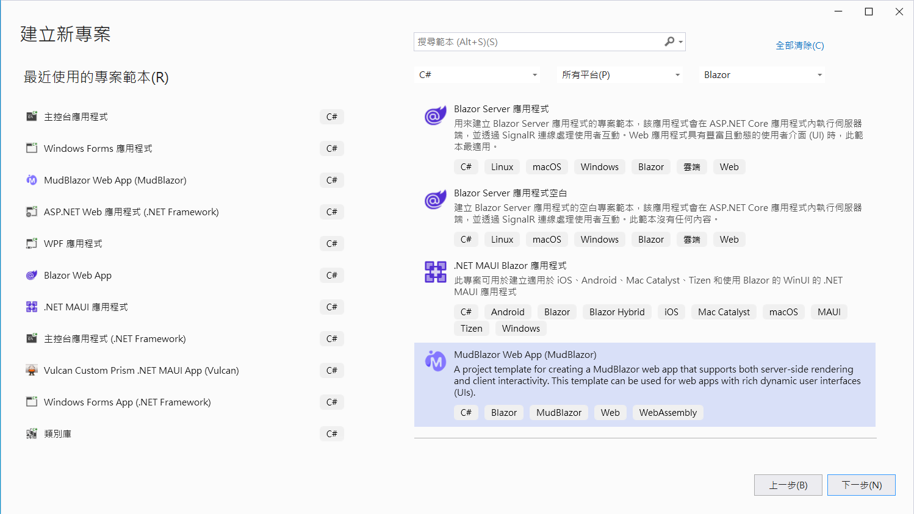
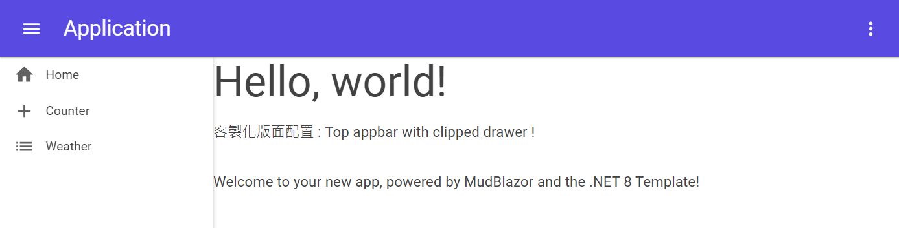

# .NET8 Blazor / MudBlazor - 動態切換不同客製化版面配置 Layouts


想要練習這篇文章的開發過程，開發電腦上必須要能夠先安裝 MudBlazor 專屬的專案範本，透過這個專案範本便可以建立一個 Blazor 開發專案，進行接下來的練習；若開發電腦上還沒有安裝這個專案範本套件，可以參考 [.NET8 Blazor - 使用 MudBlazor 專案範本來建立Blazor專案
](https://csharpkh.blogspot.com/2024/02/NET8-Blazor-MudBlazor-Template-Layout.html) 這篇文章。

## 建立練習專案

* 打開 Visual Studio 2022 IDE 應用程式
* 從 [Visual Studio 2022] 對話窗中，點選右下方的 [建立新的專案] 按鈕
* 在 [建立新專案] 對話窗右半部
  * 切換 [所有語言 (L)] 下拉選單控制項為 [C#]
  * 切換 [所有專案類型 (T)] 下拉選單控制項為 [Blazor]
* 在中間的專案範本清單中，找到並且點選 [MudBlazor Web App (MudBlazor)] 專案範本選項
  > A project template for creating a MudBlazor web app that supports both server-side rendering and client interactivity. This template can be used for web apps with rich dynamic user interfaces (UIs)

  
* 點選右下角的 [下一步] 按鈕
* 在 [設定新的專案] 對話窗
  * 找到 [專案名稱] 欄位，輸入 `csMudBlazorLayout` 作為專案名稱
  * 在剛剛輸入的 [專案名稱] 欄位下方，確認沒有勾選 [將解決方案與專案至於相同目錄中] 這個檢查盒控制項
* 點選右下角的 [下一步] 按鈕
* 現在將會看到 [其他資訊] 對話窗
  * 在 [架構] 欄位中，請選擇最新的開發框架，這裡選擇的 [架構] 是 : `.NET 8.0 (長期支援)`
  * [驗證類型] 請選擇預設值 [無]
  * 在 [Interactive render mode] 欄位中，請選擇預設值 [Server]
  * 在 [Interactivity location] 欄位中，請選擇預設值 [Per page/component]
  * 若想要看到範例頁面，可以依照自己的需求，勾選 [Include sample pages] 這個檢查盒控制項
* 請點選右下角的 [建立] 按鈕

稍微等候一下，這個主控台專案將會建立完成

底下為建立完成的專案結構


## 最左邊 側邊欄 Sidebar 版面配置

* 滑鼠右擊專案節點下的 [Components] > [Layout] 資料夾
* 從彈出的功能表中，選擇 [加入] > [Razor 元件] 選項
* 看到 [加入新檔案] 對話窗
* 在 [名稱] 欄位中，輸入 `DrawerLeftTopAppbar.razor`
* 點選右下角的 [新增] 按鈕
* 使用底下的程式碼取代原有檔案中的程式碼

```html
@inherits LayoutComponentBase

<MudThemeProvider />

<MudLayout>
    <MudAppBar Elevation="1">
        <MudIconButton Icon="@Icons.Material.Filled.Menu" Color="Color.Inherit" Edge="Edge.Start" OnClick="@((e) => DrawerToggle())" />
        <MudSpacer />
        <MudIconButton Icon="@Icons.Material.Filled.MoreVert" Color="Color.Inherit" Edge="Edge.End" />
    </MudAppBar>
    <MudDrawer @bind-Open="_drawerOpen" Elevation="2">
        <MudDrawerHeader>
            <MudText Typo="Typo.h5" Class="mt-1">Application</MudText>
        </MudDrawerHeader>
        <NavMenu />
    </MudDrawer>
    <MudMainContent>
        @Body
    </MudMainContent>
</MudLayout>

@code {
    bool _drawerOpen = true;

    void DrawerToggle()
    {
        _drawerOpen = !_drawerOpen;
    }
}
```

想要客製化一個版面配置元件，需要使用 `@inherits LayoutComponentBase` 這個指示詞，這個指示詞可以讓這個 Razor 元件可以繼承使用 Blazor 的 [LayoutComponentBase] 類別的功能，如此，這個元件便可以用於版面配置之用。

這個 Razor 元件中，使用了 [MudBlazor] 的 [MudThemeProvider] 元件，這個元件可以使用 [MudBlazor] 的主題設定。[MudThemeProvider] 是 [MudBlazor] 框架中的一個組件，它允許開發者定義和管理應用程序的主題，包括顏色、字型和其他設計相關的設定，它為開發者提供了一種高效且靈活的方式來管理和定制應用程序的主題，從而提升了開發效率和用戶體驗。

[MudLayout] 元件扮演著建立頁面版面配置 Layout 的基礎角色。它是用來定義應用程式的整體版面配置結構，如頭部、側邊欄、內容區域和部等。透過使用，開發者可以輕鬆<MudLayout>實現反應方式和整潔的介面版面配置，以適應不同的螢幕尺寸和設備。

[MudAppBar] 元件中用於建立應用程式的頂部導覽列。它是UI中一個關鍵的視覺元素，通常用於展示品牌、導航連結、搜尋列或其他重要的介面元素；這裡 [Elevation="1"] 設定了一個相對較淺的陰影效果，適合於需要強調層次感而不過分突出的頂部導覽列設計。較低的陰影值使得在視覺上更加貼合背景，而不至於<MudAppBar>瞳距過度分離或突兀。

對於 [MudDrawer] 元件是一個用於側邊導航的面板，它可以滑出展示連結或其他內容，是實現響應式佈局和提升使用者介面互動性的重要元件。

在 [MudDrawer] 元件內，使用到 [MudDrawerHeader] ，是 [MudBlazor] 元件庫中的一個元件，設計用於在 `MudDrawer` 元件內部提供一個標準化的頭部區域，這個頭部區域常用於顯示標題、圖示或提供一些上下文信息，以增強使用者介面的可識別性和美觀度。接著這個 [MudDrawerHeader] 下方才會是側邊欄功能表清單。

側邊欄的頂部會有一個標題，並且在標題下方會有一個導覽列，用來顯示導覽連結；應用程式列將不會在螢幕最上方且占據所有的螢幕寬度。

在 Razor 元件的程式碼區段中，定義了一個 `_drawerOpen` 布林變數(預設為 true)，用來控制側邊欄的開啟與關閉。在 [MudIconButton] 元件中，透過 `OnClick="@((e) => DrawerToggle())"` 宣告，當點擊這個元件之後，將會觸發 [DrawerToggle] 方法，而在 [DrawerToggle] 方法中，透過 `_drawerOpen` 變數的值，來控制側邊欄的開啟與關閉。

下圖為顯示側邊欄面板的效果


下圖為關閉側邊欄面板的效果


## 最上方 應用程式列 AppBar 與 左邊 側邊欄 版面配置

* 滑鼠右擊專案節點下的 [Components] > [Layout] 資料夾
* 從彈出的功能表中，選擇 [加入] > [Razor 元件] 選項
* 看到 [加入新檔案] 對話窗
* 在 [名稱] 欄位中，輸入 `TopAppbarWithClippedDrawer.razor`
* 點選右下角的 [新增] 按鈕
* 使用底下的程式碼取代原有檔案中的程式碼

```html
@inherits LayoutComponentBase

<MudThemeProvider />

<MudLayout>
    <MudAppBar Elevation="1">
        <MudIconButton Icon="@Icons.Material.Filled.Menu" Color="Color.Inherit" Edge="Edge.Start" OnClick="@((e) => DrawerToggle())" />
        <MudText Typo="Typo.h5" Class="ml-3">Application</MudText>
        <MudSpacer />
        <MudIconButton Icon="@Icons.Material.Filled.MoreVert" Color="Color.Inherit" Edge="Edge.End" />
    </MudAppBar>
    <MudDrawer @bind-Open="_drawerOpen" ClipMode="DrawerClipMode.Always" Elevation="2">
        <NavMenu />
    </MudDrawer>
    <MudMainContent>
        @Body
    </MudMainContent>
</MudLayout>

@code {
    bool _drawerOpen = true;

    void DrawerToggle()
    {
        _drawerOpen = !_drawerOpen;
    }
}
```

這個版面配置與前一個很類似，差別在於在 [MudAppBar] 元件中，增加了一個 [MudText] 元件 (`<MudText Typo="Typo.h5" Class="ml-3">Application</MudText>`)，用來顯示應用程式的標題。

對於在 [MudLayout] 內的 [MudDrawer] 元件是一個用於側邊導航的面板，它可以滑出展示連結或其他內容，是實現響應式佈局和提升使用者介面互動性的重要元件。 

[ClipMode="DrawerClipMode.Always"] 這意味著無論側邊導航的面板的狀態（打開或關閉），最上方 應用程式列將會永遠顯示在最上方，不會被側邊導航面板覆蓋掉。

[MudMainContent] 元件用於包裝應用程式的主要內容區域，這裡將會使用 `@Body` 前置詞來標示這裡將會是一個預留位置，用來檢視所路由到的 Razor 元件內容。


下圖為顯示側邊欄面板的效果



下圖為關閉側邊欄面板的效果


## 僅上方 應用程式列 AppBar 版面配置

* 滑鼠右擊專案節點下的 [Components] > [Layout] 資料夾
* 從彈出的功能表中，選擇 [加入] > [Razor 元件] 選項
* 看到 [加入新檔案] 對話窗
* 在 [名稱] 欄位中，輸入 `AppbarOnly.razor`
* 點選右下角的 [新增] 按鈕
* 使用底下的程式碼取代原有檔案中的程式碼

```html
@inherits LayoutComponentBase

<MudThemeProvider />

<MudLayout>
    <MudAppBar Elevation="1">
        <MudText Typo="Typo.h5" Class="ml-3">Application</MudText>
        <MudSpacer />
        <MudIconButton Icon="@Icons.Material.Filled.MoreVert" Color="Color.Inherit" Edge="Edge.End" />
    </MudAppBar>
    <MudMainContent>
        @Body
    </MudMainContent>
</MudLayout>
```

在這個版面配置下，將不會有側邊欄面版。
下圖為顯示結果


## 指定不同路由頁面使用不同的版面配置

* 建立路由頁面來套用 [最左邊 側邊欄 Sidebar 版面配置] 
* 滑鼠右擊專案節點下的 [Components] > [Pages] 資料夾
* 從彈出的功能表中，選擇 [加入] > [Razor 元件] 選項
* 看到 [加入新檔案] 對話窗
* 在 [名稱] 欄位中，輸入 `CustomLayout1.razor`
* 點選右下角的 [新增] 按鈕
* 使用底下的程式碼取代原有檔案中的程式碼

```html
@page "/CustomLayout1"
@using MB01.Components.Layout
@layout DrawerLeftTopAppbar

<PageTitle>客製化版面配置 : Drawer left + top appbar</PageTitle>

<MudText Typo="Typo.h3" GutterBottom="true">Hello, world!</MudText>
<MudText Typo="Typo.h4" Class="mb-8 mud-secondary-text">
    客製化版面配置 : Drawer left + top appbar !
</MudText>
<MudText Class="mb-8">Welcome to your new app, powered by MudBlazor and the .NET 8 Template!</MudText>
```

在這個 Razor 元件中，使用了 `@layout DrawerLeftTopAppbar` 這個指示詞，這個指示詞可以指定這個 Razor 元件使用 `DrawerLeftTopAppbar` 這個版面配置元件。

* 建立路由頁面來套用 [最上方 應用程式列 AppBar 與 左邊 側邊欄 版面配置]
* 滑鼠右擊專案節點下的 [Components] > [Pages] 資料夾
* 從彈出的功能表中，選擇 [加入] > [Razor 元件] 選項
* 看到 [加入新檔案] 對話窗
* 在 [名稱] 欄位中，輸入 `CustomLayout2.razor`
* 點選右下角的 [新增] 按鈕
* 使用底下的程式碼取代原有檔案中的程式碼

```html
@page "/CustomLayout2"
@using MB01.Components.Layout
@layout TopAppbarWithClippedDrawer

<PageTitle>客製化版面配置 : Top appbar with clipped drawer</PageTitle>

<MudText Typo="Typo.h3" GutterBottom="true">Hello, world!</MudText>
<MudText Class="mb-8">客製化版面配置 : Top appbar with clipped drawer !</MudText>
<MudText Class="mb-8">Welcome to your new app, powered by MudBlazor and the .NET 8 Template!</MudText>
```

在這個 Razor 元件中，使用了 `@layout TopAppbarWithClippedDrawer` 這個指示詞，這個指示詞可以指定這個 Razor 元件使用 `TopAppbarWithClippedDrawer` 這個版面配置元件。

* 建立路由頁面來套用 [僅上方 應用程式列 AppBar 版面配置]
* 滑鼠右擊專案節點下的 [Components] > [Pages] 資料夾
* 從彈出的功能表中，選擇 [加入] > [Razor 元件] 選項
* 看到 [加入新檔案] 對話窗
* 在 [名稱] 欄位中，輸入 `CustomLayout3.razor`
* 點選右下角的 [新增] 按鈕
* 使用底下的程式碼取代原有檔案中的程式碼

```html
@page "/CustomLayout3"
@using MB01.Components.Layout
@layout AppbarOnly

<PageTitle>客製化版面配置 : Appbar Only</PageTitle>

<MudText Typo="Typo.h4" Class="mb-8 mud-secondary-text">
    Hello, world!
</MudText>
<MudText Class="mb-8">客製化版面配置 : Appbar Only !</MudText>
<MudText Class="mb-8">Welcome to your new app, powered by MudBlazor and the .NET 8 Template!</MudText>
```

在這個 Razor 元件中，使用了 `@layout AppbarOnly` 這個指示詞，這個指示詞可以指定這個 Razor 元件使用 `AppbarOnly` 這個版面配置元件。

## 修正渲染模式

因為在版面配置 Layout 將會有使用到 C# 程式碼，也就是會有使用者互動需求，因此，需要開啟這個專案預設採用 [互動式伺服器](https://learn.microsoft.com/zh-tw/aspnet/core/blazor/components/render-modes?view=aspnetcore-8.0&WT.mc_id=DT-MVP-5002220) 模式，也就是 使用 Blazor Server的互動式伺服器端轉譯（互動式SSR）。

* 在專案節點下找到並打開 [App.razor 檔案]
* 找到 `<Routes />` 標籤
* 將這個標籤替換為 `<Routes @rendermode="RenderMode.InteractiveServer" />`


