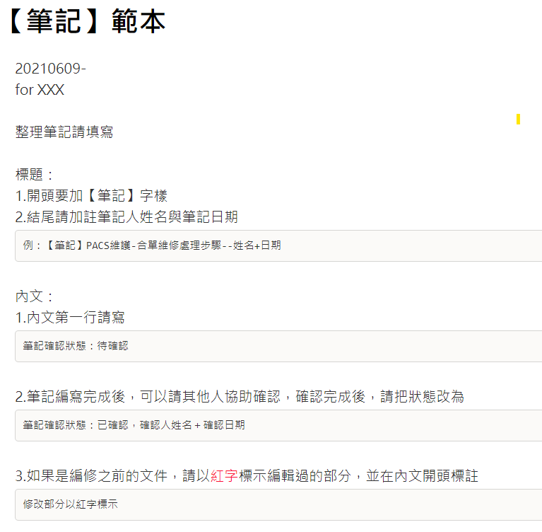

# 將文件檔案轉換成為文字內容系列 - HTML 


在 [上一篇文章](https://csharpkh.blogspot.com/2023/05/CSharp-Net-Convert-Document-To-Text-HTML.html) 有討論到如何將 HTML 文件檔案轉換成為文字內容，在這份文章中，將會是這個轉換成為文字內容系列文章的第 2 個，在這裡將會探討如何將 HTML 類型的檔案，抽取出裡面的文字內容出來。

HTML（HyperText Markup Language，超文本標記語言）是一種標準的網頁標記語言，用於描述網頁的結構和內容。它不是一種程式語言，而是一種用於組織和展示網頁元素（如文本、圖像、超連結等）的標記語言。

HTML 文件包含一系列的標籤（tags），這些標籤用來標記不同的網頁元素，例如段落、標題、列表等。瀏覽器會解析這些標籤，並根據它們的含義將內容呈現給用戶。

HTML 是網頁開發的基礎，通常與 CSS（Cascading Style Sheets，層疊樣式表）和 JavaScript 一起使用，分別負責網頁的外觀和互動功能。這三個技術共同構成了網頁開發的核心。

由於這裡需要的純文字，將會是使用者在瀏覽器上看到的各種文字，所以，對於 HTML 檔案內的各種標籤 (Tags) 、CSS、JavaScript 等這些內容，將需要忽略掉。

## 建立可以將 HTML 檔案轉換出文字內容的測試專案

為了簡化測試用專案的複雜度，因此，在這裡將會建立一個 Console 主控台應用類型的專案。

* 打開 Visual Studio 2022 IDE 應用程式
* 從 [Visual Studio 2022] 對話窗中，點選右下方的 [建立新的專案] 按鈕
* 在 [建立新專案] 對話窗右半部
  * 切換 [所有語言 (L)] 下拉選單控制項為 [C#]
  * 切換 [所有專案類型 (T)] 下拉選單控制項為 [主控台]
* 在中間的專案範本清單中，找到並且點選 [主控台應用程式] 專案範本選項
  > 專案，用於建立可在 Windows、Linux 及 macOS 於 .NET 執行的命令列應用程式
* 點選右下角的 [下一步] 按鈕
* 在 [設定新的專案] 對話窗
* 找到 [專案名稱] 欄位，輸入 `csHtml2Text` 作為專案名稱
* 在剛剛輸入的 [專案名稱] 欄位下方，確認沒有勾選 [將解決方案與專案至於相同目錄中] 這個檢查盒控制項
* 點選右下角的 [下一步] 按鈕
* 現在將會看到 [其他資訊] 對話窗
* 在 [架構] 欄位中，請選擇最新的開發框架，這裡選擇的 [架構] 是 : `.NET 7.0 (標準字詞支援)`
* 在這個練習中，需要去勾選 [不要使用最上層陳述式(T)] 這個檢查盒控制項
  > 這裡的這個操作，可以由讀者自行決定是否要勾選這個檢查盒控制項
* 請點選右下角的 [建立] 按鈕

稍微等候一下，這個主控台專案將會建立完成

## 安裝要用到的 NuGet 開發套件

因為開發此專案時會用到這些 NuGet 套件，請依照底下說明，將需要用到的 NuGet 套件安裝起來。

### 安裝 HtmlAgilityPack 套件

HtmlAgilityPack（HAP）是一個針對 C# 開發環境的 HTML 解析和操作庫。它提供了一個易於使用和高效的 API，讓開發者能夠對 HTML 文件進行各種操作，如讀取、修改和操作 HTML 內容。

HtmlAgilityPack 的主要功能和目的包括：

* HTML 解析：能夠解析不規範和破碎的 HTML 代碼，並將其轉換成一個可操作的對象模型，方便開發者進行後續操作。
* 查詢和選擇節點：提供了類似 XPath、CSS 選擇器等方式，讓開發者能夠快速地定位和選擇 HTML 文件中的指定元素。
* 修改 HTML 內容：允許開發者對 HTML 內容進行修改，如增加、刪除或修改元素的屬性、標籤名和內容等。
* 遍歷 HTML 節點：可以對 HTML 文件進行遍歷，讓開發者更方便地查找和處理指定的節點或元素。
* HTML 轉換：支持將 HTML 內容轉換成其他格式，如 XML、JSON等，以便於進行後續處理。
* 網絡爬蟲：可以擴展 HtmlAgilityPack 的功能，以實現簡單的網頁抓取和內容提取。

總之，HtmlAgilityPack 是一個強大且靈活的 HTML 處理套件，適用於 C# 開發環境。它可以幫助開發者更高效地解析和操作 HTML 內容，進行網頁資料提取或構建網頁爬蟲等任務。

請依照底下說明操作步驟，將這個套件安裝到專案內

* 滑鼠右擊 [方案總管] 視窗內的 [專案節點] 下方的 [相依性] 節點
* 從彈出功能表清單中，點選 [管理 NuGet 套件] 這個功能選項清單
* 此時，將會看到 [NuGet: csHtml2Text] 視窗
* 切換此視窗的標籤頁次到名稱為 [瀏覽] 這個標籤頁次
* 在左上方找到一個搜尋文字輸入盒，在此輸入 `HtmlAgilityPack`
* 稍待一會，將會在下方看到這個套件被搜尋出來
* 點選 [HtmlAgilityPack] 套件名稱
* 在視窗右方，將會看到該套件詳細說明的內容，其中，右上方有的 [安裝] 按鈕
* 點選這個 [安裝] 按鈕，將這個套件安裝到專案內

## 準備需要抽取文字內容的 HTML 檔案

* 準備好一個 [.html] 文件檔案
* 在這裡將會從網路上，隨機找到一個 [【筆記】範本.html] 檔案
* 取得該檔案之後，將其透過檔案總管拖拉到 Visual Studio 2022 的專案內
* 接著，點選 [【筆記】範本.html] 檔案
* 查看 [屬性] 視窗的內容

  >若沒有看到屬性視窗出現在 Visual Studio 2022 內，請從 Visual Studio 2022 功能表中，點選 [檢視] > [屬性視窗] 
  >
  >(這個選項將會在功能表清單內的最下面)
* 在屬性視窗內，找到 [複製到輸出目錄] 這個選項
* 從下拉選單中找到並且設定為這個 [有更新時才複製] 選項

## 開始進行轉檔程式設計

* 在此專案節點下，找到並且打開 [Program.cs] 這個檔案
* 使用底下 C# 程式碼替換掉 [Program.cs] 檔案內所有程式碼內容

```csharp
using System;
using HtmlAgilityPack;

namespace HtmlToText
{
    class Program
    {
        static void Main(string[] args)
        {
            string htmlContent = File.ReadAllText("【筆記】範本.html");

            // 將 HTML 內容轉換為純文本
            var textContent = ConvertHtmlToPlainText(htmlContent);

            // 將純文本內容顯示在螢幕上
            Console.WriteLine(textContent);
        }

        static string ConvertHtmlToPlainText(string htmlContent)
        {
            var htmlDoc = new HtmlDocument();
            htmlDoc.LoadHtml(htmlContent);

            // 刪除所有 script 和 style 節點
            RemoveNodeByTag(htmlDoc, "script");
            RemoveNodeByTag(htmlDoc, "style");

            // 取得網頁的純文本內容
            string plainText = htmlDoc.DocumentNode.InnerText;

            // 刪除多餘的空格和換行符
            plainText = System.Text.RegularExpressions.Regex.Replace(plainText, @"\s+", " ").Trim();

            return plainText;
        }

        static void RemoveNodeByTag(HtmlDocument htmlDoc, string tagName)
        {
            var nodes = htmlDoc.DocumentNode.SelectNodes($"//{tagName}");

            if (nodes != null)
            {
                foreach (var node in nodes)
                {
                    node.Remove();
                }
            }
        }
    }
}
```

因為 HTML 格式的檔案，其本身就是一個文字格式內容，所以，首先使用 [File.ReadAllText] 方法，將一個 HTML 檔案內容全部讀取出來，這裡使用 htmlContent 區域變數來儲存這些文字內容。

在此設計一個 [ConvertHtmlToPlainText] 方法，可以用來將傳入的 HTML 標籤內容，抽取出要顯示出來的文字內容，精煉後的文字將會儲存在 textContent 區域變數內

在 [ConvertHtmlToPlainText] 方法內，建立一個 [HtmlDocument] 物件，並且使用 [LoadHtml] 方法把整個 HTML 內容用來讀取進來，接著退去對不會用到的標籤，使用 [htmlDoc.DocumentNode.InnerText] 屬性，取出網頁內純文字內容，最後，刪除掉多餘的空格和換行字元，這樣就可以得到該 HTML 內的純文字內容了。

最後，將所有的文字內容輸出到螢幕上

底下將會是執行後的螢幕截圖結果


而原始的 HTML 在瀏覽器上看到的畫面如下：


