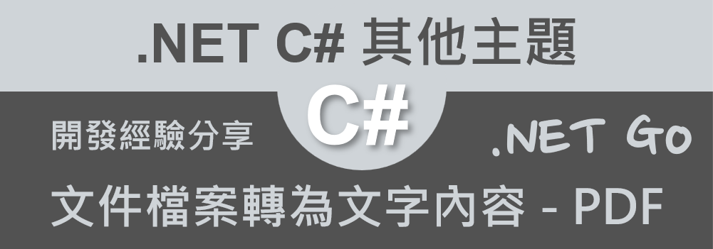

# 將文件檔案轉換成為文字內容系列 - PDF 



最近因為工作上的關係，需要提供一系列的轉檔服務，這些轉檔工作中，首先需要將原有的各種文件檔案內容讀取出來，抽取出文件檔案內的文字內容，至於圖片等其他資訊，則將會忽略掉；一旦取得這個文件檔案內的文字內容後，將會緊接著根據需要進行這些文字的精鍊處理工作，不過，因為已經成為了文字內容，這些精練的工作就會變得簡單多了。

所以，這裡將會把各種文件檔案，要如何把裡面的文字內容抽取出來的設計工作，寫成一系列的文章，在第一篇文章，將會要來挑戰 PDF 這樣類型的檔案；然而，經過初步的上網搜尋與分析，想要把各種文件檔案的內容，抽取出所有文字內容，似乎是件滿繁重的工作，若要自己來重頭開始設計這些程式碼，並無法呈現出你的優秀與能力高超，在這裡需要滿足能夠在最短的時間內，完成這樣的轉檔需求，因此，市面上各種套件將會是唯一最佳選擇。

現在將會需要面對另外一個挑戰，那就是對於這樣 PDF 文件檔案，想要把文字內容抽取出來，到底要選擇哪個套件比較合適呢？由於我這裡有時間壓力，因此，就隨機的在網路上尋找出各種轉檔套件，只使用能夠滿足這次需求目的的就好，不館這個套件是否擁有其他強大的功能還有多少。

## 建立可以將 PDF 檔案轉換出文字內容的測試專案

為了簡化測試用專案的複雜度，因此，在這裡將會建立一個 Console 主控台應用類型的專案。

* 打開 Visual Studio 2022 IDE 應用程式
* 從 [Visual Studio 2022] 對話窗中，點選右下方的 [建立新的專案] 按鈕
* 在 [建立新專案] 對話窗右半部
  * 切換 [所有語言 (L)] 下拉選單控制項為 [C#]
  * 切換 [所有專案類型 (T)] 下拉選單控制項為 [主控台]
* 在中間的專案範本清單中，找到並且點選 [主控台應用程式] 專案範本選項
  > 專案，用於建立可在 Windows、Linux 及 macOS 於 .NET 執行的命令列應用程式
* 點選右下角的 [下一步] 按鈕
* 在 [設定新的專案] 對話窗
* 找到 [專案名稱] 欄位，輸入 `csPdf2Text` 作為專案名稱
* 在剛剛輸入的 [專案名稱] 欄位下方，確認沒有勾選 [將解決方案與專案至於相同目錄中] 這個檢查盒控制項
* 點選右下角的 [下一步] 按鈕
* 現在將會看到 [其他資訊] 對話窗
* 在 [架構] 欄位中，請選擇最新的開發框架，這裡選擇的 [架構] 是 : `.NET 7.0 (標準字詞支援)`
* 在這個練習中，需要去勾選 [不要使用最上層陳述式(T)] 這個檢查盒控制項
  > 這裡的這個操作，可以由讀者自行決定是否要勾選這個檢查盒控制項
* 請點選右下角的 [建立] 按鈕

稍微等候一下，這個主控台專案將會建立完成

## 安裝要用到的 NuGet 開發套件

因為開發此專案時會用到這些 NuGet 套件，請依照底下說明，將需要用到的 NuGet 套件安裝起來。

### 安裝 itext7 套件

iText7 是一個針對 C# 開發環境的開源 PDF 庫，主要用於創建、編輯、檢視和操作 PDF 文件。它提供了一個功能強大且靈活的 API，讓開發者能夠快速並且輕鬆地完成 PDF 文件的各種操作。

iText7 的主要功能和目的包括：

* 創建 PDF 文件：可以從零開始創建新的 PDF 文件，也可以基於現有的模板或文件創建 PDF。
* 編輯 PDF 文件：提供了編輯 PDF 文本、圖像、表格和其他內容的功能，讓開發者能夠輕鬆地修改現有的 PDF 文件。
* PDF 操作：支持將多個 PDF 文件合併為一個文件、拆分 PDF 文件、重排 PDF 頁面順序等操作。
* 表單填充與編輯：可以在 PDF 表單中填充數據、讀取表單數據以及編輯現有的 PDF 表單。
* PDF 文字提取：允許從 PDF 文件中提取文字內容，便於進行分析或其他操作。
* PDF 轉換：可以將 PDF 文件轉換為其他格式，如 HTML、XML、圖像等，並支持從這些格式轉換回 PDF。
* 安全性：提供了 PDF 文件的加密、解密、簽名和驗證等安全功能，保護 PDF 文件的數據安全。
* PDF 標籤和標記：支持為 PDF 文件添加標籤和標記，以便於閱讀和搜索。
* PDF 與文檔標準相容：支持與 PDF/A、PDF/UA、PDF/X 等文檔標準相容，確保文檔在各種場景下的正確顯示和使用。
* 總之，iText7 是一個強大的 PDF 處理套件，適用於 C# 開發環境。它可以幫助開發者快速完成 PDF 文件的創建、編輯和操作等任務，提高工作效率。

請依照底下說明操作步驟，將這個套件安裝到專案內

* 滑鼠右擊 [方案總管] 視窗內的 [專案節點] 下方的 [相依性] 節點
* 從彈出功能表清單中，點選 [管理 NuGet 套件] 這個功能選項清單
* 此時，將會看到 [NuGet: csPdf2Text] 視窗
* 切換此視窗的標籤頁次到名稱為 [瀏覽] 這個標籤頁次
* 在左上方找到一個搜尋文字輸入盒，在此輸入 `itext7`
* 稍待一會，將會在下方看到這個套件被搜尋出來
* 點選 [itext7] 套件名稱
* 在視窗右方，將會看到該套件詳細說明的內容，其中，右上方有的 [安裝] 按鈕
* 點選這個 [安裝] 按鈕，將這個套件安裝到專案內

## 準備需要抽取文字內容的 PDF 檔案

* 準備好一個 [.pdf] 文件檔案
* 在這裡將會從網路上，隨機找到一個 [synapse_pacs.pdf] 檔案
* 取得該檔案之後，將其透過檔案總管拖拉到 Visual Studio 2022 的專案內
* 接著，點選 [synapse_pacs.pdf] 檔案
* 查看 [屬性] 視窗的內容

  >若沒有看到屬性視窗出現在 Visual Studio 2022 內，請從 Visual Studio 2022 功能表中，點選 [檢視] > [屬性視窗] 
  >
  >(這個選項將會在功能表清單內的最下面)
* 在屬性視窗內，找到 [複製到輸出目錄] 這個選項
* 從下拉選單中找到並且設定為這個 [有更新時才複製] 選項

  

## 開始進行轉檔程式設計

* 在此專案節點下，找到並且打開 [Program.cs] 這個檔案
* 使用底下 C# 程式碼替換掉 [Program.cs] 檔案內所有程式碼內容

```csharp
using System.Text;
using iText.Kernel.Pdf;
using iText.Kernel.Pdf.Canvas.Parser;
using iText.Kernel.Pdf.Canvas.Parser.Listener;

namespace csPdf2Text
{
    internal class Program
    {
        static void Main(string[] args)
        {
            StringBuilder result = new StringBuilder();

            using (PdfReader pdfReader = new PdfReader("synapse_pacs.pdf"))
            {
                using (PdfDocument pdfDoc = new PdfDocument(pdfReader))
                {
                    int numberOfPages = pdfDoc.GetNumberOfPages();

                    for (int i = 1; i <= numberOfPages; i++)
                    {
                        ITextExtractionStrategy strategy = new SimpleTextExtractionStrategy();
                        string pageContent = PdfTextExtractor.GetTextFromPage(pdfDoc.GetPage(i), strategy);
                        result.AppendLine(pageContent);
                    }
                }
            }

            Console.WriteLine(result.ToString());
        }
    }
}
```

[result] 這個區域變數為一個 [StringBuilder] 型別的物件，將會用於暫時儲存從 PDF 檔案內讀取出來的文字內容，一旦所有文件內容都轉成文字內後，將會使用 [StringBuilder] 的 [ToString] 方法，取得所有的文字內容。

接下來建立一個 [PdfReader] 類別的物件，在呼叫建構函式時候，將測試用的 PDF 檔案路徑名稱，傳遞到建構式內。

現在可以透過 [PdfDocument] 類別的物件，開始逐一掃瞄該 PDF 文件內的每個頁面，對於每個 PDF 頁面，將會使用 [PdfTextExtractor.GetTextFromPage] 方法，把這個頁面的文字內容抽取出來。

最後，將所有的文字內容輸出到螢幕上

底下將會是執行後的螢幕截圖結果


