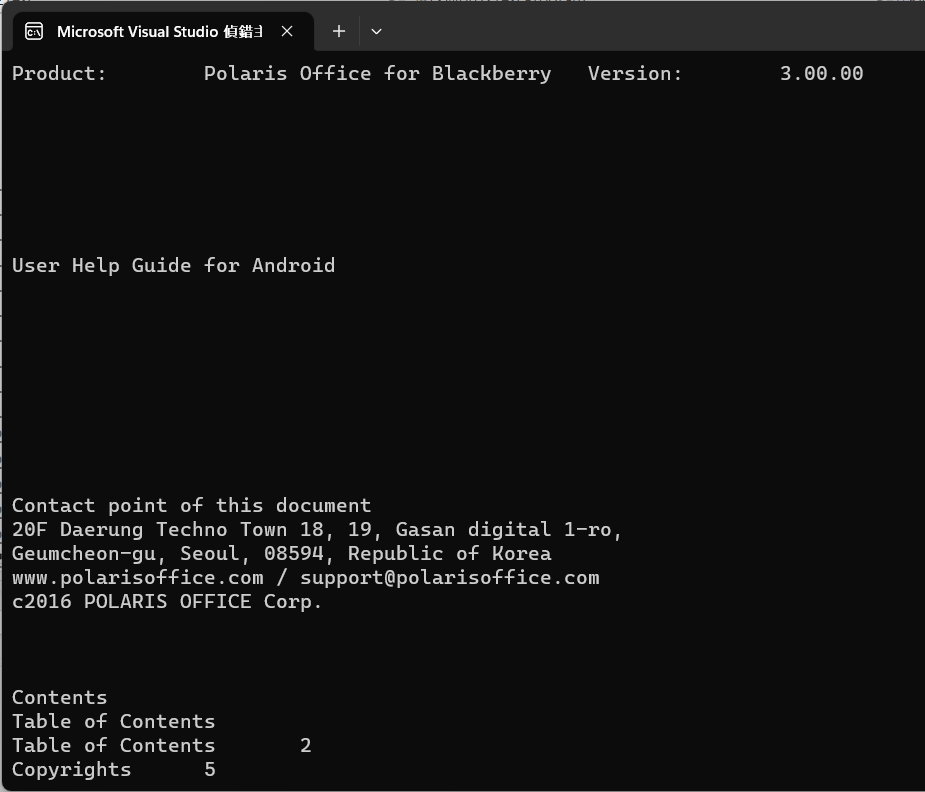
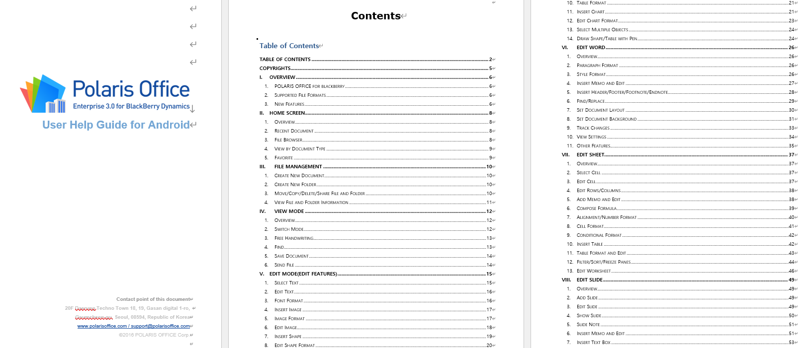

# 將文件檔案轉換成為文字內容系列 - Office Word 


在 [上一篇文章](https://csharpkh.blogspot.com/2023/05/CSharp-Net-Convert-Document-To-Text-HTML.html) 有討論到如何將 HTML 文件檔案轉換成為文字內容，在這份文章中，將會是這個轉換成為文字內容系列文章的第 3 個，在這裡將會探討如何將 Office 這套軟體中的 Word 類型的檔案，抽取出裡面的文字內容出來。

## 建立可以將 Office Word 檔案轉換出文字內容的測試專案

為了簡化測試用專案的複雜度，因此，在這裡將會建立一個 Console 主控台應用類型的專案。

* 打開 Visual Studio 2022 IDE 應用程式
* 從 [Visual Studio 2022] 對話窗中，點選右下方的 [建立新的專案] 按鈕
* 在 [建立新專案] 對話窗右半部
  * 切換 [所有語言 (L)] 下拉選單控制項為 [C#]
  * 切換 [所有專案類型 (T)] 下拉選單控制項為 [主控台]
* 在中間的專案範本清單中，找到並且點選 [主控台應用程式] 專案範本選項
  > 專案，用於建立可在 Windows、Linux 及 macOS 於 .NET 執行的命令列應用程式
* 點選右下角的 [下一步] 按鈕
* 在 [設定新的專案] 對話窗
* 找到 [專案名稱] 欄位，輸入 `csWord2Text` 作為專案名稱
* 在剛剛輸入的 [專案名稱] 欄位下方，確認沒有勾選 [將解決方案與專案至於相同目錄中] 這個檢查盒控制項
* 點選右下角的 [下一步] 按鈕
* 現在將會看到 [其他資訊] 對話窗
* 在 [架構] 欄位中，請選擇最新的開發框架，這裡選擇的 [架構] 是 : `.NET 7.0 (標準字詞支援)`
* 在這個練習中，需要去勾選 [不要使用最上層陳述式(T)] 這個檢查盒控制項
  > 這裡的這個操作，可以由讀者自行決定是否要勾選這個檢查盒控制項
* 請點選右下角的 [建立] 按鈕

稍微等候一下，這個主控台專案將會建立完成

## 安裝要用到的 NuGet 開發套件

因為開發此專案時會用到這些 NuGet 套件，請依照底下說明，將需要用到的 NuGet 套件安裝起來。

### 安裝 NPOI 套件

NPOI 是一個針對 C# 開發環境的開源文件處理庫，主要用於操作 Microsoft Office 文件格式，如 Excel（.xls 和 .xlsx）、Word（.doc 和 .docx）等。它提供了一個功能強大且靈活的 API，讓開發者能夠快速並輕鬆地完成對這些文件的讀取、創建和編輯操作。

NPOI 的主要功能和目的包括：
* 讀取和寫入 Excel 文件：支持讀取和寫入 Excel 文件的內容，包括單元格、行、列、工作表等元素。開發者可以利用 NPOI 對 Excel 文件進行各種操作，如數據導入、導出、報表生成等。
* 讀取和寫入 Word 文件：支持讀取和寫入 Word 文件的內容，包括文本、段落、列表、表格等元素。開發者可以利用 NPOI 進行 Word 文件的創建、修改和數據提取等操作。
* 格式控制：提供了對 Office 文件中各種格式的控制，如字體、顏色、對齊、邊框等，讓開發者能夠更好地自定義文件的外觀和樣式。
* 公式和圖表：支持對 Excel 文件中的公式和圖表的操作，如計算、更新和創建等。
* 模板操作：可以基於現有的 Office 文件模板進行操作，方便開發者快速生成具有一致格式和樣式的文件。
* 流操作：支持對流（Stream）進行讀取和寫入操作，使得開發者可以在不需要實際存儲文件的情況下進行 Office 文件的處理。

總之，NPOI 是一個功能強大的 Office 文件處理套件，適用於 C# 開發環境。它可以幫助開發者輕鬆地讀取、創建和編輯各種 Microsoft Office 文件，提高工作效率。

請依照底下說明操作步驟，將這個套件安裝到專案內

* 滑鼠右擊 [方案總管] 視窗內的 [專案節點] 下方的 [相依性] 節點
* 從彈出功能表清單中，點選 [管理 NuGet 套件] 這個功能選項清單
* 此時，將會看到 [NuGet: csWord2Text] 視窗
* 切換此視窗的標籤頁次到名稱為 [瀏覽] 這個標籤頁次
* 在左上方找到一個搜尋文字輸入盒，在此輸入 `NPOI`
* 稍待一會，將會在下方看到這個套件被搜尋出來
* 點選 [NPOI] 套件名稱
* 在視窗右方，將會看到該套件詳細說明的內容，其中，右上方有的 [安裝] 按鈕
* 點選這個 [安裝] 按鈕，將這個套件安裝到專案內

## 準備需要抽取文字內容的 PDF 檔案

* 準備好一個 [.pdf] 文件檔案
* 在這裡將會從網路上，隨機找到一個 [UserGuide_Android.docx] 檔案
* 取得該檔案之後，將其透過檔案總管拖拉到 Visual Studio 2022 的專案內
* 接著，點選 [UserGuide_Android.docx] 檔案
* 查看 [屬性] 視窗的內容

  >若沒有看到屬性視窗出現在 Visual Studio 2022 內，請從 Visual Studio 2022 功能表中，點選 [檢視] > [屬性視窗] 
  >
  >(這個選項將會在功能表清單內的最下面)
* 在屬性視窗內，找到 [複製到輸出目錄] 這個選項
* 從下拉選單中找到並且設定為這個 [有更新時才複製] 選項

## 開始進行轉檔程式設計

* 在此專案節點下，找到並且打開 [Program.cs] 這個檔案
* 使用底下 C# 程式碼替換掉 [Program.cs] 檔案內所有程式碼內容

```csharp
using NPOI.XWPF.Extractor;
using NPOI.XWPF.UserModel;

namespace csWord2Text
{
    internal class Program
    {
        static void Main(string[] args)
        {
            // 讀取 Word 檔案
            XWPFDocument document = new XWPFDocument(File.OpenRead(@"UserGuide_Android.docx"));

            // 讀取所有內容
            XWPFWordExtractor extractor = new XWPFWordExtractor(document);
            string text = extractor.Text;

            // 輸出所有內容
            Console.WriteLine(text);

            // 關閉 C# 檔案
            document.Close();
        }
    }
}
```


首先使用 [File.OpenRead] 方法來打開指定的 Word 檔案，該方法會回傳 Stream 物件，接著將這個 Stream 物件傳遞到 [XWPFDocument] 建構式內，如此便可以得到 [XWPFDocument] 物件。

接著，再來建立一個 [XWPFWordExtractor] 物件，透過這個物件，便可以抽取出在 Word 文件檔案內的所有文字出來。

最後，將所有的文字內容輸出到螢幕上

底下將會是執行後的螢幕截圖結果



底下是原始的 Word 檔案


