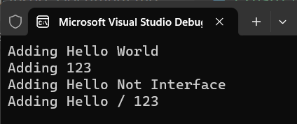

# 在 .NET 要針對泛型型別在 DI Container 內進行註冊與注入


當在使用 .NET C# 進行開發專案的時候，通常都會使用相依性注入 DI Dependency Injection 這樣的設計模式，通常也會透過建構式注入方式來取得所需要的物件，這樣可以整體程式碼具有鬆散耦合關係，並且也方便於日後進行單元測試。

在 .NET 中，如果要使用 DI Container 來進行相依性注入，通常都會使用 [Microsoft.Extensions.DependencyInjection](https://www.nuget.org/packages/Microsoft.Extensions.DependencyInjection/) 這個 NuGet 套件來進行相依性注入的設定與注入。

通常來說，若針對一個介面與具體實作類別來進行 DI 容器註冊的時候，通常不會有甚麼問題，選定介面與具體實作類別，然後進行 DI 容器註冊與注入，這樣就可以了。可是對於具有泛型型別這樣的情境又該如何進行設計呢？

對於這樣的疑問，則是這篇文章關注的要點，在這篇文章將會上述提到的情境，進行實際的程式碼開發與測試。

## 建立測試專案

請依照底下的操作，建立起這篇文章需要用到的練習專案

* 打開 Visual Studio 2022 IDE 應用程式
* 從 [Visual Studio 2022] 對話窗中，點選右下方的 [建立新的專案] 按鈕
* 在 [建立新專案] 對話窗右半部
  * 切換 [所有語言 (L)] 下拉選單控制項為 [C#]
  * 切換 [所有專案類型 (T)] 下拉選單控制項為 [主控台]
* 在中間的專案範本清單中，找到並且點選 [主控台應用程式] 專案範本選項
  > 專案，用於建立可在 Windows、Linux 及 macOS 於 .NET 執行的命令列應用程式
* 點選右下角的 [下一步] 按鈕
* 在 [設定新的專案] 對話窗
* 找到 [專案名稱] 欄位，輸入 `csGenericDI` 作為專案名稱
* 在剛剛輸入的 [專案名稱] 欄位下方，確認沒有勾選 [將解決方案與專案至於相同目錄中] 這個檢查盒控制項
* 點選右下角的 [下一步] 按鈕
* 現在將會看到 [其他資訊] 對話窗
* 在 [架構] 欄位中，請選擇最新的開發框架，這裡選擇的 [架構] 是 : `.NET 7.0 (標準字詞支援)`
* 在這個練習中，需要去勾選 [不要使用最上層陳述式(T)] 這個檢查盒控制項
  > 這裡的這個操作，可以由讀者自行決定是否要勾選這個檢查盒控制項
* 請點選右下角的 [建立] 按鈕

稍微等候一下，這個主控台專案將會建立完成

## 安裝要用到的 NuGet 開發套件

因為開發此專案時會用到這些 NuGet 套件，請依照底下說明，將需要用到的 NuGet 套件安裝起來。

### 安裝 Microsoft.Extensions.DependencyInjection 套件

* 滑鼠右擊 [方案總管] 視窗內的 [專案節點] 下方的 [相依性] 節點
* 從彈出功能表清單中，點選 [管理 NuGet 套件] 這個功能選項清單
* 此時，將會看到 [NuGet: csGenericDI] 視窗
* 切換此視窗的標籤頁次到名稱為 [瀏覽] 這個標籤頁次
* 在左上方找到一個搜尋文字輸入盒，在此輸入 `Microsoft.Extensions.DependencyInjection`
* 點選 [Microsoft.Extensions.DependencyInjection] 套件名稱，請選擇作者為 [Jarek Kowalski,Kim Christensen,Julian Verdurmen] 的套件
* 在視窗右方，將會看到該套件詳細說明的內容，其中，右上方有的 [安裝] 按鈕
* 點選這個 [安裝] 按鈕，將這個套件安裝到專案內

## 建立要使用的程式碼

* 在 [方案總管] 內找到並且開啟 [Program.cs] 檔案這個節點
* 使用底下 C# 程式碼，將原本的程式碼取代掉

```csharp

using Microsoft.Extensions.DependencyInjection;

namespace csGenericDI;

#region 只有一個泛型型別的介面與具體實作
public interface IRepository<T>
{
    void Show(T item);
}

public class Repository<T> : IRepository<T> 
{
    public void Show(T item)
    {
        Console.WriteLine($"Adding {item}");
    }
}
#endregion

internal class Program
{
    static void Main(string[] args)
    {
       var serviceProvider = new ServiceCollection()
            .AddScoped(typeof(IRepository<>), typeof(Repository<>))
            .AddScoped(typeof(Repository<>))
            .AddScoped(typeof(IRepositoryWithMoreGenericType<,>), typeof(RepositoryWithMoreGenericType<,>))
            .BuildServiceProvider();

        #region 使用介面來注入實作物件
        var repositoryString = serviceProvider.GetService<IRepository<string>>();
        repositoryString.Show("Hello World");

        var repositoryInt = serviceProvider.GetService<IRepository<int>>();
        repositoryInt.Show(123);
        #endregion

        #region 使用實作類別來注入實作物件
        var repositoryString2 = serviceProvider.GetService<Repository<string>>();
        repositoryString2.Show("Hello Not Interface");
        #endregion

        #region 使用多個泛型來注入實作物件
        var repositoryWithMoreGenericType = serviceProvider
            .GetService<IRepositoryWithMoreGenericType<string, int>>();
        repositoryWithMoreGenericType.Show("Hello", 123);
        #endregion
    }
}

#region 具有多個泛型型別的介面與具體實作
public interface IRepositoryWithMoreGenericType<T1,T2>
{
    void Show(T1 item1, T2 item2);
}

public class RepositoryWithMoreGenericType<T1, T2> : IRepositoryWithMoreGenericType<T1, T2>
{
    public void Show(T1 item1, T2 item2)
    {
        Console.WriteLine($"Adding {item1} / {item2} ");
    }
}
#endregion
```

* 首先，在程式碼的最上方，建立了一個泛型介面 `IRepository<T>` 與泛型實作類別 `Repository`，這個泛型介面與泛型實作類別，都只有一個泛型型別參數，這個泛型型別參數的名稱為 `T` 。
* 在這個類別中僅有一個方法定義， Show 這個方法，接受一個參數，一旦該方法被呼叫之後，將會把這個參數顯示在螢幕上
* 現在回到程式進入點的 Main 方法中，首先，建立一個新的 ServiceCollection 物件，並且透過 `AddScoped` 這個方法，來進行泛型介面與泛型實作類別的註冊
* 例如，這裡使用了 `AddScoped(typeof(IRepository<>), typeof(Repository<>))` 這個方法，來進行泛型介面與泛型實作類別的註冊
* 另外，也沒有使用泛型介面，直接使用具體實作的泛型類別，來進行註冊，例如 `AddScoped(typeof(Repository<>))` 這個方法，來進行泛型實作類別的註冊
* 上述將會建立了一個 DI 容器的實例，並且透過 `AddScoped` 這個方法，來進行泛型介面與泛型實作類別的註冊
* 接著，透過 `BuildServiceProvider` 這個方法，來建立一個 DI 容器的實例，這個容器執行個體名稱為 `serviceProvider`
* 當要進行注入執行個體物件的時候，可以透過 `serviceProvider.GetService<IRepository<string>>()` 這個方法，來取得泛型介面 `IRepository<T>` 的具體實作類別 `Repository<T>` 的執行個體
* 在這裡的範例程式碼中，指定了 string 這個泛型型別參數，也就是會取得一個 `Repository<string>` 這樣的物件
* 另外，也指定了 int 這個數值型別作為泛型型別參數，也就是會取得一個 `Repository<int>` 這樣的物件
* 這樣就可以透過泛型介面與泛型實作類別，來取得具體的執行個體物件
* 現在可以直接來呼叫剛剛取得的倆的執行個體物件的 Show 方法，來進行顯示訊息的操作 `repositoryString.Show("Hello World");` 與 `repositoryInt.Show(123);`
* 在之前，除了有宣告使用泛型介面對應到泛型類別的註冊，也直接使用了泛型類別註冊到 DI 容器內，這樣也可以透過 DI 容器來取得執行個體物件
* 透過 `serviceProvider.GetService<Repository<string>>()` 這個方法，來取得泛型實作類別 `Repository<T>` 的執行個體
* 使用 `repositoryString2.Show("Hello Not Interface")` 進行呼叫這個物件的 Show 方法
* 然而，這是針對一個泛型參數的用法，若該註冊的型別有多個泛型參數，該如何進行註冊與注入呢？
* 在範例程式碼的最下方，使用 `public interface IRepositoryWithMoreGenericType<T1,T2>` 宣告了使用兩個泛型參數的泛型介面
* 並且使用 `public class RepositoryWithMoreGenericType<T1, T2> : IRepositoryWithMoreGenericType<T1, T2>` 宣告了使用兩個泛型參數的泛型實作類別
* 在實作的方法 Show 內，會接收到兩個參數，並且會將這兩個參數顯示在螢幕上
* 現在，可以使用 `AddScoped(typeof(IRepositoryWithMoreGenericType<,>), typeof(RepositoryWithMoreGenericType<,>))` 方式，將多個泛型參數註冊到 DI 容器內
* 這樣就可以透過 `serviceProvider.GetService<IRepositoryWithMoreGenericType<string, int>>()` 這個方法，來取得泛型介面 `IRepositoryWithMoreGenericType<T1,T2>` 的具體實作類別 `RepositoryWithMoreGenericType<T1,T2>` 的執行個體
* 這樣就可以透過泛型介面與泛型實作類別，來取得具體的執行個體物件
* 現在可以直接來呼叫剛剛取得的執行個體物件的 Show 方法，來進行顯示訊息的操作 `repositoryWithMoreGenericType.Show("Hello", 123);`

## 執行程式，觀察結果

* 按下 `F5` 鍵，開始執行這個程式
* 請觀察 Console 視窗內的內容

  

```
Adding Hello World
Adding 123
Adding Hello Not Interface
Adding Hello / 123
```

