# 第一次使用 C# 與 ElasticSearch


Elasticsearch 是一個開源的、分布式的、RESTful 風格的搜索和分析引擎。它基於 Apache Lucene 庫構建，通常用於實現全文搜索、大數據分析和實時數據處理等功能。以下是 Elasticsearch 可以做到的事情和它的用途：

* 全文搜索：Elasticsearch 能夠對大量文檔進行快速、實時的全文搜索，並提供高度可配置的相關性排序和過濾功能。它可以用於網站或應用程序中的搜索框，以幫助用戶快速找到所需信息。
* 數據分析：Elasticsearch 具有強大的數據分析能力，可以用於對結構化和非結構化數據進行實時聚合和分析。這對於生成報告、構建儀表板以及進行數據挖掘和可視化非常有用。
* 日誌和事件數據處理：Elasticsearch 常與 Logstash 和 Kibana 一起使用（統稱為 ELK 堆棧），以收集、存儲、搜索和分析來自不同來源的日誌和事件數據。
* 擴展性和高可用性：Elasticsearch 是分布式的，這意味著它可以水平擴展以支持更多數據和更高的吞吐量。它還具有高可用性和容錯功能，可以在節點故障時自動恢復。

Elasticsearch 的需求源於其能夠快速、靈活地處理大量數據，並提供實時搜索和分析功能。它適用於各種場景，例如站內搜索、日誌分析、數據挖掘和監控等。對於需要進行大規模搜索和分析的應用程序或組織來說，Elasticsearch 是一個很好的選擇。

對於 Elasticsearch 這樣優秀的工具，若能夠透過 .NET / C# 來進行呼叫，相信必定可以做到更多層面的加值應用，因此，首先需要學會如何透過 C# 來呼叫 Elasticsearch 提供的功能，將一筆文件寫入到 Elasticsearch Index 內。

## 建立可以使用 C# 程式碼將文件寫入到 Elasticsearch 索引內的測試專案

為了簡化測試用專案的複雜度，因此，在這裡將會建立一個 Console 主控台應用類型的專案。

* 打開 Visual Studio 2022 IDE 應用程式
* 從 [Visual Studio 2022] 對話窗中，點選右下方的 [建立新的專案] 按鈕
* 在 [建立新專案] 對話窗右半部
  * 切換 [所有語言 (L)] 下拉選單控制項為 [C#]
  * 切換 [所有專案類型 (T)] 下拉選單控制項為 [主控台]
* 在中間的專案範本清單中，找到並且點選 [主控台應用程式] 專案範本選項
  > 專案，用於建立可在 Windows、Linux 及 macOS 於 .NET 執行的命令列應用程式
* 點選右下角的 [下一步] 按鈕
* 在 [設定新的專案] 對話窗
* 找到 [專案名稱] 欄位，輸入 `csElasticSearchQuichStart` 作為專案名稱
* 在剛剛輸入的 [專案名稱] 欄位下方，確認沒有勾選 [將解決方案與專案至於相同目錄中] 這個檢查盒控制項
* 點選右下角的 [下一步] 按鈕
* 現在將會看到 [其他資訊] 對話窗
* 在 [架構] 欄位中，請選擇最新的開發框架，這裡選擇的 [架構] 是 : `.NET 7.0 (標準字詞支援)`
* 在這個練習中，需要去勾選 [不要使用最上層陳述式(T)] 這個檢查盒控制項
  > 這裡的這個操作，可以由讀者自行決定是否要勾選這個檢查盒控制項
* 請點選右下角的 [建立] 按鈕

稍微等候一下，這個主控台專案將會建立完成

## 安裝要用到的 NuGet 開發套件

因為開發此專案時會用到這些 NuGet 套件，請依照底下說明，將需要用到的 NuGet 套件安裝起來。

### 安裝 Elastic.Clients.Elasticsearch 套件

Elastic.Clients.Elasticsearch 是一個針對 .NET 平台的 Elasticsearch 客戶端庫，它允許您從 .NET 應用程序與 Elasticsearch 集群進行通信和互動。該庫為 Elasticsearch 提供了一個強類型的、易於使用的 API，可以用於執行各種操作，如索引管理、文檔檢索、搜索、數據分析等。

以下是 Elastic.Clients.Elasticsearch 庫的主要功能和目的：

* 索引管理：使用該庫，您可以在 Elasticsearch 中創建、更新、刪除和配置索引。
* 文檔操作：該庫提供了對文檔的 CRUD（創建、讀取、更新和刪除）操作，允許您將數據存儲到 Elasticsearch 中，並在需要時檢索、更新或刪除文檔。
* 搜索功能：Elastic.Clients.Elasticsearch 庫支持 Elasticsearch 的強大搜索功能，如全文搜索、分面搜索、過濾和排序等。您可以使用強類型的查詢語法來構建複雜的搜索條件。
* 數據分析：該庫允許您利用 Elasticsearch 的實時數據分析和聚合功能，用於生成報告、構建儀表板或進行數據挖掘。
* 集群管理：Elastic.Clients.Elasticsearch 庫提供了用於管理 Elasticsearch 集群的 API，例如檢查集群狀態、節點統計信息和碩士選舉等。

總之，Elastic.Clients.Elasticsearch 庫為 .NET 開發者提供了一個強大且靈活的工具，用於與 Elasticsearch 集群進行通信和互動。該庫使得在 .NET 應用程序中集成 Elasticsearch 的搜索和分析功能變得更加簡單和高效。
請依照底下說明操作步驟，將這個套件安裝到專案內

* 滑鼠右擊 [方案總管] 視窗內的 [專案節點] 下方的 [相依性] 節點
* 從彈出功能表清單中，點選 [管理 NuGet 套件] 這個功能選項清單
* 此時，將會看到 [NuGet: csElasticSearchQuichStart] 視窗
* 切換此視窗的標籤頁次到名稱為 [瀏覽] 這個標籤頁次
* 在左上方找到一個搜尋文字輸入盒，在此輸入 `Elastic.Clients.Elasticsearch`
* 稍待一會，將會在下方看到這個套件被搜尋出來
* 點選 [Elastic.Clients.Elasticsearch] 套件名稱
* 在視窗右方，將會看到該套件詳細說明的內容，其中，右上方有的 [安裝] 按鈕
* 點選這個 [安裝] 按鈕，將這個套件安裝到專案內

## 建立要寫入索引內的文件使用的類別

* 滑鼠右擊專案節點
* 從彈出功能表中，點選 [加入] > [類別]
* 此時出現了 [新增項目] 對話窗
* 確認對話窗內的中間區域，已經選擇了 [類別] 這個項目
* 在對話窗的下方 [名稱] 欄位內，輸入 `Tweet.cs` 作為這個新類別檔案名稱
* 使用底下程式碼，替換掉剛剛產生的程式碼

```csharp
namespace csElasticSearchQuichStart;

/// <summary>
/// Tweet 物件
/// </summary>
public class Tweet
{
    /// <summary>
    /// 使用者名稱
    /// </summary>
    public string User { get; set; }
    /// <summary>
    /// 發文日期
    /// </summary>
    public DateTime PostDate { get; set; }
    /// <summary>
    /// 發文內容
    /// </summary>
    public string Message { get; set; }
}
```

在這裡將會宣告一個 [Tweet] 類別，這個類別所產生的執行個體或物件，將會寫入到 Elasticsearch 索引內，在指定的索引內建立一筆 [Document] 文件紀錄，接下來看看如何進行這樣的操作。

## 開始進行轉檔程式設計

* 在此專案節點下，找到並且打開 [Program.cs] 這個檔案
* 使用底下 C# 程式碼替換掉 [Program.cs] 檔案內所有程式碼內容

```csharp
using Elastic.Clients.Elasticsearch;

namespace csElasticSearchQuichStart;

internal class Program
{
    static async Task Main(string[] args)
    {
        // 建立 ElasticsearchClient 物件
        var client = new ElasticsearchClient(new Uri("http://192.168.82.7:9200"));

        // 建立一個 Tweet 物件
        var tweet = new Tweet
        {
            User = "Vulcan Lee",
            PostDate = DateTime.Now,
            Message = "Elasticsearch 是一個開源的、分布式的、RESTful 風格的搜索和分析引擎。"
        };

        // 將 Tweet 物件存入 Elasticsearch
        var response = await client.IndexAsync(tweet, "my-index-name");

        // 檢查存入是否成功
        if (response.IsValidResponse)
        {
            // 取得存入的 ID
            Console.WriteLine($"Index document with ID {response.Id} succeeded.");
        }
    }
}
```

在這個程式進入點方法內，首先使用 [ElasticsearchClient] 方法建立一個物件，由於這個類別的建構式可以接收多種參數，這裡選擇的是傳入一個 [Uri] 物件，而該 URI 將會指向自己所安裝的 Elasticsearch 服務主機，而 9200 Port 將會是預設的連線 Port 編號。

接著，建立一個 Tweet 物件，在這裡，將會把 [PostDate] 這個屬性值設定為 C# 內的 [DateTime.Now] 這個屬性值，因此，對於 [PostDate] 將會表示當前寫入的時間點；稍後，將可以透過者個屬性值，確認是否有成功寫入到 Elasticsearch 索引內。

現在，可以使用 Elasticsearch 類別庫提供的 `client.IndexAsync(tweet, "my-index-name")` 方法，將剛剛建立的物件，寫入到 Elasticsearch 的名為 [my-index-name] 索引內，在這裡將會形成一個文件在此索引內。

一旦這個方法呼叫完成後，將會回船型別為 [IndexResponse] 物件，透過該物件的 [IsValidResponse] 屬性值，可以得知此次執行是否有成功，若執行成功，將會把成功寫入的 Id 鍵值，也就是 [IndexResponse.Id]  顯示在螢幕上。

## 確認現在 Elasticsearch 狀態

* 開啟瀏覽器，輸入網址 `http://192.168.82.7:5601/`

  >這裡使用的服務埠將會是預設安裝所產生的

* 此時，網頁將會呈現如下內容

  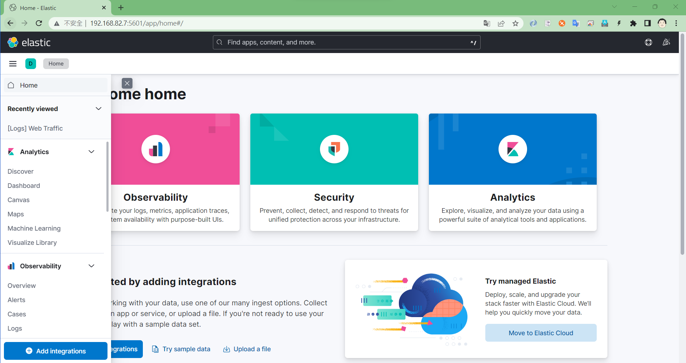

* 點選左上角的漢堡按鈕，開啟最左方的彈出功能表
* 捲到彈出功能表，將會看到最後一個功能表選項為 `Stack Management`

  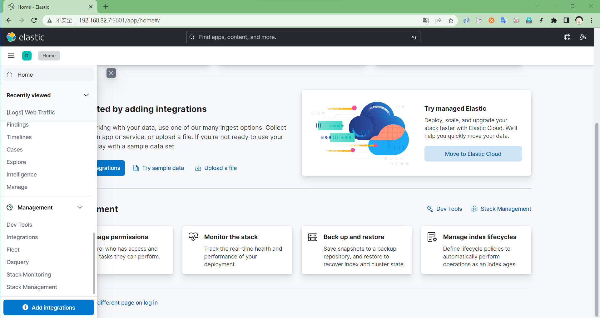
* 點選 `Stack Management` 選項
* 此時將會進入到 [http://192.168.82.7:5601/app/management] 這個網頁
* 現在左邊出現的 [Management] 功能表清單中，可以找到 [Kibana] 這個功能表
* 在 [Kibana] 功能表中，在其下方將會看到 [Data Views] 這個功能表選項
* 點選這個功能表選項
* 確認從中間的 [Data Views] 內容中，沒有看到 名稱 Name 為 [my-index-name] 的 Data View

  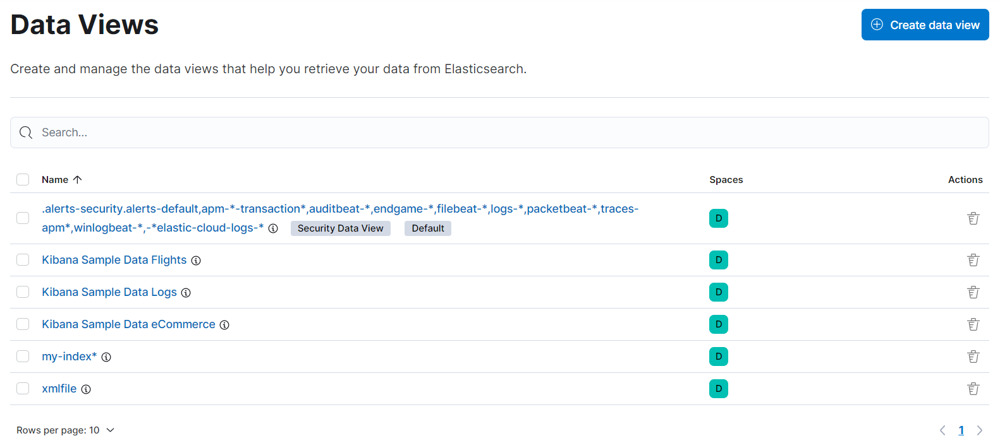

## 執行並確認有成功寫入到 ElasticSearch

* 執行這個專案
* 底下將會是執行後的螢幕截圖結果

  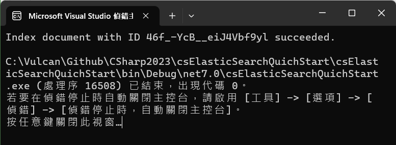

* 從執行結果可以看到，這裡建立了一個 Index，並且成功建立了一筆 document 文件紀錄，該文件 ID 為 46f_-YcB__eiJ4Vbf9yl
* 現在回到 ElasticSearch 網頁上
* 點選左上角漢堡按鈕，開啟彈出功能選項清單
* 捲動該清單到最下方，將會看到 [Stack Management]選項
* 點選這個 [Stack Management] 功能表選項
* 此時，從網頁的最左方將會看到 [Management] 這個功能表清單

  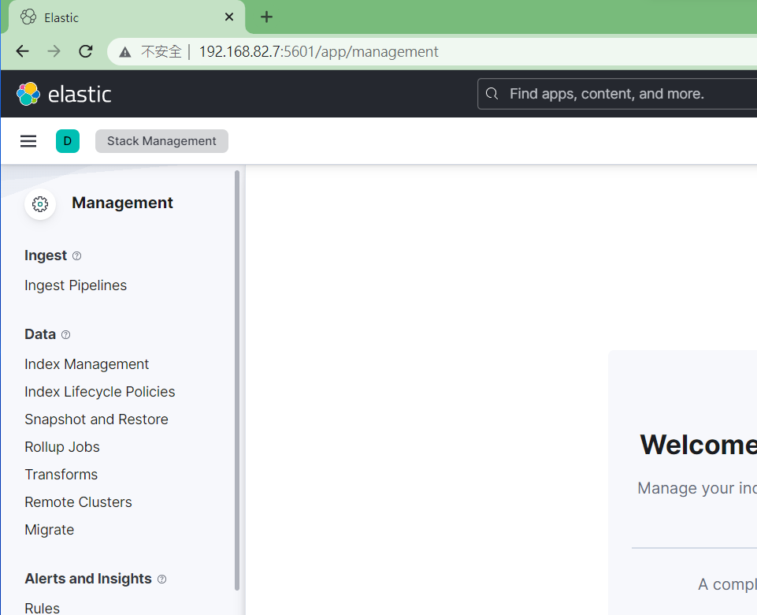
* 找到 [Data] > [Index Management] 並且點選這個選項
* 此時，在網頁的中間，將會看到 [Index Management] 畫面

  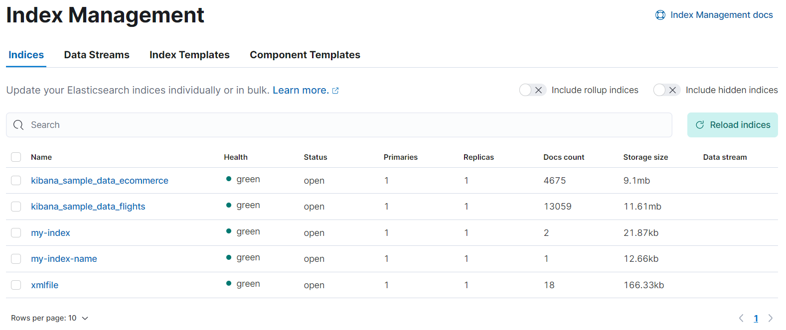

* 若在第一個欄位 (Name這個欄位) 有看到名為 [my-index-name] 的索引
* 那就表示這次的新增 document 動作，因為系統沒有這個 Index，所以將會自動產生出來
* 現在需要查看這個 Index 內有哪些 document 在裡面
* 捲動左邊的功能表清單，直到看到 [Kibana] > [Data Views] 這個項目
* 點選 [Data Views] 這個選項，將會看到如下圖畫面
  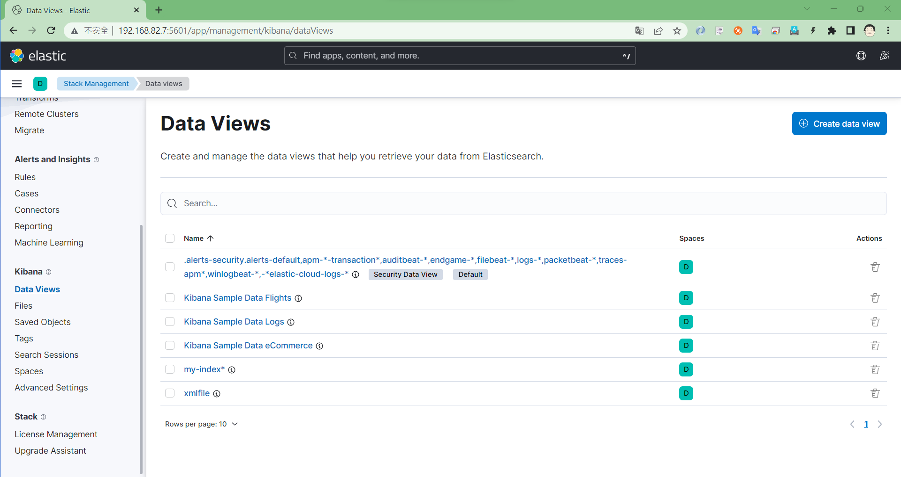
* 點選右上方的 [Create data view] 按鈕
* 現在有一個區域從網頁的右邊往左邊彈出來
* 這個區域稱作 [Create data view] 
* 在欄位 [Name] 與 [Index pattern] 都輸入 `my-index-name`
  
  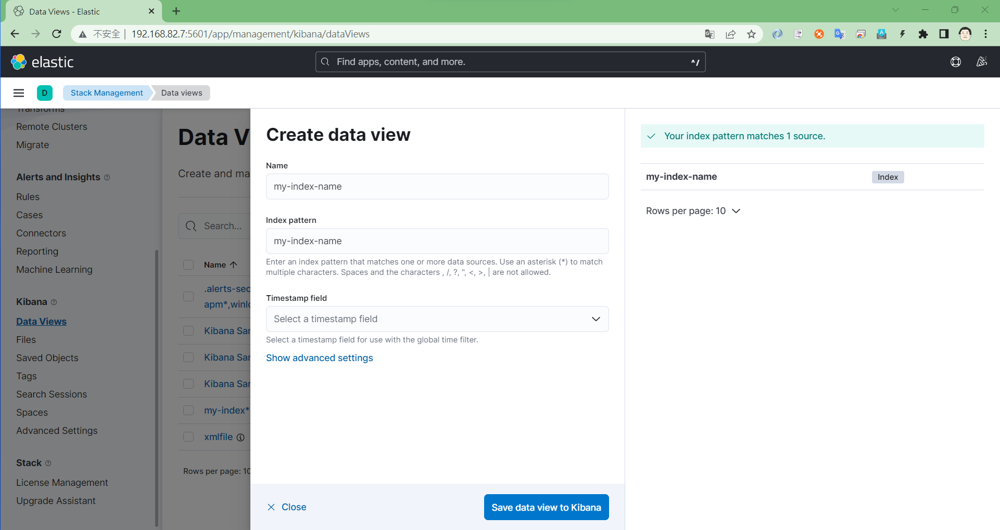

* 對於 [Timestamp field] 欄位，在其下拉選單中，選擇 [--- I don't want to use the time filter ---] 這個選項
* 點選下方的 [Save data view to Kibana] 按鈕
* 現在網頁畫面如下

  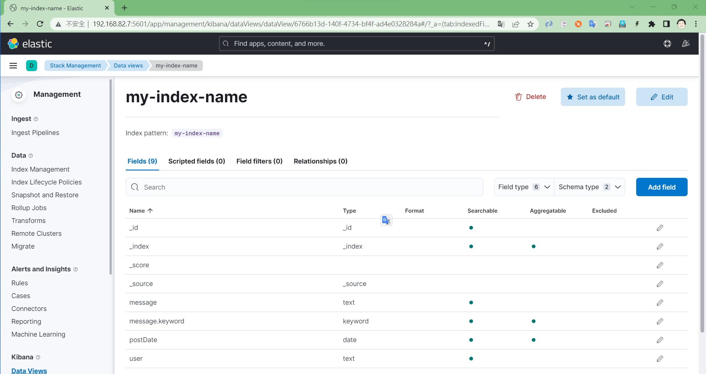

* 點選左上角漢堡按鈕，開啟彈出功能選項清單
* 捲動該清單到最下方，將會看到 [Stack Management]選項
* 點選左上角漢堡按鈕，開啟彈出功能選項清單
* 從該清單到最上方，找到並且點選 [Analytics] > [Discover]
* 當網頁顯示完成後，可以在左上方看到有個淡藍色下拉選單
* 打開該下拉選單
* 此時，應該可以找到 [my-index-name] 項目
* 點選這個 [my-index-name] 項目

  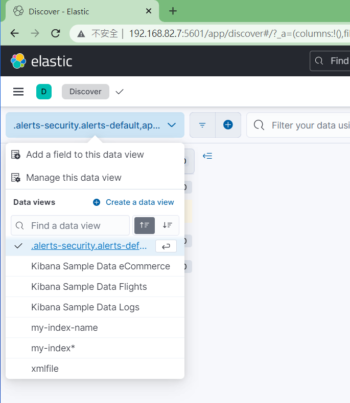

* 沒有意外的話，可以從如底下螢幕截圖畫面中，看到剛剛新增的 document

  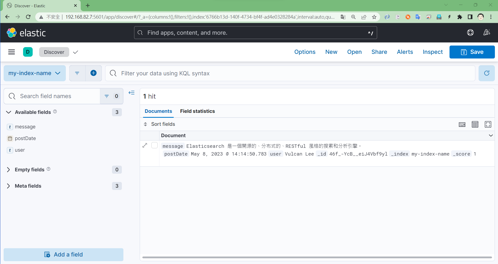


