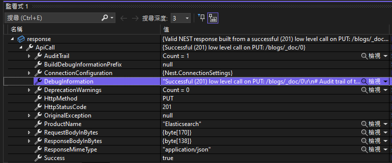

# Elasticsearch 系列 - 使用 C# / NEST 來新增文件記錄到 Elasticsearch 資料庫


之前寫了一篇關於 [Elasticsearch 系列 - 使用 C# 來新增文件記錄到 Elasticsearch 資料庫](https://csharpkh.blogspot.com/2023/12/Elasticsearch-Create-Document-Index-Mapping.html) 文章，原本是想要撰寫一些關於使用 .NET client for Elasticsearch (v8 .NET Client) 來進行 Elasticsearch 的相關 CRUD 新增、查詢、修改、刪除操作；不過，由於在官方網站與網路資源上，可以查看到的參考文件與說明內容，真的少得可憐，迫於事實情況，我決定還是要採用 Elasticsearch v7 的 .NET Client 則是通稱為 (NEST) client 來寫出相關文件的  CRUD 新增、查詢、修改、刪除程式設計作法。

## 建立測試專案

請依照底下的操作，建立起這篇文章需要用到的練習專案

* 打開 Visual Studio 2022 IDE 應用程式
* 從 [Visual Studio 2022] 對話窗中，點選右下方的 [建立新的專案] 按鈕
* 在 [建立新專案] 對話窗右半部
  * 切換 [所有語言 (L)] 下拉選單控制項為 [C#]
  * 切換 [所有專案類型 (T)] 下拉選單控制項為 [主控台]
* 在中間的專案範本清單中，找到並且點選 [主控台應用程式] 專案範本選項
  > 專案，用於建立可在 Windows、Linux 及 macOS 於 .NET 執行的命令列應用程式
* 點選右下角的 [下一步] 按鈕
* 在 [設定新的專案] 對話窗
* 找到 [專案名稱] 欄位，輸入 `csElasticsearchNestCreate` 作為專案名稱
* 在剛剛輸入的 [專案名稱] 欄位下方，確認沒有勾選 [將解決方案與專案至於相同目錄中] 這個檢查盒控制項
* 點選右下角的 [下一步] 按鈕
* 現在將會看到 [其他資訊] 對話窗
* 在 [架構] 欄位中，請選擇最新的開發框架，這裡選擇的 [架構] 是 : `.NET 8.0 (標準字詞支援)`
* 在這個練習中，需要去勾選 [不要使用最上層陳述式(T)] 這個檢查盒控制項
  > 這裡的這個操作，可以由讀者自行決定是否要勾選這個檢查盒控制項
* 請點選右下角的 [建立] 按鈕

稍微等候一下，這個主控台專案將會建立完成

## 安裝要用到的 NuGet 開發套件

因為開發此專案時會用到這些 NuGet 套件，請依照底下說明，將需要用到的 NuGet 套件安裝起來。

### 安裝 Elasticsearch.Net 套件

這個 Elasticsearch.Net 套件是 Elasticsearch 的低階 .NET 客戶端，與 NEST 不同，它提供了更多的彈性和直接控制，但也意味著需要手動處理較多的細節。

請依照底下說明操作步驟，將這個套件安裝到專案內

* 滑鼠右擊 [方案總管] 視窗內的 [專案節點] 下方的 [相依性] 節點
* 從彈出功能表清單中，點選 [管理 NuGet 套件] 這個功能選項清單
* 此時，將會看到 [NuGet: csElasticsearchNestCreate] 視窗
* 切換此視窗的標籤頁次到名稱為 [瀏覽] 這個標籤頁次
* 在左上方找到一個搜尋文字輸入盒，在此輸入 `Elasticsearch.Net`
* 在視窗右方，將會看到該套件詳細說明的內容，其中，右上方有的 [安裝] 按鈕
* 點選這個 [安裝] 按鈕，將這個套件安裝到專案內

### 安裝 NEST 套件

這個 NEST 套件是 Elasticsearch 的官方 .NET 高階客戶端。它是一個強大的、易於使用的 .NET 庫，旨在與 Elasticsearch 交互。NEST 提供了一個豐富的 .NET 接口，使得在 .NET 應用中與 Elasticsearch 進行通信變得容易和直觀。

請依照底下說明操作步驟，將這個套件安裝到專案內

* 滑鼠右擊 [方案總管] 視窗內的 [專案節點] 下方的 [相依性] 節點
* 從彈出功能表清單中，點選 [管理 NuGet 套件] 這個功能選項清單
* 此時，將會看到 [NuGet: csElasticsearchNestCreate] 視窗
* 切換此視窗的標籤頁次到名稱為 [瀏覽] 這個標籤頁次
* 在左上方找到一個搜尋文字輸入盒，在此輸入 `NEST`
* 在視窗右方，將會看到該套件詳細說明的內容，其中，右上方有的 [安裝] 按鈕
* 點選這個 [安裝] 按鈕，將這個套件安裝到專案內

## 建立要使用的程式碼

* 在 [方案總管] 內找到並且開啟 [Program.cs] 檔案這個節點
* 使用底下 C# 程式碼，將原本的程式碼取代掉

```csharp
using Nest;
using System.Diagnostics;

namespace csElasticsearchNestCreate;

[ElasticsearchType(IdProperty = nameof(BlogId))]
public class Blog
{
    public int BlogId { get; set; }
    public string Title { get; set; } = string.Empty;
    public string Content { get; set; } = string.Empty;
    public DateTime CreateAt { get; set; } = DateTime.Now;
    public DateTime UpdateAt { get; set; } = DateTime.Now;
}

internal class Program
{
    static async Task Main(string[] args)
    {
        var settings = new ConnectionSettings(new Uri("http://10.1.1.231:9200/"))
            .DisableDirectStreaming()
            .BasicAuthentication("elastic", "elastic");

        var client = new ElasticClient(settings);

        string indexName = "blogs".ToLower();

        // 嘗試讓 client 物件與後端 Elasticsearch 來通訊，避免第一次的延遲
        await client.Indices.DeleteAsync(indexName);

        // 建立 index
        await client.IndexAsync<Blog>(new Blog()
        {
            BlogId = 999,
            Title = $"Nice to meet your 999",
            Content = $"Hello Elasticsearch 999",
            CreateAt = DateTime.Now.AddDays(999),
            UpdateAt = DateTime.Now.AddDays(999),
        }, idx=>idx.Index(indexName));

        Stopwatch stopwatch = new Stopwatch();

        #region 每次新增一筆文件，共 100 次
        stopwatch.Restart();
        for (int i = 0; i < 100; i++)
        {
            Blog blog = new Blog()
            {
                BlogId = i,
                Title = $"Nice to meet your {i}",
                Content = $"Hello Elasticsearch {i}",
                CreateAt = DateTime.Now.AddDays(i),
                UpdateAt = DateTime.Now.AddDays(i),
            };

            var response = await client.IndexAsync(blog,
                idx => idx.Index(indexName));

            if (response.IsValid)
            {
                //Console.WriteLine($"Index document with ID {response.Id} succeeded.");
            }
            else
            {
                Console.WriteLine($"Error Message : {response.DebugInformation}");
            }
        }

        stopwatch.Stop();
        // 顯示需要耗費時間
        Console.WriteLine($"新增 100 次文件需要 {stopwatch.ElapsedMilliseconds} ms");
        #endregion

        #region 一次新增 100 筆文件
        stopwatch.Restart();
        Console.WriteLine();
        List<Blog> list = new List<Blog>();
        for (int i = 0; i < 100; i++)
        {
            int foo = i + 10000;
            Blog blog = new Blog()
            {
                BlogId = foo,
                Title = $"Nice to meet your (Bulk) {foo}",
                Content = $"Hello Elasticsearch (Bulk) {foo}",
                CreateAt = DateTime.Now.AddDays(i),
                UpdateAt = DateTime.Now.AddDays(i),
            };
            list.Add(blog);
        }

        var response2 = await client
            .BulkAsync(b => b.Index(indexName).IndexMany(list));

        if (response2.IsValid)
        {
            //Console.WriteLine($"Index document with ID {response.Id} succeeded.");
        }
        else
        {
            //Console.WriteLine($"Error Message : {response2.DebugInformation}");
        }

        stopwatch.Stop();
        // 顯示需要耗費時間
        Console.WriteLine($"新增 100 次文件需要 {stopwatch.ElapsedMilliseconds} ms");
        #endregion
    }
}
```

對於這個 Index 的模型，將會定義在 [Blog] 這個類別內，由於 NEST 預設將會使用 [Id] 這樣的欄位作為唯一識別碼，不過，在這個 [Blog] 類別內，卻沒有這樣的屬性存在，而是有個 [BlogId] 這樣的屬性，所以，我們需要在這個類別內使用 `ElasticsearchType` 這個屬性來指定這個欄位為唯一識別碼。

在此，將會在該類別之外，使用 `[ElasticsearchType(IdProperty = nameof(BlogId))]` 這樣的屬性來指定這個欄位為唯一識別碼。

對於這個 [Blog] 類別內的屬性，將會定義如下
* [BlogId] : 這個屬性將會作為唯一識別碼
* [Title] : 這個屬性將會作為標題
* [Content] : 這個屬性將會作為內容
* [CreateAt] : 這個屬性將會作為建立時間
* [UpdateAt] : 這個屬性將會作為更新時間

接下來就是這個程式進入點內的程式碼，首先，將會建立一個 [ConnectionSettings] 物件，用來宣告與 Elasticsearch 進行通訊的相關設定，這個物件將會傳入一個 Uri 物件，這個 Uri 物件將會指定 Elasticsearch 的伺服器位址。

由於這台 Elasticsearch 的伺服器，有設定帳號與密碼，所以，這裡將會使用 `BasicAuthentication` 這個方法，來指定帳號與密碼。

一旦得到 [ConnectionSettings] 物件，接下來的工作將會是要建立一個 [ElasticClient] 這個類別，這個類別將會是與 Elasticsearch 進行通訊的主要類別，這個類別的建構式，將會需要傳入一個 [ConnectionSettings] 類別的物件，這個物件將會是用來設定與 Elasticsearch 進行通訊的相關設定。

接下來，因為底下的許多操作都需要指定在 Elasticsearch 內的索引名稱，因此，將會建立一個字串變數 [indexName]，這個變數將會是用來指定要操作的 Index 名稱，這裡將會指定為 `blogs`。這裡有使用 `ToLower()` 方法，將這個字串轉換為小寫字串，這是因為在 Elasticsearch 內，對於所有的 Index 名稱，都是使用小寫字母來表示。

由於這是一個練習專案，用來學習如何透過 C# 與 NEST 來操作 Elasticsearch，因此，這裡將會使用 `await client.Indices.DeleteAsync(indexName);` 這個方法，來刪除這個 Index，這樣的操作，將會讓這個專案可以重複執行，而不會因為 Index 已經存在而產生錯誤；另外，也可以透過 [Kibana] 來觀察所新增的紀錄是否成功的產生在 Elasticsearch 資料庫內。

在這個專案內，將會展示兩種新增文件的做法，這兩種作法將會新增 100 筆文件到 Elasticsearch 資料庫內，第一種作法是每次新增一筆文件，共 100 次，也就是說，需要呼叫 Elasticsearch API 100 次；第二種作法是一次新增 100 筆文件，也就是說，先將這 100 份文件儲存到 .NET 集合 Collection 物件內，再呼叫一次 Elasticsearch API，將這 100 份文件一次新增到 Elasticsearch 內。

在這個專案內，將會使用 `Stopwatch` 這個類別，來計算這兩種作法所需要的時間，而為了避免量測上的誤差，因此，將會在執行每一種作法之前，先呼叫 `Stopwatch.Restart()` 這個方法，來重置計時器，接著，再呼叫 `Stopwatch.Stop()` 這個方法，來停止計時器，最後，再呼叫 `Stopwatch.ElapsedMilliseconds` 這個屬性，來取得所耗費的時間。

另外，會在程式第一次啟動後，並且刪除了這個索引之後，使用 `await client.IndexAsync<Blog>` 這個方法，來新增一筆文件到 Elasticsearch 內，這樣的作法，將會讓 Elasticsearch 內的索引，可以自動建立起來，這樣的作法，將會讓這個專案可以重複執行，而不會因為 Index 已經存在而產生錯誤。並且因為這個 [ElasticClient] 物件已經與 Elasticsearch 伺服器通訊過了，省卻其他第一次初始化需要的工作。

底下將會為故意新增一筆文件到 Elasticsearch 資料庫內的程式碼

```csharp
await client.IndexAsync<Blog>(new Blog()
{
    BlogId = 999,
    Title = $"Nice to meet your 999",
    Content = $"Hello Elasticsearch 999",
    CreateAt = DateTime.Now.AddDays(999),
    UpdateAt = DateTime.Now.AddDays(999),
}, idx=>idx.Index(indexName));
```

接下來要做到 [每次新增一筆文件，共 100 次] 的程式碼設計，在這裡將會建立一個執行 100 次的迴圈，在這個迴圈內，每次會建立一個 [Blog] 物件，在這個物件內的屬性值，每次都會不相同，尤其要確保 BlogId 這個屬性值不能夠重複，因為這是這個索引的主鍵唯一值。

一旦生成成了這個 [Blog] 類別物件，就可以呼叫 `var response = await client.IndexAsync(blog, idx => idx.Index(indexName));` 這個敘述，將這個 .NET 物件新增到 Elasticsearch 資料庫內的指定索引內，形成該索引內的一個文件。這個方法將會回傳一個型別為 [IndexResponse] 的物件，透過這個物件，將可以得到此次新增的動作是否有成功，這裡是使用這個物件內的 IsValid 這個屬性來判斷出來。

這個方法將會使用這個 URL `PUT: /blogs/_doc/0` ，透過 HTTP PUT 方法，呼叫遠端的 Elasticsearch 資料庫，並且在此次呼叫中，使用這個 Payload `{"blogId":0,"title":"Nice to meet your 0","content":"Hello Elasticsearch 0","createAt":"2023-12-11T10:11:27.0857254+08:00","updateAt":"2023-12-11T10:11:27.0857261+08:00"}` 告知 Elasticsearch 伺服器，這是要新增到 [blogs] 這個索引內的文件。



底下將會是呼叫完成這個方法之後，得到的執行結果內容，這裡將會得到一個 JSON 物件

```json
{
   "_index":"blogs",
   "_id":"0",
   "_version":1,
   "result":"created",
   "_shards":{
      "total":2,
      "successful":2,
      "failed":0
   },
   "_seq_no":0,
   "_primary_term":1
}
```

這個 JSON 表示在 Elasticsearch 索引「blogs」中成功創建了一個 ID 為「0」的文檔。

* **「_index」** 是索引的名稱。索引是 Elasticsearch 中用於存儲文檔的容器。
* **「_id」** 是文檔的唯一識別符。它由 Elasticsearch 生成，並且通常是整數或字符串。
* **「_version」** 表示文檔的當前版本。新創建的文檔版本為 1，每次更新文檔時版本號會遞增。這有助於 Elasticsearch 跟踪文檔的更改。
* **「result」** 是文檔創建操作的結果。在本例中，結果為「created」，表示操作成功。
* **「_shards」** 提供有關 Elasticsearch 分片架構的信息。分片是用於提高 Elasticsearch 可擴展性和可用性的技術。
* **「_seq_no」** 是文檔在其分片中的序列號。它用於跟踪文檔的更改。
* **「_primary_term」** 指示文檔所在的主分片的術語。術語是用於跟踪文檔歷史記錄的技術。

總而言之，這個 JSON 表示文檔已成功索引並可供搜索和檢索。

當完成呼叫 100 次的新增 API 呼叫之後，將會透過 `Console.WriteLine($"新增 100 次文件需要 {stopwatch.ElapsedMilliseconds} ms");` 敘述，得到這次動作總共耗時多久。

接下來將會需要設計 [一次新增 100 筆文件] 這樣的需求

這裡首先會宣告一個集合物件 `List<Blog> list = new List<Blog>();` ，接著，設計一個迴圈來執行 100 次動作，每次將會建立一個 [Blog] 物件，並且儲存到 [list] 集合物件內。一旦，建立完成這個集合物件內的 100 個 [Blog] 物件之後，便可以呼叫 `var response2 = await client.BulkAsync(b => b.Index(indexName).IndexMany(list));` 這樣敘述，使用 [BulkAsync] 方法來一次新增到索引內。

在這裡將會使用這個 URL `POST: /blogs/_bulk` 來呼叫 Elasticsearch API ，並且使用底下的 Payload 來將這 100 筆紀錄傳送過去

```json
{
   "index":{
      "_id":"10000"
   }
}{
   "blogId":10000,
   "title":"Nice to meet your (Bulk) 10000",
   "content":"Hello Elasticsearch (Bulk) 10000",
   "createAt":"2023-12-11T11:24:49.0384907+08:00",
   "updateAt":"2023-12-11T11:24:49.0384909+08:00"
}{
   "index":{
      "_id":"10001"
   }
}{
   "blogId":10001,
   "title":"Nice to meet your (Bulk) 10001",
   "content":"Hello Elasticsearch (Bulk) 10001",
   "createAt":"2023-12-12T11:24:49.0384924+08:00",
   "updateAt":"2023-12-12T11:24:49.0384924+08:00"
}
...
{
   "index":{
      "_id":"10099"
   }
}{
   "blogId":10099,
   "title":"Nice to meet your (Bulk) 10099",
   "content":"Hello Elasticsearch (Bulk) 10099",
   "createAt":"2024-03-19T11:24:49.0385283+08:00",
   "updateAt":"2024-03-19T11:24:49.0385284+08:00"
}
```

當這個方法執行完成之後，Elasticsearch API 將會回傳底下的 JSON 內容

```json
{
   "errors":false,
   "took":6,
   "items":[
      {
         "index":{
            "_index":"blogs",
            "_id":"10000",
            "_version":1,
            "result":"created",
            "_shards":{
               "total":2,
               "successful":2,
               "failed":0
            },
            "_seq_no":36,
            "_primary_term":1,
            "status":201
         }
      },
      {
         "index":{
            "_index":"blogs",
            "_id":"10001",
            "_version":1,
            "result":"created",
            "_shards":{
               "total":2,
               "successful":2,
               "failed":0
            },
            "_seq_no":31,
            "_primary_term":1,
            "status":201
         }
      },
      {
         "index":{
            "_index":"blogs",
            "_id":"10002",
            "_version":1,
            "result":"created",
            "_shards":{
               "total":2,
               "successful":2,
               "failed":0
            },
            "_seq_no":32,
            "_primary_term":1,
            "status":201
         }
      },
      ...
      {
         "index":{
            "_index":"blogs",
            "_id":"10099",
            "_version":1,
            "result":"created",
            "_shards":{
               "total":2,
               "successful":2,
               "failed":0
            },
            "_seq_no":67,
            "_primary_term":1,
            "status":201
         }
      }
   ]
}
```

這個 JSON 表示 Elasticsearch 成功地將 100 個文件索引到「blogs」索引中。 每個文件都有唯一的 ID，從 10000 到 10099。

以下是 JSON 中各個字段的含義：

* **_index**： 索引的名稱，在本例中是「blogs」。
* **_id**： 文檔的唯一標識符。
* **_version**： 文檔的當前版本，新創建的文檔版本為 1，每次更新文件時版本號會遞增。
* **result**： 文檔創建操作的結果，在本例中，結果為「created」，表示操作成功。
* **_shards**： 提供有關 Elasticsearch 分片架構的資訊。 在本例中，每個文檔都複製到兩個分片，並且沒有失敗。
* **_seq_no**： 文檔在其分片中的序列號。
* **_primary_term**： 指示文檔所在的主分片的術語。
* **status**： 文檔創建操作的狀態碼，在本例中，狀態碼為 201，表示操作成功。

總而言之，這個 JSON 表明所有文檔都已成功索引並可供搜索和檢索。

而在 Elasticsearch 中，"took" 欄位表示執行操作所花費的時間，以毫秒為單位。 在本例中，"took"：6 表示將 100 個檔索引到「blogs」索引所花費的時間為 6 毫秒。

"took" 欄位可用於監控 Elasticsearch 的性能。 如果 「took」 值很高，則可能表明 Elasticsearch 正在處理大量數據或存在性能瓶頸。

在本例中，"took" 值為 6 毫秒，表明 Elasticsearch 能夠以非常快的速度處理大量數據。

## 執行程式碼

* 按下 `F5` 鍵，開始執行這個程式
* 請觀察 Console 視窗內的內容
* 對於 [每次新增一筆文件，共 100 次] 這樣動作，將會耗時 3284 ms
* 對於 [一次新增 100 筆文件] 這樣動作，將會耗時 120 ms

```
新增 100 次文件需要 3284 ms

新增 100 次文件需要 120 ms
```
