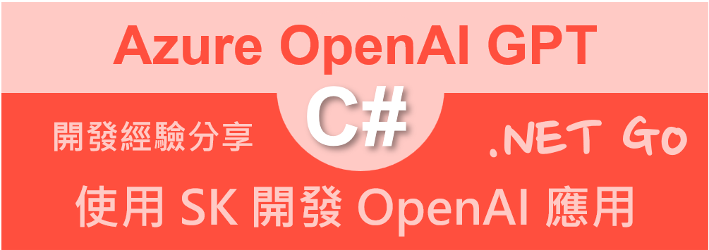
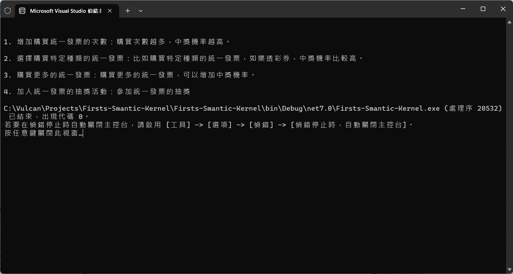

# 第一次使用 Microsoft.SemanticKernel 開發 OpenAI 提示與完成之應用 - 開發教學



由於 OpenAI 在最近相當的火紅，網路上充斥著很多不錯關於如何開發出各種 OpenAI 服務的應用教學文章，對於身為 .NET 開發者而言，總是有些不足，這是因為絕大部分的程式設計教學文章，使用的 python 程式語言來撰寫；對於微軟而言，當然也不落人後，在今年 2023 年初，也推出了 Microsoft.SemanticKernel 這個套件，此套件是將許多在進行要設計出各種 GPT 應用情境，整理出各種設計模式，並將這些 API 整理到這個套件內，方便 .NET 開發者來直接使用；若有去看到 SemanticKernel 套件說明文件的開發者，不難發現到，這個套件內所提供的許多功能，與 [LangChain](https://python.langchain.com/docs/get_started/introduction.html) 這個 Python 套件有著很多相似的地方。

關於 semantic-kernel 是個開源的類別庫專案，可以從 Github 的 [semantic-kernel](https://github.com/microsoft/semantic-kernel) 找到這個套件的原始碼與使用範例，最為重要的是，Semantic Kernel 有支援 C# 程式語言，而這句話，則是充分的說明了 [semantic-kernel] 的功能與意義

>Integrate cutting-edge LLM technology quickly and easily into your apps

另外，在 Microsoft Learn 網站上，也有個專門針對 Semantic Kernel 介紹 [What is Semantic Kernel?](https://learn.microsoft.com/en-us/semantic-kernel/overview/)，在這個網頁轉寫得相當完整與詳細，對於這個工具有興趣的開發者，強烈建議可以去觀看這個網站上的詳細內容。

## 取得 Azure OpenAI Key 並且儲存為系統環境變數

在這裡將會需要使用 Azure OpenAI Server 來進行呼叫，因此，需要取得 Azure OpenAI 的 API 授權金鑰，關於這部分的取得與設定方式，可以參考 [取得 Azure OpenAI Key 並且儲存為系統環境變數](https://csharpkh.blogspot.com/2023/04/Azure-OpenAI-client-library-for-NET-Chat-Competion.html) 這篇文章


## 建立第一次使用 Microsoft.SemanticKernel 的專案

為了簡化測試用專案的複雜度，因此，在這裡將會建立一個 Console 主控台應用類型的專案。

* 打開 Visual Studio 2022 IDE 應用程式
* 從 [Visual Studio 2022] 對話窗中，點選右下方的 [建立新的專案] 按鈕
* 在 [建立新專案] 對話窗右半部
  * 切換 [所有語言 (L)] 下拉選單控制項為 [C#]
  * 切換 [所有專案類型 (T)] 下拉選單控制項為 [主控台]
* 在中間的專案範本清單中，找到並且點選 [主控台應用程式] 專案範本選項
  > 專案，用於建立可在 Windows、Linux 及 macOS 於 .NET 執行的命令列應用程式
* 點選右下角的 [下一步] 按鈕
* 在 [設定新的專案] 對話窗
* 找到 [專案名稱] 欄位，輸入 `Firsts-Smantic-Kernel` 作為專案名稱
* 在剛剛輸入的 [專案名稱] 欄位下方，確認沒有勾選 [將解決方案與專案至於相同目錄中] 這個檢查盒控制項
* 點選右下角的 [下一步] 按鈕
* 現在將會看到 [其他資訊] 對話窗
* 在 [架構] 欄位中，請選擇最新的開發框架，這裡選擇的 [架構] 是 : `.NET 7.0 (標準字詞支援)`
* 在這個練習中，需要去勾選 [不要使用最上層陳述式(T)] 這個檢查盒控制項
  > 這裡的這個操作，可以由讀者自行決定是否要勾選這個檢查盒控制項
* 請點選右下角的 [建立] 按鈕

稍微等候一下，這個主控台專案將會建立完成

## 安裝要用到的 NuGet 開發套件

因為開發此專案時會用到這些 NuGet 套件，請依照底下說明，將需要用到的 NuGet 套件安裝起來。

### 安裝 Azure.AI.OpenAI 套件

* 滑鼠右擊 [方案總管] 視窗內的 [專案節點] 下方的 [相依性] 節點
* 從彈出功能表清單中，點選 [管理 NuGet 套件] 這個功能選項清單
* 此時，將會看到 [NuGet: Microsoft.SemanticKernel] 視窗
* 切換此視窗的標籤頁次到名稱為 [瀏覽] 這個標籤頁次
* 在左上方找到一個搜尋文字輸入盒，在此輸入 `Microsoft.SemanticKernel`
* 對於這個套件，現在尚在 Preview 階段，因此，請勾選 [包括搶鮮版] 這個檢查盒控制項
* 稍待一會，將會在下方看到這個套件被搜尋出來
* 點選 [Microsoft.SemanticKernel] 套件名稱
* 在視窗右方，將會看到該套件詳細說明的內容，其中，右上方有的 [安裝] 按鈕
* 點選這個 [安裝] 按鈕，將這個套件安裝到專案內

## 修正主程序 Program.cs 的程式碼

* 在此專案節點下，找到並且打開 [Program.cs] 這個檔案
* 使用底下 C# 程式碼替換掉 [Program.cs] 檔案內所有程式碼內容

```csharp
using Microsoft.SemanticKernel;
using Microsoft.SemanticKernel.SemanticFunctions;

namespace Firsts_Smantic_Kernel
{
    internal class Program
    {
        static async Task Main(string[] args)
        {
            // 透過環境變數取得 Azure OpenAI 服務需要用到的授權金鑰
            var apiKey = Environment.GetEnvironmentVariable("OpenAIKey");

            // 建立 Semantic Kernel Builder 建置器物件，準備進行相關運行參數設定
            var builder = new KernelBuilder();

            // 設定使用 Azure OpenAI 服務需要用到的參數
            builder.WithAzureTextCompletionService(
                     "text-davinci-003",                  // Azure OpenAI 服務中所佈署的模型名稱
                     "https://openailabtw.openai.azure.com/", // Azure OpenAI 服務端點
                     apiKey);      // Azure OpenAI 服務需要用到的授權金鑰

            // 建立 Semantic Kernel 物件
            var kernel = builder.Build();

            // 宣告一個要提問文字的樣板，其中 input 為使用者要提問的文字
            var prompt = @"{{$input}}";

            // 宣告要使用該模型的相關參數
            var myPromptConfig = new PromptTemplateConfig
            {
                Description = "透過指定的 GPT 模型，進行各種問題的文字生成.",
                Completion =
                {
                    MaxTokens = 300,
                    Temperature = 0.2,
                    TopP = 0.5,
                }
            };

            // 宣告一個提示樣板，傳入提示文字，使用該提示規劃物件與 Semantic Kernel 物件
            var myPromptTemplate = new PromptTemplate(
                prompt,
                myPromptConfig,
                kernel
            );

            // 宣告一個語意函數規劃物件，傳入提示規劃物件與提示樣板
            var myFunctionConfig = new SemanticFunctionConfig(myPromptConfig, myPromptTemplate);

            // 註冊語意函數，傳入語意函數名稱、語意函數類型、語意函數規劃物件
            // 注意：A skill name can contain only ASCII letters, digits, and underscores
            var myFunction = kernel.RegisterSemanticFunction(
                "Test_Prompt_Completion_Function",
                "TestPromptCompletion",
                myFunctionConfig);

            string inputContent = "如何才能提高統一發票中獎機率";

            // 執行語意函數，傳入使用者要提問的文字
            var myOutput = await kernel.RunAsync(inputContent, myFunction);

            // 將 GPT 生成內容寫入到螢幕
            Console.WriteLine(myOutput);
        }
    }
}
```

首先，先來看看上面這段程式碼的執行結果



這段程式碼將會對 Azure OpenAI GPT 提出一個問題

```
如何才能提高統一發票中獎機率
```

經過 Microsoft Semantic Kernel 這套類別庫的幫助，取得了 GPT 的回應文字，該文字內容如下：

```
1. 增加購買統一發票的次數：購買次數越多，中獎機率越高。

2. 選擇購買特定種類的統一發票：比如購買特定種類的統一發票，如樂透彩券，中獎機率比較高。

3. 購買更多的統一發票：購買更多的統一發票，可以增加中獎機率。

4. 加入統一發票的抽獎活動：參加統一發票的抽獎
```

從這裡可以看到一個 Azure OpenAI GPT 的基本運作模式，那就是，送出一串文字到 GPT 模型內，由其生成出相關文字，並且取得些內容。

現在來看看如何使用 Microsoft Semantic Kernel 這套工具來進行這樣需求的設計。

首先，要使用 `Environment.GetEnvironmentVariable("OpenAIKey")` 來取得 Azure OpenAI Server 需要用到的 License Key，會將這個授權鍵值放到作業系統的 環境變數內，是為了安全上的考量，避免任何人從原始程式碼上就可以看到該 License Key。

接著，建立起一個 [KernelBuilder] 物件，並且要進行相關的參數設定，最後透過該物件的 [Build()] 方法，取得一個 [IKernel] 實作物件。

有了該 Builder 物件之後，透過 `WithAzureTextCompletionService` 方法，進行相關參數的設定，這裡依序傳入 GPT 服務會用到的模型名稱、服務端點路徑與 API License Key。其中，對於模型名稱，則為使用 Azure OpenAI 網頁中，所建立的模型佈署名稱。

```csharp
var prompt = @"{{$input}}"
```

這裡宣告一個字串物件，該字串的內容則為要向 GPT 模型送出的 Prompt 文字內容，這裡可以寫入任何文字內容，要求模型要產出甚麼樣的內容或者指示額外的處理指令；其中，兩個大括號內的 $inupt 這個變數，則是用來當啟動 Semantic Kernel 機制之後，所要插入的文字內容，通常這部分的文字內容將會是由使用者所提供的內容，所以是會變動的。

呼叫 kernel 物件內的 `RunAsync` 方法，傳入使用者輸入的內容與剛剛定義的 Semantic Function 物件，其型別為 [ISKFunction]

現在需要建立 提示 Prompt 樣板需要用到的設定物件，在此，建立一個 PromptTemplateConfig 物件，其中，在這裡可以設定 完成 Completion GPT 呼叫會用的參數設定值，例如，可以使用的最大權杖 Token 數量、溫度定義值等等。

有了這個設定物件，接下來可以來建立 PromptTemplate 物件，這裡需要把剛剛設定的 提示 Prompt 樣板文字、而上面建立的設定物件、最後才 Semantic Kernel 這個 IKernel 物件 

有了上述的準備工作，還需要宣告一個語意函數規劃物件，傳入提示規劃物件與提示樣板，這裡需要建立一個 `SemanticFunctionConfig` 物件，有了這個Semantic 函數設定物件，最後便可以將其註冊到 Semantic Kernel 系統內，這裡將會用到 [kernel.RegisterSemanticFunction] 這個方法來做到。

`string inputContent = "如何才能提高統一發票中獎機率";`

現在可以宣告要注入到 GPT Prompt 提示內容的使用者問題，這裡將會請 GPT 生成出 如何才能提高統一發票中獎機率 文字內容。

```csharp
await kernel.RunAsync(inputContent, myFunction)
```

這個非同步方法呼叫之後，將會得到一個型別為 [SKContext] 物件，從這個物件可以知道剛剛呼叫的結果是否成功，或者有錯誤、甚至產生了例外異常。

若正確無誤，便可以將呼叫結果的文字取得，列印到螢幕上。


