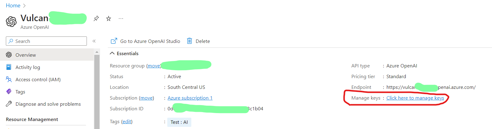
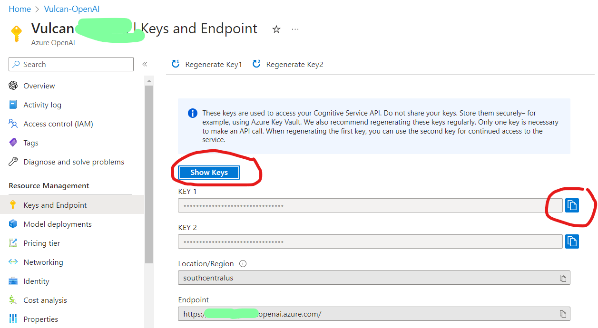

# 第一次使用 Microsoft.SemanticKernel 開發 OpenAI 提示與完成之應用 - 開發教學


由於 OpenAI 在最近相當的火紅，網路上充斥著很多不錯關於如何開發出各種 OpenAI 服務的應用教學文章，對於身為 .NET 開發者而言，總是有些不足，這是因為絕大部分的程式設計教學文章，使用的 python 程式語言來撰寫；對於微軟而言，當然也不落人後，在今年 2023 年初，也推出了 Microsoft.SemanticKernel 這個套件，此套件是將許多在進行要設計出各種 GPT 應用情境，整理出各種設計模式，並將這些 API 整理到這個套件內，方便 .NET 開發者來直接使用；若有去看告 SemanticKernel 套件說明文件的開發者，不難發現到，這個套件內所提供的許多功能，與 [LangChain](https://python.langchain.com/docs/get_started/introduction.html) 這個 Python 套件有著很多相似的地方。

至於當初一開始設計呼叫 Azure OpenAI API 的時候，從網路上找到這個 [Betalgo.OpenAI.GPT3] 套件，來呼叫 Azure OpenAI GPT 相關 API 似乎都沒有遇到甚麼問題，最重要的是，可以同時支援 OpenAI GPT API 與 微軟這裡的 OpenAI GPT API，這樣的功能真的是太完美了，因為可以同時切換在不同系統下來使用 GPT 所提供的功能。

這麼好用與開發上相當容易的套件，為什麼要更換成為 微軟官方的 [Azure.AI.OpenAI](https://learn.microsoft.com/en-us/dotnet/api/azure.ai.openai?view=azure-dotnet-preview&WT.mc_id=DT-MVP-5002220) 套件呢?其中一個最主要的原因，那就是之前使用的套件，無法使用 Azure OpenAI 內提供的 GPT4 功能，所以，只好放棄使用這個套件。

然而，最重要的原因就是，市面上滿滿 OpenAI GPT 的開發文章，幾乎一面倒地使用 Python 這個語言來做為演練主角，這讓身為 .NET 資深開發者很沒面子，也很無奈呀，難道 .NET / C# 真的與 OpenAI 這波浪潮無緣嗎？我不斷地搜尋，發現到，微軟真的有認真投入在 OpenAI 與 C# 開發工具支援上(說實在的，自己的小孩，自己不疼，還有誰會疼)，真的做到讓人刮目相看的地步，原本以為要再等很久的時間，才能夠看到有哪位大神可以釋放出可以使用 C# 開發 OpenAI GPT 應用的套件，沒想到微軟這麼快就推出了，而且驚訝的是相當親切、容易、完成，這與我之前所認識的微軟作風與做事態度，180度的顛覆我的認知。

話不多說，堅持是一定要的，這裡還是要持續使用 C# 來做到任何事情，經過第一次上手 [Azure.AI.OpenAI] 套件後，發現到這個套件也不會難用，很快速就可以上手，也許是之前有使用與呼叫過 GPT API，所以幾乎無痛就這麼開發下去了。

在第一次看到這個套件說明文件的時候，我就眼睛一亮有看到 [Chat Messages] 這個主題，心裡想說這到底是可以做出類似 ChatGPT 這樣應用的 API，還是甚麼其他鬼東西，由於尚有許多工作、文章、簡報需要去處理，心中的那個疑惑也就暫時放下了；就在今天，還是來解除這個疑問吧？

在這篇文章將會使用 [Azure.AI.OpenAI] 提供的 [Chat Messages] API，設計出一個智慧大主廚功能，使用者只需要輸入手頭上的食材，智能大主廚就會幫你設計出菜單，並且告訴你怎們做出這套菜，最後為這道菜做出完美說明。

## 取得 Azure OpenAI Key 並且儲存為系統環境變數

同樣的，這裡還是使用 Azure 上提供的 OpenAI 服務來進行 API 呼叫

* 打開 Azure 網頁，並且登入該服務
* 切換到你自己建立 [Azure OpenAI] 服務
* 在 Overview 儀表板頁面中，將會看到 [Manage keys] 欄位
* 點選該欄位名稱右邊的 [Click here to manage keys] 文字

  
* 現在將會看到 [Keys and Endpoint] 這個頁面
* 你可以點選 [Show Keys] 來看到 API Key 的內容，又或者點選最右方的複製按鈕，將 API Key 複製到剪貼簿內

  
* 開啟命令提示字元視窗
* 使用底下命令將建立 OpenAI Key 永久性的環境變數

```
setx OpenAIKey "剪貼簿內的 OpenAI Key 值" /M
```

## 建立使用 Azure OpenAI client library for .NET 測試用的專案

為了簡化測試用專案的複雜度，因此，在這裡將會建立一個 Console 主控台應用類型的專案。

* 打開 Visual Studio 2022 IDE 應用程式
* 從 [Visual Studio 2022] 對話窗中，點選右下方的 [建立新的專案] 按鈕
* 在 [建立新專案] 對話窗右半部
  * 切換 [所有語言 (L)] 下拉選單控制項為 [C#]
  * 切換 [所有專案類型 (T)] 下拉選單控制項為 [主控台]
* 在中間的專案範本清單中，找到並且點選 [主控台應用程式] 專案範本選項
  > 專案，用於建立可在 Windows、Linux 及 macOS 於 .NET 執行的命令列應用程式
* 點選右下角的 [下一步] 按鈕
* 在 [設定新的專案] 對話窗
* 找到 [專案名稱] 欄位，輸入 `AzureOpenAIClientLibraryChatMessages` 作為專案名稱
* 在剛剛輸入的 [專案名稱] 欄位下方，確認沒有勾選 [將解決方案與專案至於相同目錄中] 這個檢查盒控制項
* 點選右下角的 [下一步] 按鈕
* 現在將會看到 [其他資訊] 對話窗
* 在 [架構] 欄位中，請選擇最新的開發框架，這裡選擇的 [架構] 是 : `.NET 7.0 (標準字詞支援)`
* 在這個練習中，需要去勾選 [不要使用最上層陳述式(T)] 這個檢查盒控制項
  > 這裡的這個操作，可以由讀者自行決定是否要勾選這個檢查盒控制項
* 請點選右下角的 [建立] 按鈕

稍微等候一下，這個主控台專案將會建立完成

## 安裝要用到的 NuGet 開發套件

因為開發此專案時會用到這些 NuGet 套件，請依照底下說明，將需要用到的 NuGet 套件安裝起來。

### 安裝 Azure.AI.OpenAI 套件

* 滑鼠右擊 [方案總管] 視窗內的 [專案節點] 下方的 [相依性] 節點
* 從彈出功能表清單中，點選 [管理 NuGet 套件] 這個功能選項清單
* 此時，將會看到 [NuGet: AzureOpenAIClientLibraryChatMessages] 視窗
* 切換此視窗的標籤頁次到名稱為 [瀏覽] 這個標籤頁次
* 在左上方找到一個搜尋文字輸入盒，在此輸入 `Azure.AI.OpenAI`
* 對於這個套件，現在尚在 Preview 階段，因此，請勾選 [包括搶鮮版] 這個檢查盒控制項
* 稍待一會，將會在下方看到這個套件被搜尋出來
* 點選 [Azure.AI.OpenAI] 套件名稱
* 在視窗右方，將會看到該套件詳細說明的內容，其中，右上方有的 [安裝] 按鈕
* 點選這個 [安裝] 按鈕，將這個套件安裝到專案內

### 安裝 Azure.Identity 套件

* 滑鼠右擊 [方案總管] 視窗內的 [專案節點] 下方的 [相依性] 節點
* 從彈出功能表清單中，點選 [管理 NuGet 套件] 這個功能選項清單
* 此時，將會看到 [NuGet: AzureOpenAIClientLibraryChatMessages] 視窗
* 切換此視窗的標籤頁次到名稱為 [瀏覽] 這個標籤頁次
* 在左上方找到一個搜尋文字輸入盒，在此輸入 `Azure.Identity`
* 稍待一會，將會在下方看到這個套件被搜尋出來
* 點選 [Azure.Identity] 套件名稱
* 在視窗右方，將會看到該套件詳細說明的內容，其中，右上方有的 [安裝] 按鈕
* 點選這個 [安裝] 按鈕，將這個套件安裝到專案內

## 修正主程序 Program.cs 的程式碼

* 在此專案節點下，找到並且打開 [Program.cs] 這個檔案
* 使用底下 C# 程式碼替換掉 [Program.cs] 檔案內所有程式碼內容

```csharp
using Azure.AI.OpenAI;
using Azure;

namespace AzureOpenAIClientLibraryChatMessages
{
    internal class Program
    {
        static async Task Main(string[] args)
        {
            #region 使用 Azure.AI.OpenAI 套件來 OpenAIClient 物件
            var apiKey = Environment.GetEnvironmentVariable("OpenAIKey");
            string endpoint = "https://vulcan-openai.openai.azure.com/";
            var client = new OpenAIClient(new Uri(endpoint), new AzureKeyCredential(apiKey));
            #endregion

            #region 準備使用 OpenAI GPT 的 聊天記憶功能，並且呼叫 GPT API 來生成內容
            while (true)
            {
                Console.WriteLine("請輸入手頭上可用的食材名稱");
                string input = Console.ReadLine();
                Console.WriteLine("請稍後，主廚正在思考中...");
                var chatCompletionsOptions = new ChatCompletionsOptions()
                {
                    Messages =
                    {
                        new ChatMessage(ChatRole.System, "你是一個全方位主廚，擅長世界各地美食製作與烹飪，" +
                        "將會根據輸入食材，建議要做出的菜名與建議作法(並不一定只能夠使用指定食材來設計這道菜)，最後給予這道菜一個完美說明與介紹；" +
                        "若輸入內容沒有食材，請回應:這難倒我了，我不是食神"),
                        new ChatMessage(ChatRole.User, "食材：雞胸肉、檸檬、迷迭香"),
                        new ChatMessage(ChatRole.Assistant, "建議：檸檬迷迭香烤雞胸"),
                        new ChatMessage(ChatRole.User, "食材：番茄、義大利麵、大蒜"),
                        new ChatMessage(ChatRole.Assistant, "建議：番茄大蒜義大利麵"),
                        new ChatMessage(ChatRole.User, $"食材：{input}"),
                    },
                    Temperature = (float)0.7,
                    MaxTokens = 800,
                    NucleusSamplingFactor = (float)0.95,
                    FrequencyPenalty = 0,
                    PresencePenalty = 0
                };

                string deploymentName = "gpt-4";
                Response<ChatCompletions> response = await client.GetChatCompletionsAsync(
                    deploymentOrModelName: deploymentName,
                    chatCompletionsOptions);
                var result = response.Value;

                foreach (var message in result.Choices)
                {
                    Console.WriteLine(message.Message.Content);
                }
                await Console.Out.WriteLineAsync();
                await Console.Out.WriteLineAsync();
                #endregion
            }

            Console.WriteLine("Press any key for continuing...");
            Console.ReadKey();
        }
    }
}
```

在這個進入點程式碼內，首先會進行使用 Azure.AI.OpenAI 套件來 OpenAIClient 物件，這裡先呼叫 `Environment.GetEnvironmentVariable("OpenAIKey")` 敘述，取得剛剛設定在系統環境變數中的 OpenAI Key 值，並且將 Key 儲存到 [apiKey] 這個物件內。會想要這麼設計的理由是很單純的，就是不想把 OpenAI Key 內容寫在程式碼內，並且 Commit 到版控系統內，如果是這樣的話，那麼，大家都會知道你的 OpenAI Key 內容，當然，也就可以透過這個 Key 來存取你的 Azure OpenAI Service，最後將是你需要負擔這些呼叫 API 的費用。

緊接著使用 `OpenAIClient` 類別來建立一個物件，這個類別建構函式將會需要 Azure OpenAI Service 的服務端點與 Azure OpenAI Key 這兩個資訊，使用 `new OpenAIClient(new Uri(endpoint), new AzureKeyCredential(apiKey))` 這樣方式，建立起這個物件。

緊接著就是要來學習如何使用 Chat Completion 功能，建立一個 [ChatCompletionsOptions] 類別會用到的物件；一旦這個物件建立完成後，需要設定 [Messages] 這個屬性內容，其型別為 [IList<ChatMessage>]，也就是說，這裡會有一連串的角色與需要描述的提示 Prompt 內容，所以，每產生一個 [ChatMessage] 物件，根據這個類別建構函式描述

```csharp
/// <summary>
/// Initializes a new instance of ChatMessage.
/// </summary>
/// <param name="role">The role to associate with the message.</param>
/// <param name="content">The content to associate with the message.</param>
public ChatMessage(ChatRole role, string content)
{
    Role = role;
    Content = content;
}
```

需要傳遞一個 [ChatRole] 型別物件，與一個提示字串文字內容

對於 [ChatRole] 型別是一個 [struct] 型別，裡面會有三個主要的角色，分別是 [ChatRole.System]、[ChatRole.Assistant]、[ChatRole.User]，這可以透過該型別的提供的三個靜態欄位來取得

* [ChatRole.System] : 對系統指示的、用戶提示的輸入提供響應的角色
* [ChatRole.Assistant] : 指示或設置助手行為的角色
* [ChatRole.User] : 為聊天完成提供輸入的角色

因此，透過不同角色與其相對應的 Prompt 內容，將會讓 GTP 可以具有少數樣本的學習與產出能力，能夠產生真正需要的內容。

底下將會是這個範例所設計出來的少數樣本程式碼

```csharp
Messages =
{
    new ChatMessage(ChatRole.System, "你是一個全方位主廚，擅長世界各地美食製作與烹飪，" +
    "將會根據輸入食材，建議要做出的菜名與建議作法(並不一定只能夠使用指定食材來設計這道菜)，最後給予這道菜一個完美說明與介紹；" +
    "若輸入內容沒有食材，請回應:這難倒我了，我不是食神"),
    new ChatMessage(ChatRole.User, "食材：雞胸肉、檸檬、迷迭香"),
    new ChatMessage(ChatRole.Assistant, "建議：檸檬迷迭香烤雞胸"),
    new ChatMessage(ChatRole.User, "食材：番茄、義大利麵、大蒜"),
    new ChatMessage(ChatRole.Assistant, "建議：番茄大蒜義大利麵"),
    new ChatMessage(ChatRole.User, $"食材：{input}"),
}
```

每一次使用者輸入的食材內容(這些內容將會儲存在 input 這個字串物件內)，都會把上述的聊天情境文字，加入此次輸入的內容，一併送至 GPT API 內，而將會產生出預期的內容。

對於這個 ChatCompletionsOptions 物件，還在這個程式碼中使用到

```csharp
Temperature = (float)0.7,
MaxTokens = 800,
NucleusSamplingFactor = (float)0.95,
FrequencyPenalty = 0,
PresencePenalty = 0
```

這些參數將會用於設定 GPT 可以控制生成回答或文本的風格和長度，而主要目的是讓您能夠根據您的需求和偏好，客製化生成的文本。當然，上述的參數值是可以依據本身需求來自行調整，或者執行各種問題後，再來變更這些參數內容，觀察哪個參數或者內容是合適的。

* Temperature（溫度）: 此參數控制生成文本的創意程度。較高的溫度值（如1.0）將導致生成的文本更具創意和多樣性，但可能較難理解或較為離題。較低的溫度值（如0.2）則會讓生成的文本更為保守、連貫和專注，但可能較為重複和保守。
* MaxTokens（最大生成字數）: 此參數限制生成文本的最大字數。這可以幫助您控制生成的文本的長度，避免產生過長或冗長的回答。
* NucleusSamplingFactor（核抽樣因子）: 此參數控制生成文本時使用的核抽樣策略。核抽樣是一種在生成過程中採樣候選字的方法，它選擇了一個概率閾值，僅考慮概率高於此閾值的候選字。NucleusSamplingFactor越高，生成的文本越具創意和多樣性，但可能較難理解或較為離題。
* FrequencyPenalty（頻率懲罰）: 這個參數用於控制生成文本中出現的單詞的罕見程度。較高的FrequencyPenalty值將抑制常見單詞的出現，從而使生成的文本更具特色和創意。然而，過高的值可能會導致文本難以理解。
* PresencePenalty（出現懲罰）: 此參數用於控制生成文本中重複詞語的程度。較高的PresencePenalty值會減少生成文本中重複單詞的機率，使文本更為多樣化。然而，過高的值可能會導致生成的文本不夠連貫。

完成之後，就可以透過 [GetChatCompletionsAsync] API，將需要使用的模型和 [ChatCompletionsOptions] 物件值傳送給 GPT，完成呼叫之後，將會得到 [Response<ChatCompletions>] 型別的物件，現在便可以將 GPT 生成的內容輸出到螢幕上。

底下是執行這個專案的結果


```
請輸入手頭上可用的食材名稱
紅茶, 蝦子, 節瓜
請稍後，主廚正在思考中...
建議：紅茶燉蝦與節瓜

菜名：紅茶風味燉蝦搭配節瓜

作法：

1. 先將紅茶泡好，選擇一款濃郁的紅茶，如阿薩姆紅茶，並將紅茶濾出待用。

2. 準備新鮮的蝦子，去殼去腸，洗淨後瀝乾。

3. 節瓜削皮，切成小塊。

4. 大蒜切末，備用。

5. 熱鍋，倒入適量的橄欖油，先炒香大蒜末，再加入蝦子翻炒至變色，盛出備用。

6. 用剩餘的油和蒜末，將節瓜塊放入鍋中翻炒，炒至表面微焦後，倒入步驟1的紅茶，煮至節瓜軟熟。

7. 將炒好的蝦子放回鍋中，與節瓜一起煮沸，稍加調味（可用鹽、胡椒等，根據個人口味調整）。

8. 煮好之後，盛出並撒上適量的蔥花或香菜。

完成這道美味的紅茶風味燉蝦搭配節瓜，紅茶的香氣為蝦子帶來了一抹特別的風味，而節瓜則提供了清爽的口感，是一道很特別的中西合璧佳餚。
```

現在來輸入一個與食材無關的內容，看看會如何回應


不過，若輸入 `打火機, 牛肉` 文字，來看看 GPT 會如何生成，當然，可以透過不同的控制生成內容參數，讓生成的內容更具有參考價值

