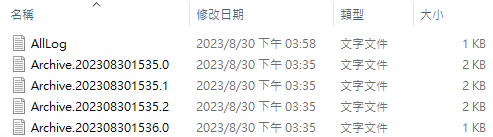
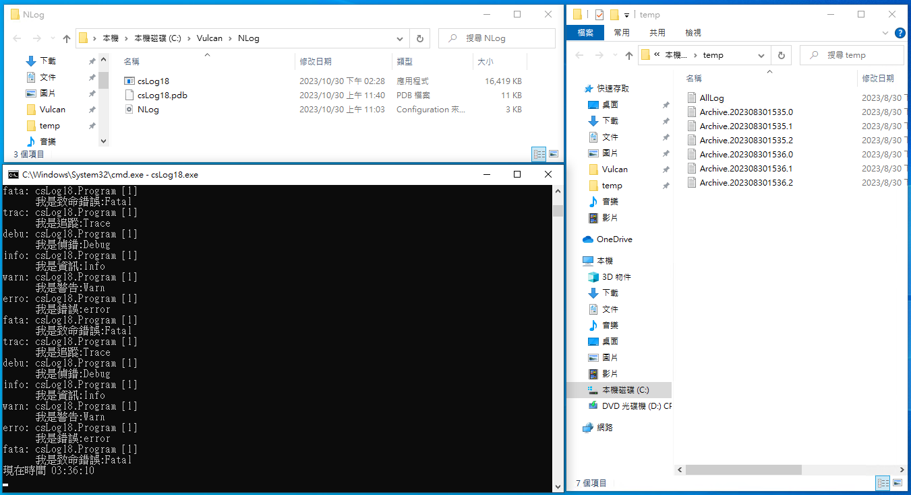
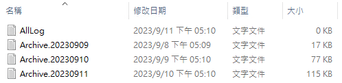
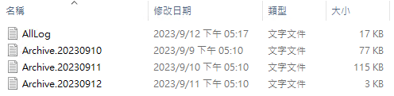
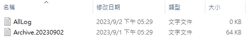
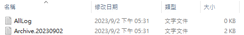
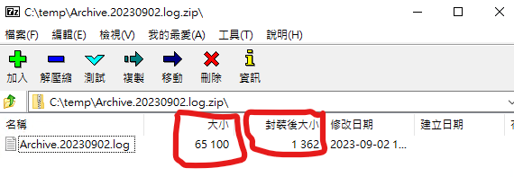

# .NET C# 使用 NLog 紀錄封存處理 切割、最多天數、壓縮


一旦有加入使用 NLog 套件的系統上線，並且在系統中有使用到 NLog 來生成各種除錯、維護、運作等相關資訊的日誌內容，接下來將會面對到的是如何有效的管理這些 Log 日誌紀錄資訊；由於，隨著使用時間的增長，日誌的內容將會不斷地長大，檔案的體積也會越加龐大，這將會影響到日後的維護或者問題查詢操作方便性，因為，所有的操作都將在同一個日誌檔案上來操作。

因此，期望能夠使用 NLog 提供的封存 Archive 機制，將正在寫入的日誌檔案，依據設定條件來進行切割與封存，並且可以依據不同設定條件，自動刪除已經逾時或者不需要的日誌封存檔案，不要因為不斷增加的 Log 檔案數量與體積，使得該磁碟機爆掉且造成空間不足的問題。

在 NLog 中，將會提供底下幾種機制，方便日誌進行封存與進行舊封存檔案的刪除

NLog 提供了多種機制來幫助用戶管理和封存日誌檔案，以及刪除舊的封存檔案。以下是 NLog 中與日誌檔案封存和刪除相關的幾個重要機制：

* 封存策略
  * archiveAboveSize: 當日誌文件大小超過指定的字節數時進行封存。
  * archiveEvery: 定義日誌封存的頻率，例如每分鐘、每小時、每天等。
* 封存文件命名和編號
  * archiveFileName: 定義封存檔案的命名模式。
  * archiveNumbering: 封存文件的編號方式，如 Sequence（連續序號）、Rolling（輪替）、  * Date（日期）、DateAndSequence（日期和序列號組合）。
  * archiveDateFormat: 當使用日期作為封存文件名的一部分時的日期格式。
* 舊封存文件的管理
  * maxArchiveFiles: 保留的封存文件的最大數量。當封存文件數量超過此值時，最舊的封存文件將被刪除。
  * enableArchiveFileCompression: 此選項決定是否在封存時壓縮日誌文件。設定為 true 時，當日誌文件被封存時，它將被壓縮（通常是 .zip 格式）。這有助於節省磁盤空間，特別是當日誌文件很大時。
  * maxArchiveDays: 這是一個用於刪除舊封存文件的設定。它定義了封存文件可以在磁盤上保留的最大天數。當封存文件的年齡超過此設定值時，該文件將被刪除。

在這篇文章將會來嘗試針對如何把已經封存的文件檔案，為了要讓磁碟空間可以有效的使用與管理，將舊有的日誌檔案進行刪除。

## 建立測試專案

請依照底下的操作，建立起這篇文章需要用到的練習專案

* 打開 Visual Studio 2022 IDE 應用程式
* 從 [Visual Studio 2022] 對話窗中，點選右下方的 [建立新的專案] 按鈕
* 在 [建立新專案] 對話窗右半部
  * 切換 [所有語言 (L)] 下拉選單控制項為 [C#]
  * 切換 [所有專案類型 (T)] 下拉選單控制項為 [主控台]
* 在中間的專案範本清單中，找到並且點選 [主控台應用程式] 專案範本選項
  > 專案，用於建立可在 Windows、Linux 及 macOS 於 .NET 執行的命令列應用程式
* 點選右下角的 [下一步] 按鈕
* 在 [設定新的專案] 對話窗
* 找到 [專案名稱] 欄位，輸入 `csLog18` 作為專案名稱
* 在剛剛輸入的 [專案名稱] 欄位下方，確認沒有勾選 [將解決方案與專案至於相同目錄中] 這個檢查盒控制項
* 點選右下角的 [下一步] 按鈕
* 現在將會看到 [其他資訊] 對話窗
* 在 [架構] 欄位中，請選擇最新的開發框架，這裡選擇的 [架構] 是 : `.NET 7.0 (標準字詞支援)`
* 在這個練習中，需要去勾選 [不要使用最上層陳述式(T)] 這個檢查盒控制項
  > 這裡的這個操作，可以由讀者自行決定是否要勾選這個檢查盒控制項
* 請點選右下角的 [建立] 按鈕

稍微等候一下，這個主控台專案將會建立完成

## 安裝要用到的 NuGet 開發套件

因為開發此專案時會用到這些 NuGet 套件，請依照底下說明，將需要用到的 NuGet 套件安裝起來。

### 安裝 NLog 套件

這個套件將會是 NLog 日誌架構的核心套件，它提供 NLog 日誌架構的核心功能。

* 滑鼠右擊 [方案總管] 視窗內的 [專案節點] 下方的 [相依性] 節點
* 從彈出功能表清單中，點選 [管理 NuGet 套件] 這個功能選項清單
* 此時，將會看到 [NuGet: csLog18] 視窗
* 切換此視窗的標籤頁次到名稱為 [瀏覽] 這個標籤頁次
* 在左上方找到一個搜尋文字輸入盒，在此輸入 `NLog`
* 點選 [NLog] 套件名稱，請選擇作者為 [Jarek Kowalski,Kim Christensen,Julian Verdurmen] 的套件
* 在視窗右方，將會看到該套件詳細說明的內容，其中，右上方有的 [安裝] 按鈕
* 點選這個 [安裝] 按鈕，將這個套件安裝到專案內

### 安裝 NLog.Schema 套件

NLog.Schema 是一個 .NET NuGet 套件，它提供 NLog 日誌架構的 XML 定義。此定義可用於在 NLog 日誌配置中使用 XML 語法。

* 滑鼠右擊 [方案總管] 視窗內的 [專案節點] 下方的 [相依性] 節點
* 從彈出功能表清單中，點選 [管理 NuGet 套件] 這個功能選項清單
* 此時，將會看到 [NuGet: csLog18] 視窗
* 切換此視窗的標籤頁次到名稱為 [瀏覽] 這個標籤頁次
* 在左上方找到一個搜尋文字輸入盒，在此輸入 `NLog.Schema`
* 點選 [NLog.Schema] 套件名稱，請選擇作者為 [Jarek Kowalski,Kim Christensen,Julian Verdurmen] 的套件
* 在視窗右方，將會看到該套件詳細說明的內容，其中，右上方有的 [安裝] 按鈕
* 點選這個 [安裝] 按鈕，將這個套件安裝到專案內
* 此時，從方案總管視窗內，將會看到有個 [NLog.xsd] 檔案，這個檔案是 NLog.Schema 套件安裝後，自動產生的檔案
* 在 [方案總管] 內找到並且點選 [NLog.xsd] 檔案這個節點
* 從 [屬性] 視窗中，將 [複製到輸出目錄] 屬性值改為 [有更新時才複製]，這樣才能讓 [NLog.xsd] 檔案在執行時，能夠被複製到執行目錄內

  >若沒有發現到 [屬性] 視窗，請在 [Visual Studio] 功能表中，點選 [檢視] > [屬性視窗] 功能選項

## 建立 NLog.config 設定檔

* 滑鼠右擊 [方案總管] 視窗內的 [專案節點]
* 從彈出功能表清單中，點選 [新增項目] 這個功能選項清單
* 此時，將會看到 [新增項目 - csLog18] 視窗
* 在左方的清單選項中，點選 [已安裝] > [C# 項目] > [資料] 節點
* 在該對話窗的中間區域，找到並點選 [XML 檔案]
* 在下方 [名稱] 欄位內，輸入 `NLog.config` 作為檔案名稱
* 點選右下方 [新增] 按鈕，將這個檔案加入到專案內
* 在 [方案總管] 內找到並且點選 [NLog.config] 檔案這個節點
* 從 [屬性] 視窗中，將 [複製到輸出目錄] 屬性值改為 [有更新時才複製]，這樣才能讓 [NLog.config] 檔案在執行時，能夠被複製到執行目錄內

  >若沒有發現到 [屬性] 視窗，請在 [Visual Studio] 功能表中，點選 [檢視] > [屬性視窗] 功能選項

* 使用底下的 XML 內容來替換掉這個檔案內的內容

```xml
<?xml version="1.0" encoding="utf-8" ?>
<nlog xmlns="http://www.nlog-project.org/schemas/NLog.xsd"
      xmlns:xsi="http://www.w3.org/2001/XMLSchema-instance"
	  autoReload="true"
	  throwConfigExceptions="true"
	  internalLogLevel="Warn"
	  internalLogFile="c:\temp\nlog-internal.log"
	  >

	<!-- 在這裡宣告要用到的 Target 項目 -->
	<targets>
		<!-- 宣告 File 目標，將會把 Log 內容寫入到檔案內 -->

		<target xsi:type="File" name="allfile"
				fileName="c:\temp\AllLog.log"
				layout="${longdate}|${uppercase:${level}}|${logger}|[${threadname:whenEmpty=${threadid}}]|${message} ${exception:format=type,message,method:maxInnerExceptionLevel=5:innerFormat=shortType,message,method}"
				maxArchiveFiles="3"
				archiveNumbering="Sequence"
				archiveFileName="c:\temp\Archive.${date:format=yyyyMMddHHmm}.{#}.log"
				encoding="utf-8"
				archiveAboveSize="2048"
				archiveEvery="Minute"
				concurrentWrites="true"
				keepFileOpen="false"
				/>

		<!--宣告 Console 目標，將會把 Log 內容寫入到 命令提示字元視窗內 -->
		<target xsi:type="Console" name="lifetimeConsole"
				layout="${level:truncate=4:lowercase=true}: ${logger} [${threadname:whenEmpty=${threadid}}]${newline}      ${message}${exception:format=tostring}"
		        />
	</targets>

	<rules>

		<!--紀錄剩下其他的日誌項目 (視為黑洞)-->
		<logger name="*" 
				writeTo="lifetimeConsole,allfile" />
	</rules>
</nlog>
```

## 建立要使用 NLog 套件的程式碼

* 在 [方案總管] 內找到並且開啟 [Program.cs] 檔案這個節點
* 使用底下 C# 程式碼，將原本的程式碼取代掉

```csharp
using NLog;

namespace csLog18;

internal class Program
{
    // 取得當前執行這個方法的類別對應的 Logger 物件
    public static Logger logger =
        LogManager.GetCurrentClassLogger();
    static void Main(string[] args)
    {
        // 觀察 Log File 封存的做法?
        Console.WriteLine($"每分鐘進行封存一次");

        while (true)
        {
            Console.WriteLine($"現在時間 {DateTime.Now:hh:mm:ss}");
            var read = Console.ReadKey();
            if (read.Key == ConsoleKey.Escape)
            {
                break;
            }
            for (int i = 0; i < 5; i++)
            {
                logger.Trace("我是追蹤:Trace");
                logger.Debug("我是偵錯:Debug");
                logger.Info("我是資訊:Info");
                logger.Warn("我是警告:Warn");
                logger.Error("我是錯誤:error");
                logger.Fatal("我是致命錯誤:Fatal");
            }
        }
    }
}
```

* 在這個程式碼中，首先建立一個型別為 [Logger] 的靜態變數 [logger]，這個變數是用來記錄 NLog 系統的 Logger 物件
* 這個範例程式碼相對簡單許多，就是製作一個無窮迴圈，每次執行5次的 Log 文字寫入

## 執行程式，觀察結果

請先確認這台電腦上在 C:\ 根目錄下，有一個 temp 資料夾，以便可以讓 NLog 系統寫入相關 Log 資訊。

現在的 NLog 設定將會觀察這個設定

```xml
<target xsi:type="File" name="allfile"
        fileName="c:\temp\AllLog.log"
        layout="${longdate}|${uppercase:${level}}|${logger}|[${threadname:whenEmpty=${threadid}}]|${message} ${exception:format=type,message,method:maxInnerExceptionLevel=5:innerFormat=shortType,message,method}"
        maxArchiveFiles="3"
        archiveNumbering="Sequence"
        archiveFileName="c:\temp\Archive.${date:format=yyyyMMddHHmm}.{#}.log"
        encoding="utf-8"
        archiveAboveSize="2048"
        archiveEvery="Minute"
        concurrentWrites="true"
        keepFileOpen="false"
        />
```

這些設定參數的說明如下:

1. **xsi:type="File"**：這指定了目標類型為文件。
2. **name="allfile"**：這是目標的名稱，可以用來在其他部分的配置中引用此目標。
3. **fileName="c:\temp\AllLog.log"**：日誌將被寫入到這指定的文件。
4. **layout**：這決定了日誌消息的格式。以下是其子組件的說明：
   - `${longdate}`：輸出長日期格式。
   - `${uppercase:${level}}`：輸出大寫的日誌等級。
   - `${logger}`：輸出產生該日誌項目的logger的名稱。
   - `[${threadname:whenEmpty=${threadid}}]`：輸出執行緒名稱，如果沒有名稱則輸出執行緒ID。
   - `${message}`：輸出日誌消息。
   - `${exception:format=...}`：輸出異常資訊，格式包括異常的類型、消息、和方法，並且可達5層的內部異常。
5. **maxArchiveFiles="3"**：在檔案達到指定的存檔條件時，會保留的最大存檔文件數量。
6. **archiveNumbering="Sequence"**：當文件被存檔時，新的檔案名稱將使用序列號。
7. **archiveFileName="c:\temp\Archive.${date:format=yyyyMMddHHmm}.{#}.log"**：存檔時的文件名稱模式。這裡使用日期和序列號。
8. **encoding="utf-8"**：輸出文件的編碼設為UTF-8。
9. **archiveAboveSize="2048"**：當原始日誌文件大小超過2KB（2048 bytes）時，它會被存檔。
10. **archiveEvery="Minute"**：無論日誌文件大小如何，每分鐘都會進行存檔。
11. **concurrentWrites="true"**：如果多個執行緒或進程同時寫入日誌，它將允許同時寫入。
12. **keepFileOpen="false"**：指定是否保持文件開放。這裡設定為false，這意味著每次寫入時都會打開和關閉文件。如果設定為true，文件將一直保持開放狀態，這可能會提高性能，但要注意文件鎖定的問題。

這個設定確保了NLog將日誌輸出到指定的文件，並根據特定條件對其進行存檔。

* 在命令提示字元視窗內，輸入 csLog18.exe，開始執行這個程式
* 首先看到當時這台電腦的時間為 [03:35:24]
* 此時，按下任一按鍵
* 現在將會產生許多日誌紀錄將會顯示在螢幕上，當然也會同步寫入到日誌檔案內，這可以從螢幕的右方的檔案總管視窗看到這些檔案的產生
* 現在，將會看到 現在時間 03:35:26
* 此時，按下任一按鍵
* 現在又看到許多日誌內容輸出了
* 在看到 現在時間 03:35:32 & 現在時間 03:35:40 之後，同樣的按下任一按鍵
* 從螢幕的右方檔案總管視窗內，將會看到如下圖的檔案產生出來

  

* 因為有宣告 archiveAboveSize="2048" 條件，因此，每當有 Log 要寫入到 NLog 系統內的時候，將會把超過 2K 的 Log 內容轉移到 Archive 檔案內
* 若當時的封存檔案名稱與之前的封存檔案相同(檔案名稱將不包含 `.{#}` 這裡宣告的流水號)，NLog 系統將會依據 maxArchiveFiles="3" 這裡的設定，維持最多 3 個封存檔案
* 若有第四個同檔案名稱的封存檔案產生出來的時候，第一個封存檔案將會被移除，也就是說，最多維持 3 個封存檔案數量
* 當時間到達下一分鐘的時候，按下任一按鍵，此時將會看到新的 Archive 封存檔案產生了，這是第四個， Archive.202308301536.0.log ，檔案產生出來，而且序號重新編號了
* 底下將會是完整操作結果



## 測試 maxArchiveDays 效果

* 在原先 Console 視窗內，按下 [ESC] 按鍵，停止這隻程式
* 更換 allfile 的設定如下所示

```xml
<target xsi:type="File" name="allfile"
        fileName="c:\temp\AllLog.log"
        layout="${longdate}|${uppercase:${level}}|${logger}|[${threadname:whenEmpty=${threadid}}]|${message} ${exception:format=type,message,method:maxInnerExceptionLevel=5:innerFormat=shortType,message,method}"
        archiveNumbering="Sequence"
        archiveFileName="c:\temp\Archive.${date:format=yyyyMMdd}.log"
        encoding="utf-8"
        maxArchiveDays="3"
        archiveEvery="Day"
        />
```

這段配置代碼描述了一個名為 "allfile" 的 NLog 目標，其類型為文件。以下是這些屬性的說明：
1. **xsi:type="File"**：這表示配置的目標類型是文件。
2. **name="allfile"**：這是目標的名稱，它可以用於配置中的其他部分來引用此目標。
3. **fileName="c:\temp\AllLog.log"**：這指定了日誌的主要輸出文件名稱和位置。
4. **layout**：這定義了日誌消息的格式化方式。以下是它的組件：
   - `${longdate}`：輸出長日期格式。
   - `${uppercase:${level}}`：輸出大寫的日誌等級。
   - `${logger}`：輸出產生日誌項目的 logger 的名稱。
   - `[${threadname:whenEmpty=${threadid}}]`：輸出執行緒名稱，如果沒有名稱則輸出執行緒ID。
   - `${message}`：輸出日誌消息本身。
   - `${exception:format=...}`：輸出異常信息，格式化為類型、消息和方法。它最多顯示5層，且其內部異常的格式為短類型、消息和方法。
5. **archiveNumbering="Sequence"**：當檔案被存檔時，它使用的編號策略是序列化，這意味著存檔的文件將會依次標記為 `.1`, `.2`, `.3` 等。
6. **archiveFileName="c:\temp\Archive.${date:format=yyyyMMdd}.log"**：這是當檔案被存檔時使用的文件名稱模式。它會將當前的日期作為名稱的一部分，格式化為 `yyyyMMdd`（例如：`20231030`）。
7. **encoding="utf-8"**：這指定了輸出文件的字符編碼方式，此處使用的是 UTF-8。
8. **maxArchiveDays="3"**：這意味著存檔的日誌文件只會保留3天。超過這個時間的存檔日誌將會被刪除。
9. **archiveEvery="Day"**：這指定了存檔策略的頻率。在這裡，每天都會對日誌進行存檔，無論其大小如何。

這段NLog設定確保了日誌被寫入到指定的文件，並在每天都會對其進行存檔。存檔的文件會保留三天，超過這三天的存檔文件會被自動刪除。

* 再度輸入 csLog18.exe 這個命令，並且執行他
* 假設現在日期為 2023/09/09
* 分別模擬在 09/09 來寫入 17K 的日誌內容
* 接著在 09/10 寫入 77K 的日誌內容
* 然後在 09/11 寫入 115K 的日誌內容
* 現在到檔案總管內的 C:\temp 目錄下，將會看到總共有四個檔案，分別為：AllLog.log , Archive.20230909.log , Archive.20230910.log , Archive.20230911.log ；如下圖所示

  

* 現在切換時間為 2023/09/12，並且嘗試寫入許多 Log
* 因為已經換了另外一天的時間，因此，此時將會觸發 NLog 進行封存舊的日誌紀錄
* 又因為有宣告 maxArchiveDays 屬性，因此，將會導致整個 NLog 的日誌輸出目錄下，僅會保留最多3個檔案，也就是說，這個 Archive.20230909.log 將會自動移除
* 底下將會是執行過後的畫面截圖

  

## 測試 maxArchiveDays 效果

* 在原先 Console 視窗內，按下 [ESC] 按鍵，停止這隻程式
* 更換 allfile 的設定如下所示

```xml
<target xsi:type="File" name="allfile"
        fileName="c:\temp\AllLog.log"
        layout="${longdate}|${uppercase:${level}}|${logger}|[${threadname:whenEmpty=${threadid}}]|${message} ${exception:format=type,message,method:maxInnerExceptionLevel=5:innerFormat=shortType,message,method}"
        archiveNumbering="Sequence"
        archiveFileName="c:\temp\Archive.${date:format=yyyyMMdd}.log"
        encoding="utf-8"
        enableArchiveFileCompression="false"
        archiveEvery="Day"
        />
```

* 這裡使用了 enableArchiveFileCompression="false" 參數，宣告封存日誌檔案的時候，[不] 要將內容使用 zip 的方式來壓縮封存取來
* 再度輸入 csLog18.exe 這個命令，並且執行他
* 連續按下任何按鍵 30 次，造成寫入大量的文字內容到日誌系統內
* 切換到另外一個日期
* 再度按下任一按鍵，此時將會觸發日誌內容封存
* 現在封存後的檔案如下圖，這個封存檔案將會有 64k 大小

  

* 在原先 Console 視窗內，按下 [ESC] 按鍵，停止這隻程式
* 接下來變更 NLog 設定檔案，使用了 enableArchiveFileCompression="true" 參數，宣告封存日誌檔案的時候，[需] 要將內容使用 zip 的方式來壓縮封存取來
* 再度輸入 csLog18.exe 這個命令，並且執行他
* 連續按下任何按鍵 30 次，造成寫入大量的文字內容到日誌系統內
* 切換到另外一個日期
* 再度按下任一按鍵，此時將會觸發日誌內容封存
* 現在封存後的檔案如下圖，這個封存檔案將會有 2k 大小

  
* 找到 Archive.20230902.log 檔案，將其檔案名稱修改為 Archive.20230909.log.zip
* 將這個檔案，使用 zip 工具打開
* 將會看到原先的封存日誌檔案，從 65100 bytes 壓縮成為 1362 bytes 大小

  


