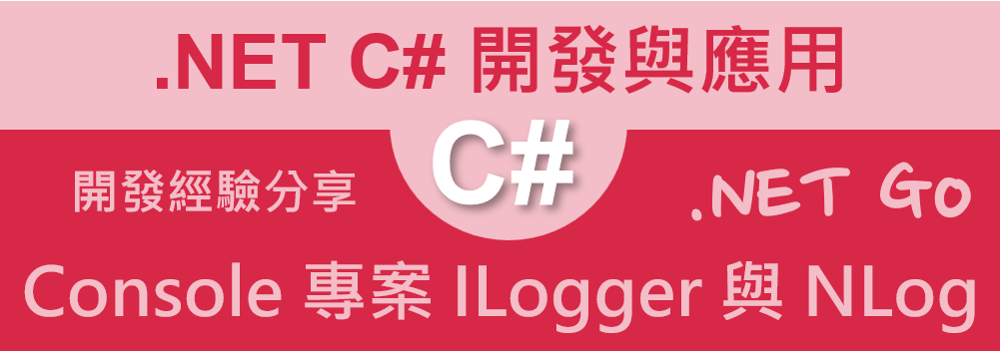

# 在 .NET 7 Console 專案下，搭配 ILogger 介面來使用 與 NLog



在上一篇文章 [.NET C# 第一次 NLog 的使用說明](https://csharpkh.blogspot.com/2023/08/Log-NLog-First-Time.html) 中，說明了當程式設計師想要一個日誌機制這樣功能需求的時候，往往是自己打造輪子，認為沒有人可以寫得比我好，沒想到這僅是讓費更多的時間與成本，並且造成未來程式碼維護上的困擾與難以維護狀況。

## 建立 Console 類型專案

請依照底下的操作，建立起這篇文章需要用到的練習專案

* 打開 Visual Studio 2022 IDE 應用程式
* 從 [Visual Studio 2022] 對話窗中，點選右下方的 [建立新的專案] 按鈕
* 在 [建立新專案] 對話窗右半部
  * 切換 [所有語言 (L)] 下拉選單控制項為 [C#]
  * 切換 [所有專案類型 (T)] 下拉選單控制項為 [主控台]
* 在中間的專案範本清單中，找到並且點選 [主控台應用程式] 專案範本選項
  > 專案，用於建立可在 Windows、Linux 及 macOS 於 .NET 執行的命令列應用程式
* 點選右下角的 [下一步] 按鈕
* 在 [設定新的專案] 對話窗
* 找到 [專案名稱] 欄位，輸入 `csLog03` 作為專案名稱
* 在剛剛輸入的 [專案名稱] 欄位下方，確認沒有勾選 [將解決方案與專案至於相同目錄中] 這個檢查盒控制項
* 點選右下角的 [下一步] 按鈕
* 現在將會看到 [其他資訊] 對話窗
* 在 [架構] 欄位中，請選擇最新的開發框架，這裡選擇的 [架構] 是 : `.NET 7.0 (標準字詞支援)`
* 在這個練習中，需要去勾選 [不要使用最上層陳述式(T)] 這個檢查盒控制項
  > 這裡的這個操作，可以由讀者自行決定是否要勾選這個檢查盒控制項
* 請點選右下角的 [建立] 按鈕

稍微等候一下，這個主控台專案將會建立完成

## 安裝要用到的 NuGet 開發套件

因為開發此專案時會用到這些 NuGet 套件，請依照底下說明，將需要用到的 NuGet 套件安裝起來。

### 安裝 NLog.Extensions.Logging 套件

這個套件將會是 NLog 日誌架構的擴充套件，它提供 NLog 日誌架構的擴充功能。NLog.Extensions.Logging 套件是 NLog 的一個擴展，它允許你使用 Microsoft.Extensions.Logging 的 ILogger 接口來寫日誌。這使得你可以在 .NET Core 應用程序中使用 NLog 而無需直接依賴 NLog 的 NuGet 套件。

從 NuGet 網站中可以查看到 [NLog.Extensions.Logging](https://www.nuget.org/packages/NLog.Extensions.Logging#dependencies-body-tab) 相依性資訊，從底下相依性清單說明中，可以看到這個套件，將會相依於 [NLog] 套件，這表示當使用了 [NLog.Extensions.Logging] 套件後，會自動引用 [NLog] 這個 NuGet 套件

```
.NETFramework 4.6.1
Microsoft.Extensions.Configuration.Abstractions (>= 2.1.0)
Microsoft.Extensions.Logging (>= 2.1.0)
NLog (>= 5.2.3)

.NETStandard 1.3
Microsoft.Extensions.Configuration.Abstractions (>= 1.0.0)
Microsoft.Extensions.Logging.Abstractions (>= 1.0.0)
NETStandard.Library (>= 1.6.0)
NLog (>= 5.2.3)

.NETStandard 1.5
Microsoft.Extensions.Configuration.Abstractions (>= 1.0.0)
Microsoft.Extensions.Logging.Abstractions (>= 1.0.0)
NETStandard.Library (>= 1.6.0)
NLog (>= 5.2.3)

.NETStandard 2.0
Microsoft.Extensions.Configuration.Abstractions (>= 2.1.0)
Microsoft.Extensions.Logging (>= 2.1.0)
NLog (>= 5.2.3)

.NETStandard 2.1
Microsoft.Extensions.Configuration.Abstractions (>= 3.1.0)
Microsoft.Extensions.Logging (>= 3.1.0)
NLog (>= 5.2.3)

net6.0
Microsoft.Extensions.Configuration.Abstractions (>= 6.0.0)
Microsoft.Extensions.Logging (>= 6.0.0)
NLog (>= 5.2.3)
```

在這裡並不需要安裝 NLog.Schema 這個套件，因為，在這個範例中，將會 NLog 設定內容，宣告在應用程式設定 ( appsettings.json ) 檔案內。

* 滑鼠右擊 [方案總管] 視窗內的 [專案節點] 下方的 [相依性] 節點
* 從彈出功能表清單中，點選 [管理 NuGet 套件] 這個功能選項清單
* 此時，將會看到 [NuGet: csLog03] 視窗
* 切換此視窗的標籤頁次到名稱為 [瀏覽] 這個標籤頁次
* 在左上方找到一個搜尋文字輸入盒，在此輸入 `NLog.Extensions.Logging`
* 點選 [NLog.Extensions.Logging] 套件名稱，請選擇作者為 [Microsoft,Julian Verdurmen] 的套件
* 在視窗右方，將會看到該套件詳細說明的內容，其中，右上方有的 [安裝] 按鈕
* 點選這個 [安裝] 按鈕，將這個套件安裝到專案內

  >若沒有發現到 [屬性] 視窗，請在 [Visual Studio] 功能表中，點選 [檢視] > [屬性視窗] 功能選項

### 安裝 Microsoft.Extensions.Configuration 套件

Microsoft.Extensions.Configuration 是 .NET 的一個擴展套件，允許你輕鬆地從各種來源讀取組態設定。它可用於讀取來自檔案、環境變數、命令列參數和其他來源的組態設定。

* 滑鼠右擊 [方案總管] 視窗內的 [專案節點] 下方的 [相依性] 節點
* 從彈出功能表清單中，點選 [管理 NuGet 套件] 這個功能選項清單
* 此時，將會看到 [NuGet: csLog03] 視窗
* 切換此視窗的標籤頁次到名稱為 [瀏覽] 這個標籤頁次
* 在左上方找到一個搜尋文字輸入盒，在此輸入 `Microsoft.Extensions.Configuration`
* 點選 [Microsoft.Extensions.Configuration] 套件名稱，請選擇作者為 [Microsoft] 的套件
* 在視窗右方，將會看到該套件詳細說明的內容，其中，右上方有的 [安裝] 按鈕
* 點選這個 [安裝] 按鈕，將這個套件安裝到專案內

### 安裝 Microsoft.Extensions.DependencyInjection 套件

Microsoft.Extensions.DependencyInjection (DI) 套件是 .NET Core 的一個擴展套件，它提供了一個一致的方法來註冊和解析依賴項。它可以用在任何 .NET Core 應用程序中，無論是 ASP.NET Core 應用程序還是命令列應用程序。

* 滑鼠右擊 [方案總管] 視窗內的 [專案節點] 下方的 [相依性] 節點
* 從彈出功能表清單中，點選 [管理 NuGet 套件] 這個功能選項清單
* 此時，將會看到 [NuGet: csLog03] 視窗
* 切換此視窗的標籤頁次到名稱為 [瀏覽] 這個標籤頁次
* 在左上方找到一個搜尋文字輸入盒，在此輸入 `Microsoft.Extensions.DependencyInjection`
* 點選 [Microsoft.Extensions.DependencyInjection] 套件名稱，請選擇作者為 [Microsoft] 的套件
* 在視窗右方，將會看到該套件詳細說明的內容，其中，右上方有的 [安裝] 按鈕
* 點選這個 [安裝] 按鈕，將這個套件安裝到專案內

## 建立 appsettings.json 設定檔

所謂的 appsettings.json 設定檔，其目的與用途在於：這是一個在 ASP.NET Core 和其他 .NET Core 應用程式中常見的配置檔案。它用於存儲應用程式的配置資訊，如資料庫連接字串、API 金鑰等。因此，可以讓這個程式運作起來更加有彈性，因為可以讓 appsettings.json 檔案內容有所不同，而讓系統運作方式有所不同，在這裡將會透過這個設定檔案來指定 NLog 要記錄的各種日誌過濾條件等設定。

* 滑鼠右擊 [方案總管] 視窗內的 [專案節點]
* 從彈出功能表清單中，點選 [新增項目] 這個功能選項清單
* 此時，將會看到 [新增項目 - csLog03] 視窗
* 在此對話窗右上方的文字輸入盒內，輸入 `json`
* 搜尋出與 json 有關的檔案範本
* 在該對話窗的中間區域，找到並點選 [JSON 檔案]
* 在下方 [名稱] 欄位內，輸入 `appsettings.json` 作為檔案名稱
* 點選右下方 [新增] 按鈕，將這個檔案加入到專案內
* 在 [方案總管] 內找到並且點選 [appsettings.json] 檔案這個節點
* 從 [屬性] 視窗中，將 [複製到輸出目錄] 屬性值改為 [有更新時才複製]，這樣才能讓 [NLog.config] 檔案在執行時，能夠被複製到執行目錄內

  >若沒有發現到 [屬性] 視窗，請在 [Visual Studio] 功能表中，點選 [檢視] > [屬性視窗] 功能選項

* 使用底下的 XML 內容來替換掉這個檔案內的內容

```json
{
  "Logging": {
    "NLog": {
      "IncludeScopes": false,
      "ParseMessageTemplates": true,
      "CaptureMessageProperties": true
    }
  },
  "NLog": {
    "autoreload": true,
    "internalLogLevel": "Info",
    "internalLogFile": "c:/temp/Sample-internal.log",
    "throwConfigExceptions": true,
    "targets": {
      "console": {
        "type": "Console",
        "layout": "${date}|${level:uppercase=true}|${message} ${exception:format=tostring}|${logger}|${all-event-properties}"
      },
      "file": {
        "type": "AsyncWrapper",
        "target": {
          "wrappedFile": {
            "type": "File",
            "fileName": "c:/temp/console-sample.log",
            "layout": {
              "type": "JsonLayout",
              "Attributes": [
                {
                  "name": "timestamp",
                  "layout": "${date:format=o}"
                },
                {
                  "name": "level",
                  "layout": "${level}"
                },
                {
                  "name": "logger",
                  "layout": "${logger}"
                },
                {
                  "name": "message",
                  "layout": "${message:raw=true}"
                },
                {
                  "name": "properties",
                  "encode": false,
                  "layout": {
                    "type": "JsonLayout",
                    "includeallproperties": "true"
                  }
                }
              ]
            }
          }
        }
      }
    },
    "rules": [
      {
        "logger": "*",
        "minLevel": "Trace",
        "writeTo": "File,Console"
      }
    ]
  }
}
```

在這個 [NLog] 節點下的各種內容，就是用來宣告 NLog 的運作行為

## 建立要使用 ILogger & NLog 套件的程式碼

* 在 [方案總管] 內找到並且開啟 [Program.cs] 檔案這個節點
* 使用底下 C# 程式碼，將原本的程式碼取代掉

```csharp
using Microsoft.Extensions.Configuration;
using Microsoft.Extensions.DependencyInjection;
using Microsoft.Extensions.Logging;
using NLog;
using NLog.Extensions.Logging;

namespace csLog03
{
    // 在 .NET Core 專案下，使用 與 NLog
    internal class Program
    {
        static void Main(string[] args)
        {
            // 取得 NLog 的日誌物件
            var logger = LogManager.GetCurrentClassLogger();
            // 建議接下來的程式碼，要捕捉起來，一旦發生例外，就可以寫入到日誌系統內
            try
            {
                // 建立一個設定檔案的建構式
                var config = new ConfigurationBuilder()
                   .SetBasePath(System.IO.Directory.GetCurrentDirectory())
                   .AddJsonFile("appsettings.json", optional: true, reloadOnChange: true)
                   .Build();

                // 建立一個服務容器
                using var servicesProvider = new ServiceCollection()
                    .AddTransient<MyService>() // 註冊一個具有短暫生命週期的服務
                    .AddLogging(loggingBuilder => // 註冊日誌服務
                    {
                        // 清除所有的日誌服務提供者
                        loggingBuilder.ClearProviders();
                        // 設定最低的日誌等級
                        loggingBuilder.SetMinimumLevel(Microsoft.Extensions.Logging.LogLevel.Trace);
                        // 設定日誌服務提供者為 NLog
                        loggingBuilder.AddNLog(config);
                    }).BuildServiceProvider();

                // 取得服務容器內的 MyService 服務物件
                var runner = servicesProvider.GetRequiredService<MyService>();
                // 執行該服務物件的功能，該方法內會寫入一個 Debug 層級的日誌訊息
                runner.MyAction("MyAction引數");

                Console.WriteLine("Press ANY key to exit");
                Console.ReadKey();
            }
            catch (Exception ex)
            {
                // 發生例外時，將例外訊息寫入到日誌系統內
                logger.Error(ex, "因為系統啟動時，發生不明例外異常，系統即將停止運行");
                // 重新拋出例外
                throw;
            }
            finally
            {
                // 將日誌系統內的資料寫入到目的地
                LogManager.Shutdown();
            }
        }
    }

    /// <summary>
    /// 客製服務類別
    /// </summary>
    public class MyService
    {
        /// <summary>
        /// 注入的日誌服務物件
        /// </summary>
        private readonly ILogger<MyService> _logger;

        public MyService(ILogger<MyService> logger)
        {
            _logger = logger;
        }

        /// <summary>
        /// 該服務所提供的功能
        /// </summary>
        /// <param name="name"></param>
        public void MyAction(string name)
        {
            // 將指定的內容寫入到日誌系統內
            _logger.LogDebug(20, "正在進行指派工作處理! {Action}", name);
        }
    }
}
```

* 在上方的程式碼中，有建立一個 [MyService] 類別，這個類別內有一個方法 [MyAction]，這個方法將會模擬一項工作，並會使用 `ILogger<MyServer>` 這個型別物件，將 [Debug] 分類的日誌訊息寫入到日誌系統
* 為了要能夠使用 `ILogger<MyServer>` 這個物件，在此使用了 [建構式注入] 設計模式，在這個 [MyService] 類別內，建立一個建構函式，其中，該建構函式將會有個 `ILogger<MyServer>` 參數，這表示當相依性注入容器要注入一個 MyServer 類別的時候，需要去解析與生成出 `ILogger<MyServer>` 這個物件，並且傳入到 [MyService] 建構式函數內。
* 完成了需要呼叫與注入的類別，現在要來看看這個程式進入點程式碼
* 首先，將會透過 LogManager.GetCurrentClassLogger() 方法來讀取一個 NLog 物件，並且設定給 logger 這個變數
* 建立一個 [ConfigurationBuilder] 物件，這將會用來讀取這個程式設定檔案，也就是 [appsettings.json]
* 接著建立 [ServiceCollection] 物件，這個物件將會用來建立相依性注入容器，而在這個容器中，也會宣告剛剛設計的 [MyService] 類別服務，其生命週期宣告為短暫的 Transient；最後將會使用 [AddLogging] 這個方法，設定日誌服務的提供者為 NLog 這個物件
* 接著，使用 [BuildServiceProvider] 方法，將這個容器建立起來，並且將這個容器物件設定給 [servicesProvider] 這個變數
* 接著，使用 [GetRequiredService] 方法，從 [servicesProvider] 這個容器物件內，取得 [MyService] 這個服務物件，並且設定給 [runner] 這個變數
* 接著，呼叫 [runner] 這個物件的 [MyAction] 方法，並且傳入一個字串參數
* 由於透過相依性注入容器注入了 [MyService] 這個物件，因此，其相依的 ILogger 物件，也會透過相依性注入容器取得
* 因此，再呼叫了 [MyAction] 這個方法之後，將會有個訊息寫入到 NLog 日誌服務內

## 執行程式，觀察結果

這裡將會是執行這個程式後的結果

```
2023/09/07 13:34:56.070|DEBUG|正在進行指派工作處理! "MyAction引數" |csLog03.MyService|Action=MyAction引數, EventId=20
```


