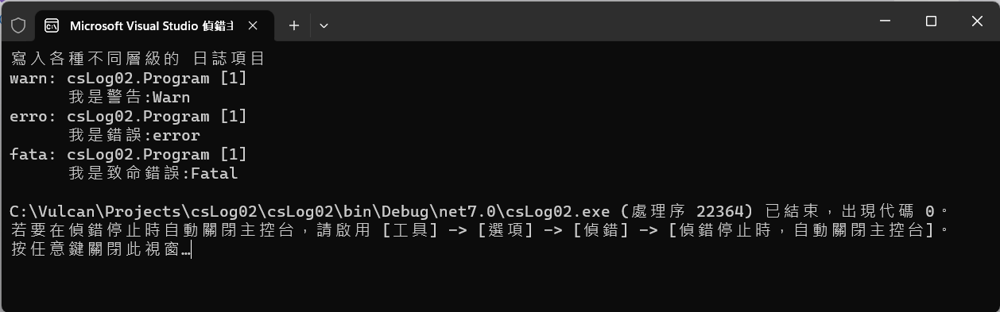
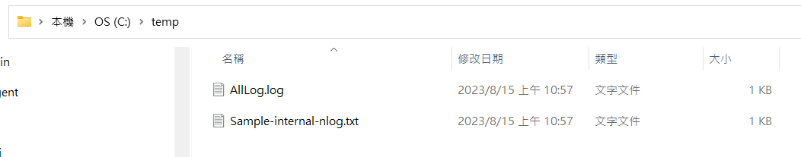

# .NET C# 第一次 NLog 的使用說明


在上一篇文章 [探討在沒有使用任何一種 Log 套件下，想要做到系統活動的設計做法](https://csharpkh.blogspot.com/2023/08/csharp-Log-common-record-system-activity-message.html) 中，說明了當程式設計師想要一個日誌機制這樣功能需求的時候，往往是自己打造輪子，認為沒有人可以寫得比我好，沒想到這僅是讓費更多的時間與成本，並且造成未來程式碼維護上的困擾與難以維護狀況。

從這篇文章開始，將會是一系列探討 NLog 這個套件使用方式的文章，NLog 是一個強大的日誌架構，可用於 .NET 應用程式。它提供多種功能，包括日誌級別、日誌格式和日誌目的地。NLog.Schema 套件可用於在 NLog 日誌配置中使用 XML 語法，這使其更易於使用和維護。

雖然 NLog 存在已經有段時間了，不過，這個套件內存在著許多令人驚豔與值得探索的價值，因此，就先以一個小白的身分，對於從未摸過 NLog 的程式設計師，說明如何入門使用 NLog 這個套件與如何利用它來完成日誌記錄功能。

## 建立自行發明的寫入日誌之類別服務的測試專案

請依照底下的操作，建立起這篇文章需要用到的練習專案

* 打開 Visual Studio 2022 IDE 應用程式
* 從 [Visual Studio 2022] 對話窗中，點選右下方的 [建立新的專案] 按鈕
* 在 [建立新專案] 對話窗右半部
  * 切換 [所有語言 (L)] 下拉選單控制項為 [C#]
  * 切換 [所有專案類型 (T)] 下拉選單控制項為 [主控台]
* 在中間的專案範本清單中，找到並且點選 [主控台應用程式] 專案範本選項
  > 專案，用於建立可在 Windows、Linux 及 macOS 於 .NET 執行的命令列應用程式
* 點選右下角的 [下一步] 按鈕
* 在 [設定新的專案] 對話窗
* 找到 [專案名稱] 欄位，輸入 `csLog02` 作為專案名稱
* 在剛剛輸入的 [專案名稱] 欄位下方，確認沒有勾選 [將解決方案與專案至於相同目錄中] 這個檢查盒控制項
* 點選右下角的 [下一步] 按鈕
* 現在將會看到 [其他資訊] 對話窗
* 在 [架構] 欄位中，請選擇最新的開發框架，這裡選擇的 [架構] 是 : `.NET 7.0 (標準字詞支援)`
* 在這個練習中，需要去勾選 [不要使用最上層陳述式(T)] 這個檢查盒控制項
  > 這裡的這個操作，可以由讀者自行決定是否要勾選這個檢查盒控制項
* 請點選右下角的 [建立] 按鈕

稍微等候一下，這個主控台專案將會建立完成

## 安裝要用到的 NuGet 開發套件

因為開發此專案時會用到這些 NuGet 套件，請依照底下說明，將需要用到的 NuGet 套件安裝起來。

### 安裝 NLog 套件

這個套件將會是 NLog 日誌架構的核心套件，它提供 NLog 日誌架構的核心功能。

* 滑鼠右擊 [方案總管] 視窗內的 [專案節點] 下方的 [相依性] 節點
* 從彈出功能表清單中，點選 [管理 NuGet 套件] 這個功能選項清單
* 此時，將會看到 [NuGet: csLog02] 視窗
* 切換此視窗的標籤頁次到名稱為 [瀏覽] 這個標籤頁次
* 在左上方找到一個搜尋文字輸入盒，在此輸入 `NLog`
* 點選 [NLog] 套件名稱，請選擇作者為 [Jarek Kowalski,Kim Christensen,Julian Verdurmen] 的套件
* 在視窗右方，將會看到該套件詳細說明的內容，其中，右上方有的 [安裝] 按鈕
* 點選這個 [安裝] 按鈕，將這個套件安裝到專案內

### 安裝 NLog.Schema 套件

NLog.Schema 是一個 .NET NuGet 套件，它提供 NLog 日誌架構的 XML 定義。此定義可用於在 NLog 日誌配置中使用 XML 語法。

* 滑鼠右擊 [方案總管] 視窗內的 [專案節點] 下方的 [相依性] 節點
* 從彈出功能表清單中，點選 [管理 NuGet 套件] 這個功能選項清單
* 此時，將會看到 [NuGet: csLog02] 視窗
* 切換此視窗的標籤頁次到名稱為 [瀏覽] 這個標籤頁次
* 在左上方找到一個搜尋文字輸入盒，在此輸入 `NLog.Schema`
* 點選 [NLog.Schema] 套件名稱，請選擇作者為 [Jarek Kowalski,Kim Christensen,Julian Verdurmen] 的套件
* 在視窗右方，將會看到該套件詳細說明的內容，其中，右上方有的 [安裝] 按鈕
* 點選這個 [安裝] 按鈕，將這個套件安裝到專案內
* 此時，從方案總管視窗內，將會看到有個 [NLog.xsd] 檔案，這個檔案是 NLog.Schema 套件安裝後，自動產生的檔案
* 在 [方案總管] 內找到並且點選 [NLog.xsd] 檔案這個節點
* 從 [屬性] 視窗中，將 [複製到輸出目錄] 屬性值改為 [有更新時才複製]，這樣才能讓 [NLog.xsd] 檔案在執行時，能夠被複製到執行目錄內

  >若沒有發現到 [屬性] 視窗，請在 [Visual Studio] 功能表中，點選 [檢視] > [屬性視窗] 功能選項

## 建立 NLog.config 設定檔

* 滑鼠右擊 [方案總管] 視窗內的 [專案節點]
* 從彈出功能表清單中，點選 [新增項目] 這個功能選項清單
* 此時，將會看到 [新增項目 - csLog02] 視窗
* 在左方的清單選項中，點選 [已安裝] > [C# 項目] > [資料] 節點
* 在該對話窗的中間區域，找到並點選 [XML 檔案]
* 在下方 [名稱] 欄位內，輸入 `NLog.config` 作為檔案名稱
* 點選右下方 [新增] 按鈕，將這個檔案加入到專案內
* 在 [方案總管] 內找到並且點選 [NLog.config] 檔案這個節點
* 從 [屬性] 視窗中，將 [複製到輸出目錄] 屬性值改為 [有更新時才複製]，這樣才能讓 [NLog.config] 檔案在執行時，能夠被複製到執行目錄內

  >若沒有發現到 [屬性] 視窗，請在 [Visual Studio] 功能表中，點選 [檢視] > [屬性視窗] 功能選項

* 使用底下的 XML 內容來替換掉這個檔案內的內容

```xml
<?xml version="1.0" encoding="utf-8" ?>
<nlog xmlns="http://www.nlog-project.org/schemas/NLog.xsd"
      xmlns:xsi="http://www.w3.org/2001/XMLSchema-instance"
	  autoReload="true"
	  throwConfigExceptions="true"
	  internalLogLevel="Info"
	  internalLogFile="c:\temp\Sample-internal-nlog.txt"
	  >

	<!-- 在這裡宣告要用到的 Target 項目 -->
	<targets>
		<!-- 宣告 File 目標，將會把 Log 內容寫入到檔案內 -->
		<!--更多 Layout Renderer 變數，可以參考 https://nlog-project.org/config/?tab=layout-renderers-->
		<!--https://github.com/NLog/NLog/wiki/Layouts-->
		<target xsi:type="File" name="allfile" 
				fileName="c:\temp\AllLog.log"
				layout="${longdate}|${uppercase:${level}}|${logger}|[${threadname:whenEmpty=${threadid}}]|${message} ${exception:format=type,message,method:maxInnerExceptionLevel=5:innerFormat=shortType,message,method}"
				/>

		<!--宣告 Console 目標，將會把 Log 內容寫入到 命令提示字元視窗內 -->
		<target xsi:type="Console" name="lifetimeConsole"
				layout="${level:truncate=4:lowercase=true}: ${logger} [${threadname:whenEmpty=${threadid}}]${newline}      ${message}${exception:format=tostring}"
		        />
	</targets>

	<rules>

		<!--紀錄剩下其他的日誌項目 (視為黑洞)-->
		<logger name="*" minlevel="Warn"
				writeTo="lifetimeConsole,allfile" />
	</rules>
</nlog>
```

### NLog.config 設定檔的說明

在 NLog.config 設定檔內，有幾個重要的屬性，這些屬性可以控制 NLog 的行為

* `autoReload` : 指定是否要自動重新載入 NLog 設定檔
* `throwConfigExceptions` : 指定是否要在 NLog 設定檔內發生錯誤時，拋出例外
* `internalLogLevel` : 指定 NLog 內部的日誌級別
* `internalLogFile` : 指定 NLog 內部的日誌檔案名稱

在 targets 節點內，宣告了兩個 Target 項目，分別是 `allfile` 和 `lifetimeConsole`，這兩個 Target 項目都是用來寫入日誌內容的目標。

對於 `allfile` 這個目標，它會將日誌內容寫入到 `c:\temp\AllLog.log` 這個檔案內，並且使用 `${longdate}|${uppercase:${level}}|${logger}|[${threadname:whenEmpty=${threadid}}]|${message} ${exception:format=type,message,method:maxInnerExceptionLevel=5:innerFormat=shortType,message,method}` 這個格式來寫入日誌內容。

其格式為 : [日期和時間] | [日誌級別] | [日誌來源] | [執行緒名稱] | [訊息] | [例外]

對於 `lifetimeConsole` 這個目標，它會將日誌內容寫入到命令提示字元視窗內，並且使用 `${level:truncate=4:lowercase=true}: ${logger} [${threadname:whenEmpty=${threadid}}]${newline}      ${message}${exception:format=tostring}` 這個格式來寫入日誌內容。

其格式為 : [日誌級別] | [日誌來源] | [執行緒名稱] | [訊息] | [例外]

透過這兩個目標，可以了解到如何宣告 NLog.config 設定檔案，讓 NLog 系統將日誌內容寫入到檔案內和命令提示字元視窗內。

而在 rules 節點內，宣告了一個 logger 項目，這個項目的名稱為 `*`，這個名稱代表所有的日誌來源，而這個項目的 minlevel 屬性值為 `Warn`，這個屬性值代表只有日誌級別為 `Warn` 以上的日誌才會被寫入到 `allfile` 和 `lifetimeConsole` 這兩個目標內。


而在 rules 節點內
* 這個 rule 元素會將所有日誌訊息寫入 lifetimeConsole 和 allfile 目標。
* logger name="*" minlevel="Warn" 部分，會將所有日誌訊息寫入，只要它們的級別至少為警告 (Warn)。
* writeTo="lifetimeConsole,allfile" 部分，會將日誌訊息寫入 lifetimeConsole 和 allfile 目標。
* lifetimeConsole 目標會將日誌訊息寫入命令提示字元視窗。
* allfile 目標會將日誌訊息寫入檔案 c:\temp\AllLog.log。
* 您可以使用 minlevel 元素來指定日誌訊息的最低級別。日誌訊息只有在其級別至少為指定的級別時才會被寫入目標。
* 您可以使用 writeTo 元素來指定日誌訊息要寫入的目標。您可以指定一個或多個目標。
* 您可以使用 layout 元素來自訂日誌訊息的格式。

## 建立要使用 NLog 套件的程式碼

* 在 [方案總管] 內找到並且開啟 [Program.cs] 檔案這個節點
* 使用底下 C# 程式碼，將原本的程式碼取代掉

```csharp
using NLog;

namespace csLog02
{
    internal class Program
    {
        // 取得當前執行這個方法的類別對應的 Logger 物件
        public static Logger logger =
            LogManager.GetCurrentClassLogger();
        static void Main(string[] args)
        {
            // 請觀察 Console & Log File 所寫入的內容為何?
            Console.WriteLine($"寫入各種不同層級的 日誌項目");

            logger.Trace("我是追蹤:Trace");
            logger.Debug("我是偵錯:Debug");
            logger.Info("我是資訊:Info");
            logger.Warn("我是警告:Warn");
            logger.Error("我是錯誤:error");
            logger.Fatal("我是致命錯誤:Fatal");
        }
    }
}
```

* 在這個程式碼中，首先建立一個型別為 [Logger] 的靜態變數 [logger]，這個變數是用來記錄 NLog 系統的 Logger 物件
* 而在 [Main] 程式進入點方法內，將會依序呼叫 [logger] 這個物件的 [Trace] , [Debug] , [Info] , [Warn] , [Error] , [Fatal] 這六個方法，來寫入不同級別的日誌內容
* 觀察這樣的使用方式，比對 [探討在沒有使用任何一種 Log 套件下，想要做到系統活動的設計做法](https://csharpkh.blogspot.com/2023/08/csharp-Log-common-record-system-activity-message.html) 文章內的作法，將會有天壤之別，因為，使用了類似 [NLog] 這樣的套件之後，讓整個應用程式變得更加簡單、清爽
* 若想要指定不同日誌層級要寫入到指定目標內，僅需要修正 [NLog.config] 檔案即可，而在自行設計的程式碼中，也僅需要根據當時執行情況，寫入指定層級的日誌內容即可
* 因此，之前提到的問題，都已經迎刃而解了。

## 執行程式，觀察結果

請先確認這台電腦上在 C:\ 根目錄下，有一個 temp 資料夾，以便可以讓 NLog 系統寫入相關 Log 資訊。

* 按下 `F5` 鍵，開始執行這個程式
* 請觀察 Console 視窗內的內容

  

```
warn: csLog02.Program [1]
      我是警告:Warn
erro: csLog02.Program [1]
      我是錯誤:error
fata: csLog02.Program [1]
      我是致命錯誤:Fatal
```

從執行後的螢幕輸出內容，可以看到 NLog 系統已經將日誌內容寫入到命令提示字元視窗內；並且僅有 [warn] , [error] , [fata] 這三個日誌級別的日誌內容被寫入到命令提示字元視窗內，這樣的結果是符合 NLog.config 設定檔內的規則。

* 請觀察 C:\temp 目錄下，應該有兩個檔案，分別是 [AllLog.log] 和 [Sample-internal-nlog.txt] 這兩個檔案

  

* 請使用記事本開啟 [Sample-internal-nlog.txt] 檔案，應該可以看到底下的內容

```
2023-08-15 10:57:18.7570 Info Registered target NLog.Targets.FileTarget(Name=allfile)
2023-08-15 10:57:18.7711 Info Registered target NLog.Targets.ConsoleTarget(Name=lifetimeConsole)
2023-08-15 10:57:18.7853 Info NLog, Version=5.0.0.0, Culture=neutral, PublicKeyToken=5120e14c03d0593c. File version: 5.2.3.1999. Product version: 5.2.3+a5ddef92a8afb22508450803e37c001f4a3ba52a. GlobalAssemblyCache: False
2023-08-15 10:57:18.8079 Info Validating config: TargetNames=lifetimeConsole, allfile, ConfigItems=40, FilePath=C:\Vulcan\Projects\csLog02\csLog02\bin\Debug\net7.0\NLog.config
2023-08-15 10:57:18.8180 Info Configuration initialized.
2023-08-15 10:57:18.8481 Info AppDomain Shutting down. LogFactory closing...
2023-08-15 10:57:18.8696 Info LogFactory has been closed.
```

* 請使用記事本開啟 [AllLog.log] 檔案，應該可以看到底下的內容

```
2023-08-15 10:57:18.8180|WARN|csLog02.Program|[1]|我是警告:Warn 
2023-08-15 10:57:18.8481|ERROR|csLog02.Program|[1]|我是錯誤:error 
2023-08-15 10:57:18.8481|FATAL|csLog02.Program|[1]|我是致命錯誤:Fatal 
```


