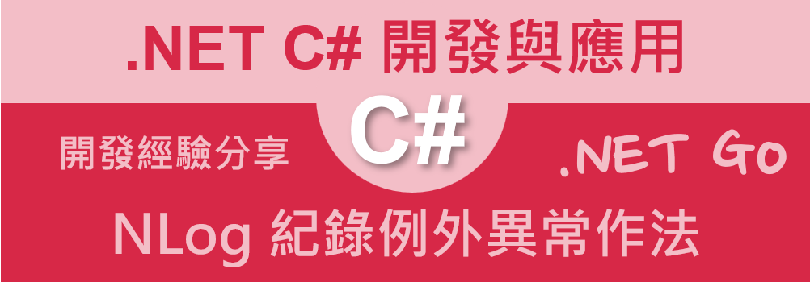

# 使用 NLog 已經 catch 到例外異常，並且記錄下來



在進行軟體專案開發過程或者實際上線執行的時候，當程式發生例外異常的時候，這時候，就需要將這些例外異常的訊息記錄下來，這樣的做法，將會有助於之後的問題排除與追蹤，這時候，就需要使用到日誌系統，這裡將會介紹如何使用 NLog 這個日誌套件，來記錄下這些例外異常的訊息。

這些例外異常有些是可以預期到的，有些是無法預期的，不論是屬於哪一種，原則上應該都要能夠將這些例外異常的訊息記錄下來，這些訊息內容應該包含著當時發生例外異常的原因，呼叫堆疊 call stack 訊息，是否有內部 inner 例外異常或者是組合例外異常訊息。

對於例外異常物件，則是會有單一異常的物件、一或多個錯誤 [AggregateException](https://learn.microsoft.com/zh-tw/dotnet/api/system.aggregateexception?WT.mc_id=DT-MVP-5002220)、內部例外異常 [InnerException](https://learn.microsoft.com/zh-tw/dotnet/api/system.exception.innerexception?WT.mc_id=DT-MVP-5002220) 類型，當例外異常發生的後，需要能夠將這三種例外異常物件的內容，寫入到日誌系統內，以便日後可以根據這些內容來進行分析與除錯。

因此，在這篇文章中，將會針對這些同步或者非同步呼叫過程中造成有例外異常問題發生的時候，捕捉到這些例外異常物件，並且使用 LogError 方法來寫入到日誌記錄內，接著，來觀察寫入的內容為何，是否可以幫助於運作系統的除錯。

## 建立測試專案

請依照底下的操作，建立起這篇文章需要用到的練習專案

* 打開 Visual Studio 2022 IDE 應用程式
* 從 [Visual Studio 2022] 對話窗中，點選右下方的 [建立新的專案] 按鈕
* 在 [建立新專案] 對話窗右半部
  * 切換 [所有語言 (L)] 下拉選單控制項為 [C#]
  * 切換 [所有專案類型 (T)] 下拉選單控制項為 [主控台]
* 在中間的專案範本清單中，找到並且點選 [主控台應用程式] 專案範本選項
  > 專案，用於建立可在 Windows、Linux 及 macOS 於 .NET 執行的命令列應用程式
* 點選右下角的 [下一步] 按鈕
* 在 [設定新的專案] 對話窗
* 找到 [專案名稱] 欄位，輸入 `csLog17` 作為專案名稱
* 在剛剛輸入的 [專案名稱] 欄位下方，確認沒有勾選 [將解決方案與專案至於相同目錄中] 這個檢查盒控制項
* 點選右下角的 [下一步] 按鈕
* 現在將會看到 [其他資訊] 對話窗
* 在 [架構] 欄位中，請選擇最新的開發框架，這裡選擇的 [架構] 是 : `.NET 7.0 (標準字詞支援)`
* 在這個練習中，需要去勾選 [不要使用最上層陳述式(T)] 這個檢查盒控制項
  > 這裡的這個操作，可以由讀者自行決定是否要勾選這個檢查盒控制項
* 請點選右下角的 [建立] 按鈕

稍微等候一下，這個主控台專案將會建立完成

## 安裝要用到的 NuGet 開發套件

因為開發此專案時會用到這些 NuGet 套件，請依照底下說明，將需要用到的 NuGet 套件安裝起來。

### 安裝 NLog.Extensions.Logging 套件

這個套件將會是 NLog 日誌架構的擴充套件，它提供 NLog 日誌架構的擴充功能。NLog.Extensions.Logging 套件是 NLog 的一個擴展，它允許你使用 Microsoft.Extensions.Logging 的 ILogger 接口來寫日誌。這使得你可以在 .NET Core 應用程序中使用 NLog 而無需直接依賴 NLog 的 NuGet 套件。

在這裡並不需要安裝 NLog.Schema 這個套件，因為，在這個範例中，將會 NLog 設定內容，宣告在應用程式設定 ( appsettings.json ) 檔案內。

* 滑鼠右擊 [方案總管] 視窗內的 [專案節點] 下方的 [相依性] 節點
* 從彈出功能表清單中，點選 [管理 NuGet 套件] 這個功能選項清單
* 此時，將會看到 [NuGet: csLog03] 視窗
* 切換此視窗的標籤頁次到名稱為 [瀏覽] 這個標籤頁次
* 在左上方找到一個搜尋文字輸入盒，在此輸入 `NLog.Extensions.Logging`
* 點選 [NLog.Extensions.Logging] 套件名稱，請選擇作者為 [Microsoft,Julian Verdurmen] 的套件
* 在視窗右方，將會看到該套件詳細說明的內容，其中，右上方有的 [安裝] 按鈕
* 點選這個 [安裝] 按鈕，將這個套件安裝到專案內

  >若沒有發現到 [屬性] 視窗，請在 [Visual Studio] 功能表中，點選 [檢視] > [屬性視窗] 功能選項

### 安裝 Microsoft.Extensions.Configuration 套件

Microsoft.Extensions.Configuration 是 .NET 的一個擴展套件，允許你輕鬆地從各種來源讀取組態設定。它可用於讀取來自檔案、環境變數、命令列參數和其他來源的組態設定。

* 滑鼠右擊 [方案總管] 視窗內的 [專案節點] 下方的 [相依性] 節點
* 從彈出功能表清單中，點選 [管理 NuGet 套件] 這個功能選項清單
* 此時，將會看到 [NuGet: csLog03] 視窗
* 切換此視窗的標籤頁次到名稱為 [瀏覽] 這個標籤頁次
* 在左上方找到一個搜尋文字輸入盒，在此輸入 `Microsoft.Extensions.Configuration`
* 點選 [Microsoft.Extensions.Configuration] 套件名稱，請選擇作者為 [Microsoft] 的套件
* 在視窗右方，將會看到該套件詳細說明的內容，其中，右上方有的 [安裝] 按鈕
* 點選這個 [安裝] 按鈕，將這個套件安裝到專案內

### 安裝 Microsoft.Extensions.DependencyInjection 套件

Microsoft.Extensions.DependencyInjection (DI) 套件是 .NET Core 的一個擴展套件，它提供了一個一致的方法來註冊和解析依賴項。它可以用在任何 .NET Core 應用程序中，無論是 ASP.NET Core 應用程序還是命令列應用程序。

* 滑鼠右擊 [方案總管] 視窗內的 [專案節點] 下方的 [相依性] 節點
* 從彈出功能表清單中，點選 [管理 NuGet 套件] 這個功能選項清單
* 此時，將會看到 [NuGet: csLog03] 視窗
* 切換此視窗的標籤頁次到名稱為 [瀏覽] 這個標籤頁次
* 在左上方找到一個搜尋文字輸入盒，在此輸入 `Microsoft.Extensions.DependencyInjection`
* 點選 [Microsoft.Extensions.DependencyInjection] 套件名稱，請選擇作者為 [Microsoft] 的套件
* 在視窗右方，將會看到該套件詳細說明的內容，其中，右上方有的 [安裝] 按鈕
* 點選這個 [安裝] 按鈕，將這個套件安裝到專案內

## 建立 appsettings.json 設定檔

所謂的 appsettings.json 設定檔，其目的與用途在於：這是一個在 ASP.NET Core 和其他 .NET Core 應用程式中常見的配置檔案。它用於存儲應用程式的配置資訊，如資料庫連接字串、API 金鑰等。因此，可以讓這個程式運作起來更加有彈性，因為可以讓 appsettings.json 檔案內容有所不同，而讓系統運作方式有所不同，在這裡將會透過這個設定檔案來指定 NLog 要記錄的各種日誌過濾條件等設定。

* 滑鼠右擊 [方案總管] 視窗內的 [專案節點]
* 從彈出功能表清單中，點選 [新增項目] 這個功能選項清單
* 此時，將會看到 [新增項目 - csLog03] 視窗
* 在此對話窗右上方的文字輸入盒內，輸入 `json`
* 搜尋出與 json 有關的檔案範本
* 在該對話窗的中間區域，找到並點選 [JSON 檔案]
* 在下方 [名稱] 欄位內，輸入 `appsettings.json` 作為檔案名稱
* 點選右下方 [新增] 按鈕，將這個檔案加入到專案內
* 在 [方案總管] 內找到並且點選 [appsettings.json] 檔案這個節點
* 從 [屬性] 視窗中，將 [複製到輸出目錄] 屬性值改為 [有更新時才複製]，這樣才能讓 [NLog.config] 檔案在執行時，能夠被複製到執行目錄內

  >若沒有發現到 [屬性] 視窗，請在 [Visual Studio] 功能表中，點選 [檢視] > [屬性視窗] 功能選項

* 使用底下的 XML 內容來替換掉這個檔案內的內容

```json
{
  "Logging": {
    "NLog": {
      "IncludeScopes": false,
      "ParseMessageTemplates": true,
      "CaptureMessageProperties": true
    }
  },
  "NLog": {
    "autoreload": true,
    "internalLogLevel": "Info",
    "internalLogFile": "c:/temp/Sample-internal.log",
    "throwConfigExceptions": true,
    "targets": {
      "logconsole": {
        "type": "Console",
        "layout": "${date}|${level:uppercase=true}|${message} ${exception:format=tostring}|${logger}|${all-event-properties}"
      },
      "logfile": {
        "type": "AsyncWrapper",
        "target": {
          "wrappedFile": {
            "type": "File",
            "fileName": "c:/temp/console-sample.log",
            "layout": {
              "type": "JsonLayout",
              "Attributes": [
                {
                  "name": "timestamp",
                  "layout": "${date:format=o}"
                },
                {
                  "name": "level",
                  "layout": "${level}"
                },
                {
                  "name": "logger",
                  "layout": "${logger}"
                },
                {
                  "name": "message",
                  "layout": "${message:raw=true}"
                },
                {
                  "name": "properties",
                  "encode": false,
                  "layout": {
                    "type": "JsonLayout",
                    "includeallproperties": "true"
                  }
                }
              ]
            }
          }
        }
      }
    },
    "rules": [
      {
        "logger": "*",
        "minLevel": "Trace",
        "writeTo": "logfile,logconsole"
      }
    ]
  }
}
```

## 修正程式碼 

* 在專案中找到與打開 [Program.cs] 這個檔案
* 使用底下 C# 程式碼取代原始的程式碼

```csharp
using Microsoft.Extensions.Configuration;
using Microsoft.Extensions.DependencyInjection;
using Microsoft.Extensions.Logging;
using NLog;
using NLog.Extensions.Logging;

namespace csLog17;

// 當應用程式拋出例外異常，如何進行日誌紀錄寫入
internal class Program
{
    static async Task Main(string[] args)
    {
        // 取得 NLog 的日誌物件
        var logger = LogManager.GetCurrentClassLogger();
        // 建議接下來的程式碼，要捕捉起來，一旦發生例外，就可以寫入到日誌系統內
        try
        {
            // 建立一個設定檔案的建構式
            var config = new ConfigurationBuilder()
               .SetBasePath(System.IO.Directory.GetCurrentDirectory())
               .AddJsonFile("appsettings.json", optional: true, reloadOnChange: true)
               .Build();

            // 建立一個服務容器
            using var servicesProvider = new ServiceCollection()
                .AddTransient<MyService>() // 註冊一個具有短暫生命週期的服務
                .AddLogging(loggingBuilder => // 註冊日誌服務
                {
                    // 清除所有的日誌服務提供者
                    loggingBuilder.ClearProviders();
                    // 設定最低的日誌等級
                    loggingBuilder.SetMinimumLevel(Microsoft.Extensions.Logging.LogLevel.Trace);
                    // 設定日誌服務提供者為 NLog
                    loggingBuilder.AddNLog(config);
                }).BuildServiceProvider();

            // 取得服務容器內的 MyService 服務物件
            var runner = servicesProvider.GetRequiredService<MyService>();
            // 執行該服務物件的功能，該方法內會寫入一個 Debug 層級的日誌訊息
           await runner.MyAction("MyAction引數");

            Console.WriteLine("Press ANY key to exit");
            Console.ReadKey();
        }
        catch (Exception ex)
        {
            // 發生例外時，將例外訊息寫入到日誌系統內
            logger.Error(ex, "因為系統啟動時，發生不明例外異常，系統即將停止運行");
            // 重新拋出例外
            throw;
        }
        finally
        {
            // 將日誌系統內的資料寫入到目的地
            LogManager.Shutdown();
        }
    }
}

/// <summary>
/// 客製服務類別
/// </summary>
public class MyService
{
    /// <summary>
    /// 注入的日誌服務物件
    /// </summary>
    private readonly ILogger<MyService> logger;

    public MyService(ILogger<MyService> logger)
    {
        this.logger = logger;
    }

    /// <summary>
    /// 該服務所提供的功能
    /// </summary>
    /// <param name="name"></param>
    public async Task MyAction(string name)
    {
        // 將指定的內容寫入到日誌系統內
        logger.LogDebug(20, "正在進行指派工作處理! {Action}", name);
        logger.LogTrace("-------------------------\n\n\n");
        try
        {
            // 這裡模擬在一個方法內，故意拋出一個例外異常
            throw new NullReferenceException("測試用，強制拋出例外異常");
        }
        catch (Exception ex)
        {
            // 將例外異常寫入到日誌系統內
            logger.LogError(ex, "已經捕捉到例外異常(Error)");
            logger.LogTrace("-------------------------\n\n\n");

            logger.LogCritical(ex, "已經捕捉到例外異常(Critical)");
            logger.LogTrace("-------------------------\n\n\n");
        }

        // 模擬聚合例外異常
        AggregationException();

        // 模擬內部例外異常
        InnerException();

        // 模擬非同步方法
        await MyAwaitAsync();

    }

    /// <summary>
    /// 模擬非同步方法
    /// </summary>
    public async Task MyAwaitAsync()
    {
        await Task.Run(() =>
        {
            logger.LogDebug(20, "正在進行指派工作處理! {Action}", "MyAwaitAsync");
            // 這裡模擬在一個非同步方法內，故意拋出一個例外異常
            throw new ArgumentException("測試用，強制拋出例外異常");
        });
    }

    /// <summary>
    /// 模擬聚合例外異常
    /// </summary>
    /// <exception cref="Exception"></exception>
    public void AggregationException()
    {
        // 建立兩個會擲回例外狀況的工作
        Task task1 = Task.Run(() =>
        {
            throw new Exception("This is task 1 exception");
        });
        Task task2 = Task.Run(() =>
        {
            throw new Exception("This is task 2 exception");
        });
        Task task3 = Task.Run(() =>
        {
            Thread.Sleep(1000);
        });

        // 使用 Task.WaitAll 方法等待兩個工作完成
        try
        {
            Task.WaitAll(task1, task2, task3);
        }
        catch (AggregateException ex)
        {
            logger.LogError(ex, "已經捕捉到 AggregateException 例外異常(Error)");
            // 處理 Aggregation Exception 例外狀況
            //foreach (Exception innerException in ex.InnerExceptions)
            //{
            //    Console.WriteLine(innerException.Message);
            //}
            logger.LogTrace("-------------------------\n\n\n");
        }
    }

    /// <summary>
    /// 模擬內部例外異常
    /// </summary>
    public void InnerException()
    {
        try
        {
            try
            {
                // 產生一個外層異常
                throw new Exception("外層異常");
            }
            catch (Exception ex)
            {
                // 產生一個內層異常
                throw new Exception("內層異常", ex);
            }
        }
        catch (Exception ex)
        {
            logger.LogError(ex, "已經捕捉到 InnerException 例外異常(Error)");
            logger.LogTrace("-------------------------\n\n\n");
        }
    }
}
```

從上面的程式碼中，將會有兩個類別存在，分別是 Main 方法，這是此專案程式的進入點，另外一個是 MyService 類別，這個類別將會用於建立許多方法，分別會產生出不同的例外異常出來，並且嘗試捕捉到這些例外異常物件，接著可以將這些例外異常訊息寫入到日誌輸出內。

在程式進入點類別中，首先使用 LogManager.GetCurrentClassLogger() 方法來取得取得 NLog 的日誌物件，接著，建立一個設定檔案物件，這裡將會使用到 .NET Core 內建的 [ConfigurationBuilder()] 建構式來做到，一旦取得這個設定檔案物件之後，將會使用 [SetBasePath] 方法來設定設定檔案的主要目錄位置，接著使用 [AddJsonFile] 來指定要使用 [appsettings.json] 作為設定檔案的來源，最後使用 [Build] 方法來產生出具有 Key / Value 的物件出來。

接下來要來建立相依性注入容器，並且宣告各種服務並且註冊到相依性服務容器內，因此，這裡將會使用 [ServiceCollection](https://learn.microsoft.com/zh-tw/dotnet/api/microsoft.extensions.dependencyinjection.servicecollection?WT.mc_id=DT-MVP-5002220) 類別做到這樣的目的。

一旦建立此物件之後，將會
* 呼叫 [AddTransient] 方法，註冊 [MyService] 這個類別到相依性服務容器內
* 呼叫 [AddLogging] 方法，註冊日誌服務到相依性服務容器內
  * 呼叫 [ClearProviders] 方法，清除所有的日誌服務提供者
  * 呼叫 [SetMinimumLevel] 方法，設定最低的日誌等級
  * 呼叫 [AddNLog] 方法，設定日誌服務提供者為 NLog，並且該 NLog 的設定檔案，將會使用剛剛建立的設定檔案物件來取得

現在在這個程式中已經具有了 DI Container 相依性注入容器，因此，便可以開始使用這個容器來取得需要的服務物件，這裡將會使用 [GetRequiredService] 方法來取得 [MyService] 這個服務物件，接著，呼叫 [MyAction] 方法，這個方法內將會模擬出各種例外異常，並且嘗試捕捉到這些例外異常物件，接著可以將這些例外異常訊息寫入到日誌輸出內。

這裡使用了 [await runner.MyAction("MyAction引數");] 敘述來開始執行相關程式碼。

在整個程式進入點的 Main 方法內，絕大部分的程式碼都有被 try ... catch 起來，因此，只要發生例外異常，就會被 catch 起來，接著，將會呼叫 [logger.Error(ex, "因為系統啟動時，發生不明例外異常，系統即將停止運行");] 方法，將例外異常物件寫入到日誌系統內，這裡，將會在第一個引數傳入當前捕捉到的例外異常物件，第二個參數將會是要寫入日誌的文字主題內容ㄋ，接著，重新拋出例外異常，這樣的做法，將會讓程式在發生例外異常的時候，可以將例外異常訊息寫入到日誌系統內，並且重新拋出例外異常，讓程式可以繼續執行下去。當然，在 MyService 類別內，有一段程式碼將會故意拋出例外異常，並且沒有被捕捉起來，這個時候就需要在程式進入點的 try ... catch 程式碼來做最後的捕捉例外異常。

了解完程式進入點之後，現在要來看看 [MyService] 這個類別做了來些事情。

在 [MyService] 建構式內，其建構函式將會有一個參數 [ILogger<MyService> logger]，當 MyService 這個物件要被相依性容器產生出來前，DI Container 將會看到有一個參數，因此，DI Container 將會先生成出 ILogger<MyService> 這個物件，一旦取得這個物件之後，DI Container 就會將這個物件傳入到 MyService 的建構函式內，以便生成出 MyService 物件出來。

接著，MyService 類別內，有一個方法 [MyAction]，這個方法內將會模擬出各種例外異常，並且嘗試捕捉到這些例外異常物件，接著可以將這些例外異常訊息寫入到日誌輸出內。

在該方法內將會首先使用 [logger.LogDebug] 將一段文字輸出到日誌系統內的 Debug Level 除錯層級內，接著，使用 [logger.LogTrace] 將一段文字輸出到日誌系統內的 Trace Level 追蹤層級內，這裡，將會使用到 [-------------------------\n\n\n] 這段文字，這段文字將會用於區隔不同的日誌訊息內容。

因此，一旦執行到這裡，將會看到日誌系統內，將會有一段文字內容，這段文字內容將會如底下所示。每一列將會分成不同的行，第一行代表了當時寫入到日誌系統的時間，第二行則表示日誌訊息的層級，在這裡的例子中，將會看到分別顯示了 [DEBUG] 與 [TRACE] 這兩個層級；第三行則是這筆日誌訊息的文字內容，這裡也包含了例外異常訊息文字，之後將會看到這樣的內容；第四行代表當時所在的類別名稱，這是因為當時注入這個日誌服務物件是使用了 `ILogger<MyService>` 這樣型別，因此，日誌名稱將會是這個 MyService 類別的完整名稱；第五行將會用來顯示該日誌訊息的相關其他指派的變數名稱與值，在底下第一列中，將會看到第五行將會顯示 `Action=MyAction引數, EventId=20` ，這是因為在 C# 程式碼中有使用 `logger.LogDebug(20, "正在進行指派工作處理! {Action}", name);` 這樣敘述，將 name 這個物件傳遞過去。

```
2023/10/18 09:25:36.019|DEBUG|正在進行指派工作處理! "MyAction引數" |csLog17.MyService|Action=MyAction引數, EventId=20
2023/10/18 09:25:36.052|TRACE|-------------------------


 |csLog17.MyService|
```

在輸出的日誌內容會如上所顯示出來，這是因為在 [appsettings.json] 檔案中，有使用底下內容來宣告輸出到螢幕上的日誌格式。

```
"targets": {
    "logconsole": {
    "type": "Console",
    "layout": "${date}|${level:uppercase=true}|${message} ${exception:format=tostring}|${logger}|${all-event-properties}"
    },
```

接下來將會使用這個 C# 敘述 `throw new NullReferenceException("測試用，強制拋出例外異常");` 故意拋出例外異常，不過，這行敘述將會使用 try...catch 包裹起來，因此，當有例外異常拋出的時候，將會被捕捉到，並且執行 catch 區塊內的程式碼。

```
logger.LogError(ex, "已經捕捉到例外異常(Error)");
logger.LogTrace("-------------------------\n\n\n");
```

在此將會使用 `logger.LogError` 這樣敘述來進行將 [ex] 這個例外異常物件寫入到日誌系統內，並且指派日誌層級為 Error，在這裡會想要指定 Level 為 Error，這是因為這是一個已經捕捉到的例外異常，並且該例外異常已經在 catch 區塊中進行相關的資源修正，不會影響到程式碼的運行；然而，若是這樣的例外異常無法被修復或者沒有被捕捉到，則會使用 `logger.LogCritical` 這樣的方法來寫入日誌系統內。

底下為使用 [logger.LogError] 方法寫入到日誌系統內的螢幕輸出內容

```
2023/10/18 09:25:36.052|ERROR|已經捕捉到例外異常(Error) System.NullReferenceException: 測試用，強制拋出例外異常
   at csLog17.MyService.MyAction(String name) in C:\Vulcan\Github\CSharp2023\csLog17\csLog17\Program.cs:line 88|csLog17.MyService|
2023/10/18 09:25:36.052|TRACE|-------------------------


 |csLog17.MyService|
```

在第三行的欄位中，將會看到除了寫入的日誌訊息 [已經捕捉到例外異常(Error)] 之外，也看到這個例外異常訊息的說明內容和當時發生例外異常程式碼的呼叫堆疊資訊，原則上，當開發人員進行檢視這些異常日誌的時候，透過上述關於例外異常狀態的描述，應該可以大致猜測出發生問題的原因與所在程式碼位置，有了這些資訊將會有利於接下來的問題程式碼除厝工作進行。

底下為使用 [logger.LogCritical(ex, "已經捕捉到例外異常(Critical)");] 方法寫入到日誌系統內的螢幕輸出內容

```
2023/10/18 09:25:36.052|FATAL|已經捕捉到例外異常(Critical) System.NullReferenceException: 測試用，強制拋出例外異常
   at csLog17.MyService.MyAction(String name) in C:\Vulcan\Github\CSharp2023\csLog17\csLog17\Program.cs:line 88|csLog17.MyService|
2023/10/18 09:25:36.052|TRACE|-------------------------


 |csLog17.MyService|
```

在這裡，將會看到第二行的文字為 FATAL ，表示這是一個嚴重錯誤層級的日誌項目，而在第三行中，就可以看到關於發生這樣嚴重錯誤的原因與位置在哪裡。

這個方法將會繼續來執行 [AggregationException();] 敘述

在這個方法內將會產生出一個聚合類型的例外異常，這裡將會透過產生三個非同步工作，兩個非同步工作會故意拋出例外異常，而另外一個非同步工作將會休息一秒後，就會正常完成此非同步工作；在此將會透過 [Task.WaitAll(task1, task2, task3);] 這個敘述來觸發例外異常產生，而由於這行敘述將會被 try...catch 包裹起來，因此，當有例外異常拋出的時候，將會被捕捉到，並且執行 catch 區塊內的程式碼。

在 catch 區塊內，將會透過 [logger.LogError(ex, "已經捕捉到 AggregateException 例外異常(Error)");] 敘述，將捕捉到的聚合例外異常物件，寫入到日誌系統內，底下為執行後的日誌內容。

```
2023/10/18 09:25:37.077|ERROR|已經捕捉到 AggregateException 例外異常(Error) System.AggregateException: One or more errors occurred. (This is task 1 exception) (This is task 2 exception)
 ---> System.Exception: This is task 1 exception
   at csLog17.MyService.<>c.<AggregationException>b__4_0() in C:\Vulcan\Github\CSharp2023\csLog17\csLog17\Program.cs:line 133
   at System.Threading.Tasks.Task`1.InnerInvoke()
   at System.Threading.ExecutionContext.RunFromThreadPoolDispatchLoop(Thread threadPoolThread, ExecutionContext executionContext, ContextCallback callback, Object state)
--- End of stack trace from previous location ---
   at System.Threading.ExecutionContext.RunFromThreadPoolDispatchLoop(Thread threadPoolThread, ExecutionContext executionContext, ContextCallback callback, Object state)
   at System.Threading.Tasks.Task.ExecuteWithThreadLocal(Task& currentTaskSlot, Thread threadPoolThread)
   --- End of inner exception stack trace ---
 ---> (Inner Exception #1) System.Exception: This is task 2 exception
   at csLog17.MyService.<>c.<AggregationException>b__4_1() in C:\Vulcan\Github\CSharp2023\csLog17\csLog17\Program.cs:line 137
   at System.Threading.Tasks.Task`1.InnerInvoke()
   at System.Threading.ExecutionContext.RunFromThreadPoolDispatchLoop(Thread threadPoolThread, ExecutionContext executionContext, ContextCallback callback, Object state)
--- End of stack trace from previous location ---
   at System.Threading.ExecutionContext.RunFromThreadPoolDispatchLoop(Thread threadPoolThread, ExecutionContext executionContext, ContextCallback callback, Object state)
   at System.Threading.Tasks.Task.ExecuteWithThreadLocal(Task& currentTaskSlot, Thread threadPoolThread)<---
|csLog17.MyService|
2023/10/18 09:25:37.077|TRACE|-------------------------


 |csLog17.MyService|
```

由於捕捉到的例外異常物件為一個 AggregateException 型別的物件，因此，這個物件內將會包含超過一個以上的例外異常物件，並且將所有的例外異常訊息都輸出到螢幕上。

從這個訊息 [System.AggregateException: One or more errors occurred. (This is task 1 exception) (This is task 2 exception)] 可以看出這裡將會有兩個例外異常物件被捕捉到。並且可以分別看到這兩個例外異常的呼救堆疊資訊。

當 [AggregationException] 執行完畢之後，將會回到 [MyAction] 方法內繼續往下執行，此時將會繼續執行 [InnerException();] 這個敘述。

對於 [InnerException] 將會透過底下敘述產生出一個內部例外異常 (Inner Exception)

```
try
{
    try
    {
        // 產生一個外層異常
        throw new Exception("外層異常");
    }
    catch (Exception ex)
    {
        // 產生一個內層異常
        throw new Exception("內層異常", ex);
    }
}
catch (Exception ex)
{
    logger.LogError(ex, "已經捕捉到 InnerException 例外異常(Error)");
    logger.LogTrace("-------------------------\n\n\n");
}
```

底下將會是捕捉到的內部例外異常的日誌輸出內容

```
2023/10/18 09:25:37.077|ERROR|已經捕捉到 InnerException 例外異常(Error) System.Exception: 內層異常
 ---> System.Exception: 外層異常
   at csLog17.MyService.InnerException() in C:\Vulcan\Github\CSharp2023\csLog17\csLog17\Program.cs:line 171
   --- End of inner exception stack trace ---
   at csLog17.MyService.InnerException() in C:\Vulcan\Github\CSharp2023\csLog17\csLog17\Program.cs:line 176|csLog17.MyService|
2023/10/18 09:25:37.077|TRACE|-------------------------


 |csLog17.MyService|
```
當 [InnerException] 執行完畢之後，將會回到 [MyAction] 方法內繼續往下執行，此時將會繼續執行 [await MyAwaitAsync();] 這個敘述。

在 [MyAwaitAsync] 方法內，將會建立一個非同步工作在這個非同步工作內，將會拋出一個例外異常，而由於這個例外異常在非同步工作內，其實會造成該非同步工作異常完成，但不會使得程式無法繼續執行，不過，在這個方法內也會使用一個 await 關鍵字來等待此非同步工作完成。

因為此非同步工作發生了例外異常，而當 await 這個程式碼執行之後，就會拋出例外異常出來；此時，在此方法內並沒有使用 try...catch 捕捉這個例外異常物件，所以，該例外異常將會繼續往上拋到 [MyAction] 方法內，不過，這個 [await MyAwaitAsync();] 有沒有使用 try ... catch 捕捉例外異常，所以，該例外異常將繼續往上拋到 [Main] 這個方法內。

在最外層的 [Main] 方法內將會有一層 try ... catch 來捕捉例外異常，因此，將會在 catch 區塊內看到底下的日誌內容輸出到螢幕上。

```
2023/10/18 09:25:37.077|DEBUG|正在進行指派工作處理! "MyAwaitAsync" |csLog17.MyService|Action=MyAwaitAsync, EventId=20
2023/10/18 09:25:37.077|ERROR|因為系統啟動時，發生不明例外異常，系統即將停止運行 System.ArgumentException: 測試用，強制 拋出例外異常
   at csLog17.MyService.<MyAwaitAsync>b__3_0() in C:\Vulcan\Github\CSharp2023\csLog17\csLog17\Program.cs:line 120
   at System.Threading.Tasks.Task`1.InnerInvoke()
   at System.Threading.ExecutionContext.RunFromThreadPoolDispatchLoop(Thread threadPoolThread, ExecutionContext executionContext, ContextCallback callback, Object state)
--- End of stack trace from previous location ---
   at System.Threading.ExecutionContext.RunFromThreadPoolDispatchLoop(Thread threadPoolThread, ExecutionContext executionContext, ContextCallback callback, Object state)
   at System.Threading.Tasks.Task.ExecuteWithThreadLocal(Task& currentTaskSlot, Thread threadPoolThread)
--- End of stack trace from previous location ---
   at csLog17.MyService.MyAwaitAsync() in C:\Vulcan\Github\CSharp2023\csLog17\csLog17\Program.cs:line 116
   at csLog17.MyService.MyAction(String name) in C:\Vulcan\Github\CSharp2023\csLog17\csLog17\Program.cs:line 107
   at csLog17.Program.Main(String[] args) in C:\Vulcan\Github\CSharp2023\csLog17\csLog17\Program.cs:line 41|csLog17.Program|
Unhandled exception. System.ArgumentException: 測試用，強制拋出例外異常
   at csLog17.MyService.<MyAwaitAsync>b__3_0() in C:\Vulcan\Github\CSharp2023\csLog17\csLog17\Program.cs:line 120
   at System.Threading.Tasks.Task`1.InnerInvoke()
   at System.Threading.ExecutionContext.RunFromThreadPoolDispatchLoop(Thread threadPoolThread, ExecutionContext executionContext, ContextCallback callback, Object state)
--- End of stack trace from previous location ---
   at System.Threading.ExecutionContext.RunFromThreadPoolDispatchLoop(Thread threadPoolThread, ExecutionContext executionContext, ContextCallback callback, Object state)
   at System.Threading.Tasks.Task.ExecuteWithThreadLocal(Task& currentTaskSlot, Thread threadPoolThread)
--- End of stack trace from previous location ---
   at csLog17.MyService.MyAwaitAsync() in C:\Vulcan\Github\CSharp2023\csLog17\csLog17\Program.cs:line 116
   at csLog17.MyService.MyAction(String name) in C:\Vulcan\Github\CSharp2023\csLog17\csLog17\Program.cs:line 107
   at csLog17.Program.Main(String[] args) in C:\Vulcan\Github\CSharp2023\csLog17\csLog17\Program.cs:line 41
   at csLog17.Program.<Main>(String[] args)
```


