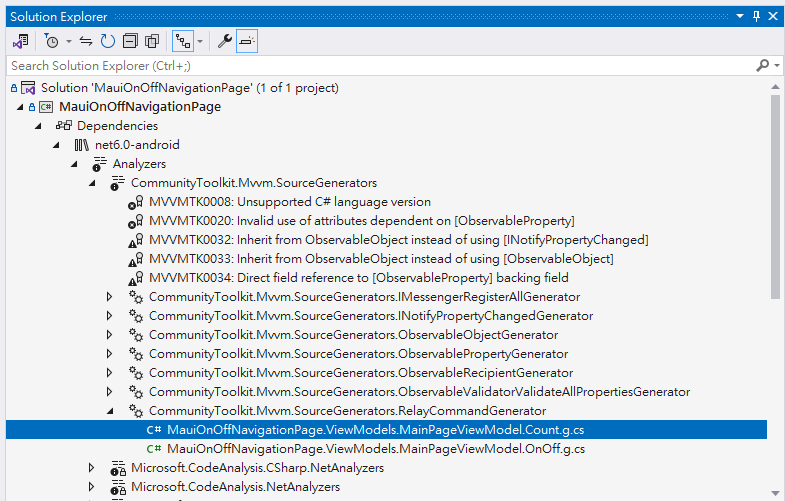
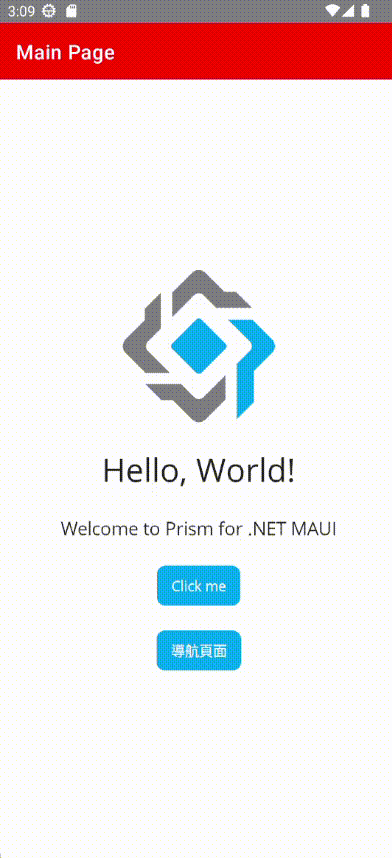

# 在 .NET MAUI 專案內，如何透過資料綁定做到導航頁面的隱藏與顯示

當在進行 .NET MAUI 專案開發的時候，會因為當時設計需要，在某些情況下，需要能夠暫時隱藏導航頁面，接著在某些情境下，又需要將導航頁面顯示出來；我們會發現在導航頁面的顯示與隱藏，是透過導航頁面的 `IsVisible` 這個屬性來控制的，但是這個屬性並沒有提供資料綁定的功能，所以我們無法透過資料綁定的方式來控制導航頁面的顯示與隱藏。

在這裡將會介紹如何透過資料綁定的方式，來控制導航頁面的顯示與隱藏。

若要完成這篇文章的練習程式碼，請先參考這篇 [使用 Vulcan.Maui.Template 專案範本來進行 MAUI for Prism 專案開發](https://csharpkh.blogspot.com/2023/01/Create-First-MAUI-Project-By-Vulcan-Template.html) 文章，來準備專案開發模板的使用環境。

## 安裝 Prism for MAUI 專案的模板

* 打開命令提示字元視窗
* 輸入 `dotnet new install Vulcan.Maui.Template`
  
  >這個命令將會安裝一個名稱為 `Vulcan.Maui.Template` 的專案範本，這個專案範本內含有 Prism for MAUI 專案開發所需要的所有檔案與設定，可以參考 [https://www.nuget.org/packages/Vulcan.Maui.Template](https://www.nuget.org/packages/Vulcan.Maui.Template) 這個網址，來查看這個專案範本的內容
* 底下將會是解除安裝過程出現的內容

```
C:\>dotnet new install Vulcan.Maui.Template
將安裝下列範本套件:
   Vulcan.Maui.Template

成功: Vulcan.Maui.Template::0.2.2 已安裝下列範本:
範本名稱                                 簡短名稱     語言  標記
---------------------------------------  -----------  ----  -------------------------------------------
Vulcan Custom Full Prism .NET MAUI App   Full-Maui    [C#]  MAUI/Android/iOS/macOS/Mac Catalyst/Windows
Vulcan Custom Prism .NET MAUI App        Vulcan-Maui  [C#]  MAUI/Android/iOS/macOS/Mac Catalyst/Windows
Vulcan Custom Prism View and View Model  MVVMItem     [C#]  MAUI/Android/iOS/macOS/Mac Catalyst/Windows
```

現在來進行專案開發模板的使用

## 建立採用 Prism 開發框架的 MAUI 專案

* 打開 Visual Studio 2022 IDE 應用程式
* 從 [Visual Studio 2022] 對話窗中，點選右下方的 [建立新的專案] 按鈕
* 在 [建立新專案] 對話窗右半部
  * 切換 [所有語言 (L)] 下拉選單控制項為 [C#]
  * 切換 [所有專案類型 (T)] 下拉選單控制項為 [MAUI]
* 在中間的專案範本清單中，找到並且點選 [Vulcan Custom Prism .NET MAUI App] 專案範本選項
  
  >若沒有看到這個專案範本，請參考 [使用 Vulcan.Maui.Template 專案範本來進行 MAUI for Prism 專案開發](https://csharpkh.blogspot.com/2023/01/Create-First-MAUI-Project-By-Vulcan-Template.html) 文章，進行安裝這個專案範本到 Visual Studio 2022 內
* 點選右下角的 [下一步] 按鈕
* 在 [設定新的專案] 對話窗
* 在 [專案名稱] 欄位內輸入 `MauiOnOffNavigationPage` 做為這個專案名稱
* 請點選右下角的 [建立] 按鈕
* 此時，將會建立一個可以用於 MAUI 開發的專案

## 建立 客製的導航頁面之 View & ViewModel

* 滑鼠右擊這個專案節點，也就是 [MauiOnOffNavigationPage] 名稱
* 從右鍵選單中，選擇 [開啟終端機] 選單指令
* 請在命令提示字元視窗內輸入 `dotnet new MVVMItem --namespace MauiOnOffNavigationPage --view-name Navi` 

  >這個命令將會在這個專案內的 Views 資料夾內產生 NaviPage.xaml / NaviPage.xaml.cs 這個 View 檔案
  >
  >另外，會在 ViewModels 資料夾內，產生 NaviPageViewModel.cs 這個 ViewModel 檔案
  >
  >這兩個 View 與 ViewModel 檔案，都已經有預設一些內容在裡面

## 修正 客製的導航頁面之 View & ViewModel

* 因為剛剛建立的 View & ViewModel 都是使用 ContentPage 這種類型，所以，需要修正這兩個檔案的內容，讓它們都改為使用 NavigationPage 這種類型
* 打開 NaviPage.xaml 檔案
* 將 `<ContentPage>` 這個標籤，改為 `<NavigationPage>`
* 在 NavigationPage 節點內，加入這兩個屬性 `BarBackgroundColor="Red" BarTextColor="White"`
* 底下是完成後的 NaviPage.xaml 檔案內容

```xml
<?xml version="1.0" encoding="utf-8" ?>
<NavigationPage xmlns="http://schemas.microsoft.com/dotnet/2021/maui"
             xmlns:x="http://schemas.microsoft.com/winfx/2009/xaml"
             x:Class="MauiOnOffNavigationPage.Views.NaviPage"
             xmlns:viewModel="clr-namespace:MauiOnOffNavigationPage.ViewModels"
             x:DataType="viewModel:NaviPageViewModel"
             BarBackgroundColor="Red" BarTextColor="White"
             >

</NavigationPage>
```

* 打開 NaviPage.xaml.cs 檔案
* 將 `ContentPage` 這個類別，改為 `NavigationPage`
* 底下是完成後的 NaviPage.xaml.cs 檔案內容

```csharp
namespace MauiOnOffNavigationPage.Views;

public partial class NaviPage : NavigationPage
{
    public NaviPage()
    {
        InitializeComponent();
    }
}
```

## 對 DI 容器註冊 客製的導航頁面之 View & ViewModel

* 打開 [MauiProgram.cs] 檔案
* 找到 `container.RegisterForNavigation<MainPage, MainPageViewModel>();` 這行程式碼
* 在這行程式碼上加入這一行 `container.RegisterForNavigation<NaviPage, NaviPageViewModel>();`
* 底下為完成後的 [MauiProgram.cs] 檔案內容

```csharp
using Prism.Ioc;
using MauiOnOffNavigationPage.ViewModels;
using MauiOnOffNavigationPage.Views;

namespace MauiOnOffNavigationPage;

public static class MauiProgram
{
    public static MauiApp CreateMauiApp()
    {
        var builder = MauiApp.CreateBuilder();
        builder
            .UseMauiApp<App>()
            .UsePrism(prism =>
            {

                prism.RegisterTypes(container =>
                      {
                          container.RegisterForNavigation<NaviPage, NaviPageViewModel>();
                          container.RegisterForNavigation<MainPage, MainPageViewModel>();
                      })
                     .OnInitialized(() =>
                      {
                          // Do some initializations here
                      })
                     .OnAppStart(async navigationService =>
                     {
                         // Navigate to First page of this App
                         var result = await navigationService
                         .NavigateAsync("NaviPage/MainPage");
                         if (!result.Success)
                         {
                             System.Diagnostics.Debugger.Break();
                         }
                     });
            })
            .ConfigureFonts(fonts =>
            {
                fonts.AddFont("OpenSans-Regular.ttf", "OpenSansRegular");
                fonts.AddFont("OpenSans-Semibold.ttf", "OpenSansSemibold");
            });

        return builder.Build();
    }
}
```

## 開始設計可以動態顯示或關閉導航面板的功能

* 打開 [MainPageViewModel.cs] 檔案
* 宣告一個可綁定屬性，用來控制導航頁面的顯示與隱藏

```csharp
    [ObservableProperty]
    bool isOn = true;
```

* 這裡使用了 ObservableProperty 這個屬性，這是 Microsoft.MVVMToolkit 套件所提供的功能，將會透過原始碼產生機制，產生出具有 INotifyPropertyChange 介面的相關程式碼，讓這個屬性可以進行資料綁定
* 接著，將需要設計一個可綁定命令呼叫的方法，來控制導航頁面的顯示與隱藏
* 將底下的方法加入到此 ViewModel 內

```csharp
[RelayCommand]
void OnOff()
{
    IsOn = !IsOn;
}
```

* 一旦這個方法被觸發之後，將會把 IsOn 這個屬性反轉為相反的值，透過這個 C# 屬性值得變化，來控制導航頁面的顯示與隱藏
* 底下將會是完成後的 ViewModel 內容

```csharp
using CommunityToolkit.Mvvm.ComponentModel;
using CommunityToolkit.Mvvm.Input;

namespace MauiOnOffNavigationPage.ViewModels;

public partial class MainPageViewModel : ObservableObject, INavigatedAware
{
    #region Field Member
    private int _count;
    private readonly INavigationService navigationService;

    [ObservableProperty]
    string title = "Main Page";

    [ObservableProperty]
    string text = "Click me";
    #endregion

    #region Property Member
    [ObservableProperty]
    bool isOn = true;
    #endregion

    #region Constructor
    public MainPageViewModel(INavigationService navigationService)
    {
        this.navigationService = navigationService;
    }
    #endregion

    #region Method Member
    #region Command Method
    [RelayCommand]
    void OnOff()
    {
        IsOn = !IsOn;
    }
    [RelayCommand]
    private void Count()
    {
        _count++;
        if (_count == 1)
            Text = "Clicked 1 time";
        else if (_count > 1)
            Text = $"Clicked {_count} times";
    }
    #endregion

    #region Navigation Event
    public void OnNavigatedFrom(INavigationParameters parameters)
    {
    }

    public void OnNavigatedTo(INavigationParameters parameters)
    {
    }
    #endregion

    #region Other Method
    #endregion
    #endregion
}
```

* 接著，打開 [MainPage.xaml] 檔案
* 找到 ContentPage 這個節點，加入這個附加屬性的宣告 `NavigationPage.HasNavigationBar="{Binding IsOn}"`
* 現在要加入一個按鈕，來觸發 ViewModel 內的方法

```xml
<Button Text="導航頁面"
    Command="{Binding OffCommand}"
    HorizontalOptions="Center" />
```

* 這裡使用了 `Command="{Binding OffCommand}"` 宣告，設定這個按鈕被點擊之後，要呼叫 ViewModel 內的 OffCommand 方法，而我們剛剛有在 ViewModel 內設計這個方法，OnOff，並且有加入這個屬性宣告 `[RelayCommand]` ，所以，透過 Microsoft.MVVMToolkit 套件，將會產生出一個可以用於命令綁定的 OffCommand 屬性，這個屬性將會指向 OnOff 方法
* 從方案總管來展開 [Dependencies] 節點，將會到如下圖的狀態

  
* 其中 [MauiOnOffNavigationPage.ViewModels.MainPageViewModel.Count.g.cs] 這個檔案將會是編譯器產生的原始碼
* 底下將會是編譯器產生的原始碼內容

```csharp
// <auto-generated/>
#pragma warning disable
#nullable enable
namespace MauiOnOffNavigationPage.ViewModels
{
    partial class MainPageViewModel
    {
        /// <summary>The backing field for <see cref="OffCommand"/>.</summary>
        [global::System.CodeDom.Compiler.GeneratedCode("CommunityToolkit.Mvvm.SourceGenerators.RelayCommandGenerator", "8.1.0.0")]
        private global::CommunityToolkit.Mvvm.Input.RelayCommand? offCommand;
        /// <summary>Gets an <see cref="global::CommunityToolkit.Mvvm.Input.IRelayCommand"/> instance wrapping <see cref="OnOff"/>.</summary>
        [global::System.CodeDom.Compiler.GeneratedCode("CommunityToolkit.Mvvm.SourceGenerators.RelayCommandGenerator", "8.1.0.0")]
        [global::System.Diagnostics.CodeAnalysis.ExcludeFromCodeCoverage]
        public global::CommunityToolkit.Mvvm.Input.IRelayCommand OffCommand => offCommand ??= new global::CommunityToolkit.Mvvm.Input.RelayCommand(new global::System.Action(OnOff));
    }
}
```

* 從這裡可以看出，編譯器產生了一個 OffCommand 屬性，這個屬性將會指向 OnOff 方法 (最後一行程式碼敘述)
* 底下將會是完成後的 [MainPageViewModel.cs] 檔案內容

```csharp
using CommunityToolkit.Mvvm.ComponentModel;
using CommunityToolkit.Mvvm.Input;

namespace MauiOnOffNavigationPage.ViewModels;

public partial class MainPageViewModel : ObservableObject, INavigatedAware
{
    #region Field Member
    private int _count;
    private readonly INavigationService navigationService;

    [ObservableProperty]
    string title = "Main Page";

    [ObservableProperty]
    string text = "Click me";
    #endregion

    #region Property Member
    [ObservableProperty]
    bool isOn = true;
    #endregion

    #region Constructor
    public MainPageViewModel(INavigationService navigationService)
    {
        this.navigationService = navigationService;
    }
    #endregion

    #region Method Member
    #region Command Method
    [RelayCommand]
    void OnOff()
    {
        IsOn = !IsOn;
    }
    [RelayCommand]
    private void Count()
    {
        _count++;
        if (_count == 1)
            Text = "Clicked 1 time";
        else if (_count > 1)
            Text = $"Clicked {_count} times";
    }
    #endregion

    #region Navigation Event
    public void OnNavigatedFrom(INavigationParameters parameters)
    {
    }

    public void OnNavigatedTo(INavigationParameters parameters)
    {
    }
    #endregion

    #region Other Method
    #endregion
    #endregion
}
```

## 執行與確認結果

底下是在 Android 模擬器內執行的結果



