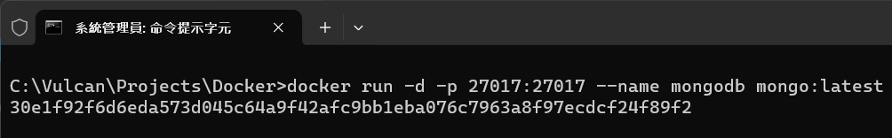
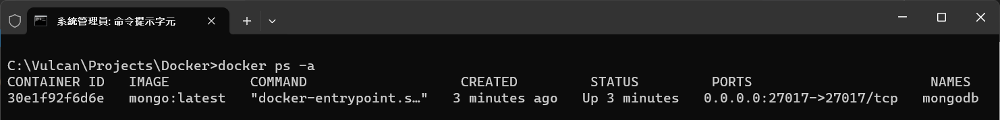
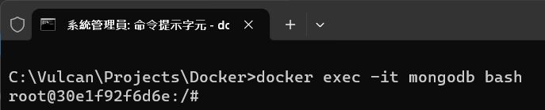
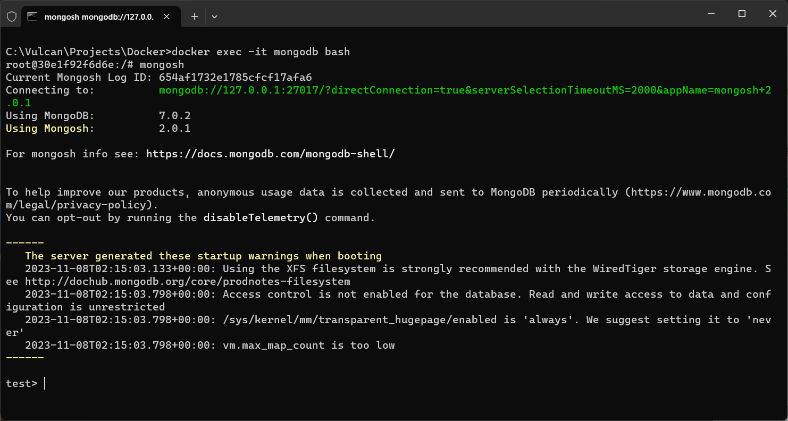
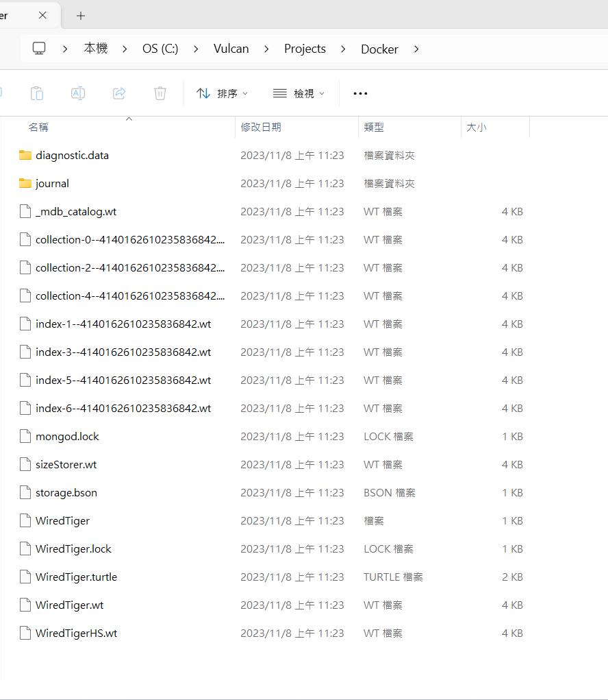

# MongoDB 系列 - 使用 Docker Hub 拉取 MongoDB Image 並且啟動該容器


在上一篇文章中 [MongoDB 系列 - 在 Windows 作業系統上安裝 Docker](https://csharpkh.blogspot.com/2023/11/MongoDb-Installation-Windows-Ducker-Desktop.html#google_vignette)，我們介紹了如何在 Windows 10 上安裝 Docker Desktop，並且啟動 Docker 服務。在這篇文章中，我們將介紹如何使用 Docker Hub 拉取 MongoDB Image 並且啟動該容器；不過，一旦該容器重新啟動之後，原先存在於該容器內之 MongoDB 更新的資料，將會消失不見，所以，在這篇文章也需要解決持久性的問題。

## 拉取 MongoDB Image 並且啟動該容器

* 開啟命令提示字元視窗
* 輸入以下指令，查看現在 Docker 內有哪些 Image
* 這裡將會使用 docker images 這個指令，查看現在 Docker 內有哪些 Image

```
docker images
```

* 底下螢幕截圖是我們在 Windows 10 上執行的結果，在這台機器上，沒有存在任何 Image 檔案

  

* 現在要來抓取 MongoDB 的 Image，請輸入以下指令
* 這裡將會使用 docker pull 這個指令，從 Docker Hub 上抓取最新的 MongoDB Image
* 其中在下方指令中的 mongo:latest，代表要抓取最新的 MongoDB Image，當然，也可以指定特定的版本，例如 mongo:4.4.9

```
docker pull mongo:latest
```

* 底下螢幕截圖是我們在 Windows 10 上執行的結果，可以看到 Docker 已經抓取到最新的 MongoDB Image

  

```
C:\Users\vulca>docker pull mongo:latest
latest: Pulling from library/mongo
43f89b94cd7d: Pull complete
54a7480baa9d: Pull complete
7f9301fbd7df: Pull complete
5e4470f2e90f: Pull complete
40d046ff8fd3: Pull complete
e062d62b861e: Pull complete
72919e34fde8: Pull complete
ab22810dfc64: Pull complete
fb05c29fbdf5: Pull complete
Digest: sha256:d341a86584b96eb665345a8f5b35fba8695ee1d0618fd012ec4696223a3d6c62
Status: Downloaded newer image for mongo:latest
docker.io/library/mongo:latest

What's Next?
  View a summary of image vulnerabilities and recommendations → docker scout quickview mongo:latest
```

* 再來查看現在 Docker 內有哪些 Image，下達底下命令

```
docker images
```

* 底下螢幕截圖是我們在 Windows 10 上執行的結果，在這台機器上，已經看到 MongoDB 的 Image 檔案已經存在 Docker 內了

  

```
C:\Users\vulca>docker images
REPOSITORY   TAG       IMAGE ID       CREATED       SIZE
mongo        latest    ee3b4d1239f1   3 weeks ago   748MB
```

* 當使用 docker images 命令時，會得到上述欄位的輸出結果，這些欄位的意義如下：
  * REPOSITORY（倉庫）：顯示映像檔案的名稱。在這個例子中是 mongo，指的是MongoDB的映像檔案，MongoDB 是一種廣泛使用的 NoSQL 數據庫。
  * TAG（標籤）：標籤列指定了映像檔案的版本。latest 表示這個映像是從 Docker Hub 的 MongoDB 倉庫中，拉取時可用的最新版本。
  * IMAGE ID（映像 ID）：這是 Docker 映像檔案的唯一標識符。在這個例子中是 ee3b4d1239f1，每個映像檔案都有一個獨特的映像 ID。
  * CREATED（創建時間）：這列顯示映像檔案被創建或最後更新的時間。這裡顯示的是 3 weeks ago，意味著這個映像檔案是在三週前創建或更新的。
  * SIZE（大小）：這列顯示了映像檔案的大小。這個 MongoDB 映像檔案的大小是 748MB。
* 這個輸出讓你可以快速了解本機上有哪些 Docker 映像檔案，以及它們的版本、大小和創建時間。

* 現在已經有了 MongoDB Image 了，接下來要來啟動 MongoDB 的 Container
* 使用底下命令，啟動 MongoDB 的 Container
    
```
docker run -d -p 27017:27017 --name mongodb mongo:latest
```

* 該命令的各個部分的意義如下：
  * docker run：這是 Docker 的一個命令，用於運行一個新的容器。
  * 這個參數代表 "detached" 模式，這意味著 Docker 容器會在背景執行。
  * -p 27017:27017：這個選項是用於端口映射。它將容器內的 27017 端口映射到宿主機的 27017 端口。MongoDB 預設會在 27017 端口進行監聽，所以這樣做可以讓你從宿主機的相同端口連接到 MongoDB。
  * --name mongodb：這個選項指定了運行的容器名稱。在這裡，容器被命名為 mongodb。
  * mongo:latest：這指定了要運行的 Docker 映像檔案名稱和標籤。mongo 是映像檔案的名稱（來自 Docker Hub 的官方 MongoDB 倉庫），而 latest 是映像檔案的標籤，表示使用該倉庫的最新版本。
  * 綜上所述，這行命令將會從 Docker Hub 下載最新版本的 MongoDB 映像（如果本地沒有的話），並以 mongodb 為名稱運行一個新的容器，同時將容器的 27017 端口映射到宿主機的 27017 端口。這樣你就可以通過宿主機的 27017 端口來進行數據庫操作。
* 底下螢幕截圖，將會是我們在 Windows 10 上執行的結果，可以看到 Docker 已經啟動了 MongoDB 的 Container

  

* 現在，我們可以使用 docker ps 這個指令，查看目前正在執行的 Container

```
docker ps -a
```



```
docker ps -a
CONTAINER ID   IMAGE          COMMAND                   CREATED         STATUS         PORTS                      NAMES
30e1f92f6d6e   mongo:latest   "docker-entrypoint.s…"   3 minutes ago   Up 3 minutes   0.0.0.0:27017->27017/tcp   mongodb
```

* 這個 docker ps -a 命令的輸出顯示了一個容器的信息：
  * CONTAINER ID: 30e1f92f6d6e - 容器的唯一識別碼。
  * IMAGE: mongo:latest - 這個容器使用的 Docker 映像檔案，指定為 MongoDB 的最新版。
  * COMMAND: "docker-entrypoint.s…" - 容器啟動時運行的命令或腳本。這裡顯示的是截斷了的入口點命令。
  * CREATED: 3 minutes ago - 這個容器是三分鐘前創建的。
  * STATUS: Up 3 minutes - 容器已經運行了三分鐘。
  * PORTS: 0.0.0.0:27017->27017/tcp - 容器的 27017 端口被映射到了宿主機的 27017 端口。
  * NAMES: mongodb - 容器的名稱是 mongodb。

* 如果你想要移除這個容器，你可以先停止它，然後移除：

* 停止容器，請下達底下命令

```
docker stop 30e1f92f6d6e
```

* 接著查看目前正在執行的 Container，底下是完整的操作步驟

```
docker stop 30e1f92f6d6e
30e1f92f6d6e

docker ps -a
CONTAINER ID   IMAGE          COMMAND                   CREATED         STATUS                     PORTS     NAMES
30e1f92f6d6e   mongo:latest   "docker-entrypoint.s…"   9 minutes ago   Exited (0) 5 seconds ago             mongodb
```

這裡可以看到 STATUS 欄位顯示值為 Exited (0) 5 seconds ago，代表容器已經停止了
* 要重新啟動這個容器，請下達底下命令

```
docker start 30e1f92f6d6e
30e1f92f6d6e

docker ps -a
CONTAINER ID   IMAGE          COMMAND                   CREATED          STATUS         PORTS                      NAMES
30e1f92f6d6e   mongo:latest   "docker-entrypoint.s…"   12 minutes ago   Up 5 seconds   0.0.0.0:27017->27017/tcp   mongodb
```

* 這裡可以看到 STATUS 欄位顯示值為 Up 5 seconds，代表容器已經重新啟動了

## 確認 MongoDB 可以正常運作

* 開啟命令提示字元視窗
* 輸入以下指令，查看目前正在執行的 Container

```
docker exec -it mongodb bash
```



* 現在已經進入到 Container 內，並且使用的 bash 來進行後續互動與操作
* 接下來，進入到 MongoSH 這個 Shell 程式，請下達底下命令

```
mongosh
```



* 在 MongoSH 這個 Shell 程式內，輸入 db 命令，查看現在正在使用的資料庫
* 接著輸入 show dbs 命令，查看現在 MongoDB 內有哪些資料庫

```
test> db
test
test> show dbs
admin   40.00 KiB
config  60.00 KiB
local   72.00 KiB
```

* 這些命令是在 MongoDB 的 shell 環境中執行的，用來檢查目前選擇的數據庫以及列出所有可用的數據庫和它們的大小：
  * test> db - 這個命令顯示了當前選擇的數據庫名稱。在這裡，test 是預設的數據庫或是你之前選擇的數據庫。
  * test> show dbs - 這個命令列出了所有現有的數據庫及其大小：
    * admin 數據庫通常包含 MongoDB 的管理相關的信息，大小為 40.00 KiB。
    * config 數據庫保存了分片配置信息，大小為 60.00 KiB。
    * local 數據庫通常用於儲存本機環境特定的數據，如複製集的狀態信息，大小為 72.00 KiB。

* 在 MongoDB shell 中建立一個數據庫、集合（collection），並插入一筆文檔（document），可以透過以下步驟進行

```
use myNewDatabase
db.createCollection("myCollection")
db.myCollection.insertOne({name: "John Doe", age: 30})
```

* 這些命令的意義如下：
  * use myNewDatabase - 這個命令創建了一個名為 myNewDatabase 的新數據庫。如果數據庫不存在，MongoDB 會自動創建它。
  * db.createCollection("myCollection") - 這個命令創建了一個名為 myCollection 的新集合。如果集合不存在，MongoDB 會自動創建它。
  * db.myCollection.insertOne({name: "John Doe", age: 30}) - 這個命令向 myCollection 集合中插入了一個文檔。如果集合不存在，MongoDB 會自動創建它。這個文檔包含了兩個字段：name 和 age。

* 底下為完整的操作步驟過程

```
test> use myNewDatabase
switched to db myNewDatabase
myNewDatabase> db.createCollection("myCollection")
{ ok: 1 }
myNewDatabase> db.myCollection.insertOne({name: "John Doe", age: 30})
{
  acknowledged: true,
  insertedId: ObjectId("654af7e52e1785cfcf17afa7")
}
myNewDatabase> show dbs
```
* 最後輸入 show db 指令，確認目前 MongoDB 內有 myNewDatabase 資料庫，且文件已經存在了

```
myNewDatabase> show dbs
admin           40.00 KiB
config         108.00 KiB
local           72.00 KiB
myNewDatabase   40.00 KiB
myNewDatabase> db.myCollection.find()
[
  {
    _id: ObjectId("654af7e52e1785cfcf17afa7"),
    name: 'John Doe',
    age: 30
  }
]
```

## 讓 MongoDB 的資料庫持久化

* 在 Docker 容器中運行的應用程序（如 MongoDB）的數據預設是存儲在容器的可寫層中。由於 Docker 容器的設計理念是「不可變的」和「易於替換的」，當容器被刪除時，它的可寫層和所有數據也會一同被刪除。這意味著，除非數據被存儲在外部的、持久化的存儲中，否則重啟容器或創建新容器都不會保留之前容器內的數據。
* 要確認數據是否會在容器重新啟動後消失，可以進行以下操作：
  * 啟動 MongoDB 容器而不使用 -v 來持久化數據。
  * 進入 MongoDB 容器並創建一些數據（例如，插入一些文檔）。
  * 停止並刪除該容器。
  * 再次啟動一個新的 MongoDB 容器（同樣不使用 -v）。
  * 進入新的容器並檢查之前創建的數據。
* 如果你沒有使用持久化存儲，你會發現之前創建的數據不再存在。以下是相關的 Docker 命令：

```
# 啟動 MongoDB 容器
docker run --name mymongodb -d mongo:latest

# 停止容器
docker stop mymongodb

# 刪除容器
docker rm mymongodb

# 啟動新的 MongoDB 容器
docker run --name mynewmongodb -d mongo:latest
```

* 這就是為什麼需要使用 -v 或 --volume 來設定資料持久性。這個選項允許你將容器內的數據映射到宿主機上的一個目錄或者一個已存在的數據卷（volume）。這樣做的好處是，即使容器被刪除，映射的數據卷中的數據仍然會被保留，並且可以被其他容器訪問或重新附加。
* 如果你沒有使用 -v 來持久化數據，那麼容器一旦刪除，其中的數據就會丟失。
* 現在來進行這樣的操作
* 首先在本機建立一個目錄，用來存放 MongoDB 的資料庫

```
mkdir c:\Vulcan\Projects\Docker & cd c:\Vulcan\Projects\Docker
```

* 使用底下指令，停止正在執行的容器

```
docker stop mongodb
```

* 使用底下命令，啟動 MongoDB 的 Container
    
```
docker run -d -p 27017:27017 -v "c:\Vulcan\Projects\Docker:/data/db" --name mongodb mongo:latest
```

* 其中，這些參數的意義如下  
    * -d: 代表在背景執行
    * -p: 代表將 Container 內的 Port 對應到 Host 的 Port
    * -v: 代表將 Container 內的目錄對應到 Host 的目錄
    * --name: 代表 Container 的名稱
    * mongo:latest: 代表要啟動的 Image

* 可是，將會得到底下錯誤訊息

```
docker: Error response from daemon: Conflict. The container name "/mongodb" is already in use by container "30e1f92f6d6eda573d045c64a9f42afc9bb1eba076c7963a8f97ecdcf24f89f2". You have to remove (or rename) that container to be able to reuse that name.
See 'docker run --help'.
```

* 這個錯誤信息表明 Docker 在試圖創建一個新容器時遇到了名稱衝突。你指定的容器名稱“/mongodb”已經被另一個容器使用了。在 Docker 中，每個運行的容器都必須有一個唯一的名稱。如果你嘗試創建一個名稱相同的新容器，就會發生這種衝突。
* 為了解決這個問題，你有以下幾個選擇：
  * 移除已存在的同名容器。
  * 重新命名已存在的容器。
  * 使用另一個名稱創建新的容器。


* 使用底下命令，另外創建一個新的容器名稱，啟動 MongoDB 的 新 Container
    
```
docker run -d -p 27017:27017 -v "c:\Vulcan\Projects\Docker:/data/db" --name mongodbmapping mongo:latest
```

* 現在， MongoDB 的 Container 已經啟動了，並且 MongoDB 的資料庫已經存在於本機磁碟機上了

  

* 如此，就再也不要擔心一旦容器有問題，需要重新建立，儲存在容器內的 MongoDB 資料庫的資料會不見了


