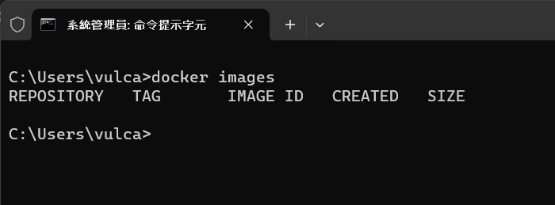
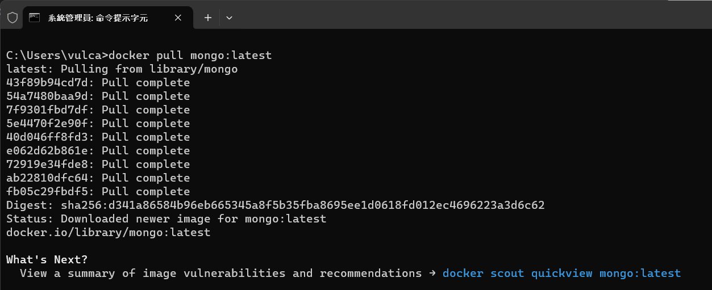
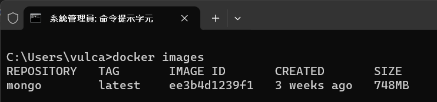

# MongoDB 系列 - 使用 Docker Hub 拉取 MongoDB Image 並且啟動該容器


* 開啟命令提示字元視窗
* 輸入以下指令，查看現在 Docker 內有哪些 Image

```
docker images
```

* 底下螢幕截圖是我們在 Windows 10 上執行的結果，在這台機器上，沒有存在任何 Image 檔案

  

* 現在要來抓取 MongoDB 的 Image，請輸入以下指令

```
docker pull mongo:latest
```

* 底下螢幕截圖是我們在 Windows 10 上執行的結果，可以看到 Docker 已經抓取到最新的 MongoDB Image

  

```
C:\Users\vulca>docker pull mongo:latest
latest: Pulling from library/mongo
43f89b94cd7d: Pull complete
54a7480baa9d: Pull complete
7f9301fbd7df: Pull complete
5e4470f2e90f: Pull complete
40d046ff8fd3: Pull complete
e062d62b861e: Pull complete
72919e34fde8: Pull complete
ab22810dfc64: Pull complete
fb05c29fbdf5: Pull complete
Digest: sha256:d341a86584b96eb665345a8f5b35fba8695ee1d0618fd012ec4696223a3d6c62
Status: Downloaded newer image for mongo:latest
docker.io/library/mongo:latest

What's Next?
  View a summary of image vulnerabilities and recommendations → docker scout quickview mongo:latest
```

* 再來查看現在 Docker 內有哪些 Image，下達底下命令

```
docker images
```

* 底下螢幕截圖是我們在 Windows 10 上執行的結果，在這台機器上，已經看到 MongoDB 的 Image 檔案已經存在 Docker 內了

  

```
C:\Users\vulca>docker images
REPOSITORY   TAG       IMAGE ID       CREATED       SIZE
mongo        latest    ee3b4d1239f1   3 weeks ago   748MB
```

* 使用底下命令，建立一個練習用的 docker 目錄，並且切換到該目錄內
    
```
mkdir c:\Vulcan\Projects\Docker & cd c:\Vulcan\Projects\Docker
```

* 使用底下命令，啟動 MongoDB 的 Container
    
```
docker run -d -p 27017-27019:27017-27019 -v c:\Vulcan\Projects\Docker:/data/db --name mongodb mongo:latest
```

* 其中，這些參數的意義如下  
    * -d: 代表在背景執行
    * -p: 代表將 Container 內的 Port 對應到 Host 的 Port
    * -v: 代表將 Container 內的目錄對應到 Host 的目錄
    * --name: 代表 Container 的名稱
    * mongo:latest: 代表要啟動的 Image


