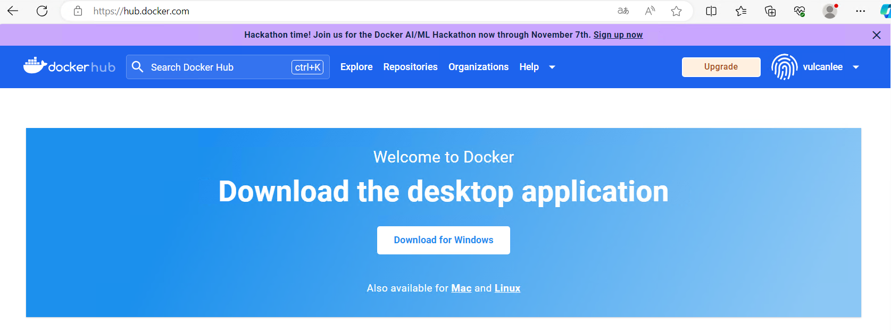
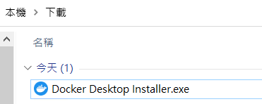
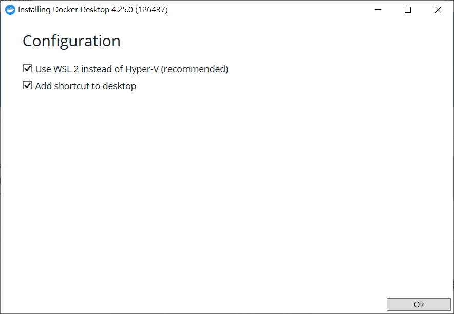
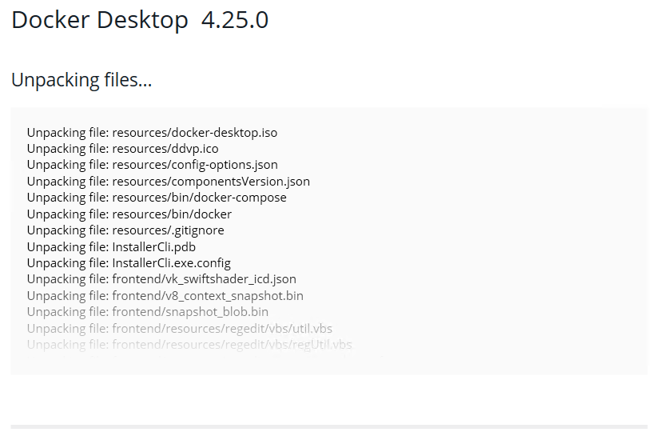
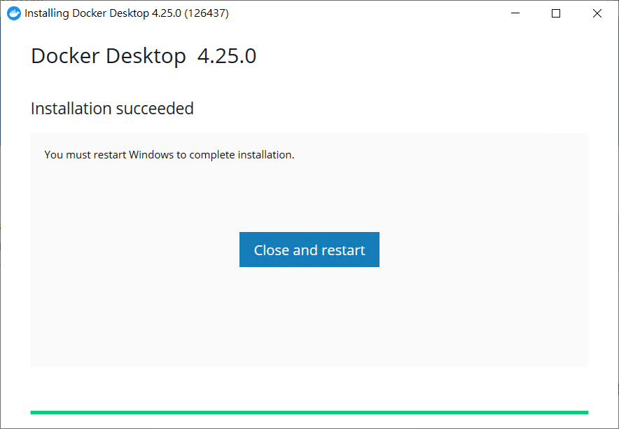
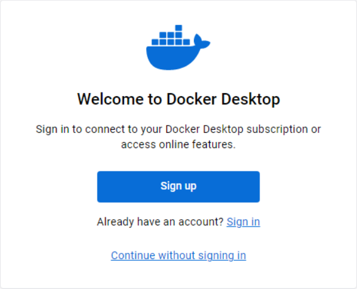
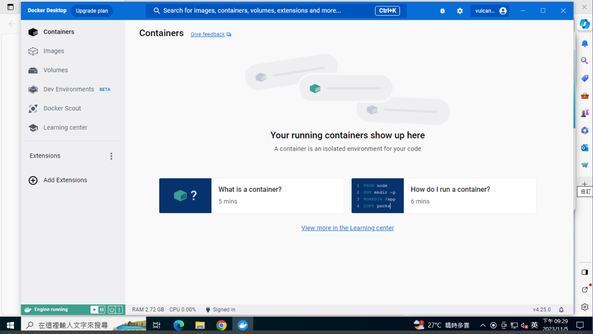
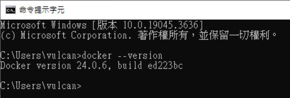
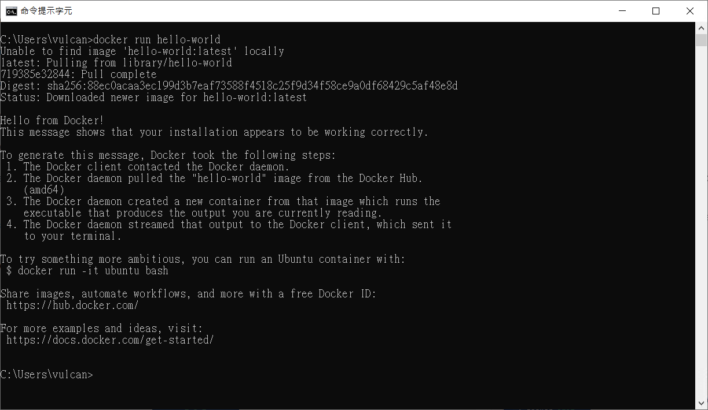

# MongoDB 系列 - 在 Windows 作業系統上安裝 Docker


## 安裝 Docker Desktop

* 開啟 [Docker](https://www.docker.com) 網頁 
* 登入到 Docker 網站
* 點選 [Download for Windows] 按鈕
  
* 下載完成後，執行 [Docker Desktop Installer.exe] 這個安裝檔案
  
* 此時，出現 [Installing Docker Desktop 4.25.0(126437)] 這個對話出
  

  這裡提示需要使用 WSL 2 來替換 Hyper-V
* 點選 [Ok] 按鈕
* 此時，安裝程式正在進行解壓縮與安裝
  
* 安裝完成之後，點選 [Close and restart] 重新啟動作業系統
  
* 重新開機完成後，將會出現 [Docker Subscription Service Agreement] 對話窗
* 點選右下方的 [Accept] 按鈕
* 現在看到 [Finish setting up Docker Desktop] 對話窗
* 這裡使用預設設定選項，接著，點選 [Finish] 按鈕，完成 Docker 的安裝
* [Docker Desktop] 視窗將會出現在螢幕上，點選 [Sing in] 連結，登入到 Docker 網站
  
* 登入完成之後，將會重新導入到 [Docker Desktop] 視窗
* 可以回答問卷題目，或者點選 [Skip] 按鈕
* 現在，經可以看到 Docker Desktop 應用程式了
  

## 確認 Docker 可以正常運作
* 開啟命令提示字元視窗
* 再命令提示字元視窗內輸入 `docker --version`
* 將會看到現在安裝的 Docker 版本 Docker version 24.0.6, build ed223bc
  
* 現在要來確認 Docker 的容器是否可以正常運作
* 在命令提示字元視窗內，輸入 `docker run hello-world`
* 此時，將會發現到本地端沒有這個 hello-world 影像 Image 檔案存在，所以，將會從 Docker Hub 上拉取下來

```
C:\Users\vulcan>docker run hello-world
Unable to find image 'hello-world:latest' locally
latest: Pulling from library/hello-world
719385e32844: Pull complete
Digest: sha256:88ec0acaa3ec199d3b7eaf73588f4518c25f9d34f58ce9a0df68429c5af48e8d
Status: Downloaded newer image for hello-world:latest
```
* 一旦 Image 拉取下來之後，就會透過 Container 容器來執行
* 執行後，將會看到底下文字內容

```
Hello from Docker!
This message shows that your installation appears to be working correctly.

To generate this message, Docker took the following steps:
 1. The Docker client contacted the Docker daemon.
 2. The Docker daemon pulled the "hello-world" image from the Docker Hub.
    (amd64)
 3. The Docker daemon created a new container from that image which runs the
    executable that produces the output you are currently reading.
 4. The Docker daemon streamed that output to the Docker client, which sent it
    to your terminal.

To try something more ambitious, you can run an Ubuntu container with:
 $ docker run -it ubuntu bash

Share images, automate workflows, and more with a free Docker ID:
 https://hub.docker.com/

For more examples and ideas, visit:
 https://docs.docker.com/get-started/
```



* 緊接著輸入命令 [docker image ls --all]，確認 Image 真的有下載下來

```
C:\Users\vulcan>docker image ls --all
REPOSITORY    TAG       IMAGE ID       CREATED        SIZE
hello-world   latest    9c7a54a9a43c   6 months ago   13.3kB
```
* 輸入 [docker container ls --all] 確認有容器啟動了

```
C:\Users\vulcan>docker container ls --all
CONTAINER ID   IMAGE         COMMAND    CREATED         STATUS                     PORTS     NAMES
654e829a338a   hello-world   "/hello"   6 minutes ago   Exited (0) 6 minutes ago             peaceful_williams
```

