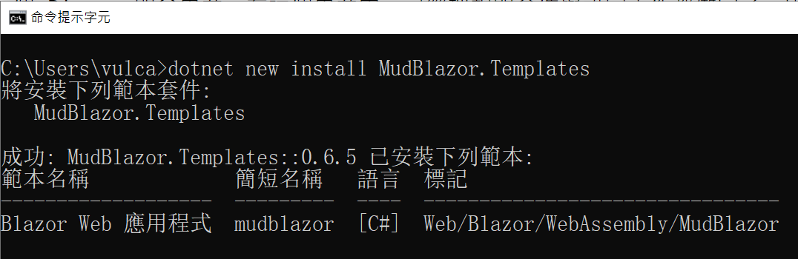
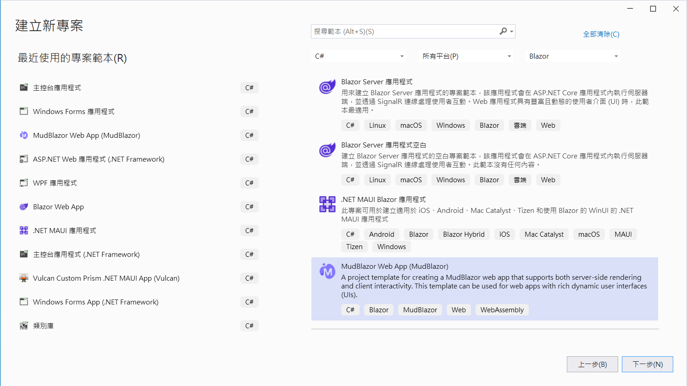
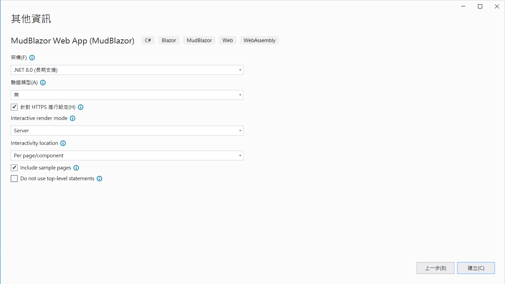
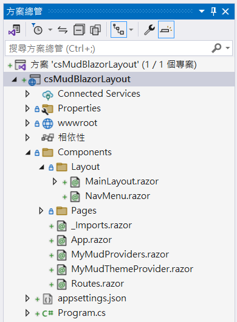
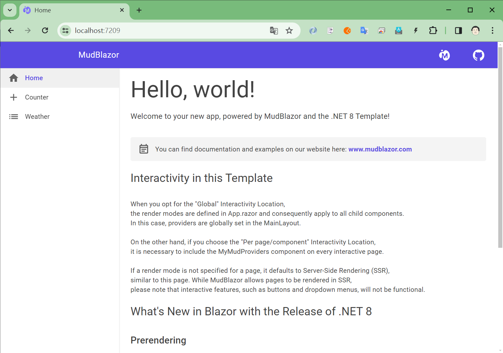

# .NET8 Blazor - 使用 MudBlazor 專案範本來建立Blazor專案


MudBlazor 是一個用於 .NET Blazor 架構下的元件，這個套件提供相當多且豐富的元件，並且這些元件都是使用 Material Design 的設計風格。

在上一篇文章 [使用 MudBlazor 元件 建立 Blazor 專案](https://csharpkh.blogspot.com/2024/02/CSharp-Create-New-Blazor-MudBlazor-Component.html) 中，說明如何使用預設的 Blazor 專案範本來建立一個 Blazor 的專案，並且開始安裝 MudBlazor 套件與修正這個預設專案範本所建立的專案，使其可以應用 MudBlazor 所提供的相關元件。

不過，MudBlazor 也提供專屬於自己的專案範本，透過這個專案範本便可以建立一個 Blazor 開發專案，在這個專案內，已經把相關套件與設定工作都做完了，因此，接下來的一系列關於 MudBlazor 套件的使用說明文章，都將會使用這個 MudBlazor 專案範本來建立練習開發專案。

想要在 Visual Studio 2022 & VS Code 內使用 MudBlazor 專案範本，需要先將 MudBlazor 專案範本功能安裝起來，想要做到這樣的需求，需要開啟[命令提示字元視窗]，並且在命令提示字元視窗內，輸入底下的安裝專案範本的命令。

```shell
dotnet new install MudBlazor.Templates
```



所以想要在開發環境安裝 MudBlazor 專案範本，可以說是相當的簡單與容易；然而，這個專案範本可以在  Visual Studio 2022 & Visual Studio Code 內來使用，若想要在 Visual Studio Code 內使用 MudBlazor 專案範本來建立Blazor專案，可以使用底下 CLI 命令

```shell
dotnet new mudblazor --host wasm --name MyApplication
```

這裡將會建立一個 Blazor WebAssembly 託管的專案，這個專案名稱就是為 MyApplication

更多的專案範本參數，可以使用底下 CLI 命令查看到

```shell
dotnet new mudblazor --help
```

底下將會是完整的 CLI 用法

```
C:\Users\vulca>dotnet new mudblazor --help
Blazor Web 應用程式 (C#)
作者: Microsoft
描述: 用於建立同時支援伺服器端轉譯和用戶端互動的 Blazor Web 應用程式的專案範本。此範本可用於具有豐富動態使用者介面 (UI) 的 Web 應用程式。

使用方式:
  dotnet new mudblazor [options] [範本選項]

選項:
  -n, --name <name>       要建立的輸出名稱。如果未指定名稱，則使用輸出目錄的名稱。
  -o, --output <output>   放置產生輸出的位置。
  --dry-run               顯示如果執行所給予的命令列會導致範本建立，會發生什麼情況的摘要。
  --force                 強制產生內容，即使內容會變更現有的檔案。
  --no-update-check       停用在具現化範本時檢查範本套件更新。
  --project <project>     應該用於內容評估的專案。
  -lang, --language <C#>  指定要具現化的範本語言。
  --type <project>        指定要具現化的範本類型。

範本選項:
  -f, --framework <net8.0>                 專案的目標 Framework。
                                           類型: choice
                                             net8.0  目標 net8.0
                                           預設: net8.0
  --no-restore                             若指定，會在建立時跳過專案的自動還原。
                                           類型: bool
                                           預設: false
  --exclude-launch-settings                是否要從產生的範本排除 launchSettings.json。
                                           類型: bool
                                           預設: false
  -int, --interactivity <None|Server|...>  選擇要用於互動式元件的裝載平台
                                           類型: choice
                                             None         沒有互動功能 (只有靜態伺服器轉譯)
                                             Server       在伺服器上執行
                                             WebAssembly  使用 WebAssembly 在瀏覽器中執行
                                             Auto         下載 WebAssembly 資產時使用伺服器，然後使用 WebAssembly
                                           預設: Server
  -e, --empty                              設定是否要省略範例頁面和樣式，其示範基本使用模式。
                                           類型: bool
                                           預設: false
  -au, --auth <Individual|None>            要使用的驗證類型。
                                           類型: choice
                                             None        沒有驗證
                                             Individual  個別驗證
                                           預設: None
  -uld, --use-local-db                     是否使用 LocalDB 而非 SQLite。只有在已指定 --auth Individual 時，才適用此選項。
                                           類型: bool
                                           預設: false
  -ai, --all-interactive                   設定是否要在最上層套用互動式轉譯模式，讓每個頁面都成為互動式。如果為
                                           false，則頁面預設會使用靜態伺服器轉譯，而且可以以每頁或每一元件為基礎標示為互動式。
                                           啟用時間: (InteractivityPlatform != "None")
                                           類型: bool
                                           預設: false
  --no-https                               是否要關閉 HTTPS。此選項僅適用於個人未用於 --auth 時。
                                           類型: bool
                                           預設: false
  --use-program-main                       是否要產生明確的 Program 類別和 Main 方法，而非最上層語句。
                                           類型: bool
                                           預設: false
```

將下來的更多關於 MudBlazor 應用說明的文章，將會使用 Visual Studio 2022 來說明

## 建立練習專案

* 打開 Visual Studio 2022 IDE 應用程式
* 從 [Visual Studio 2022] 對話窗中，點選右下方的 [建立新的專案] 按鈕
* 在 [建立新專案] 對話窗右半部
  * 切換 [所有語言 (L)] 下拉選單控制項為 [C#]
  * 切換 [所有專案類型 (T)] 下拉選單控制項為 [Blazor]
* 在中間的專案範本清單中，找到並且點選 [MudBlazor Web App (MudBlazor)] 專案範本選項
  > A project template for creating a MudBlazor web app that supports both server-side rendering and client interactivity. This template can be used for web apps with rich dynamic user interfaces (UIs)

  
* 點選右下角的 [下一步] 按鈕
* 在 [設定新的專案] 對話窗
  * 找到 [專案名稱] 欄位，輸入 `csMudBlazorLayout` 作為專案名稱
  * 在剛剛輸入的 [專案名稱] 欄位下方，確認沒有勾選 [將解決方案與專案至於相同目錄中] 這個檢查盒控制項
* 點選右下角的 [下一步] 按鈕
* 現在將會看到 [其他資訊] 對話窗
  * 在 [架構] 欄位中，請選擇最新的開發框架，這裡選擇的 [架構] 是 : `.NET 8.0 (長期支援)`
  * [驗證類型] 請選擇預設值 [無]
  * 在 [Interactive render mode] 欄位中，請選擇預設值 [Server]
  * 在 [Interactivity location] 欄位中，請選擇預設值 [Per page/component]
  * 若想要看到範例頁面，可以依照自己的需求，勾選 [Include sample pages] 這個檢查盒控制項

  
* 請點選右下角的 [建立] 按鈕

稍微等候一下，這個主控台專案將會建立完成

## 了解 MudBlazor 專案範本建立的專案

現在已經透過 MudBlazor 專案範本建立了一個 Blazor Server 的專案，現在來看看這個專案與預設採用 Blazor 專案範本所建立的專案有何不同

### 專案結構

首先，底下螢幕截圖將會是這個專案的結構圖



使用滑鼠雙擊專案節點，將可以看到這個專案的定義 XML 內容，如下所示

```xml
<Project Sdk="Microsoft.NET.Sdk.Web">

  <PropertyGroup>
    <TargetFramework>net8.0</TargetFramework>
    <Nullable>enable</Nullable>
    <ImplicitUsings>enable</ImplicitUsings>
  </PropertyGroup>

  
  <ItemGroup>
    <PackageReference Include="MudBlazor" Version="6.*" />
  </ItemGroup>
  
</Project>
```

從上面的 [csMudBlazorLayout.csproj] 內容可以看出，這是一個 .NET 8 的專案，並且已將加入了 [MudBlazor] 套件

打開這個專案根目錄下的 [Program.cs] 檔案，了解這個 Blazor 專案的程式進入點程式碼

```csharp
using csMudBlazorLayout.Components;
using MudBlazor.Services;

var builder = WebApplication.CreateBuilder(args);

// Add services to the container.
builder.Services.AddRazorComponents()
    .AddInteractiveServerComponents();

builder.Services.AddMudServices();

var app = builder.Build();

// Configure the HTTP request pipeline.
if (!app.Environment.IsDevelopment())
{
    app.UseExceptionHandler("/Error", createScopeForErrors: true);
    // The default HSTS value is 30 days. You may want to change this for production scenarios, see https://aka.ms/aspnetcore-hsts.
    app.UseHsts();
}

app.UseHttpsRedirection();

app.UseStaticFiles();
app.UseAntiforgery();

app.MapRazorComponents<App>()
    .AddInteractiveServerRenderMode();

app.Run();
```

這是一個 [ASP.NET Core] 的專案，透過 `AddInteractiveServerComponents()` 方法呼叫，提供了新增服務以支持轉譯 Interactive Server 元件，也就是說，在 [ASP.NET Core Blazor 轉譯模式](https://learn.microsoft.com/zh-tw/aspnet/core/blazor/components/render-modes?view=aspnetcore-8.0&WT.mc_id=DT-MVP-5002220) 下，將會提供了 互動式伺服器	使用 Blazor Server的互動式伺服器端轉譯（互動式SSR），也就是在 .NET 7 之前所謂的 Blazor Server 功能。

另外，也會呼叫 `builder.Services.AddMudServices();` 這個方法，將會註冊 MudBlazor 套件需要用到的相關服務到 DI 容器內。

這個專案內將會有一個 [Components] 資料夾，在此資料夾下，將會有另外兩個資料夾 [Layout] 與 [Pages]

在 [Components] 資料夾下的 [_Imports.razor] 檔案，將會用於 Blazor 元件會用到的預設命名空間，在這個檔案中，將會加入底下兩行宣告，如此，在所有的 Blazor 元件內，便可以直接使用各種 MudBlazor 所提供的相關元件，而不再需要再加入相關宣告了，如此，精簡與簡化了專案設計過程。

```html
@using MudBlazor
@using MudBlazor.Services
```

[App.razor] 這個檔案，將會是 Blazor 元件的進入點，在這個檔案內的 `</body>` 封閉標籤前，也有加入了 MudBlazor 套件需要用到的 JavaScript 程式碼。

```html
<script src="_content/MudBlazor/MudBlazor.min.js"></script>
```

打開 [MyMudProviders.razor] 檔案，這裡加入了關於三個最重要的提供者是 `<MudPopoverProvider />` 、 `<MudDialogProvider />` 、 `<MudSnackbarProvider />`，這三個元件分別提供了： [MudPopoverProvider]：用於提供 MudPopover 元件的上下文。MudPopover 元件可讓您在應用程式中顯示浮動式內容。[MudDialogProvider]：用於提供 MudDialog 元件的上下文。MudDialog 元件可讓您在應用程式中顯示模態對話方塊。[MudSnackbarProvider]：用於提供 MudSnackbar 元件的上下文。MudSnackbar 元件可讓您在應用程式中顯示簡短的通知。

```html
@inject ISnackbar Snackbar

<MudPopoverProvider></MudPopoverProvider>
<MudDialogProvider />
<MudSnackbarProvider />

@code {
    protected override void OnInitialized()
    {
        Snackbar.Clear();
        Snackbar.Configuration.PositionClass = Defaults.Classes.Position.TopCenter;
        Snackbar.Configuration.MaxDisplayedSnackbars = 5;
        Snackbar.Configuration.SnackbarVariant = Variant.Filled;
        Snackbar.Configuration.PreventDuplicates = true;
    }
}
```

對於 [MyMudThemeProvider.razor] 檔案用於建立自訂的 MudBlazor 主題。MudBlazor 提供了一個預設的主題，您可以使用它來自定義應用程式的樣式。以下是一些使用 MyMudThemeProvider.razor 檔案的提示：使用 MudTheme 元件的 Palette 屬性指定自訂的調色板。使用 MudTheme 元件的 Typography 屬性指定自訂的字體。使用 MudTheme 元件的 Shadows 屬性指定自訂的陰影。

[Routes.razor] 檔案，則沒有其他的不同

[Layout] 這個資料夾下，同樣是用於定義整個應用程式的整體版面配置，定義在 [MainLayout.razor] 這個檔案內，而對於應用程式的功能表區域，則是透過了 [NavMenu.razor] 這個檔案內來定義。

底下將會是 [MainLayout.razor] 檔案內容

```html
@using csMudBlazorLayout.Components
@inherits LayoutComponentBase

<MyMudThemeProvider />

<div class="page mud-layout">

    <div class="sidebar mud-elevation-1">
        <div class="top-row mud-drawer-head">
            <div>
                <a class="navbar-brand" href="https://mudblazor.com/" target="_blank">MudBlazor</a>
            </div>
        </div>

        <input type="checkbox" title="Navigation menu" class="navbar-toggler" />
        <div class="nav-scrollable" onclick="document.querySelector('.navbar-toggler').click()">
            <NavMenu />
        </div>

    </div>

     <main>
        <div class="top-row px-4">
            <MudIconButton Icon="@Icons.Custom.Brands.MudBlazor" Style="color: white;" Link="https://mudblazor.com/" Target="_blank" />
            <MudIconButton Icon="@Icons.Custom.Brands.GitHub" Style="color: white;" Link="https://github.com/MudBlazor/MudBlazor/" Target="_blank" />
        </div>

        <MudContainer MaxWidth="MaxWidth.ExtraExtraLarge" Class="my-2 pt-2">
            @Body
        </MudContainer>
    </main>
</div>

<div id="blazor-error-ui">
    An unhandled error has occurred.
    <a href="" class="reload">Reload</a>
    <a class="dismiss">🗙</a>
</div>
```

對於每個頁面用到的版面配置結構說明如下：

在一個包裹著 .page mud-layout CSS 類別的 div 中定義了整個頁面的佈局。

div.sidebar mud-elevation-1 包含了側邊導航欄，使用了 MudBlazor 的陰影效果（elevation）來增加視覺層次感。

導航菜單切換：一個 input 元素（類型為 checkbox）用作導航菜單的切換器，配合一個可滾動的導航區域，在點擊時觸發切換器。
主內容區： `<main>` 標籤內，首先有一行包含兩個 MudBlazor 圖示按鈕，分別指向 MudBlazor 的官方網站和 GitHub 頁面。
隨後是一個 `<MudContainer>` 組件，設置了最大寬度為超超大（MaxWidth.ExtraExtraLarge），並包含了 @Body 指令，這是 Blazor 應用中動態內容的插槽。

底下將會是 [NavMenu.razor] 檔案內容

```html
<MudNavMenu>
    <MudNavLink Href="" Match="NavLinkMatch.All" Icon="@Icons.Material.Filled.Home">Home</MudNavLink>
    <MudNavLink Href="counter" Match="NavLinkMatch.Prefix" Icon="@Icons.Material.Filled.Add">Counter</MudNavLink>
    <MudNavLink Href="weather" Match="NavLinkMatch.Prefix" Icon="@Icons.Material.Filled.List">Weather</MudNavLink>

</MudNavMenu>
```

在這個檔案內，使用了 MudBlazor 提供的 [MudNavMenu] 與 [MudNavLink] 元件，宣告出這個應用程式可以看到的功能表項目清單；對於每個功能項目前的圖示，則是透過 [Icons] 類別，來明確指出要使用 Google Material Design 所附上的各種圖示，這也是 MudBlazor 套件相當不錯的功能，因為，可以輕鬆與明確的指出所要用到的圖示，因為都是強型別宣告，透過圖示名稱，可以很容易理解要顯示的圖示內容

## 執行結果

底下將會是這個專案的執行結果



