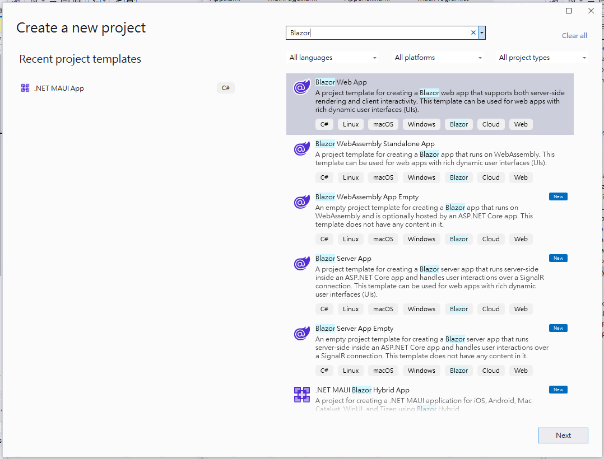
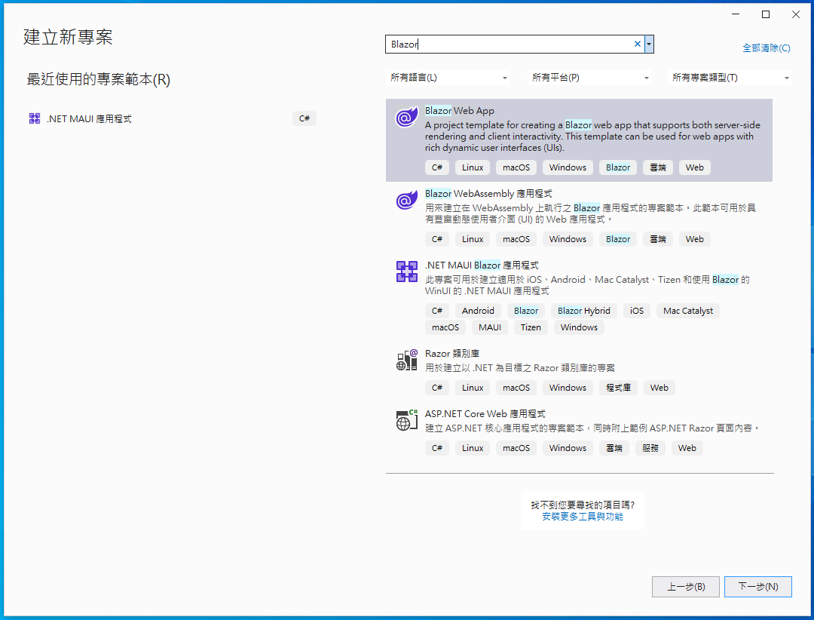
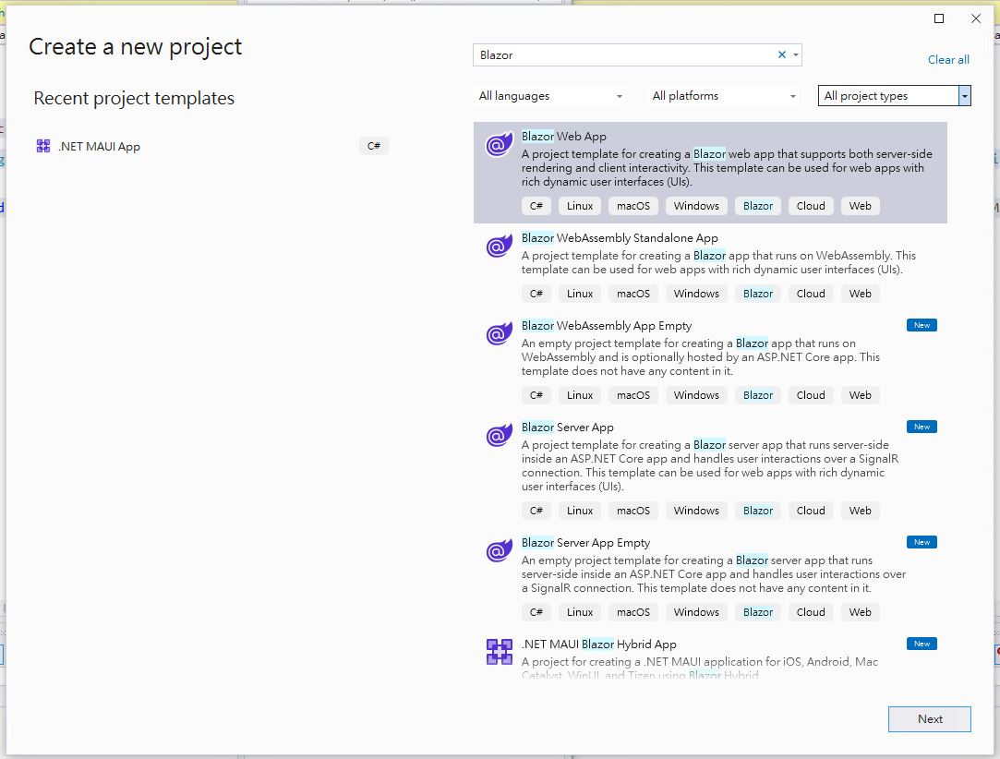

# # 比較 .NET 8 & 7 Blazor 專案範本差異

## Visual Studio 2022 Blazor 專案範本

### .NET 8

* [Blazor Web App]
  A project template for creating a Blazor web app that supports both server-side rendering and client interactivity. This template can be used for web apps with rich dynamic user interfaces (Uls).
* [Blazor WebAssembly Standalone App]
  A project template for creating a Blazor app that runs on WebAssembly. This template can be used for web apps with rich dynamic user interfaces (Uls).
* [Blazor WebAssembly App Empty]
  An empty project template for creating a Blazor app that runs on WebAssembly and is optionally hosted by an ASP.NET Core app. This template does not have any content in it.
* [Blazor Server App]
  A project template for creating a Blazor server app that runs server-side inside an ASP.NET Core app and handles user interactions over a SignalR connection.This template can be used for web apps with rich dynamic user interfaces (Uls).
* [Blazor Server App Empty]
  An empty project template for creating a Blazor server app that runs server-side inside an ASP.NET Core app and handles user interactions over a SignalR connection. This template does not have any content in it.
* [.NET MAUI Blazor Hybrid App]
  A project for creating a .NET MAUI application for iOS, Android, Mac Catalyst, WinUl, and Tizen using Blazor Hybrid

底下為中文介面的專案範本，可以看出明顯的比起英文版的可用專案範本項目少了許多。

### .NET 7

## 

### .NET 8

### .NET 7

## 

### .NET 8

### .NET 7

## 

### .NET 8

### .NET 7

## 

### .NET 8

### .NET 7

## 

### .NET 8

### .NET 7

## 

### .NET 8

### .NET 7

## 

### .NET 8

### .NET 7

## 

### .NET 8

### .NET 7

## 

### .NET 8

### .NET 7

## 

### .NET 8

### .NET 7

## 

### .NET 8

### .NET 7

