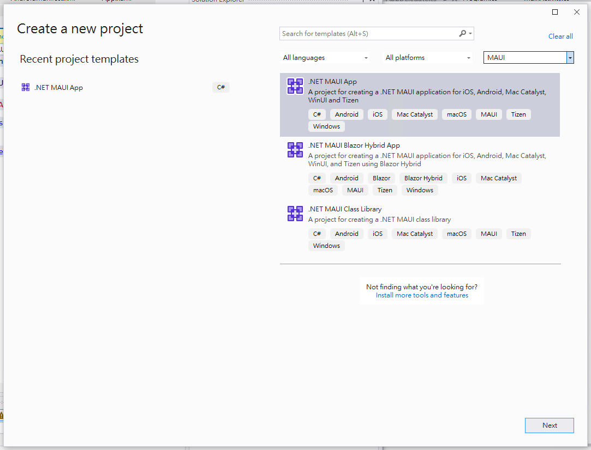
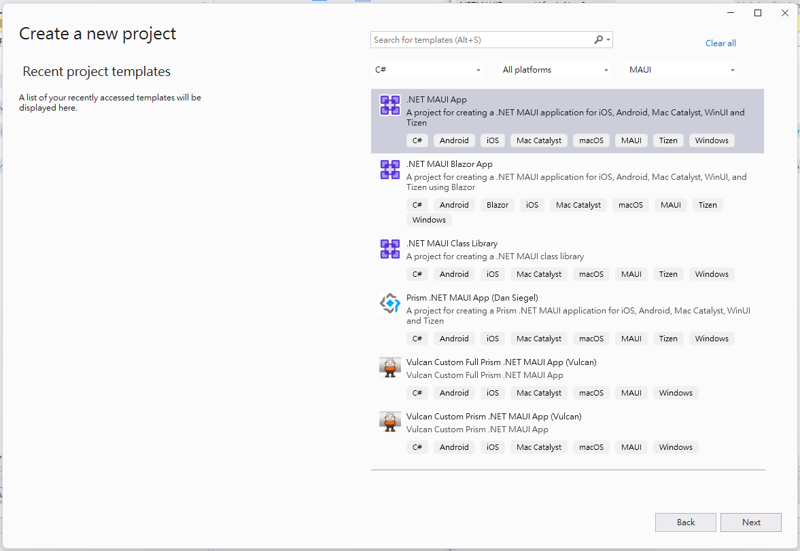
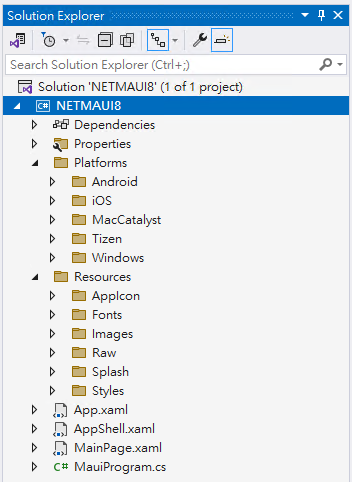
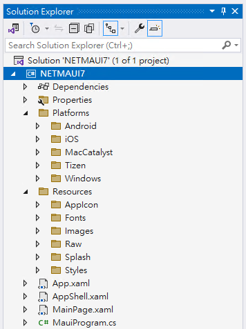

# 比較 .NET 8 & 7 MAUI 專案範本差異

## 專案範本

### .NET 8



### .NET 7



## 專案結構

### .NET 8



### .NET 7



## Project Template

### .NET 8

```xml
<Project Sdk="Microsoft.NET.Sdk">

	<PropertyGroup>
		<TargetFrameworks>net8.0-android;net8.0-ios;net8.0-maccatalyst</TargetFrameworks>
		<TargetFrameworks Condition="$([MSBuild]::IsOSPlatform('windows'))">$(TargetFrameworks);net8.0-windows10.0.19041.0</TargetFrameworks>
		<!-- Uncomment to also build the tizen app. You will need to install tizen by following this: https://github.com/Samsung/Tizen.NET -->
		<!-- <TargetFrameworks>$(TargetFrameworks);net8.0-tizen</TargetFrameworks> -->

		<!-- Note for MacCatalyst:
		The default runtime is maccatalyst-x64, except in Release config, in which case the default is maccatalyst-x64;maccatalyst-arm64.
		When specifying both architectures, use the plural <RuntimeIdentifiers> instead of the singular <RuntimeIdentifer>.
		The Mac App Store will NOT accept apps with ONLY maccatalyst-arm64 indicated;
		either BOTH runtimes must be indicated or ONLY macatalyst-x64. -->
		<!-- For example: <RuntimeIdentifiers>maccatalyst-x64;maccatalyst-arm64</RuntimeIdentifiers> -->

		<OutputType>Exe</OutputType>
		<RootNamespace>NETMAUI8</RootNamespace>
		<UseMaui>true</UseMaui>
		<SingleProject>true</SingleProject>
		<ImplicitUsings>enable</ImplicitUsings>

		<!-- Display name -->
		<ApplicationTitle>NETMAUI8</ApplicationTitle>

		<!-- App Identifier -->
		<ApplicationId>com.companyname.netmaui8</ApplicationId>

		<!-- Versions -->
		<ApplicationDisplayVersion>1.0</ApplicationDisplayVersion>
		<ApplicationVersion>1</ApplicationVersion>

		<SupportedOSPlatformVersion Condition="$([MSBuild]::GetTargetPlatformIdentifier('$(TargetFramework)')) == 'ios'">11.0</SupportedOSPlatformVersion>
		<SupportedOSPlatformVersion Condition="$([MSBuild]::GetTargetPlatformIdentifier('$(TargetFramework)')) == 'maccatalyst'">13.1</SupportedOSPlatformVersion>
		<SupportedOSPlatformVersion Condition="$([MSBuild]::GetTargetPlatformIdentifier('$(TargetFramework)')) == 'android'">21.0</SupportedOSPlatformVersion>
		<SupportedOSPlatformVersion Condition="$([MSBuild]::GetTargetPlatformIdentifier('$(TargetFramework)')) == 'windows'">10.0.17763.0</SupportedOSPlatformVersion>
		<TargetPlatformMinVersion Condition="$([MSBuild]::GetTargetPlatformIdentifier('$(TargetFramework)')) == 'windows'">10.0.17763.0</TargetPlatformMinVersion>
		<SupportedOSPlatformVersion Condition="$([MSBuild]::GetTargetPlatformIdentifier('$(TargetFramework)')) == 'tizen'">6.5</SupportedOSPlatformVersion>
	</PropertyGroup>

	<ItemGroup>
		<!-- App Icon -->
		<MauiIcon Include="Resources\AppIcon\appicon.svg" ForegroundFile="Resources\AppIcon\appiconfg.svg" Color="#512BD4" />

		<!-- Splash Screen -->
		<MauiSplashScreen Include="Resources\Splash\splash.svg" Color="#512BD4" BaseSize="128,128" />

		<!-- Images -->
		<MauiImage Include="Resources\Images\*" />
		<MauiImage Update="Resources\Images\dotnet_bot.svg" BaseSize="168,208" />

		<!-- Custom Fonts -->
		<MauiFont Include="Resources\Fonts\*" />

		<!-- Raw Assets (also remove the "Resources\Raw" prefix) -->
		<MauiAsset Include="Resources\Raw\**" LogicalName="%(RecursiveDir)%(Filename)%(Extension)" />
	</ItemGroup>

	<ItemGroup>
		<PackageReference Include="Microsoft.Maui.Controls" Version="$(MauiVersion)" />
		<PackageReference Include="Microsoft.Maui.Controls.Compatibility" Version="$(MauiVersion)" />
		<PackageReference Include="Microsoft.Extensions.Logging.Debug" Version="8.0.0-rc.2.23479.6" />
	</ItemGroup>

	<!-- Build Properties must be defined within these property groups to ensure successful publishing
       to the Mac App Store. See: https://aka.ms/maui-publish-app-store#define-build-properties-in-your-project-file -->
  <PropertyGroup Condition="$(TargetFramework.Contains('-maccatalyst')) and '$(Configuration)' == 'Debug'">
    <CodesignEntitlements>Platforms/MacCatalyst/Entitlements.Debug.plist</CodesignEntitlements>
  </PropertyGroup>

  <PropertyGroup Condition="$(TargetFramework.Contains('-maccatalyst')) and '$(Configuration)' == 'Release'">
    <CodesignEntitlements>Platforms/MacCatalyst/Entitlements.Release.plist</CodesignEntitlements>
    <UseHardenedRuntime>true</UseHardenedRuntime>
  </PropertyGroup>
</Project>
```

### .NET 7

```xml
<Project Sdk="Microsoft.NET.Sdk">

	<PropertyGroup>
		<TargetFrameworks>net7.0-android;net7.0-ios;net7.0-maccatalyst</TargetFrameworks>
		<TargetFrameworks Condition="$([MSBuild]::IsOSPlatform('windows'))">$(TargetFrameworks);net7.0-windows10.0.19041.0</TargetFrameworks>
		<!-- Uncomment to also build the tizen app. You will need to install tizen by following this: https://github.com/Samsung/Tizen.NET -->
		<!-- <TargetFrameworks>$(TargetFrameworks);net7.0-tizen</TargetFrameworks> -->
		<OutputType>Exe</OutputType>
		<RootNamespace>NETMAUI7</RootNamespace>
		<UseMaui>true</UseMaui>
		<SingleProject>true</SingleProject>
		<ImplicitUsings>enable</ImplicitUsings>

		<!-- Display name -->
		<ApplicationTitle>NETMAUI7</ApplicationTitle>

		<!-- App Identifier -->
		<ApplicationId>com.companyname.netmaui7</ApplicationId>
		<ApplicationIdGuid>eecea58d-5648-46b9-af92-0615912e936e</ApplicationIdGuid>

		<!-- Versions -->
		<ApplicationDisplayVersion>1.0</ApplicationDisplayVersion>
		<ApplicationVersion>1</ApplicationVersion>

		<SupportedOSPlatformVersion Condition="$([MSBuild]::GetTargetPlatformIdentifier('$(TargetFramework)')) == 'ios'">11.0</SupportedOSPlatformVersion>
		<SupportedOSPlatformVersion Condition="$([MSBuild]::GetTargetPlatformIdentifier('$(TargetFramework)')) == 'maccatalyst'">13.1</SupportedOSPlatformVersion>
		<SupportedOSPlatformVersion Condition="$([MSBuild]::GetTargetPlatformIdentifier('$(TargetFramework)')) == 'android'">21.0</SupportedOSPlatformVersion>
		<SupportedOSPlatformVersion Condition="$([MSBuild]::GetTargetPlatformIdentifier('$(TargetFramework)')) == 'windows'">10.0.17763.0</SupportedOSPlatformVersion>
		<TargetPlatformMinVersion Condition="$([MSBuild]::GetTargetPlatformIdentifier('$(TargetFramework)')) == 'windows'">10.0.17763.0</TargetPlatformMinVersion>
		<SupportedOSPlatformVersion Condition="$([MSBuild]::GetTargetPlatformIdentifier('$(TargetFramework)')) == 'tizen'">6.5</SupportedOSPlatformVersion>
	</PropertyGroup>

	<ItemGroup>
		<!-- App Icon -->
		<MauiIcon Include="Resources\AppIcon\appicon.svg" ForegroundFile="Resources\AppIcon\appiconfg.svg" Color="#512BD4" />

		<!-- Splash Screen -->
		<MauiSplashScreen Include="Resources\Splash\splash.svg" Color="#512BD4" BaseSize="128,128" />

		<!-- Images -->
		<MauiImage Include="Resources\Images\*" />
		<MauiImage Update="Resources\Images\dotnet_bot.svg" BaseSize="168,208" />

		<!-- Custom Fonts -->
		<MauiFont Include="Resources\Fonts\*" />

		<!-- Raw Assets (also remove the "Resources\Raw" prefix) -->
		<MauiAsset Include="Resources\Raw\**" LogicalName="%(RecursiveDir)%(Filename)%(Extension)" />
	</ItemGroup>

	<ItemGroup>
		<PackageReference Include="Microsoft.Extensions.Logging.Debug" Version="7.0.0" />
	</ItemGroup>

</Project>
```

## MauiProgram.cs

### .NET 8

```csharp
using Microsoft.Extensions.Logging;

namespace NETMAUI8
{
    public static class MauiProgram
    {
        public static MauiApp CreateMauiApp()
        {
            var builder = MauiApp.CreateBuilder();
            builder
                .UseMauiApp<App>()
                .ConfigureFonts(fonts =>
                {
                    fonts.AddFont("OpenSans-Regular.ttf", "OpenSansRegular");
                    fonts.AddFont("OpenSans-Semibold.ttf", "OpenSansSemibold");
                });

#if DEBUG
    		builder.Logging.AddDebug();
#endif

            return builder.Build();
        }
    }
}
```

### .NET 7

```csharp
using Microsoft.Extensions.Logging;

namespace NETMAUI7;

public static class MauiProgram
{
	public static MauiApp CreateMauiApp()
	{
		var builder = MauiApp.CreateBuilder();
		builder
			.UseMauiApp<App>()
			.ConfigureFonts(fonts =>
			{
				fonts.AddFont("OpenSans-Regular.ttf", "OpenSansRegular");
				fonts.AddFont("OpenSans-Semibold.ttf", "OpenSansSemibold");
			});

#if DEBUG
		builder.Logging.AddDebug();
#endif

		return builder.Build();
	}
}
```

## AppShell.xaml

### .NET 8

```xml
<?xml version="1.0" encoding="UTF-8" ?>
<Shell
    x:Class="NETMAUI8.AppShell"
    xmlns="http://schemas.microsoft.com/dotnet/2021/maui"
    xmlns:x="http://schemas.microsoft.com/winfx/2009/xaml"
    xmlns:local="clr-namespace:NETMAUI8"
    Shell.FlyoutBehavior="Disabled"
    Title="NETMAUI8">

    <ShellContent
        Title="Home"
        ContentTemplate="{DataTemplate local:MainPage}"
        Route="MainPage" />

</Shell>
```

### .NET 7

```xml
<?xml version="1.0" encoding="UTF-8" ?>
<Shell
    x:Class="NETMAUI7.AppShell"
    xmlns="http://schemas.microsoft.com/dotnet/2021/maui"
    xmlns:x="http://schemas.microsoft.com/winfx/2009/xaml"
    xmlns:local="clr-namespace:NETMAUI7"
    Shell.FlyoutBehavior="Disabled">

    <ShellContent
        Title="Home"
        ContentTemplate="{DataTemplate local:MainPage}"
        Route="MainPage" />

</Shell>
```

## App.xaml

### .NET 8

```xml
<?xml version = "1.0" encoding = "UTF-8" ?>
<Application xmlns="http://schemas.microsoft.com/dotnet/2021/maui"
             xmlns:x="http://schemas.microsoft.com/winfx/2009/xaml"
             xmlns:local="clr-namespace:NETMAUI8"
             x:Class="NETMAUI8.App">
    <Application.Resources>
        <ResourceDictionary>
            <ResourceDictionary.MergedDictionaries>
                <ResourceDictionary Source="Resources/Styles/Colors.xaml" />
                <ResourceDictionary Source="Resources/Styles/Styles.xaml" />
            </ResourceDictionary.MergedDictionaries>
        </ResourceDictionary>
    </Application.Resources>
</Application>
```

### .NET 7

```xml
<?xml version = "1.0" encoding = "UTF-8" ?>
<Application xmlns="http://schemas.microsoft.com/dotnet/2021/maui"
             xmlns:x="http://schemas.microsoft.com/winfx/2009/xaml"
             xmlns:local="clr-namespace:NETMAUI7"
             x:Class="NETMAUI7.App">
    <Application.Resources>
        <ResourceDictionary>
            <ResourceDictionary.MergedDictionaries>
                <ResourceDictionary Source="Resources/Styles/Colors.xaml" />
                <ResourceDictionary Source="Resources/Styles/Styles.xaml" />
            </ResourceDictionary.MergedDictionaries>
        </ResourceDictionary>
    </Application.Resources>
</Application>
```

## Android MainActivity.cs

### .NET 8

```csharp
using Android.App;
using Android.Content.PM;
using Android.OS;

namespace NETMAUI8
{
    [Activity(Theme = "@style/Maui.SplashTheme", MainLauncher = true, ConfigurationChanges = ConfigChanges.ScreenSize | ConfigChanges.Orientation | ConfigChanges.UiMode | ConfigChanges.ScreenLayout | ConfigChanges.SmallestScreenSize | ConfigChanges.Density)]
    public class MainActivity : MauiAppCompatActivity
    {
    }
}
```

### .NET 7

```csharp
using Android.App;
using Android.Content.PM;
using Android.OS;

namespace NETMAUI7;

[Activity(Theme = "@style/Maui.SplashTheme", MainLauncher = true, ConfigurationChanges = ConfigChanges.ScreenSize | ConfigChanges.Orientation | ConfigChanges.UiMode | ConfigChanges.ScreenLayout | ConfigChanges.SmallestScreenSize | ConfigChanges.Density)]
public class MainActivity : MauiAppCompatActivity
{
}
```

## iOS AppDelegate.cs

### .NET 8

```csharp
using Foundation;

namespace NETMAUI8
{
    [Register("AppDelegate")]
    public class AppDelegate : MauiUIApplicationDelegate
    {
        protected override MauiApp CreateMauiApp() => MauiProgram.CreateMauiApp();
    }
}
```

### .NET 7

```csharp
using Foundation;

namespace NETMAUI7;

[Register("AppDelegate")]
public class AppDelegate : MauiUIApplicationDelegate
{
	protected override MauiApp CreateMauiApp() => MauiProgram.CreateMauiApp();
}
```


