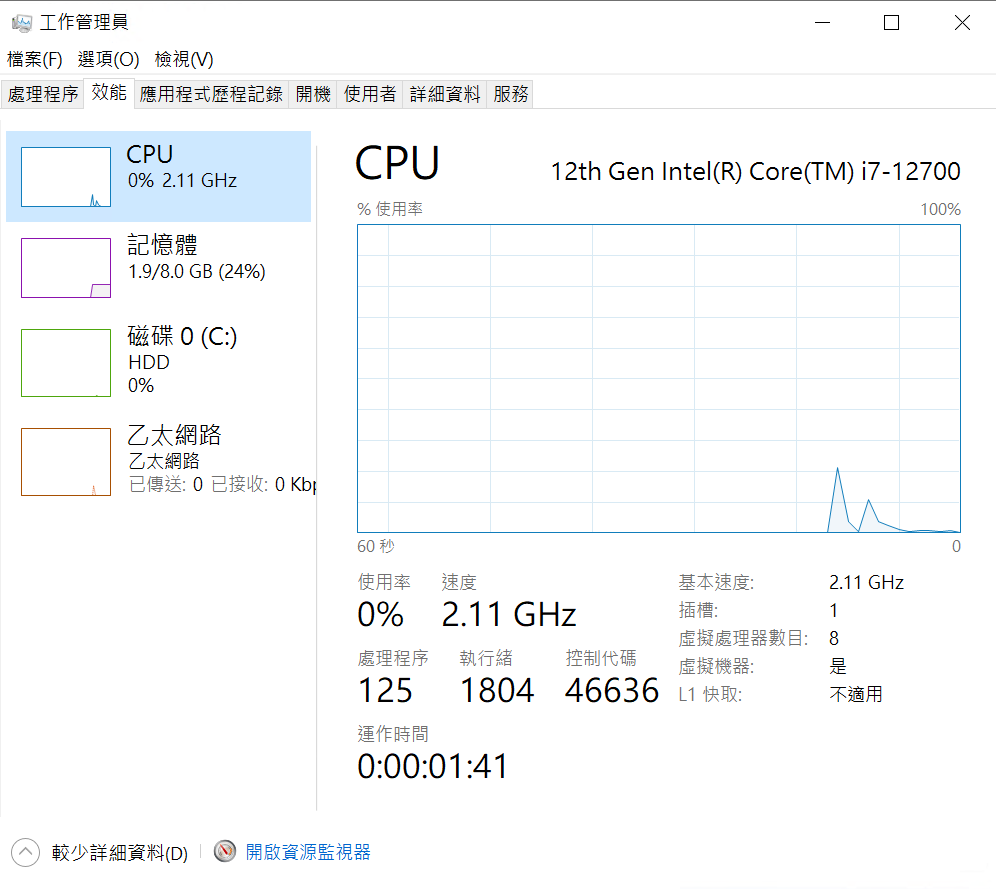
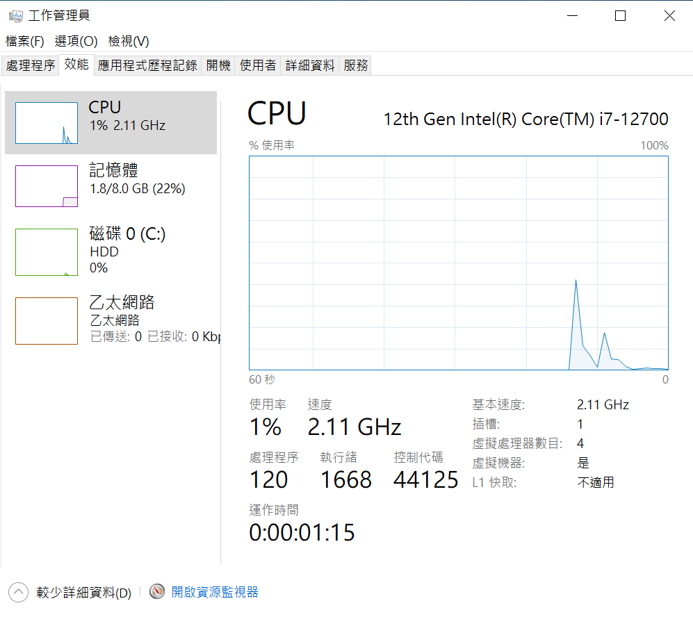
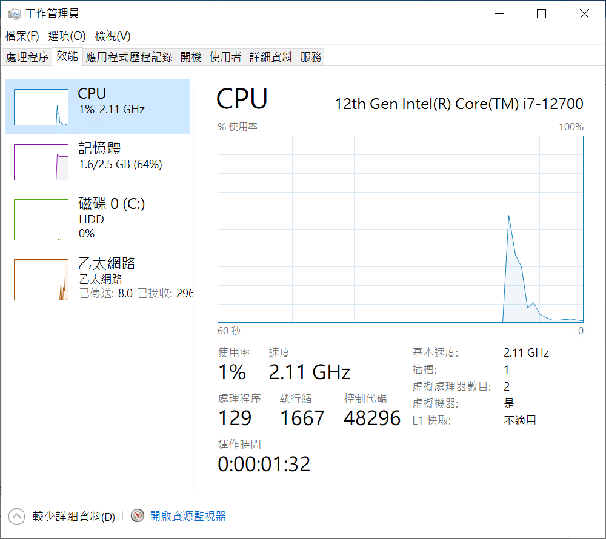
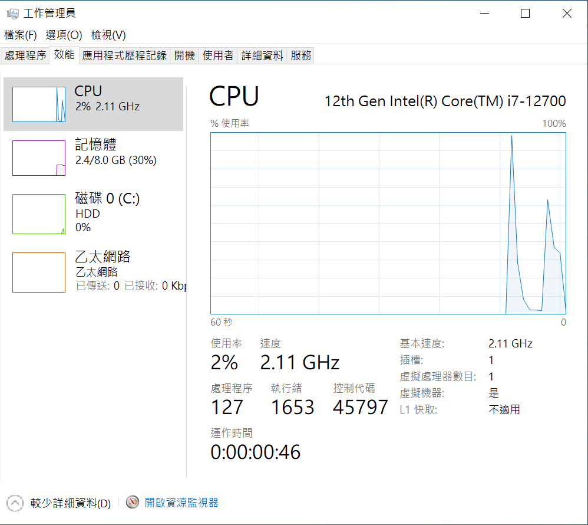

# 在 C# 內，透過 PLinq 的 AsParallel 方法做到多執行緒與平行化處理剖析


我最近這幾年對於 .NET 開發環境的非同步、平行處理等相關議題與需求，做了大量的研究、閱讀的相當多量的文章或者書籍，並且將這些經驗整理出相關簡報與說明範例程式碼；也有幸的能夠開設五種非同步或平行程式設計課程，透過實際與不同學員交流，將如何有效、正確地寫出好的非同步程式碼告訴更多的人。

可是，畢竟對於這方面的議題，還是存在著相當大的技術門檻，對於一般的開發者來說，這些議題還是相當的難以理解與掌握，因此，我在這裡將會透過一系列的文章，來說明如何有效地使用 .NET 開發環境內的非同步、平行處理等相關議題與需求。

首先登場的就是關於要使用 PLinq 的 AsParallel 方法，來改善原先 Linq 的查詢速度的問題。

不論是在網路的開發討論論壇、技術文章中，都會提到 PLinq & AsParallel 這兩個名詞，首先，先來了解這兩個名詞是甚麼？

* Linq

  根據微軟的官方網頁 [LINQ 查詢簡介 (C#)](https://learn.microsoft.com/zh-tw/dotnet/csharp/programming-guide/concepts/linq/introduction-to-linq-queries?WT.mc_id=DT-MVP-5002220) 的解釋 : 「查詢」是指從資料來源中擷取資料的運算式。 查詢通常以特定的查詢語言來表示。 針對各種資料來源類型開發不同的語言已有一段時間，例如用於關聯式資料庫的 SQL，以及用於 XML 的 XQuery。 因此，開發人員在過去必須針對所需支援的每種資料來源類型或資料格式，學習新的查詢語言。 LINQ 提供一致的查詢模型，以便處理各種資料來源和格式的資料，因此可簡化此情況。 在 LINQ 查詢中，您所處理的一定是物件。 您可以使用相同的基本程式碼模式來查詢和轉換 XML 檔、SQL 資料庫、ADO.NET 資料集、.NET 集合中的資料，以及 LINQ 提供者可供使用的任何其他格式。

* PLinq

  根據微軟的官方網頁 [PLINQ 簡介](https://learn.microsoft.com/zh-tw/dotnet/standard/parallel-programming/introduction-to-plinq?WT.mc_id=DT-MVP-5002220) 的解釋 : 平行 LINQ (PLINQ) 是 Language-Integrated Query (LINQ) 模式的平行實作。 PLINQ 實作了一組完整的 LINQ 標準查詢運算子來作為 System.Linq 命名空間的擴充方法，並具有其他運算子可供平行作業使用。 PLINQ 結合了 LINQ 語法簡單易懂的特性以及平行程式設計的威力。

* AsParallel

  啟用查詢的平行化作業

因此，若有大量查詢要處理，是否可以啟用查詢的平行化作業，就可以大幅加速整體查詢速度，又或者當有多個工作想要平行處理，將要平行處理的資料做成可列舉型態的物件，接著就可以做到平行處理的程式設計需求。

有著這樣的想法的人不在少數，然而，撞牆的開發者也佔絕大多數，最後因為無法真正使用平行化技術來解決原先問題，而自行判斷與下出結論，認為平行化技術無法解決眼前問題，然而，真的是這樣嗎？究竟是所遇到的問題真的無法使用平行程式設計方法來處理，還是當時問題的 API 無法用於平行處理，又或者是對於 I/O 或者 CPU 密集處理判斷或認知錯誤等等問題，使得無法徹底解決問題。

由於許多不正確的認知、想法、觀念、做法，著實無法一一來解釋說明，因此，只好針對不同情境，進行詳細的解剖與分析，透過有系統化的工程手法，進行驗證與測試，了解到平行處理上背後的真正運作方式，讓開發者可以實際活用這方面的技術。

在這篇文章中，將會針對一個需求，這裡會面對到有個 I/O Bound 方面的工作，也許是要做 PDF 檔案產生或者要產生 HTML 文件檔案，因為將會一次需要做到許多檔案的產生作業，立即想到可以透過平行作業方式來提升全部執行效能的提升，不用透過同步方式，一個一個的檔案來產生，造成要生成這些文件檔案需要耗時很久的時間。

因此，將需要生成檔案的資料，都先放到一個可列舉的物件內，接著透過 PLinq 提供的平行化處理功能，做到提升執行速度的結果。會使用這樣例子來說明，這是因為我有看到一個這樣的案例，因為使用了 PLinq 技術，結果還是無法提升整體執行速度，而聽到的結論是，可能使用的 API 有使用了互相鎖定機制而造成無法提升執行速度效果。

不過，在這裡將會解析隱藏在 PLinq 又或者是 [.NET 中的平行程式設計](https://learn.microsoft.com/zh-tw/dotnet/standard/parallel-programming/?WT.mc_id=DT-MVP-5002220) 內使用到的 [工作平行程式庫 (TPL Task Parallel Library)](https://learn.microsoft.com/zh-tw/dotnet/standard/parallel-programming/task-parallel-library-tpl?WT.mc_id=DT-MVP-5002220) 技術後面的原理。一旦，理解與明瞭這樣的設計與運作方式，日後就可以很容易地解決相關問題，而不會找出許多文不對題的解釋理由。

## 建立 PLinq 的 AsParallel 方法 測試專案

為了簡化測試用專案的複雜度，因此，在這裡將會建立一個 Console 主控台應用類型的專案。

* 打開 Visual Studio 2022 IDE 應用程式
* 從 [Visual Studio 2022] 對話窗中，點選右下方的 [建立新的專案] 按鈕
* 在 [建立新專案] 對話窗右半部
  * 切換 [所有語言 (L)] 下拉選單控制項為 [C#]
  * 切換 [所有專案類型 (T)] 下拉選單控制項為 [主控台]
* 在中間的專案範本清單中，找到並且點選 [主控台應用程式] 專案範本選項
  > 專案，用於建立可在 Windows、Linux 及 macOS 於 .NET 執行的命令列應用程式
* 點選右下角的 [下一步] 按鈕
* 在 [設定新的專案] 對話窗
* 找到 [專案名稱] 欄位，輸入 `csAsParallel` 作為專案名稱
* 在剛剛輸入的 [專案名稱] 欄位下方，確認沒有勾選 [將解決方案與專案至於相同目錄中] 這個檢查盒控制項
* 點選右下角的 [下一步] 按鈕
* 現在將會看到 [其他資訊] 對話窗
* 在 [架構] 欄位中，請選擇最新的開發框架，這裡選擇的 [架構] 是 : `.NET 7.0 (標準字詞支援)`
* 在這個練習中，需要去勾選 [不要使用最上層陳述式(T)] 這個檢查盒控制項
  > 這裡的這個操作，可以由讀者自行決定是否要勾選這個檢查盒控制項
* 請點選右下角的 [建立] 按鈕

稍微等候一下，這個主控台專案將會建立完成

## 撰寫測試用的程式碼

* 在此專案節點下，找到並且打開 [Program.cs] 這個檔案
* 使用底下 C# 程式碼替換掉 [Program.cs] 檔案內所有程式碼內容

```csharp
namespace csAsParallel
{
    internal class Program
    {
        static void Main(string[] args)
        {
            var source = Enumerable.Range(1, 10000);

            var evenNums = source.AsParallel()
                .Select(ShowInfo);

            Console.WriteLine($"Total {evenNums.Count()}");
        }

        static int ShowInfo(int n)
        {
            Console.WriteLine($"N={n:d6} {DateTime.Now:mm:ss} - {n} / Thread ID {Thread.CurrentThread.ManagedThreadId}");
            Thread.Sleep(5000);
            return n;
        }
    }  
}
```

在這裡將會使用 [Enumerable.Range(1, 10000)] 方法，產生出 10 萬個整數數值列舉物件， source ，接著對這個列著列舉物件下達 AsParallel() 方法呼叫，讓這個 Linq 敘述，轉換成為要使用 PLinq 平行處理的計算方式。

最後，使用了 Select(ShowInfo) 方法，產生出新的列舉值，不過，這裡所生成的列舉值，將會使用平行處理方式來處理。

對於 [ShowInfo] 這個方法，將會使用 Thread.Sleep(5000) 方法，模擬要產生 PDF 或者 HTML 檔案所要花費的時間，而在這個方法之前，將會列出所接收到的列舉項目的數值(整數值)，當時的時間，當前所用的執行緒 ID。

整體看來，這個範例程式似乎相當的簡單與容易了解，解設當產生的列舉值總共有 100 個，身為開發者的你，可以預期、預估這個程式碼需要耗費多少的時間才能夠執行完成執行完成呢？

是要 100 * 5 (秒) = 500 (秒) ， 還是全部執行完成僅需要 5 秒呢？身為讀者的你會認為需要多久的時間呢？若真的全部完成需要 5 秒，真的做得到嗎?

現在開始來解開隱藏在背後的祕密之一

## 在 8 個邏輯處理器下的運行結果

將上述的專案採用底下的模式來發布

* 採用發佈到資料夾模式
* 部署模式設定為 獨立式
* 目標執行階段設定為 win-x64
* 檔案發行選項內要勾選 產生單一檔案 與 修剪未使用的程式碼
* 底下為發布後所產生的檔案


現在準備了一台具有 8 個邏輯處器的主機，將發布後的兩個檔案複製到這台主機上

透過工作管理員視窗內 [效能] > [CPU] 看到相關 CPU 效能數據，其中在右下角區域，將會看到虛擬邏輯處理器數量確定為 8



透過命令提示字元視窗來執行這個 csAsParallel.exe 程式，將會看到底下輸出結果

```
C:\Vulcan\win-x64>csAsParallel.exe
N=000001 20:48 - 1 / Thread ID 1
N=000008 20:48 - 8 / Thread ID 11
N=000006 20:48 - 6 / Thread ID 9
N=000005 20:48 - 5 / Thread ID 8
N=000007 20:48 - 7 / Thread ID 10
N=000002 20:48 - 2 / Thread ID 4
N=000004 20:48 - 4 / Thread ID 7
N=000003 20:48 - 3 / Thread ID 6
N=000009 20:53 - 9 / Thread ID 4
N=000012 20:53 - 12 / Thread ID 8
N=000010 20:53 - 10 / Thread ID 6
N=000013 20:53 - 13 / Thread ID 1
N=000011 20:53 - 11 / Thread ID 7
N=000014 20:53 - 14 / Thread ID 10
N=000015 20:53 - 15 / Thread ID 9
N=000016 20:53 - 16 / Thread ID 11
N=000017 20:58 - 17 / Thread ID 11
N=000024 20:58 - 24 / Thread ID 8
N=000019 20:58 - 19 / Thread ID 9
N=000020 20:58 - 20 / Thread ID 1
N=000021 20:58 - 21 / Thread ID 4
N=000022 20:58 - 22 / Thread ID 10
N=000023 20:58 - 23 / Thread ID 7
N=000018 20:58 - 18 / Thread ID 6
^C
C:\Vulcan\win-x64>
```

從上面的執行結果文字，可以看到

* 這台具有 8 個邏輯處理器電腦，每 5 秒鐘，同時執行 8 八個執行緒
* 當 5 秒鐘過後，又會有另外 8 個執行緒跑起來，每個執行緒需要 5 秒執行時間
* 從 N 這個後面的值看到，這個 PLinq 敘述其實把整個列舉數值，切割成為 8 個區塊 Chunk ，每個 Chunk 內的整數列舉，將會依序交給一個執行緒來執行
* 每次需要執行緒來執行程式碼的時候，將會透過執行緒集區來取得一個執行緒來執行委派方法

結論：因為這台電腦具有 8 個邏輯處理器，因為， PLinq 會將整個列舉整數切割成為 8 個區塊，並且透過 8 個執行緒來處理每個區塊內的整數數值，因此，整體最終完成時間將會是 100000 / 8 * 5 = xxx 秒。

## 在 4 個邏輯處理器下的運行結果

現在準備了一台具有 4 個邏輯處器的主機，將發布後的兩個檔案複製到這台主機上

透過工作管理員視窗內 [效能] > [CPU] 看到相關 CPU 效能數據，其中在右下角區域，將會看到虛擬邏輯處理器數量確定為 4



透過命令提示字元視窗來執行這個 csAsParallel.exe 程式，將會看到底下輸出結果

```
C:\Vulcan\win-x64>csAsParallel.exe
N=000003 18:45 - 3 / Thread ID 4
N=000001 18:45 - 1 / Thread ID 1
N=000002 18:45 - 2 / Thread ID 7
N=000004 18:45 - 4 / Thread ID 6
N=000006 18:50 - 6 / Thread ID 4
N=000007 18:50 - 7 / Thread ID 1
N=000005 18:50 - 5 / Thread ID 7
N=000008 18:50 - 8 / Thread ID 6
N=000012 18:55 - 12 / Thread ID 7
N=000011 18:55 - 11 / Thread ID 1
N=000009 18:55 - 9 / Thread ID 6
N=000010 18:55 - 10 / Thread ID 4
N=000016 19:00 - 16 / Thread ID 7
N=000013 19:00 - 13 / Thread ID 1
N=000015 19:00 - 15 / Thread ID 4
N=000014 19:00 - 14 / Thread ID 6
N=000018 19:05 - 18 / Thread ID 4
N=000019 19:05 - 19 / Thread ID 1
N=000017 19:05 - 17 / Thread ID 6
N=000020 19:05 - 20 / Thread ID 7
^C
C:\Vulcan\win-x64>
```

從上面的執行結果文字，可以看到

* 這台具有 4 個邏輯處理器電腦，每 5 秒鐘，同時執行 4 八個執行緒
* 當 5 秒鐘過後，又會有另外 4 個執行緒跑起來，每個執行緒需要 5 秒執行時間
* 從 N 這個後面的值看到，這個 PLinq 敘述其實把整個列舉數值，切割成為 4 個區塊 Chunk ，每個 Chunk 內的整數列舉，將會依序交給一個執行緒來執行
* 每次需要執行緒來執行程式碼的時候，將會透過執行緒集區來取得一個執行緒來執行委派方法

結論：因為這台電腦具有 4 個邏輯處理器，因為， PLinq 會將整個列舉整數切割成為 4 個區塊，並且透過 4 個執行緒來處理每個區塊內的整數數值，因此，整體最終完成時間將會是 100000 / 8 * 5 = xxx 秒。

## 在 2 個邏輯處理器下的運行結果

現在準備了一台具有 2 個邏輯處器的主機，將發布後的兩個檔案複製到這台主機上

透過工作管理員視窗內 [效能] > [CPU] 看到相關 CPU 效能數據，其中在右下角區域，將會看到虛擬邏輯處理器數量確定為 2



透過命令提示字元視窗來執行這個 csAsParallel.exe 程式，將會看到底下輸出結果

```
C:\Vulcan\win-x64>csAsParallel.exe
N=000001 33:43 - 1 / Thread ID 1
N=000002 33:43 - 2 / Thread ID 4
N=000003 33:48 - 3 / Thread ID 1
N=000004 33:48 - 4 / Thread ID 4
N=000005 33:53 - 5 / Thread ID 1
N=000006 33:53 - 6 / Thread ID 4
N=000007 33:58 - 7 / Thread ID 1
N=000008 33:58 - 8 / Thread ID 4
N=000009 34:03 - 9 / Thread ID 1
N=000010 34:03 - 10 / Thread ID 4
N=000011 34:08 - 11 / Thread ID 1
N=000012 34:08 - 12 / Thread ID 4
^C
C:\Vulcan\win-x64>
```

從上面的執行結果文字，可以看到

* 這台具有 2 個邏輯處理器電腦，每 5 秒鐘，同時執行 2 八個執行緒
* 當 5 秒鐘過後，又會有另外 2 個執行緒跑起來，每個執行緒需要 5 秒執行時間
* 從 N 這個後面的值看到，這個 PLinq 敘述其實把整個列舉數值，切割成為 2 個區塊 Chunk ，每個 Chunk 內的整數列舉，將會依序交給一個執行緒來執行
* 每次需要執行緒來執行程式碼的時候，將會透過執行緒集區來取得一個執行緒來執行委派方法

結論：因為這台電腦具有 2 個邏輯處理器，因為， PLinq 會將整個列舉整數切割成為 2 個區塊，並且透過 2 個執行緒來處理每個區塊內的整數數值，因此，整體最終完成時間將會是 100000 / 2 * 5 = xxx 秒。

## 在 1 個邏輯處理器下的運行結果

現在準備了一台具有 1 個邏輯處器的主機，將發布後的兩個檔案複製到這台主機上

透過工作管理員視窗內 [效能] > [CPU] 看到相關 CPU 效能數據，其中在右下角區域，將會看到虛擬邏輯處理器數量確定為 1



透過命令提示字元視窗來執行這個 csAsParallel.exe 程式，將會看到底下輸出結果

```
C:\Vulcan\win-x64>csAsParallel.exe
N=000001 39:05 - 1 / Thread ID 1
N=000002 39:10 - 2 / Thread ID 1
N=000003 39:15 - 3 / Thread ID 1
N=000004 39:20 - 4 / Thread ID 1
N=000005 39:25 - 5 / Thread ID 1
N=000006 39:30 - 6 / Thread ID 1
N=000007 39:35 - 7 / Thread ID 1
^C
C:\Vulcan\win-x64>
```

從上面的執行結果文字，可以看到

* 這台具有 1 個邏輯處理器電腦，每 5 秒鐘，同時執行 1 八個執行緒
* 當 5 秒鐘過後，又會有另外 1 個執行緒跑起來，每個執行緒需要 5 秒執行時間
* 從 N 這個後面的值看到，這個 PLinq 敘述其實把整個列舉數值，切割成為 1 個區塊 Chunk ，每個 Chunk 內的整數列舉，將會依序交給一個執行緒來執行
* 每次需要執行緒來執行程式碼的時候，將會透過執行緒集區來取得一個執行緒來執行委派方法

結論：因為這台電腦具有 1 個邏輯處理器，因為， PLinq 會將整個列舉整數切割成為 1 個區塊，並且透過 1 個執行緒來處理每個區塊內的整數數值，因此，整體最終完成時間將會是 100000 / 1 * 5 = xxx 秒。


