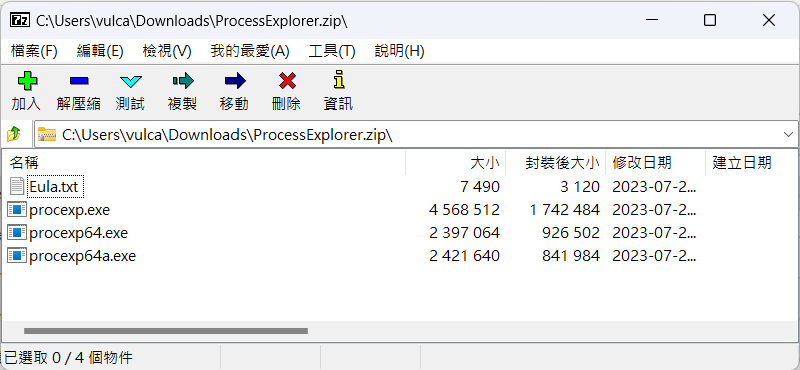
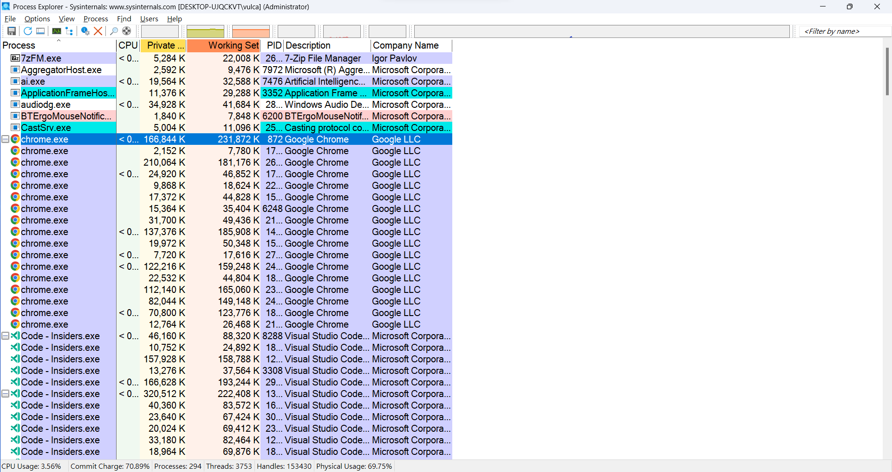
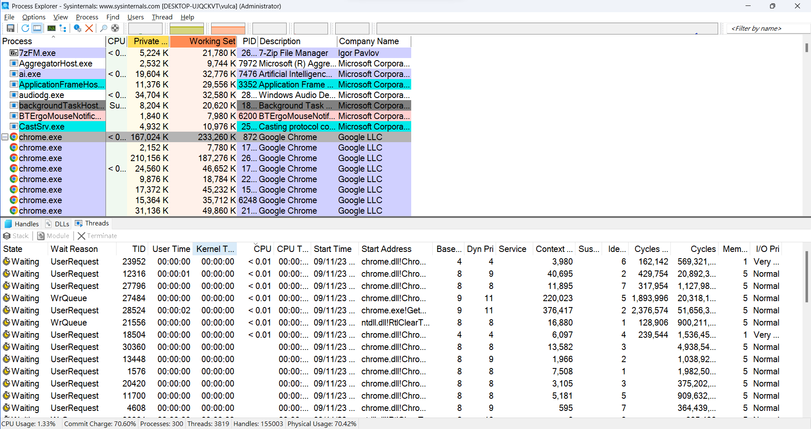
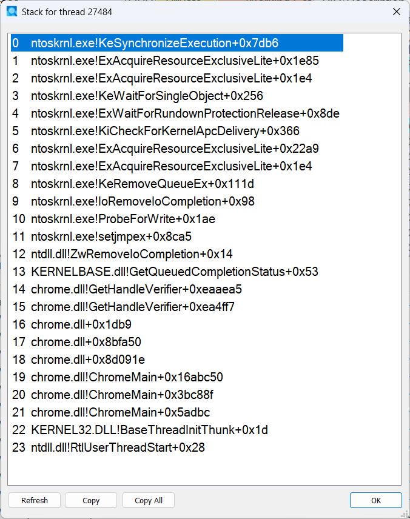

# 觀察 .NET CLR 執行緒或執行緒集區與作業系統內執行緒的關係


當使用 C# 開發出一套可以在 .NET CLR 環境下運行的程式，必定會遇到執行緒這樣的議題，然而，對於執行緒這個物件而言，這是由作業系統的核心模式內所提供的一個物件，對於執行緒而言，執行緒代表了程式執行的一個獨立單元。執行緒可以同時執行在同一個處理器上，以提高系統的運行效率。在 Windows OS 中，執行緒是作業系統進行資源分配和調度的一個基本單位。作業系統會根據執行緒的優先級來調度執行緒，以確保系統的穩定運行。

不過，.NET CLR 下的執行緒與 Windows 作業系統內的執行緒都是用來在同一個處理器上同時執行多個任務的工具。但是，兩者在控制權、記憶體管理、以及同步等方面存在一些差異。

關於 .NET CLR 下的執行緒 ： .NET CLR 下的執行緒是由 CLR 控制的。CLR 會根據執行緒的優先級來調度執行緒，並且會在執行緒之間進行同步。CLR 會為每個執行緒分配一個獨立的記憶體空間，並且會在執行緒結束時釋放記憶體。CLR 提供了多種同步機制來防止執行緒間的資料競爭。

關於 Windows 作業系統內的執行緒 ： Windows 作業系統內的執行緒是由作業系統控制的。作業系統會根據 CPU 的空閒情況來調度執行緒，並且會在執行緒之間進行同步。

.NET CLR 下的執行緒提供了更高的抽象性，可以讓開發人員專注於應用程式的邏輯，而不需要擔心底層的細節。Windows 作業系統內的執行緒提供了更大的控制權，可以讓開發人員根據自己的需求來調整執行緒的行為。

.NET CLR 下的執行緒與 Windows 作業系統內的執行緒存在著對應關係。

在 .NET CLR 下，每個執行緒都會對應到一個 Windows 作業系統內的執行緒。CLR 會將 .NET CLR 下的執行緒映射到 Windows 作業系統內的執行緒，並且會負責在兩者之間進行轉換。CLR 會根據 .NET CLR 下的執行緒的狀態來管理 Windows 作業系統內的執行緒。例如，如果 .NET CLR 下的執行緒被終止，則 CLR 會終止對應的 Windows 作業系統內的執行緒。

因此，可以說 .NET CLR 下的執行緒是 Windows 作業系統內執行緒的抽象。應用程式可以使用 .NET CLR 下的執行緒來編寫多執行緒程式，而不需要直接處理 Windows 作業系統內的執行緒。

不過，在 .NET CLR 下的執行集區與作業系統間的關係又是如何呢？我們知道一旦一個 .NET 應用程式啟動之後，在 .NET 下的執行緒集區理論上應該有相當於該主機邏輯處理器數量的執行緒存在，但是，事實是否是這樣了，這裡也想藉由這篇文來更深的探討 .NET 執行緒集區與作業系統內的執行緒關係。

## 下載與安裝 SysInternals 的 Process Explorer 工具

這篇文章將會透一個小範例程式碼，搭配 SysInternals 的 [Process Explorer](https://docs.microsoft.com/en-us/sysinternals/downloads/process-explorer) 這個工具，來觀察 .NET 執行緒集區與作業系統內的執行緒關係。

請先透過底下的連結，下載 SysInternals 的 Process Explorer這個工具，並且安裝起來。

https://docs.microsoft.com/en-us/sysinternals/downloads/process-explorer 

其實這個工具是不需要做任何安裝與設定工作的，只要下載下來，然後解壓縮，就可以直接使用了。

這個下載壓縮檔案內將會如下圖所示的內容



在我這台電腦上安裝的是 64 位元的作業系統，所以我會使用 [procexp64.exe] 這個執行檔來執行這個工具。

執行這個 Process Exprorer , procexp64.exe , 檔案，將會看到底下畫面



這是 SysInternals 提供的 Process Exprorer 執行畫面截圖，在這個畫面中，將會列出這台作業系統內所有的處理程序 Process 物件清單，請在這裡隨意點選一個處理程序，在這裡例子，點選是任何一個 chrome.exe 處理程序；當點選了一個處理程序之後，這個處理程序將會顯示違背景色為藍色的模式。

現在，想要知道這個處理程序在作業系統內已經使用到多少的執行緒，接下來僅需要按下 [Ctrl] + [L] 組合按鍵，就會在下方出現一個新的面板，在此面板上有三個分頁頁次，分別是 [Handles] , [Dlls] , [Threads]，此時顯示的正是執行緒分頁；這代表了這個處理程序擁有的執行緒。



在 [Threads] 分頁面板內，所以雙擊任何一個執行緒，將可以看到該執行緒的呼叫堆疊資訊，如下圖所示



## 建立 Console 類型專案

請依照底下的操作，建立起這篇文章需要用到的練習專案

* 打開 Visual Studio 2022 IDE 應用程式
* 從 [Visual Studio 2022] 對話窗中，點選右下方的 [建立新的專案] 按鈕
* 在 [建立新專案] 對話窗右半部
  * 切換 [所有語言 (L)] 下拉選單控制項為 [C#]
  * 切換 [所有專案類型 (T)] 下拉選單控制項為 [主控台]
* 在中間的專案範本清單中，找到並且點選 [主控台應用程式] 專案範本選項
  > 專案，用於建立可在 Windows、Linux 及 macOS 於 .NET 執行的命令列應用程式
* 點選右下角的 [下一步] 按鈕
* 在 [設定新的專案] 對話窗
* 找到 [專案名稱] 欄位，輸入 `AWatchThreadOnSystem` 作為專案名稱
* 在剛剛輸入的 [專案名稱] 欄位下方，確認沒有勾選 [將解決方案與專案至於相同目錄中] 這個檢查盒控制項
* 點選右下角的 [下一步] 按鈕
* 現在將會看到 [其他資訊] 對話窗
* 在 [架構] 欄位中，請選擇最新的開發框架，這裡選擇的 [架構] 是 : `.NET 7.0 (標準字詞支援)`
* 在這個練習中，需要去勾選 [不要使用最上層陳述式(T)] 這個檢查盒控制項
  > 這裡的這個操作，可以由讀者自行決定是否要勾選這個檢查盒控制項
* 請點選右下角的 [建立] 按鈕

稍微等候一下，這個主控台專案將會建立完成

## 安裝要用到的 NuGet 開發套件

因為開發此專案時會用到這些 NuGet 套件，請依照底下說明，將需要用到的 NuGet 套件安裝起來。

## 建立要使用 ILogger & NLog 套件的程式碼

* 在 [方案總管] 內找到並且開啟 [Program.cs] 檔案這個節點
* 使用底下 C# 程式碼，將原本的程式碼取代掉

```csharp
using Microsoft.Diagnostics.Runtime;
using System.Diagnostics;

namespace AWatchThreadOnSystem
{
    internal class Program
    {
        static void Main(string[] args)
        {
            while (true)
            {
                var key = Console.ReadKey();
                if (key.Key == ConsoleKey.S)
                {
                    ShowThreadInformation();
                }
                else if (key.Key == ConsoleKey.P)
                {
                    UsingThreadPool();
                }
                else if (key.Key == ConsoleKey.E)
                {
                    Environment.Exit(0);
                }
            }
        }

        private static void UsingThreadPool()
        {
            for (int i = 0; i < 8; i++)
            {
                ThreadPool.QueueUserWorkItem((state) =>
                {
                    Console.WriteLine($"  Pool Managed Id : {Thread.CurrentThread.ManagedThreadId}");
                    Thread.Sleep(3000);
                    Console.WriteLine($"  Pool Managed Id : {Thread.CurrentThread.ManagedThreadId} Exit");
                });
            }
        }

        private static void ShowThreadInformation()
        {
            int threadCount = 1;

            #region Get OS Threads
            Console.WriteLine($"顯示該處理程序內在 作業系統 上的所有執行緒資訊");
            var osThreads = System.Diagnostics.Process.GetCurrentProcess().Threads;
            threadCount = 1;
            foreach (ProcessThread itemProcessThread in osThreads)
            {
                Console.WriteLine($"OS Thread {threadCount++} : Id {itemProcessThread.Id} " +
                    $"{itemProcessThread.PriorityLevel.ToString()}");
            }
            #endregion

            #region Get CLR Managed Threads
            Console.WriteLine($"顯示該處理程序內在 CLR Managed 上的所有執行緒資訊");
            threadCount = 1;
            using (DataTarget target = DataTarget.AttachToProcess(
                Process.GetCurrentProcess().Id, false))
            {
                ClrRuntime runtime = target.ClrVersions.First().CreateRuntime();
                foreach (ClrThread itemClrManagedThread in runtime.Threads)
                {
                    Console.WriteLine($"Managed Thread {threadCount++} : Id" +
                        $"{itemClrManagedThread.ManagedThreadId} (OS Id {itemClrManagedThread.OSThreadId})");
                }
            }
            #endregion
        }
    }
}
```

## 執行程式，觀察結果

這裡將會是執行這個程式後的結果


