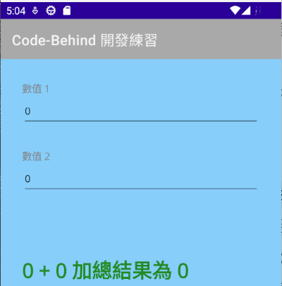
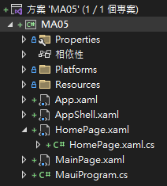
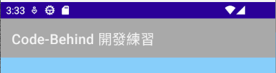
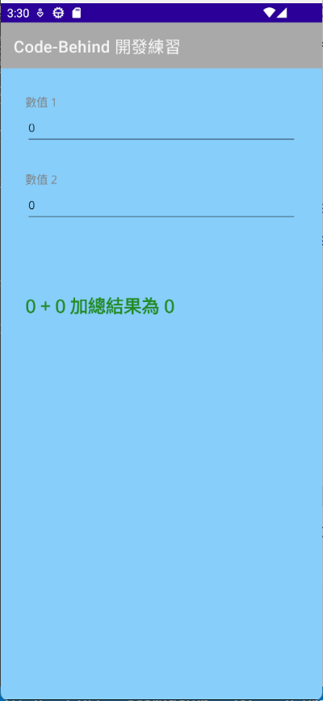
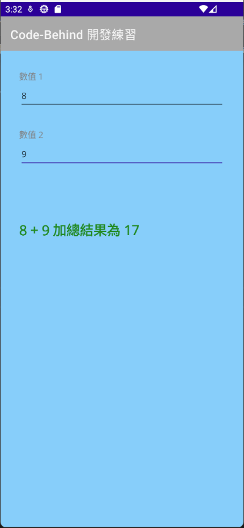
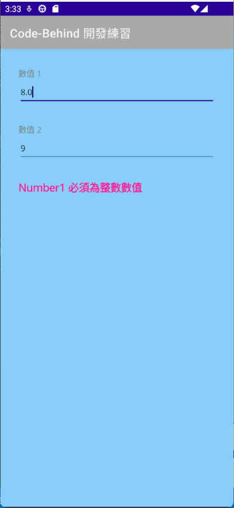

# .NET 8 MAUI 使用 Code-Behind 方式進行 MAUI 專案開發


.NET MAUI 工具組是一個跨平台的開發工具組，可以用來開發 iOS、Android、Mac Catalyst、Tizen 和 WinUI 的 .NET MAUI 應用程式。它的特色為：一次開發，多平台執行，並且使用單一專案，完全使用 C# 程式語言來進行商業邏輯的設計方式，不再需要針對不同的行動裝置平台，學習不同的程式語言，並且使用單一程式碼庫，這樣的開發方式，可以大幅降低開發成本，並且可以大幅提升開發效率。

這樣的特色，讓 .NET MAUI 工具組成為 .NET 程式設計人員可以輕鬆的進入到跨平台行動應用專案開發的首選工具組。

對於 UI 的設計方面，可以選擇使用 XAML 進行開發，也可以選擇使用 C# 進行開發，在此將會說明如何使用 XAML 進行開發。

當選擇使用 .NET MAUI 工具組進行開發時，可以選擇使用 Code-Behind 方式進行開發，也可以選擇使用 MVVM 方式進行開發，在此將會說明如何使用 Code-Behind 方式進行開發。

當採用 Code-Behind 方式進行開發，將會使用 XAML 進行 UI 的設計，並且使用 C# 進行商業邏輯的設計，而且，這兩者之間，可以透過事件回呼的方式，進行資料的傳遞。而當採用 MVVM 方式進行開發時，將會使用 XAML 進行 UI 的設計，並且使用 C# 進行商業邏輯的設計，而且，這兩者之間，可以透過資料綁定的方式，進行資料的傳遞。

為了要能夠體驗如何採用 XAML + Code-Behind 方式進行開發，這裡設計一個應用情境：設計的可以在 Android & iOS 行動裝置上可以運行的專案，並且可以在這個專案中，將會讓使用者輸入兩個整數數值，最後會將這兩個數值加總起來，將兩數相加的總和顯示在螢幕上。不過，若使用者輸入的內容不是整數數值，則會在螢幕上顯示紅色文字的錯誤訊息。

## 建立 .NET 8 MAUI 專案

> **為了能夠完成這份文件所提到的事情，需要將電腦上的 Visual Studio 2022 升級到 17.8 以上的版本，也就是，這台電腦上必須要有安裝 .NET 8 SDK。**

* 打開 Visual Studio 2022 IDE 應用程式
* 從 [Visual Studio 2022] 對話窗中，點選右下方的 [建立新的專案] 按鈕
* 在 [建立新專案] 對話窗右半部
  * 切換 [所有語言 (L)] 下拉選單控制項為 [C#]
  * 切換 [所有專案類型 (T)] 下拉選單控制項為 [MAUI]
* 在中間的專案範本清單中，找到並且點選 [.NET MAUI 應用程式] 專案範本選項
  > 此專案可用於建立適用於 iOS、Android、Mac Catalyst、Tizen 和 WinUI 的 .NET MAUI 應用程式。
* 點選右下角的 [下一步] 按鈕
* 在 [設定新的專案] 對話窗
* 找到 [專案名稱] 欄位，輸入 `MA05` 作為專案名稱
* 在剛剛輸入的 [專案名稱] 欄位下方，確認沒有勾選 [將解決方案與專案至於相同目錄中] 這個檢查盒控制項
* 點選右下角的 [下一步] 按鈕
* 現在將會看到 [其他資訊] 對話窗
* 在 [架構] 欄位中，請選擇最新的開發框架，這裡選擇的 [架構] 是 : `.NET 8.0 (長期支援)`
* 請點選右下角的 [建立] 按鈕

稍微等候一下，這個主控台專案將會建立完成

## 建立新的頁面

* 滑鼠右擊專案節點，從彈出的功能表清單中，點選 [加入] > [新增項目]
* 在 [新增項目 - MA05] 對話窗中，點選對話窗左方的 [已安裝] > [.NET MAUI]
* 在對話窗的中間，點選 [.NET MAUI ContentPage (XAML)] 節點
* 在對話窗的下方的名稱欄位，輸入 [HomePage.xaml] 作為名稱
* 點選對話窗右下方的 [新增] 按鈕
* 現在將會看到 [HomePage.xaml] 這個檔案，並且，這個檔案會被開啟在 Visual Studio 2022 的編輯器內
* 使用底下內容，替換掉這個檔案內的所有內容

```xml
<?xml version="1.0" encoding="utf-8" ?>
<ContentPage xmlns="http://schemas.microsoft.com/dotnet/2021/maui"
             xmlns:x="http://schemas.microsoft.com/winfx/2009/xaml"
             x:Class="MA05.HomePage"
             Title="Code-Behind 開發練習"
             BackgroundColor="LightSkyBlue">
    
    <Grid>
        <VerticalStackLayout
            Padding="30"
            HorizontalOptions="Fill" VerticalOptions="Start">

            <Label 
                Text="數值 1" HorizontalOptions="Start"
                FontSize="14" TextColor="Gray"/>
            <Entry x:Name="Number1" HorizontalOptions="Fill"
                   TextChanged="Number1_TextChanged"/>

            <Label Margin="0,30,0,0"
                Text="數值 2" HorizontalOptions="Start"
                FontSize="14" TextColor="Gray"/>
            <Entry x:Name="Number2" HorizontalOptions="Fill"
                   TextChanged="Number2_TextChanged"/>

            <Label x:Name="Message" Margin="0,30,0,0"
                Text="錯誤訊息" HorizontalOptions="Start"
                FontSize="18" TextColor="DeepPink" FontAttributes="Bold"/>

            <Label x:Name="Summary" Margin="0,30,0,0"
                Text="操作摘要" HorizontalOptions="Start"
                FontSize="28" TextColor="ForestGreen" FontAttributes="Bold"/>

        </VerticalStackLayout>
    </Grid>
</ContentPage>
```

* 這個頁面的主要效果是提供一個用戶界面，讓用戶可以輸入兩個數值，並在輸入時更新顯示的錯誤訊息和操作摘要。
* 對於 [HomePage.xaml] 這個頁面，首先在根項目 (Root Element)，它包含了所有的子項目，也就是 [ContentPage] 這個項目，使用 `BackgroundColor="LightSkyBlue"` 宣告這個頁面背景顏色將會為淡天藍色。
* 對於使用 `Title="Code-Behind 開發練習"` 宣告這個頁面的名稱為 [Code-Behind 開發練習]，從底下螢幕截圖，將會看到這文字出現在導航工具列上的效果。

  

* 對於每個 [ContentPage] 項目，都會有個 [Content] 屬性，將包含頁面內容的檢視，也就是整個頁面將會看到的所有 UI；在 XAML 裡若沒有特別指定這個 [Content] 屬性，則表示 [ContentPage] 內的第一個項目 Element 將會指定給 [ContentPage.Content] 這個屬性；在這個例子中，將會為底下的 [Grid] 版面配置 Layout。
* [Grid] 這是一個版面配置容器，用於包含其他項目，這是因為這個頁面將會用到其他更多視覺項目，而 [ContentPage.Content] 內僅能夠指向一個項目，因此，在這裡將會藉由 [Grid] 這個版面配置項目，將更多的項目設定在 [Grid] 內。
* [VerticalStackLayout] 也是屬於一個版面配置容器，這是一個垂直的堆疊版面配置容器，用於將其包含的所有子元素垂直排列。
* 在 [VerticalStackLayout] 內，有宣告 [Padding] 屬性設定為 "30"，這代表了在 [VerticalStackLayout] 內的子項目將會採用上下左右內縮 30 [個與裝置無關的畫素，HorizontalOptions] 屬性設定為 [Fill]，[VerticalOptions] 屬性設定為 [Start] 則表示 [VerticalStackLayout] 版面配置容器將會採用水平完全填滿與垂直往上對齊的方式來排列在螢幕上。
* 緊接著會有兩對 [Label] 和 [Entry] 項目，前者 [Label] 項目將會顯示文字內容在螢幕上，而 [Entry] 這個項目，將提供使用者可以進行文字輸入需求。其中，[Label] 元素的 [Text] 屬性設定為顯示的文字內容，[FontSize] 屬性設定為文字的大小， [TextColor] 屬性設定為文字的顏色。
* [Entry] 項目提供使用者輸入內容到應用程式內，其中 [x:Name] 這樣的用法是屬於 XAML 內的標記延伸的用法，其目的在於會建立一個名為 Number1 這個物件，其型別為 [Entry]，有了這個變數，將會在這個 [.xaml] 頁面內的 Code-Behind 程式碼區塊內來存取這個項目，進行各種客製或者細微的設定；在 [Entry] 內用到了 [TextChanged](https://learn.microsoft.com/zh-tw/dotnet/api/microsoft.maui.controls.inputview.textchanged?view=net-maui-8.0#microsoft-maui-controls-inputview-textchanged?WT.mc_id=DT-MVP-5002220) 屬性，這是一個 .NET 事件 Event ，用來設定為當文字改變時觸發的事件，而後面所描述的文字，將會是要綁定事件的委派方法，對於 [Number1_TextChanged] 這個方法，將會使用 Code-Behind 方式來進行設計。
* 最後兩個項目，同樣也是個 [Label] ，第一個名為 [Message] 的 [Label] 將會代表一個粉紅色的文字，用來顯示警告或者錯誤提示訊息，第二個名為 [Summary] 的 [Label] 將會代表一個綠色的文字，用來顯示兩個數值計算後的結果。

```xml
<Label x:Name="Message" Margin="0,30,0,0"
    Text="錯誤訊息" HorizontalOptions="Start"
    FontSize="18" TextColor="DeepPink" FontAttributes="Bold"/>

<Label x:Name="Summary" Margin="0,30,0,0"
    Text="操作摘要" HorizontalOptions="Start"
    FontSize="28" TextColor="ForestGreen" FontAttributes="Bold"/>
```

## 建立新的頁面的程式碼

* 對於 [HomePage.xaml] 這個檔案，將會描述整體頁面的視覺 UI 樣貌與效果，然而，對於這個 [HomePage.xaml] 頁面內的相關商業邏輯，這還是需要透過 C# 程式碼來設計，這些 C# 程式碼將會寫在 Code-Behind 區域。
* 在方案總管視窗中，找到 [HomePage.xaml] 檔案節點
* 在 [HomePage.xaml] 檔案名稱前面，將會看到一個三角形
* 點選此三角形，將會展開這個檔案的內容
* 在展開的內容中，找到並且打開 [HomePage.xaml.cs] 檔案節點

  
* 使用底下內容，替換掉這個檔案內的所有內容]

* 對於前面宣告的 [HomePage.xaml] 將會透過 [來源產生器](https://learn.microsoft.com/zh-tw/dotnet/csharp/roslyn-sdk/source-generators-overview?WT.mc_id=DT-MVP-5002220) 生成一個 C# [HomePage] 類別
  * 在方案總管中，找到這個專案節點，依序點選與展開
  * [MA05] > [相依性] > [net8.0-android] > [分析器] > [Microsoft.Maui.Controls.SourceGen]  > [Microsoft.Maui.Controls.SourceGen.CodeBehindGenerator] 節點
  * 找到並且打開 [HomePage.xaml.sg.cs] 這個節點
  * 這個節點內容，就是透過原始碼產生器，依據 [HomePage.xaml] 這個檔案內容，所自動產生出來的 C# 類別原始碼
  * 底下將會是 [HomePage.xaml.sg.cs] 原始碼內容
  * 這裡生成的類別將會是一個 [partial 部分類別](https://learn.microsoft.com/zh-tw/dotnet/csharp/programming-guide/classes-and-structs/partial-classes-and-methods?WT.mc_id=DT-MVP-5002220) `public partial class HomePage : global::Microsoft.Maui.Controls.ContentPage`

```csharp

//------------------------------------------------------------------------------
// <auto-generated>
//     This code was generated by a .NET MAUI source generator.
//
//     Changes to this file may cause incorrect behavior and will be lost if
//     the code is regenerated.
// </auto-generated>
//------------------------------------------------------------------------------

[assembly: global::Microsoft.Maui.Controls.Xaml.XamlResourceId("MA05.HomePage.xaml", "HomePage.xaml", typeof(global::MA05.HomePage))]
namespace MA05
{
	[global::Microsoft.Maui.Controls.Xaml.XamlFilePath("HomePage.xaml")]
	public partial class HomePage : global::Microsoft.Maui.Controls.ContentPage
	{
		[global::System.CodeDom.Compiler.GeneratedCode("Microsoft.Maui.Controls.SourceGen", "1.0.0.0")]
		private global::Microsoft.Maui.Controls.Entry Number1;

		[global::System.CodeDom.Compiler.GeneratedCode("Microsoft.Maui.Controls.SourceGen", "1.0.0.0")]
		private global::Microsoft.Maui.Controls.Entry Number2;

		[global::System.CodeDom.Compiler.GeneratedCode("Microsoft.Maui.Controls.SourceGen", "1.0.0.0")]
		private global::Microsoft.Maui.Controls.Label Message;

		[global::System.CodeDom.Compiler.GeneratedCode("Microsoft.Maui.Controls.SourceGen", "1.0.0.0")]
		private global::Microsoft.Maui.Controls.Label Summary;

		[global::System.CodeDom.Compiler.GeneratedCode("Microsoft.Maui.Controls.SourceGen", "1.0.0.0")]
#if NET5_0_OR_GREATER
		[global::System.Diagnostics.CodeAnalysis.MemberNotNullAttribute(nameof(Number1))]
		[global::System.Diagnostics.CodeAnalysis.MemberNotNullAttribute(nameof(Number2))]
		[global::System.Diagnostics.CodeAnalysis.MemberNotNullAttribute(nameof(Message))]
		[global::System.Diagnostics.CodeAnalysis.MemberNotNullAttribute(nameof(Summary))]
#endif
		private void InitializeComponent()
		{
			global::Microsoft.Maui.Controls.Xaml.Extensions.LoadFromXaml(this, typeof(HomePage));
			Number1 = global::Microsoft.Maui.Controls.NameScopeExtensions.FindByName<global::Microsoft.Maui.Controls.Entry>(this, "Number1");
			Number2 = global::Microsoft.Maui.Controls.NameScopeExtensions.FindByName<global::Microsoft.Maui.Controls.Entry>(this, "Number2");
			Message = global::Microsoft.Maui.Controls.NameScopeExtensions.FindByName<global::Microsoft.Maui.Controls.Label>(this, "Message");
			Summary = global::Microsoft.Maui.Controls.NameScopeExtensions.FindByName<global::Microsoft.Maui.Controls.Label>(this, "Summary");
		}
	}
}
```

* 在這裡的 [HomePage.xaml.cs] 檔案，將會透過 partial 關鍵字定義一個 [HomePage] 類別，與來源原始碼產生器生成的 [HomePage] 類別合成為一個類別

```csharp
namespace MA05;

public partial class HomePage : ContentPage
{
    // 這裡是 Code-Behind 的程式碼
    public HomePage()
    {
        InitializeComponent();

        #region 針對 UI 做相關初始設定
        Message.Text = string.Empty;
        Summary.Text = string.Empty;
        Number1.Text = "0";
        Number2.Text = "0";
        #endregion
    }

    void FullNumberCheck()
    {
        Message.Text = string.Empty;
        Summary.Text = string.Empty;

        // 檢查 Number1 是否為合法整數數值，若不成立，將訊息顯示在 Message 內
        if (!CheckNumber1())
        {
            return;
        }

        // 檢查 Number2 是否為合法整數數值，若不成立，將訊息顯示在 Message 內
        if (!CheckNumber2())
        {
            return;
        }

        // 進行 Number1 與 Number2 的加總運算
        int number1 = int.Parse(Number1.Text);
        int number2 = int.Parse(Number2.Text);
        int summary = number1 + number2;

        // 將加總結果顯示在 Summary 內
        Summary.Text = $"{number1} + {number2} 加總結果為 {summary}";
    }

    // 檢查 Number1 是否為合法整數數值，若不成立，將訊息顯示在 Message 內
    private bool CheckNumber1()
    {
        if (int.TryParse(Number1.Text, out int number1) == false)
        {
            Message.IsVisible = true;
            Message.Text = "Number1 必須為整數數值";
            return false;
        }
        else
            return true;
    }
    private bool CheckNumber2()
    {
        if (int.TryParse(Number2.Text, out int number2) == false)
        {
            Message.IsVisible = true;
            Message.Text = "Number2 必須為整數數值";
            return false;
        }
        else
            return true;
    }

    private void Number2_TextChanged(object sender, TextChangedEventArgs e)
    {
        FullNumberCheck();
    }

    private void Number1_TextChanged(object sender, TextChangedEventArgs e)
    {
        FullNumberCheck();
    }
}
```

* ，有以下的宣告和效果：
* 在這個 [HomePage.xaml.cs] 檔案中文件中，定義了一個 [HomePage] 類別：這是一個繼承自 [ContentPage] 的類別，代表了一個頁面，通常來說，將會佔據整個手機頁面。它包含了一些屬性和方法，用於處理頁面的邏輯。
* [HomePage()] 構造函數：這是 [HomePage] 類別的構造函數，它在創建 HomePage 對象時被調用。在這個構造函數中，我們調用了 [InitializeComponent()] 方法來初始化頁面，並設定了一些 UI 元素的初始值。
* [InitializeComponent()] 是一個在 MAUI 中常見的方法，它在頁面或 UI 控制項的構造函數中被呼叫。這個方法的主要工作是讀取該頁面或控件的 XAML 文件，並將其轉換為實際的 UI 元素。
* 當你在 XAML 文件中定義一個控件（例如，一個按鈕或一個標籤），[InitializeComponent()] 會負責創建該控件的實例，並將其添加到頁面的視覺樹中。此外，它還會將 XAML 中定義的事件處理程序連接到對應的事件。
* 總的來說，[InitializeComponent()] 是連接 XAML 和 C# 代碼的橋樑，它使得我們可以在 XAML 中以宣告式的方式設計 UI，然後在 C# 代碼中處理 UI 的邏輯。
* [FullNumberCheck()] 方法：這個方法用於檢查 [Number1.Text] 和 [Number2.Text] 的值是否為合法的整數，並計算它們的和。如果 [Number1.Text] 或 [Number2.Text] 的值不是合法的整數，則會在 Message 控制項中顯示錯誤訊息 (這裡僅需要將錯誤訊息文字設定給 [Message.Text] 屬性即可) 。如果它們的值都是合法的整數，則會計算它們的和，並在 Summary 中顯示結果 (這裡同樣將結果內容，設定給 [Summary.Text] 屬性)。
* [CheckNumber1()] 和 [CheckNumber2()] 方法：這兩個方法用於檢查 [Number1.Text] 和 [Number2.Text] 的值是否為合法的整數。如果不是，則會在 [Message.Text] 中顯示錯誤訊息，並返回 false。如果是，則返回 true。
* [Number1_TextChanged()] 和 [Number2_TextChanged()] 方法：這兩個方法是用來綁定到 [TextChanged] 事件的處理程序，當 Number1 或 Number2 的文字內容改變時，會將會透過這兩個事件來呼叫 [FullNumberCheck()] 方法。
* 現在，已經將 View (HomePage.xaml) 與該頁面商業邏輯 (HomePage.xaml.cs) 綁定與設計完成了

## 修正 AppShell.xaml 內容

* 因為預設的導航工具列為白色底色，且文字文淡灰色，因此，會看不太清楚這個頁面標題，所以，需要進行底下的修正
* 在方案總管視窗中，找到並打開 [AppShell.xaml] 檔案節點
* 使用底下內容，替換掉這個檔案內的所有內容

```xml
<?xml version="1.0" encoding="UTF-8" ?>
<Shell
    x:Class="MA05.AppShell"
    xmlns="http://schemas.microsoft.com/dotnet/2021/maui"
    xmlns:x="http://schemas.microsoft.com/winfx/2009/xaml"
    xmlns:local="clr-namespace:MA05"
    Shell.FlyoutBehavior="Disabled"
    Shell.BackgroundColor="DarkGray"
    Shell.TitleColor="WhiteSmoke"
    Title="MA05">

    <ShellContent
        Title="Home"
        ContentTemplate="{DataTemplate local:HomePage}"
        Route="MainPage" />

</Shell>
```

* 在這裡，首先在 [Shell] 項目 (Element) 內，新增了兩個屬性，分別是 [Shell.TitleColor] 與 [Shell.BackgroundColor]，其中，[Shell.TitleColor] 屬性的值為 [WhiteSmoke]，也就是宣告導航工具列的文字顏色要使用 [白色的煙] 的顏色來顯示；而對於 [Shell.BackgroundColor] 這個屬性，則是宣告 Shell 的背景顏色要使用 [DarkGray] 的顏色來顯示這表示導航工具列的背景顏色為深灰色。

若沒有經過這樣修正，則導航工具列的文字顏色與背景顏色，將會是預設的顏色，也就是，文字顏色為黑色，背景顏色為白色。底下螢幕截圖將會是修正後的結果。



* 另外，找到 [ShellContent] 這個項目 (Element)，修正 [ContentTemplate] 這個屬性，需要用到剛剛建立起來的 [HomePage] 這個頁面，這裡使用到了 `ContentTemplate="{DataTemplate local:HomePage}"` 語法。
* 這表示這個應用程式啟動的時候，將會使用 [AppShell.xaml] 作為主要顯示頁面，而在 [AppShell.xaml] 內，將會指定 [HomePage.xaml] 作為第一個要顯示的頁面。

## 執行結果

* 底下畫面將會是這個專案在 Android 平台內執行的結果

因為 App 一啟動之後，數值1 與 數值2 預設直接為 0，所以，在中間將會顯示綠色文字的 [0 + 0 加總結果為 0] 的結果。



此時，在輸入數值 1 與 數值 2 的文字方塊內，分別輸入兩個整數數值 8 與 9，因為這兩個輸入的內容都是整數數值，所以，則會在中間顯示綠色文字的 [8 + 9 加總結果為 17] 的結果。



然而，若在數值 1 或 數值 2 的文字方塊內，輸入的內容不是整數數值(在此輸入內容為 8.0，是一個浮點數，並不是一個整數數值)，此時系統將會偵測出來，並且使用紅色文字，顯示錯誤訊息在螢幕上。


