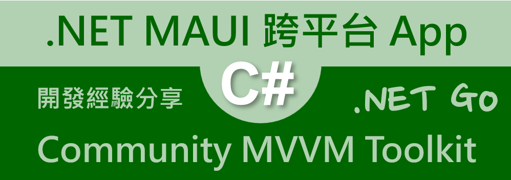

# .NET 8 MAUI 使用微軟 Community Toolkit MVVM 套件進行資料綁定開發

## 建立 .NET 8 MAUI 專案

> **為了能夠完成這份文件所提到的事情，需要將電腦上的 Visual Studio 2022 升級到 17.8 以上的版本，也就是，這台電腦上必須要有安裝 .NET 8 SDK。**

* 打開 Visual Studio 2022 IDE 應用程式
* 從 [Visual Studio 2022] 對話窗中，點選右下方的 [建立新的專案] 按鈕
* 在 [建立新專案] 對話窗右半部
  * 切換 [所有語言 (L)] 下拉選單控制項為 [C#]
  * 切換 [所有專案類型 (T)] 下拉選單控制項為 [MAUI]
* 在中間的專案範本清單中，找到並且點選 [.NET MAUI 應用程式] 專案範本選項
  > 此專案可用於建立適用於 iOS、Android、Mac Catalyst、Tizen 和 WinUI 的 .NET MAUI 應用程式。
* 點選右下角的 [下一步] 按鈕
* 在 [設定新的專案] 對話窗
* 找到 [專案名稱] 欄位，輸入 `MA04` 作為專案名稱
* 在剛剛輸入的 [專案名稱] 欄位下方，確認沒有勾選 [將解決方案與專案至於相同目錄中] 這個檢查盒控制項
* 點選右下角的 [下一步] 按鈕
* 現在將會看到 [其他資訊] 對話窗
* 在 [架構] 欄位中，請選擇最新的開發框架，這裡選擇的 [架構] 是 : `.NET 8.0 (長期支援)`
* 請點選右下角的 [建立] 按鈕

稍微等候一下，這個主控台專案將會建立完成

## 安裝要用到的 NuGet 開發套件

因為開發此專案時會用到這些 NuGet 套件，請依照底下說明，將需要用到的 NuGet 套件安裝起來。

### 安裝 CommunityToolkit.Mvvm 套件

CommunityToolkit.Mvvm 是微軟官方提供的 MVVM 套件，提供了一些 MVVM 開發常用的功能，例如：ObservableObject、ObservableProperty、RelayCommand 等等，這些功能在 WPF、UWP、Xamarin.Forms 都可以使用，而且在 .NET 8 MAUI 也可以使用。

CommunityToolkit.Mvvm 包括以下功能：

* 消息傳遞: CommunityToolkit.Mvvm 提供了一個消息傳遞系統，可讓您在應用程序的不同部分之間進行通信。
* 命令: CommunityToolkit.Mvvm 提供了一個命令系統，可讓您將 UI 元素綁定到視圖模型中的方法。
* 可觀察對象: CommunityToolkit.Mvvm 提供了一個 ObservableObject 類，可讓您創建可以通知其觀察者其屬性更改的對象。
* IObservableRecipient: CommunityToolkit.Mvvm 提供了一個 IObservableRecipient 接口，可讓您創建可以接收消息的視圖模型。

請依照底下說明操作步驟，將這個套件安裝到專案內

* 滑鼠右擊 [方案總管] 視窗內的 [專案節點] 下方的 [相依性] 節點
* 從彈出功能表清單中，點選 [管理 NuGet 套件] 這個功能選項清單
* 此時，將會看到 [NuGet: MA04] 視窗
* 切換此視窗的標籤頁次到名稱為 [瀏覽] 這個標籤頁次
* 在左上方找到一個搜尋文字輸入盒，在此輸入 `CommunityToolkit.Mvvm`
* 稍待一會，將會在下方看到這個套件被搜尋出來
* 點選 [CommunityToolkit.Mvvm] 套件名稱
* 在視窗右方，將會看到該套件詳細說明的內容，其中，右上方有的 [安裝] 按鈕
* 點選這個 [安裝] 按鈕，將這個套件安裝到專案內

## MVVM 開發模式用到的資料夾

* 滑鼠右擊專案節點，從彈出的功能表清單中，點選 [加入] > [新增資料夾] 選項
* 將剛剛建立的資料夾名稱，使用 [Views] 名稱來取代
* 滑鼠右擊專案節點，從彈出的功能表清單中，點選 [加入] > [新增資料夾] 選項
* 將剛剛建立的資料夾名稱，使用 [ViewModels] 名稱來取代
* 滑鼠右擊專案節點，從彈出的功能表清單中，點選 [加入] > [新增資料夾] 選項
* 將剛剛建立的資料夾名稱，使用 [Models] 名稱來取代

