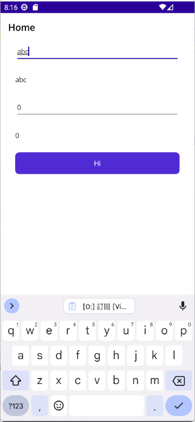
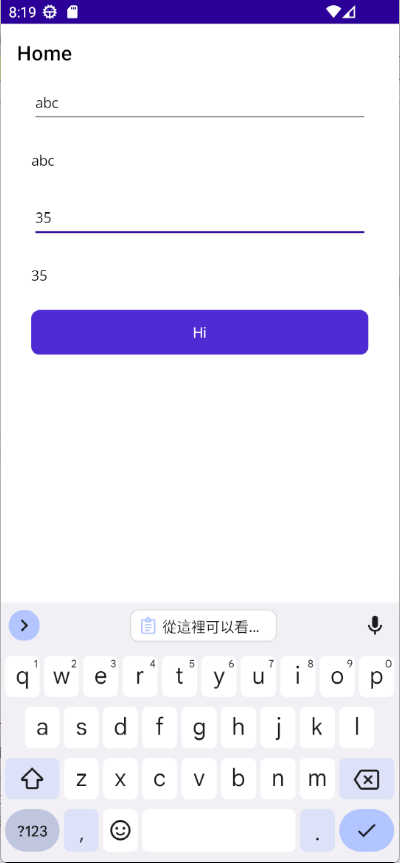
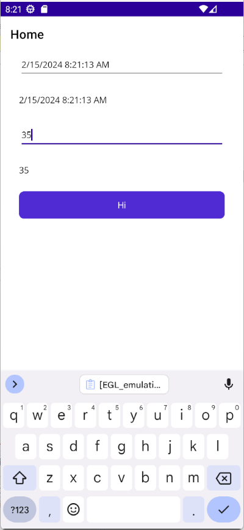

# .NET 8 MAUI 了解 INotifyPropertyChanged 實作與運作行為


在進行 .NET MAUI 專案開發的過程中，會搭配使用 MVVM Model-View-ViewModel 設計模式來進行開發，而在 View 的部分，會使用到 [XAML Extensible Application Markup Language](https://learn.microsoft.com/zh-tw/dotnet/maui/xaml/fundamentals/get-started?view=net-maui-8.0&WT.mc_id=DT-MVP-5002220) 這個技術來進行畫面要顯示的 UI 開發，而在商業邏輯的部分，當然還是採用 C# 程式語言，會將商業邏輯的程式碼寫在 ViewModel 的類別內。透過建立或者注入一個 ViewModel 的執行個體，並且將這個執行個體指定給 View 的 `BindingContext` 屬性，這樣 View 就可以透過資料繫結的方式，來取得 ViewModel 內的資料，並且顯示在 UI 上。

在 MVVM 設計模式下，View 知道所要使用的 ViewModel 物件是哪個(透過 `BindingContext` 屬性)，因此，當 View 的 UI 控制項的屬性有變動的時候，並且這個屬性有使用到 `{Binding ...}` 進行資料綁定的宣告，對於 View 的物件，便知道如何更新到 ViewModel 所綁定的屬性上；然而 ViewModel 並不知道是哪個 View 要使用這個 ViewModel 物件，因此，當 ViewModel 內的屬性值有變動的時候，需要採用另外一種機制來進行通知對應的 View 要來根據 ViewModel 的變動，同時也進行更新 View 上對應的屬性值。

在 .NET Framework 2.0 開始，就有提供一個 [INotifyPropertyChanged 介面](https://learn.microsoft.com/zh-tw/dotnet/api/system.componentmodel.inotifypropertychanged?view=net-8.0&WT.mc_id=DT-MVP-5002220)，提供了有訂閱的用戶端提供通知已變更屬性值狀態發生了，有了這個機制，一旦在 ViewModel 上的屬性值有異動了，在 ViewModel 上將會觸發 INPC INotifyPropertyChanged 事件，此時，相對應的 View 將會收到這樣的通知，更新 View 上對應的屬性值，進而畫面上的 UI 樣貌或者位置也會有所變動。

在這篇文章中，將會介紹如何建立一個 .NET MAUI 專案，並且在這個專案中，建立一個 ViewModel 類別，並且在這個 ViewModel 類別中，實作 INotifyPropertyChanged 介面，並且在這個 ViewModel 類別中，建立一個屬性，並且在這個屬性的存取子中，進行 INPC 事件的觸發，以及在這個專案中，建立一個 View 的 XAML 檔案，並且在這個 View 的 XAML 檔案中，進行資料繫結的宣告，並且在這個 View 的程式碼檔案中，建立一個 ViewModel 的執行個體，並且將這個執行個體指定給 View 的 `BindingContext` 屬性，這樣 View 就可以透過資料繫結的方式，來取得 ViewModel 內的資料，並且顯示在 UI 上。

## 建立 .NET 8 MAUI 專案

* 打開 Visual Studio 2022 IDE 應用程式
* 從 [Visual Studio 2022] 對話窗中，點選右下方的 [建立新的專案] 按鈕
* 在 [建立新專案] 對話窗右半部
  * 切換 [所有語言 (L)] 下拉選單控制項為 [C#]
  * 切換 [所有專案類型 (T)] 下拉選單控制項為 [MAUI]
* 在中間的專案範本清單中，找到並且點選 [.NET MAUI 應用程式] 專案範本選項
  > 此專案可用於建立適用於 iOS、Android、Mac Catalyst、Tizen 和 WinUI 的 .NET MAUI 應用程式。
* 點選右下角的 [下一步] 按鈕
* 在 [設定新的專案] 對話窗
  * 找到 [專案名稱] 欄位，輸入 `MA14` 作為專案名稱
* 在剛剛輸入的 [專案名稱] 欄位下方，確認沒有勾選 [將解決方案與專案至於相同目錄中] 這個檢查盒控制項
* 點選右下角的 [下一步] 按鈕
* 現在將會看到 [其他資訊] 對話窗
* 在 [架構] 欄位中，請選擇最新的開發框架，這裡選擇的 [架構] 是 : `.NET 8.0 (長期支援)`
* 請點選右下角的 [建立] 按鈕

稍微等候一下，這個主控台專案將會建立完成

## 建立 ViewModel 類別

在 MVVM 的架構下， View 與 ViewModel 彼此間具有鬆散耦合的關係，所以，在這裡將要建立一個 ViewModel 類別，這個 ViewModel 類別將會實作 INotifyPropertyChanged 介面，並且在這個 ViewModel 類別中，建立一個屬性，並且在這個屬性的存取子中，進行 INPC 事件的觸發。原則上，接下來的設計將會是從無到有的打造出一個可以適用於 MVVM 設計模式的 ViewModel 類別，不過，在現在開發環境中，將會有許多不錯的套件可以使用，這些套件將會幫助開發者更快速的建立 ViewModel 類別，並且在這個 ViewModel 類別中，實作 INotifyPropertyChanged 介面。

* 滑鼠右擊專案名稱 `MA14`，在彈出的功能表中，選擇 [加入] -> [類別]
* 在 [新增項目] 對話窗中
* 在 [名稱] 文字方塊中，輸入 `MainPageViewModel` 作為類別名稱
* 請點選 [新增] 按鈕
* 使用底下程式碼替換掉這個檔案的內容

```csharp
using System.ComponentModel;
using System.Diagnostics;
using System.Runtime.CompilerServices;

namespace MA14;

public class MainPageViewModel : INotifyPropertyChanged
{
    #region 實作 MVVM 的 INotifyPropertyChanged 介面
    public event PropertyChangedEventHandler? PropertyChanged;

    void NotifyPropertyChanged([CallerMemberName] String propertyName = "")
    {
        PropertyChanged?.Invoke(this, new PropertyChangedEventArgs(propertyName));
    }
    #endregion

    #region 需要做資料綁定的屬性設計
    string userName = string.Empty;
    public string UserName
    {
        get
        {
            return this.userName;
        }

        set
        {
            if (value != this.userName)
            {
                this.userName = value;
                NotifyPropertyChanged();
                Debug.WriteLine($"[ViewModel] 的 UserName 屬性有變動 : {this.userName}");
            }
        }
    }

    int age = 0;
    public int Age
    {
        get
        {
            return this.age;
        }

        set
        {
            if (value != this.age)
            {
                this.age = value;
                NotifyPropertyChanged();
                Debug.WriteLine($"[ViewModel] 的 Age 屬性有變動 : {this.age}");
            }
        }
    }
    #endregion
}
```

首先，在這個 ViewModel 類別 MainPageViewModel，將會實作 INotifyPropertyChanged 介面，底下將會是這個介面的定義

```csharp
  public interface INotifyPropertyChanged
  {
      event PropertyChangedEventHandler? PropertyChanged;
  }
```

從這裡看到，這個介面只有一個事件，這個事件的名稱是 PropertyChanged，這個事件的委派是 PropertyChangedEventHandler，這個委派的定義如下

```csharp
  public delegate void PropertyChangedEventHandler(object? sender, PropertyChangedEventArgs e);
```

因此，在這個 ViewModel 內，將會宣告一個 PropertyChanged 的事件，並且在這個 ViewModel 內，建立一個方法 NotifyPropertyChanged，這個方法的目的是要觸發 PropertyChanged 事件，這樣當這個 ViewModel 內的屬性值有變動的時候，便會觸發這個事件，進而通知 View 進行更新。底下將會是這個方法的定義

```csharp
    void NotifyPropertyChanged([CallerMemberName] String propertyName = "")
    {
        PropertyChanged?.Invoke(this, new PropertyChangedEventArgs(propertyName));
    }
```

為了簡化程式碼的呼叫，在這裡透過 [CallerMemberName] 這個屬性宣告，取得處發這個事件的屬性名稱，這樣在呼叫這個方法的時候，就不需要傳入屬性名稱，這樣可以減少程式碼的撰寫量，若不這樣做，就需要自己手動撰寫字串內容，傳入到 [NotifyPropertyChanged] 這個方法內，不過，若選擇這樣做法，將會有很大的機會因為字串輸入錯誤，造成資料綁定無法正常運作成功。

，並且在這個 ViewModel 類別中，建立了兩個屬性，分別是 UserName 與 Age，這兩個屬性的存取子中，都有進行 INPC 事件的觸發，這樣當這兩個屬性的值有變動的時候，便會觸發 INPC 事件，進而通知 View 進行更新。

例如，對於 UserName 這個屬性，當這個屬性的值有變動的時候，將會使用底下程式碼，觸發 INPC 事件，這樣 View 就可以透過資料繫結的方式，來取得這個屬性的值，並且顯示在 UI 上。

```csharp
if (value != this.userName)
{
    this.userName = value;
    NotifyPropertyChanged();
    Debug.WriteLine($"[ViewModel] 的 UserName 屬性有變動 : {this.userName}");
}
```

為了避免不必要的觸發 INPC 事件，在這裡將會有做檢查，若此次要變動屬性的內容維持不變，則是不會觸發 INPC 事件的，這樣可以避免不必要的事件觸發，進而提升應用程式的效能。另外，一旦觸發 INPC 事件之後，將會透過 [Debug.WriteLine] 方法，將這個事件的觸發資訊輸出到 [輸出] 視窗中，如此一來，便可以知道這個事件的觸發時間點，以及觸發的內容。

## 建立 View 的 XAML 檔案

* 在專案根目錄找到並且打開 [MainPage.xaml] 檔案
* 使用底下XAML程式碼替換掉這個檔案的內容

```xml
<?xml version="1.0" encoding="utf-8" ?>
<ContentPage xmlns="http://schemas.microsoft.com/dotnet/2021/maui"
             xmlns:x="http://schemas.microsoft.com/winfx/2009/xaml"
             x:Class="MA14.MainPage">

    <Grid>
        <VerticalStackLayout
            Padding="30,0"
            Spacing="25">

            <Entry x:Name="UserNameEntry"
                   Text="{Binding UserName}"/>
            <Label x:Name="UserNameLabel"
                   Text="{Binding UserName}"/>
            <Entry x:Name="AgeEntry"
                   Text="{Binding Age}"/>
            <Label x:Name="AgeLabel"
                   Text="{Binding Age}"/>
            <Button
                x:Name="SayHiBtn"
                Text="Hi" Clicked="SayHiBtnClicked"
                HorizontalOptions="Fill" />
        </VerticalStackLayout>
    </Grid>

</ContentPage>
```

在這個頁面中，將會有兩個文字輸入盒，名稱為 [UserNameEntry] 與 [AgeEntry，這兩個控制項要儲存輸入文字的屬性，] [Text] ，將會分別綁定到 ViewModel 內的 [UserName] 與 [Age] 這兩個屬性上，並且這兩個 ViewModel 屬性也會分別綁定到兩個 Lable 控制項的 [Text] 屬性上，用來確認使用者輸入的內容，確實已經綁定成功了。

最後，將會設計一個名稱為 [SayHiBtn] 按鈕，一旦按下這個按鈕之後，將會觸發 [SayHiBtnClicked] 處理程式。

接下來看看這個 [MainPage] 頁面的 Code Behind 程式碼

## 修正頁面 Code Behind 程式碼

* 在專案根目錄下，找到並打開 [MainPage.xaml.cs] 檔案
* 使用底下程式碼替換掉這個檔案原有內容

```csharp
using System.ComponentModel;
using System.Diagnostics;

namespace MA14;

public partial class MainPage : ContentPage
{
    int count = 0;
    MainPageViewModel mainPageViewModel = new MainPageViewModel();
    public MainPage()
    {
        InitializeComponent();
        BindingContext = mainPageViewModel;

        UserNameEntry.PropertyChanged += UserNameEntry_PropertyChanged;
        AgeEntry.PropertyChanged += (s, e) =>
        {
            Debug.WriteLine($"[View] Age Entry 的 Text 屬性已經有變動 (PropertyChanged) : {e.PropertyName}");
        };
        //UserNameEntry.PropertyChanging += UserNameEntry_PropertyChanging;
        mainPageViewModel.PropertyChanged += (s, e) =>
        {
            Debug.WriteLine($"訂閱 [ViewModel] 的 PropertyChanged 事件被觸發 : {e.PropertyName}");
        };
    }

    private void UserNameEntry_PropertyChanging(object sender, Microsoft.Maui.Controls.PropertyChangingEventArgs e)
    {
        #region 消除除厝噪音
        if (e.PropertyName == "IsFocused" || e.PropertyName == "CursorPosition")
        {
            return;
        }
        #endregion

        Debug.WriteLine($"[View] UserName Entry 的 Text 屬性即將有變動 (PropertyChanging) : {e.PropertyName}");
    }

    private void UserNameEntry_PropertyChanged(object? sender, PropertyChangedEventArgs e)
    {
        #region 消除除厝噪音
        if (e.PropertyName == "IsFocused" || e.PropertyName == "CursorPosition"
            || e.PropertyName == "SelectionLength")
        {
            return;
        }
        #endregion

        Debug.WriteLine($"[View] UserName Entry 的 Text 屬性已經有變動 (PropertyChanged) : {e.PropertyName}");
    }

    private void SayHiBtnClicked(object sender, EventArgs e)
    {
        mainPageViewModel.UserName = DateTime.Now.ToString();
    }
}
```

為了要讓資料綁定可以正常運作，首先將會在頁面建構式內，將 [MainPageViewModel] 物件指定給這個頁面的 [BindingContext] 屬性上。

接下來在這個建構式內，將會針對 [UserNameEntry] 這個文字輸入盒控制項，訂閱其控制項提供的 [PropertyChanged] 事件，在這個事件處理常式中，將會透過 [Debug.WriteLine] 方法，將這個事件的觸發資訊輸出到 [輸出] 視窗中，如此一來，便可以知道這個事件的觸發時間點，以及觸發的內容。同樣的，對於 [AgeEntry] 這個文字輸入盒控制項，針對 [PropertyChanged] 事件進行訂閱與做同樣的事情。

最後，為了要更加清楚 INPC 的運作模式，在這個 View 的建構式內，將會訂閱 ViewModel 內的 [ProperyChanged] 事件，一旦在 ViewModel 的任何程式碼想要觸發 INPC 事件，這裡訂閱處理常式將會透過 [Debug.WriteLine] 方法，將這個事件的觸發資訊輸出到 [輸出] 視窗中。

在這個頁面的 Code Behind 中，將要實作出按鈕按下後，要執行的工作，在這裡僅是將現在的電腦時間文字，寫入到 ViewModel 內的 UserName 屬性上，觀察當 ViewModel 的屬性值有異動發生之後，整個 INPC 的運作情況，與是否 View 上的控制項所綁定的屬性是否可以正常更新到最新的內容。

## 驗證成果

現在可以執行這個 .NET MAUI 專案，一旦 MainPage 畫面出現之後，請在 UserName 文字輸入盒內，輸入 abc 文字，此時，在 Visual Studio 輸出式窗內，將會看到底下內容：

```
[0:] 訂閱 [ViewModel] 的 PropertyChanged 事件被觸發 : UserName
[0:] [ViewModel] 的 UserName 屬性有變動 : a
[0:] [View] UserName Entry 的 Text 屬性已經有變動 (PropertyChanged) : Text
[0:] [View] Age Entry 的 Text 屬性已經有變動 (PropertyChanged) : Y

[0:] 訂閱 [ViewModel] 的 PropertyChanged 事件被觸發 : UserName
[0:] [ViewModel] 的 UserName 屬性有變動 : ab
[0:] [View] UserName Entry 的 Text 屬性已經有變動 (PropertyChanged) : Text

[0:] 訂閱 [ViewModel] 的 PropertyChanged 事件被觸發 : UserName
[0:] [ViewModel] 的 UserName 屬性有變動 : abc
[0:] [View] UserName Entry 的 Text 屬性已經有變動 (PropertyChanged) : Text
```

從這裡可以看到，每次在 UserName 文字輸入盒輸入一個文字，相關的屬性變更事件就會被觸發

此時螢幕畫面為



現在，請在 Age 文字輸入盒內，輸入 35此時，在 Visual Studio 輸出式窗內，將會看到底下內容：

```
[0:] [View] Age Entry 的 Text 屬性已經有變動 (PropertyChanged) : CursorPosition
[0:] [View] Age Entry 的 Text 屬性已經有變動 (PropertyChanged) : CursorPosition
[0:] [View] Age Entry 的 Text 屬性已經有變動 (PropertyChanged) : IsFocused
[0:] [View] Age Entry 的 Text 屬性已經有變動 (PropertyChanged) : CursorPosition
[0:] 訂閱 [ViewModel] 的 PropertyChanged 事件被觸發 : Age
[0:] [ViewModel] 的 Age 屬性有變動 : 3

[0:] [View] Age Entry 的 Text 屬性已經有變動 (PropertyChanged) : Text
[0:] [View] Age Entry 的 Text 屬性已經有變動 (PropertyChanged) : Text
[0:] [View] Age Entry 的 Text 屬性已經有變動 (PropertyChanged) : CursorPosition
[0:] [View] Age Entry 的 Text 屬性已經有變動 (PropertyChanged) : CursorPosition
[0:] 訂閱 [ViewModel] 的 PropertyChanged 事件被觸發 : Age
[0:] [ViewModel] 的 Age 屬性有變動 : 35

[0:] [View] Age Entry 的 Text 屬性已經有變動 (PropertyChanged) : Text
[0:] [View] Age Entry 的 Text 屬性已經有變動 (PropertyChanged) : CursorPosition
```

從這裡可以看到，每次在 UserName 文字輸入盒輸入一個文字，相關的屬性變更事件就會被觸發

此時螢幕畫面為



最後，按下 [Hi] 按鈕，在 Visual Studio 輸出式窗內，將會看到底下內容：

```
[0:] [View] UserName Entry 的 Text 屬性已經有變動 (PropertyChanged) : Text
[0:] 訂閱 [ViewModel] 的 PropertyChanged 事件被觸發 : UserName
[0:] [ViewModel] 的 UserName 屬性有變動 : 2/15/2024 8:21:13 AM
```

此時螢幕畫面為



從這裡的日誌輸入內容與最終螢幕畫面，可以看到當 ViewModel 內的屬性內容有變動的時候，將會觸發 INPC 事件，在 View 的物件相對應的控制項，將會收到所綁定的屬性有變動的通知，並且會更新最新內容到螢幕上。

