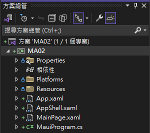
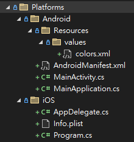
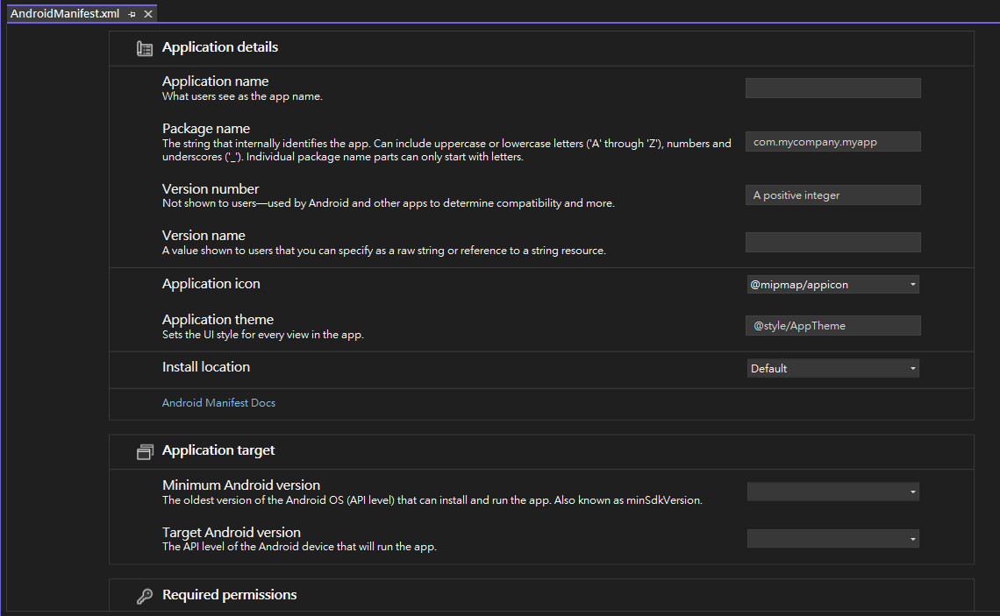
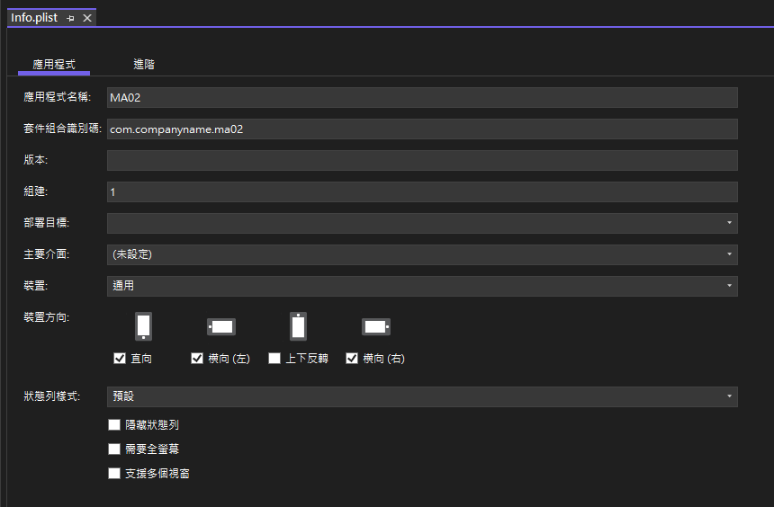
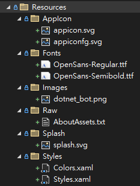
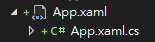
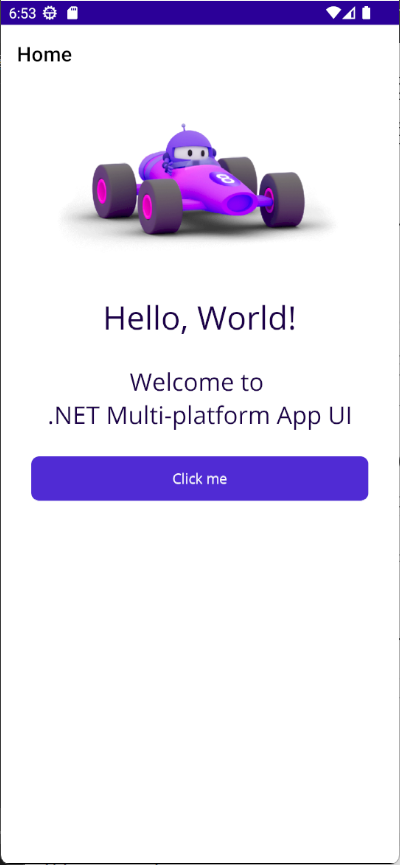

# .NET 8 MAUI 專案範本結構與成員說明


.NET 8 MAUI 已經於 2023.11 推出了，在此之前，作者在進行 Xamarin.Forms 或者 .NET MAUI 開發的時候，都是搭配著 [Prism Library](https://github.com/PrismLibrary/Prism) 這個框架來進行跨平台 App 開發，不過，隨著這個套件的使用授權變更與支援即時度等相關問題，迫使作者做了另外一個層面的思考，決定要使用原生地 .NET MAUI 來進行跨平台 App 開發，這樣一來，就不用再擔心 Prism Library 的授權與支援度問題了。

在這篇文章中，作者將會說明如何建立一個 .NET 8 MAUI 專案，並且說明這個專案的結構與成員的用途。

## 建立 .NET 8 MAUI 專案

> **為了能夠完成這份文件所提到的事情，需要將電腦上的 Visual Studio 2022 升級到 17.8 以上的版本，也就是，這台電腦上必須要有安裝 .NET 8 SDK。**

* 打開 Visual Studio 2022 IDE 應用程式
* 從 [Visual Studio 2022] 對話窗中，點選右下方的 [建立新的專案] 按鈕
* 在 [建立新專案] 對話窗右半部
  * 切換 [所有語言 (L)] 下拉選單控制項為 [C#]
  * 切換 [所有專案類型 (T)] 下拉選單控制項為 [MAUI]
* 在中間的專案範本清單中，找到並且點選 [.NET MAUI 應用程式] 專案範本選項
  > 此專案可用於建立適用於 iOS、Android、Mac Catalyst、Tizen 和 WinUI 的 .NET MAUI 應用程式。
* 點選右下角的 [下一步] 按鈕
* 在 [設定新的專案] 對話窗
* 找到 [專案名稱] 欄位，輸入 `MA02` 作為專案名稱
* 在剛剛輸入的 [專案名稱] 欄位下方，確認沒有勾選 [將解決方案與專案至於相同目錄中] 這個檢查盒控制項
* 點選右下角的 [下一步] 按鈕
* 現在將會看到 [其他資訊] 對話窗
* 在 [架構] 欄位中，請選擇最新的開發框架，這裡選擇的 [架構] 是 : `.NET 8.0 (長期支援)`
* 請點選右下角的 [建立] 按鈕

稍微等候一下，這個主控台專案將會建立完成

## 專案結構與成員說明

* 從 Visual Studio 2022 的方案視窗中，可以看到如下螢幕截圖



* 這個 [MA02] 方案內將會有個 [MA02] 專案
* 在這個 [MA02] 專案內，將會有 3 個資料夾，分別是 [Properties] 、 [Platforms] 與 [Resources]
    * [Propertis] 資料夾內有個 [launchSettings.json] 檔案，這個檔案是用來配置是為了在 Windows 機器上進行部署或調試而設定的，並且使用 MSIX 作為打包方式，同時關閉了原生調試功能。
    * [Platforms] 資料夾將會放置各平台的專案檔案，包括 Android、iOS、Mac Catalyst 和 Windows。
    * 在下圖中，將會呈現出 [Android] & [iOS] 平台專屬用到的檔案

      
    * [Resources] 資料夾將會放置應用程式的圖示、啟動畫面、圖片、字型和原始資源等等。
* 在這個 [MA02] 專案內，將會有 4 個檔案，分別是 [App.xaml] 、 [AppShell.xaml] 、 [MainPage.xaml] 與 [MauiProgram.cs]
  * [App.xaml] 為應用程式的主要資源檔案，這個檔案會定義應用程式的主要資源，包括應用程式的主題、樣式、資源字典、資源檔案、資源檔案的位置等等。
  * [AppShell.xaml] 檔案是用來定義應用程式的主要外觀與階層，這個檔案會定義應用程式的主要外觀，包括主要的頁面、導覽列、導覽列的外觀、導覽列的位置、導覽列的顏色、導覽列的字型、導覽列的圖示等等。
  * [MainPage.xaml] 檔案是用來定義應用程式的主要頁面，這個檔案會定義應用程式的主要頁面，也可以說，是這個 App 第一個看到的內容頁面 Content Page。
  * [MauiProgram.cs] 檔案是用來定義應用程式的進入點，這個檔案會定義應用程式的進入點，並且會建立應用程式的主要物件，也就是 [Microsoft.Maui.MauiApp] 類別的物件。

  * [MA02.csproj] 檔案是用來定義專案的設定和組態，並且指導編譯器如何建置專案。
  * [AndroidManifest.xml] 檔案是用來定義 Android 平台的應用程式資訊，包括應用程式名稱、識別碼、版本、圖示、啟動畫面、權限、設定等等。
  * [Info.plist] 檔案是用來定義 iOS 平台的應用程式資訊，包括應用程式名稱、識別碼、版本、圖示、啟動畫面、權限、設定等等。
  * [MainActivity.cs] 檔案是用來定義 Android 平台的應用程式進入點，這個檔案會繼承自 [Microsoft.Maui.MauiAppCompatActivity] 類別，並且實作 [Microsoft.Maui.IActivity] 介面。

## MAUI 專案定義檔案

這個 MA02.csproj 檔案是一個 .NET MAUI (Multi-platform App UI) 專案檔案，它定義了專案的設定和組態，並且指導編譯器如何建置專案，以下是一些主要的功能：

1.	目標框架：這個專案可以建置為多個平台的應用程式，包括 Android、iOS、Mac Catalyst 和 Windows。這是由 TargetFrameworks 屬性定義的。
2.	輸出類型：這個專案的輸出類型是可執行檔，由 OutputType 屬性定義。
3.	命名空間：這個專案的根命名空間是 MA02，由 RootNamespace 屬性定義。
4.	應用程式資訊：這個專案定義了應用程式的名稱、識別碼和版本，由 ApplicationTitle、ApplicationId、ApplicationDisplayVersion 和 ApplicationVersion 屬性定義。
5.	支援的作業系統平台版本：這個專案定義了每個目標平台的支援的最小作業系統版本，由 SupportedOSPlatformVersion 和 TargetPlatformMinVersion 屬性定義。
6.	資源：這個專案包含了一些資源檔案，如應用程式圖示、啟動畫面、圖片、字型和原始資源。
7.	套件參考：這個專案參考了一些 NuGet 套件，包括 Microsoft.Maui.Controls、Microsoft.Maui.Controls.Compatibility 和 Microsoft.Extensions.Logging.Debug。

底下是這個專案的 MA02.csproj 檔案內容

```xml
<Project Sdk="Microsoft.NET.Sdk">

	<PropertyGroup>
		<TargetFrameworks>net8.0-android;net8.0-ios;net8.0-maccatalyst</TargetFrameworks>
		<TargetFrameworks Condition="$([MSBuild]::IsOSPlatform('windows'))">$(TargetFrameworks);net8.0-windows10.0.19041.0</TargetFrameworks>
		<!-- Uncomment to also build the tizen app. You will need to install tizen by following this: https://github.com/Samsung/Tizen.NET -->
		<!-- <TargetFrameworks>$(TargetFrameworks);net8.0-tizen</TargetFrameworks> -->

		<!-- Note for MacCatalyst:
		The default runtime is maccatalyst-x64, except in Release config, in which case the default is maccatalyst-x64;maccatalyst-arm64.
		When specifying both architectures, use the plural <RuntimeIdentifiers> instead of the singular <RuntimeIdentifier>.
		The Mac App Store will NOT accept apps with ONLY maccatalyst-arm64 indicated;
		either BOTH runtimes must be indicated or ONLY macatalyst-x64. -->
		<!-- For example: <RuntimeIdentifiers>maccatalyst-x64;maccatalyst-arm64</RuntimeIdentifiers> -->

		<OutputType>Exe</OutputType>
		<RootNamespace>MA02</RootNamespace>
		<UseMaui>true</UseMaui>
		<SingleProject>true</SingleProject>
		<ImplicitUsings>enable</ImplicitUsings>
		<Nullable>enable</Nullable>

		<!-- Display name -->
		<ApplicationTitle>MA02</ApplicationTitle>

		<!-- App Identifier -->
		<ApplicationId>com.companyname.ma02</ApplicationId>

		<!-- Versions -->
		<ApplicationDisplayVersion>1.0</ApplicationDisplayVersion>
		<ApplicationVersion>1</ApplicationVersion>

		<SupportedOSPlatformVersion Condition="$([MSBuild]::GetTargetPlatformIdentifier('$(TargetFramework)')) == 'ios'">11.0</SupportedOSPlatformVersion>
		<SupportedOSPlatformVersion Condition="$([MSBuild]::GetTargetPlatformIdentifier('$(TargetFramework)')) == 'maccatalyst'">13.1</SupportedOSPlatformVersion>
		<SupportedOSPlatformVersion Condition="$([MSBuild]::GetTargetPlatformIdentifier('$(TargetFramework)')) == 'android'">21.0</SupportedOSPlatformVersion>
		<SupportedOSPlatformVersion Condition="$([MSBuild]::GetTargetPlatformIdentifier('$(TargetFramework)')) == 'windows'">10.0.17763.0</SupportedOSPlatformVersion>
		<TargetPlatformMinVersion Condition="$([MSBuild]::GetTargetPlatformIdentifier('$(TargetFramework)')) == 'windows'">10.0.17763.0</TargetPlatformMinVersion>
		<SupportedOSPlatformVersion Condition="$([MSBuild]::GetTargetPlatformIdentifier('$(TargetFramework)')) == 'tizen'">6.5</SupportedOSPlatformVersion>
	</PropertyGroup>

	<ItemGroup>
		<!-- App Icon -->
		<MauiIcon Include="Resources\AppIcon\appicon.svg" ForegroundFile="Resources\AppIcon\appiconfg.svg" Color="#512BD4" />

		<!-- Splash Screen -->
		<MauiSplashScreen Include="Resources\Splash\splash.svg" Color="#512BD4" BaseSize="128,128" />

		<!-- Images -->
		<MauiImage Include="Resources\Images\*" />
		<MauiImage Update="Resources\Images\dotnet_bot.png" Resize="True" BaseSize="300,185" />

		<!-- Custom Fonts -->
		<MauiFont Include="Resources\Fonts\*" />

		<!-- Raw Assets (also remove the "Resources\Raw" prefix) -->
		<MauiAsset Include="Resources\Raw\**" LogicalName="%(RecursiveDir)%(Filename)%(Extension)" />
	</ItemGroup>

	<ItemGroup>
		<PackageReference Include="Microsoft.Maui.Controls" Version="$(MauiVersion)" />
		<PackageReference Include="Microsoft.Maui.Controls.Compatibility" Version="$(MauiVersion)" />
		<PackageReference Include="Microsoft.Extensions.Logging.Debug" Version="8.0.0" />
	</ItemGroup>

</Project>
```

## Android 平台專案定義檔案

* 位於 [Platforms] > [Android] 目錄下，所設計的類別將可以呼叫原生的 Android API，而在這裡將會有三個檔案
  * [AndroidManifest.xml] AndroidManifest.xml 是一個 Android 應用程式的核心配置文件，它包含了應用程式的許多重要設定和權限；總的來說，AndroidManifest.xml 文件定義了應用程式的許多重要設定和權限，包括應用程式的全局設定和需要的權限等。以下是這個 AndroidManifest.xml 文件中的一些主要設定：

    1. application：這個元素定義了應用程式的全局設定，如是否允許備份 (android:allowBackup="true")，應用程式的圖示 (android:icon="@mipmap/appicon")，以及是否支援從右到左的語言 (android:supportsRtl="true")。
    2. uses-permission：這些元素定義了應用程式需要的權限，如網路狀態訪問權限 (android:name="android.permission.ACCESS_NETWORK_STATE") 和網路訪問權限 (android:name="android.permission.INTERNET")。

    >
    > 使用滑鼠雙擊這個檔案內容，可以透過 [Android Manifest Editor] 這個工具來進行編輯
    >
    > 
    >

    其實這個檔案是個 XML 檔案，若使用滑鼠右擊這個檔案，從彈出功能表中選擇 [開啟方式] > [XML (文字) 編輯器]，就可以使用文字編輯器來編輯這個檔案內容。

```xml
<?xml version="1.0" encoding="utf-8"?>
<manifest xmlns:android="http://schemas.android.com/apk/res/android">
	<application android:allowBackup="true" android:icon="@mipmap/appicon" android:roundIcon="@mipmap/appicon_round" android:supportsRtl="true"></application>
	<uses-permission android:name="android.permission.ACCESS_NETWORK_STATE" />
	<uses-permission android:name="android.permission.INTERNET" />
</manifest>
```

  * [MainActivity.cs] 檔案是用來定義 Android 平台的應用程式進入點，這個檔案會繼承自 [Microsoft.Maui.MauiAppCompatActivity] 類別，並且實作 [Microsoft.Maui.IActivity] 介面。在這個類別內，將會有許多方法可以覆寫，這些方法都是用來定義應用程式在 Android 平台上的行為。 

```csharp
using Android.App;
using Android.Content.PM;
using Android.OS;

namespace MA02
{
    [Activity(Theme = "@style/Maui.SplashTheme", MainLauncher = true, ConfigurationChanges = ConfigChanges.ScreenSize | ConfigChanges.Orientation | ConfigChanges.UiMode | ConfigChanges.ScreenLayout | ConfigChanges.SmallestScreenSize | ConfigChanges.Density)]
    public class MainActivity : MauiAppCompatActivity
    {
    }
}
```
  * [MainApplication.cs] 這個檔案為繼承自 [Microsoft.Maui.MauiApplication] 類別的應用程式類別，在這裡將會透過 `protected override MauiApp CreateMauiApp() => MauiProgram.CreateMauiApp();` 敘述，從 [MauiProgram.cs] 檔案內，取得一個 MauiApp 物件，讓這個 Androud 專案可以執行相關 MAUI 開發框架程式碼。

```csharp
using Android.App;
using Android.Runtime;

namespace MA02
{
    [Application]
    public class MainApplication : MauiApplication
    {
        public MainApplication(IntPtr handle, JniHandleOwnership ownership)
            : base(handle, ownership)
        {
        }

        protected override MauiApp CreateMauiApp() => MauiProgram.CreateMauiApp();
    }
}
```

* 位於 [Platforms] > [Android] > [Resources] > [values] 目錄下，將會有 [colors.xml] 檔案，這裡將會定義應用程式的主要顏色，包括主要顏色、主要暗色、主要亮色等等。

```xml
<?xml version="1.0" encoding="utf-8"?>
<resources>
    <color name="colorPrimary">#512BD4</color>
    <color name="colorPrimaryDark">#2B0B98</color>
    <color name="colorAccent">#2B0B98</color>
</resources>
```

## iOS 平台專案定義檔案

* 位於 [Platforms] > [iOS] 目錄下，所設計的類別將可以呼叫原生的 Android API，在這裡將會有三個檔案
  * [Program.cs] 檔案是用來定義 iOS 平台的應用程式進入點，這個檔案會定義應用程式的進入點，並且會建立應用程式的主要物件，在 Main 的方法內，將會把 [AppDelegate] 這個型別傳入到這個方法內。

```csharp
using ObjCRuntime;
using UIKit;

namespace MA02
{
    public class Program
    {
        // This is the main entry point of the application.
        static void Main(string[] args)
        {
            // if you want to use a different Application Delegate class from "AppDelegate"
            // you can specify it here.
            UIApplication.Main(args, null, typeof(AppDelegate));
        }
    }
}
```

  * [AppDelegate.cs] 檔案會繼承自 [Microsoft.Maui.MauiUIApplicationDelegate] 類別，並且實作 [Microsoft.Maui.IUIApplicationDelegate] 介面。在這個類別內，將會有許多方法可以覆寫，這些方法都是用來定義應用程式在 iOS 平台上的行為。

```csharp
using Foundation;

namespace MA02
{
    [Register("AppDelegate")]
    public class AppDelegate : MauiUIApplicationDelegate
    {
        protected override MauiApp CreateMauiApp() => MauiProgram.CreateMauiApp();
    }
}
```

  * [Info.plist] 檔案是用來定義 iOS 平台的應用程式資訊，包括應用程式名稱、識別碼、版本、圖示、啟動畫面、權限、設定等等。總的來說，Info.plist 文件定義了應用程式的許多重要設定，包括應用程式的運行環境、支援的設備類型和功能、支援的介面方向，以及應用程式的圖示等。

    Info.plist 是一個 iOS 應用程式的配置文件，它包含了應用程式的許多重要設定。以下是這個 Info.plist 文件中的一些主要設定：

    1. LSRequiresIPhoneOS：這個鍵表示應用程式需要在 iPhone OS 上運行，這是一個布林值，設為 true。
    2. UIDeviceFamily：這個鍵定義了應用程式支援的設備類型，1 代表 iPhone，2 代表 iPad。
    3. UIRequiredDeviceCapabilities：這個鍵定義了應用程式需要的設備功能，這裡設定為 arm64，表示應用程式需要在支援 arm64 架構的設備上運行。
    4. UISupportedInterfaceOrientations 和 UISupportedInterfaceOrientations~ipad：這兩個鍵定義了應用程式支援的介面方向，分別為 iPhone 和 iPad。
    5. XSAppIconAssets：這個鍵定義了應用程式的圖示資源的位置。

    >
    > 使用滑鼠雙擊這個檔案內容，可以透過 [Info.plist Editor] 這個工具來進行編輯
    >
    > 
    >

    其實這個檔案是個 XML 檔案，若使用滑鼠右擊這個檔案，從彈出功能表中選擇 [開啟方式] > [XML (文字) 編輯器]，就可以使用文字編輯器來編輯這個檔案內容。
  
```xml
<?xml version="1.0" encoding="UTF-8"?>
<!DOCTYPE plist PUBLIC "-//Apple//DTD PLIST 1.0//EN" "http://www.apple.com/DTDs/PropertyList-1.0.dtd">
<plist version="1.0">
<dict>
	<key>LSRequiresIPhoneOS</key>
	<true/>
	<key>UIDeviceFamily</key>
	<array>
		<integer>1</integer>
		<integer>2</integer>
	</array>
	<key>UIRequiredDeviceCapabilities</key>
	<array>
		<string>arm64</string>
	</array>
	<key>UISupportedInterfaceOrientations</key>
	<array>
		<string>UIInterfaceOrientationPortrait</string>
		<string>UIInterfaceOrientationLandscapeLeft</string>
		<string>UIInterfaceOrientationLandscapeRight</string>
	</array>
	<key>UISupportedInterfaceOrientations~ipad</key>
	<array>
		<string>UIInterfaceOrientationPortrait</string>
		<string>UIInterfaceOrientationPortraitUpsideDown</string>
		<string>UIInterfaceOrientationLandscapeLeft</string>
		<string>UIInterfaceOrientationLandscapeRight</string>
	</array>
	<key>XSAppIconAssets</key>
	<string>Assets.xcassets/appicon.appiconset</string>
</dict>
</plist>
```

## 專案共用資源 Resources 目錄與檔案

* 在 [Resources] 目錄內將會宣告許多該 App 會用到的共用資源檔案，底下螢幕截圖，將會是這個目錄下的所有子目錄與檔案



  * [AppIcon] 資料夾內有兩個 SVG 檔案，分別是 [appicon.svg] 與 [appiconfg.svg]，這兩個檔案是用來定義應用程式的圖示，其中 [appicon.svg] 檔案是用來定義應用程式的圖示，而 [appiconfg.svg] 檔案是用來定義應用程式的圖示的前景顏色。
  * [Splash] 資料夾內有一個 SVG 檔案，這個檔案是用來定義應用程式的啟動畫面。
  * [Images] 資料夾內有一個 PNG 檔案，這個檔案是用來定義應用程式的圖片，在這裡也可以接受 SVG 類型的檔案。
  * [Fonts] 資料夾內有一個 TTF 檔案，這個檔案是用來定義應用程式的字型。
  * [Raw] 資料夾內有一個 TXT 檔案，這個檔案是用來定義應用程式的原始資源。

## MauiProgram.cs 檔案

* 這個 [MauiProgram.cs] 是一個 .NET MAUI (Multi-platform App UI) 應用程式的啟動檔案，它定義了應用程式的啟動和配置過程與相依性注入 DI 容器 Container 的注入型別註冊。

* 以下是這個 MauiProgram.cs 文件中的一些主要設定：

  1. MauiApp.CreateBuilder()：這個方法用於創建一個 MAUI 應用程式的建構器。
  2. UseMauiApp()：這個方法用於設定應用程式的主類型為 App。
  3. ConfigureFonts：這個方法用於配置應用程式的字體。在這裡，它添加了兩種字體：OpenSans-Regular.ttf 和 OpenSans-Semibold.ttf。
  4. builder.Logging.AddDebug()：這個方法用於在 Debug 模式下添加日誌記錄。
  5. builder.Build()：這個方法用於建構和返回一個 MAUI 應用程式。
總的來說，MauiProgram.cs 文件定義了應用程式的啟動和配置過程，包括應用程式的主類型、字體配置、日誌記錄和應用程式的建構等。

* 底下將會是這個檔案的程式碼

```csharp
using Microsoft.Extensions.Logging;

namespace MA02
{
    public static class MauiProgram
    {
        public static MauiApp CreateMauiApp()
        {
            var builder = MauiApp.CreateBuilder();
            builder
                .UseMauiApp<App>()
                .ConfigureFonts(fonts =>
                {
                    fonts.AddFont("OpenSans-Regular.ttf", "OpenSansRegular");
                    fonts.AddFont("OpenSans-Semibold.ttf", "OpenSansSemibold");
                });

#if DEBUG
    		builder.Logging.AddDebug();
#endif

            return builder.Build();
        }
    }
}
```

## App.xaml 檔案

* 在 [MauiProgram.cs] 檔案內，對於 `.UseMauiApp<App>()` 這個表示式，這裡的 `App` 類別是一個應用程式的主類型。
* [App.xaml] 是一個 .NET MAUI (Multi-platform App UI) 應用程式的配置文件，它定義了應用程式的全局資源，總的來說，App.xaml 文件定義了應用程式的全局設定和資源，包括命名空間、主類型、全局資源和合併的資源字典等，在這個類別內，將會有許多方法可以覆寫，這些方法都是用來定義應用程式的行為。
* 以下是這個 App.xaml 文件中的一些主要設定：
  1. Application：這個元素定義了應用程式的全局設定，包括命名空間 (xmlns, xmlns:x, xmlns:local) 和應用程式的主類型 (x:Class="MA02.App")。
  2. Application.Resources：這個元素定義了應用程式的全局資源，這裡使用了 ResourceDictionary 來存儲資源。
  3. ResourceDictionary.MergedDictionaries：這個元素定義了合併的資源字典，這裡合併了兩個資源字典：Colors.xaml 和 Styles.xaml，這兩個文件定義了應用程式的顏色和樣式。

* 底下將會是這個檔案的程式碼
    
```xml
<?xml version = "1.0" encoding = "UTF-8" ?>
<Application xmlns="http://schemas.microsoft.com/dotnet/2021/maui"
             xmlns:x="http://schemas.microsoft.com/winfx/2009/xaml"
             xmlns:local="clr-namespace:MA02"
             x:Class="MA02.App">
    <Application.Resources>
        <ResourceDictionary>
            <ResourceDictionary.MergedDictionaries>
                <ResourceDictionary Source="Resources/Styles/Colors.xaml" />
                <ResourceDictionary Source="Resources/Styles/Styles.xaml" />
            </ResourceDictionary.MergedDictionaries>
        </ResourceDictionary>
    </Application.Resources>
</Application>
```

## App.xaml.cs 檔案

* [App.xaml.cs] 是 [App.xaml] 的 code-behind 檔案，也就是這個 XAML 用來寫 C# 程式碼的地方，通常，例如 UI 的事件回呼 (callback) 就會將 C# 程式碼寫在這裡
* 想要開啟這個 [App.xaml.cs] 檔案，首先找到 [App.xaml] 檔案，點選該檔案最前面的三角形圖示，將過展開之後，就會看到這個 [App.xaml.cs] 檔案節點，如底下畫面截圖

  
* 在這個檔案內，會在建構式內，宣告 MainPage 這個屬性為 [AppShell] 型別的物件，也就是說，這個跨平台應用程式，將會首先顯示出 [AppShell] 這個 XAML 物件在螢幕上
* 底下是這個檔案的原始碼

```csharp
namespace MA02
{
    public partial class App : Application
    {
        public App()
        {
            InitializeComponent();

            MainPage = new AppShell();
        }
    }
}
```

## AppShell.xaml 檔案

* AppShell.xaml 是一個 .NET MAUI (Multi-platform App UI) 應用程式的 Shell 文件，它定義了應用程式的導航結構。
* 以下是這個 AppShell.xaml 文件中的一些主要設定：
  1. AppShell：這是一個繼承自 Shell 的類別，Shell 是一個用於應用程式導航的容器。
  2. Shell：這是一個用於應用程式導航的容器，它定義了應用程式的全局設定，包括命名空間 (xmlns, xmlns:x, xmlns:local) 和應用程式的主類型 (x:Class="MA02.AppShell")。此外，它還設定了 Shell.FlyoutBehavior 為 Disabled，這表示飛出菜單被禁用。
  3. Shell 元素的子元素，它定義了一個導航內容。在這個例子中，它定義了一個標題為 "Home" 的導航內容，內容模板為 MainPage，路由為 "MainPage"。
  4. 在這裡使用 `ContentTemplate="{DataTemplate local:MainPage}"` 語法，宣告了這個 AppShell 的內容樣板為 [MainPage.xaml] 這個類別
* 總的來說，AppShell.xaml 文件定義了應用程式的導航結構，包括 Shell 容器和 ShellContent 導航內容等。

* 而對於 Shell 這個型別而言，將 是 .NET MAUI (Multi-platform App UI) 中的一個類別，它提供了一種簡單的方式來創建應用程式的導航結構。
* 以下是 Shell 類別的一些主要功能：
  1. 導航結構：Shell 類別允許你定義應用程式的導航結構，包括頁面的層次結構和導航路徑。
  2. 導航服務：Shell 類別提供了一個導航服務，可以用來進行頁面的導航，包括頁面的推送和彈出。
  3. 導航欄和底部欄：Shell 類別允許你定義導航欄和底部欄，包括它們的項目和行為。
  4. 飛出菜單：Shell 類別允許你定義一個飛出菜單，用於在應用程式中顯示主要的導航選項。
* 總的來說，Shell 類別是一個用於創建和管理應用程式導航結構的工具，它提供了一種簡單的方式來定義和操作導航。
* 底下將會是這個檔案的內容

```xml
<?xml version="1.0" encoding="UTF-8" ?>
<Shell
    x:Class="MA02.AppShell"
    xmlns="http://schemas.microsoft.com/dotnet/2021/maui"
    xmlns:x="http://schemas.microsoft.com/winfx/2009/xaml"
    xmlns:local="clr-namespace:MA02"
    Shell.FlyoutBehavior="Disabled"
    Title="MA02">

    <ShellContent
        Title="Home"
        ContentTemplate="{DataTemplate local:MainPage}"
        Route="MainPage" />

</Shell>
```

## AppShell.xaml.cs 檔案

* 對於 [AppShell.xaml.cs] 這個檔案，則是預設的檔案內容

```csharp
namespace MA02
{
    public partial class AppShell : Shell
    {
        public AppShell()
        {
            InitializeComponent();
        }
    }
}
```

## MainPage.xaml 檔案

* 是頁面文件，它定義了應用程式的主要用戶界面。以下是這個 MainPage.xaml 文件中的一些主要元素：
  1. ContentPage：這是一個用於顯示應用程式內容的頁面，它包含了一個 ScrollView 和一個 VerticalStackLayout。
  2. ScrollView：這是一個可以滾動的視圖，它包含了一個 VerticalStackLayout。
  3. VerticalStackLayout：這是一個垂直堆疊的布局，它包含了一個圖像 (Image)，兩個標籤 (Label) 和一個按鈕 (Button)。
  4. Image：這是一個圖像元素，它顯示了一個名為 "dotnet_bot.png" 的圖像。
  5. Label：這是一個標籤元素，它顯示了一些文字。
  6. Button：這是一個按鈕元素，它的文字為 "Click me"，並且當它被點擊時，會調用 OnCounterClicked 方法。
* 總的來說，MainPage.xaml 文件定義了應用程式的主要用戶界面，包括一個可以滾動的視圖，一個垂直堆疊的布局，以及一些用戶界面元素，如圖像，標籤和按鈕等。

* 底下將會是這個檔案的內容

```XML
<?xml version="1.0" encoding="utf-8" ?>
<ContentPage xmlns="http://schemas.microsoft.com/dotnet/2021/maui"
             xmlns:x="http://schemas.microsoft.com/winfx/2009/xaml"
             x:Class="MA02.MainPage">

    <ScrollView>
        <VerticalStackLayout
            Padding="30,0"
            Spacing="25">
            <Image
                Source="dotnet_bot.png"
                HeightRequest="185"
                Aspect="AspectFit"
                SemanticProperties.Description="dot net bot in a race car number eight" />

            <Label
                Text="Hello, World!"
                Style="{StaticResource Headline}"
                SemanticProperties.HeadingLevel="Level1" />

            <Label
                Text="Welcome to &#10;.NET Multi-platform App UI"
                Style="{StaticResource SubHeadline}"
                SemanticProperties.HeadingLevel="Level2"
                SemanticProperties.Description="Welcome to dot net Multi platform App U I" />

            <Button
                x:Name="CounterBtn"
                Text="Click me" 
                SemanticProperties.Hint="Counts the number of times you click"
                Clicked="OnCounterClicked"
                HorizontalOptions="Fill" />
        </VerticalStackLayout>
    </ScrollView>

</ContentPage>
```

## MainPage.xaml.cs 檔案

* MainPage.xaml.cs 是主頁面代碼文件，它定義了應用程式的主要邏輯，包括按鈕點擊的處理，以及更新按鈕文字和讀出按鈕文字等功能。。
* 以下是這個 MainPage.xaml.cs 文件中的一些主要元素：
  1. MainPage 類別：這是一個繼承自 ContentPage 的類別，它定義了應用程式的主頁面。
  2. count 變量：這是一個整數變量，用於記錄按鈕被點擊的次數。
  3. MainPage 構造函數：這是 MainPage 類別的構造函數，它調用了 InitializeComponent 方法來初始化頁面。
  4. OnCounterClicked 方法：這是一個事件處理器，當按鈕被點擊時，它會被調用。在這個方法中，count 變量會被增加，並且按鈕的文字會被更新為顯示點擊次數。最後，它會調用 SemanticScreenReader.Announce 方法來讀出按鈕的文字。
* 底下將會是這個檔案的內容

```csharp
namespace MA02
{
    public partial class MainPage : ContentPage
    {
        int count = 0;

        public MainPage()
        {
            InitializeComponent();
        }

        private void OnCounterClicked(object sender, EventArgs e)
        {
            count++;

            if (count == 1)
                CounterBtn.Text = $"Clicked {count} time";
            else
                CounterBtn.Text = $"Clicked {count} times";

            SemanticScreenReader.Announce(CounterBtn.Text);
        }
    }

}
```

## 執行結果

* 底下畫面將會是這個專案在 Android 平台內執行的結果




