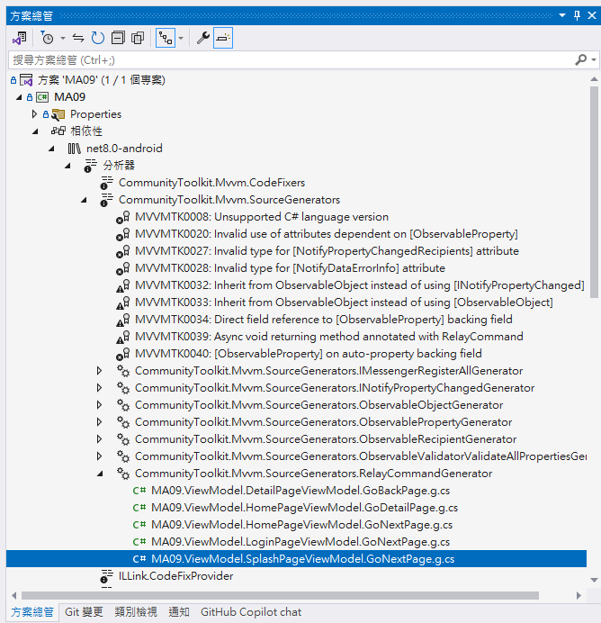

# .NET8 Maui 通用導航應用情境 Splash - Login - Home - Detail


在這個範例中，將會說明如何透過 .NET 8 MAUI 來建立一個通用導航應用情境，這個應用情境將會包含有啟動畫面、登入畫面、首頁畫面與詳細畫面，這個應用情境將會透過導航頁面來進行畫面的切換，而且，這個應用情境將會透過 ViewModel 來進行畫面的資料綁定，這樣的設計方式，將會讓程式碼更加的乾淨與容易維護。

當這個範例 App 啟動之後，就會第一個先顯示啟動畫面頁面 SplashPage


原則上在這個頁面將會做些初始化等相關工作，接著就會自動切換到下一個頁面，為了讓學習更加容易，這個頁面將會暫停在這裡，只要使用者點選 [繼續] 按鈕之後，就會進入到下一個頁面。

接下來將進入到身分驗證的頁面


雖然名為身分驗證頁面，因為簡化與方便說明，將不提供帳號與密碼輸入和進行檢查驗證工作，使用者僅需要點選該頁面上的 [繼續] 按鈕，就表示成功通過身分驗證，並且要切換到首頁頁面。

底下將會是首頁頁面


在前面兩個 啟動 與 登入 頁面，可以看到頁面將會占據整個手機畫面，而到首頁頁面的時候，在螢幕的最上方將會有個粉紅色底色的導航工具列，剩下的空間才是這個頁面要顯示的內容。

在首頁頁面中，透過 [重新登入] 按鈕，模擬正常操作情況下，使用者想要登出系統，並且重新登入需求，因此，點選這個按鈕，將會回到身分驗證登入頁面，此時，使用者除非通過身分驗證，否則是無法再度回到首頁頁面的。

第二個按鈕將會是 [查看明細] 按鈕，按下這個按鈕，將會切換到產品明細頁面，如下圖


這個產品明細頁面僅提供一個按鈕，[返回] 按鈕，按下這個按鈕之後，將會回到首頁，當然使用者也可以點選螢幕左上方箭頭，回到首頁頁面。

接下來就會說明如何根據上述需求，設計出這樣的 .NET MAUI 程式碼

## 建立 .NET 8 MAUI 專案

* 打開 Visual Studio 2022 IDE 應用程式
* 從 [Visual Studio 2022] 對話窗中，點選右下方的 [建立新的專案] 按鈕
* 在 [建立新專案] 對話窗右半部
  * 切換 [所有語言 (L)] 下拉選單控制項為 [C#]
  * 切換 [所有專案類型 (T)] 下拉選單控制項為 [MAUI]
* 在中間的專案範本清單中，找到並且點選 [.NET MAUI 應用程式] 專案範本選項
  > 此專案可用於建立適用於 iOS、Android、Mac Catalyst、Tizen 和 WinUI 的 .NET MAUI 應用程式。
* 點選右下角的 [下一步] 按鈕
* 在 [設定新的專案] 對話窗
* 找到 [專案名稱] 欄位，輸入 `MA09` 作為專案名稱
* 在剛剛輸入的 [專案名稱] 欄位下方，確認沒有勾選 [將解決方案與專案至於相同目錄中] 這個檢查盒控制項
* 點選右下角的 [下一步] 按鈕
* 現在將會看到 [其他資訊] 對話窗
* 在 [架構] 欄位中，請選擇最新的開發框架，這裡選擇的 [架構] 是 : `.NET 8.0 (長期支援)`
* 請點選右下角的 [建立] 按鈕

稍微等候一下，這個主控台專案將會建立完成

## 安裝要用到的 NuGet 開發套件

因為開發此專案時會用到這些 NuGet 套件，請依照底下說明，將需要用到的 NuGet 套件安裝起來。

### 安裝 CommunityToolkit.Mvvm 套件

CommunityToolkit.Mvvm 是微軟官方提供的 MVVM 套件，提供了一些 MVVM 開發常用的功能，例如：ObservableObject、ObservableProperty、RelayCommand 等等，這些功能在 WPF、UWP、Xamarin.Forms 都可以使用，而且在 .NET 8 MAUI 也可以使用。

請依照底下說明操作步驟，將這個套件安裝到專案內

* 滑鼠右擊 [方案總管] 視窗內的 [專案節點] 下方的 [相依性] 節點
* 從彈出功能表清單中，點選 [管理 NuGet 套件] 這個功能選項清單
* 此時，將會看到 [NuGet: MA10] 視窗
* 切換此視窗的標籤頁次到名稱為 [瀏覽] 這個標籤頁次
* 在左上方找到一個搜尋文字輸入盒，在此輸入 `CommunityToolkit.Mvvm`
* 稍待一會，將會在下方看到這個套件被搜尋出來
* 點選 [CommunityToolkit.Mvvm] 套件名稱
* 在視窗右方，將會看到該套件詳細說明的內容，其中，右上方有的 [安裝] 按鈕
* 點選這個 [安裝] 按鈕，將這個套件安裝到專案內

## MVVM 開發模式用到的資料夾

* 由於這個專案採用預設 .NET MAUI 專案範本所建立的專案，所以，專案內的資料夾結構，是採用預設的資料夾結構，為了要能夠讓專案內的資料夾結構，符合 MVVM 開發模式的資料夾結構，請依照底下的說明，將專案內的資料夾結構，修改成符合 MVVM 開發模式的資料夾結構。
* 滑鼠右擊專案節點，從彈出的功能表清單中，點選 [加入] > [新增資料夾] 選項
* 將剛剛建立的資料夾名稱，使用 [Views] 名稱來取代
* 滑鼠右擊專案節點，從彈出的功能表清單中，點選 [加入] > [新增資料夾] 選項
* 將剛剛建立的資料夾名稱，使用 [ViewModels] 名稱來取代
* [Models] 資料夾在這個練習中，並不需要，因此，不需要建立此資料夾

## 建立 SplashPage ViewModel

現在要開始建立這個 App 第一個看到的頁面，也就是 SplashPage，並且進行其 ViewModel ，這將會是這個畫面的邏輯處理中心，這個 ViewModel 將會透過資料綁定的方式，將畫面上的資料與畫面上的元件進行綁定，這樣的設計方式，將會讓程式碼更加的乾淨與容易維護。

* 在專案內找到 [ViewModels] 節點，滑鼠右擊此節點，從彈出的功能表清單中，點選 [加入] > [類別] 選項
* 在 [新增項目 - MA09] 對話窗中，點選對話窗左方的 [已安裝] > [.NET MAUI]
* 在對話窗的下方的名稱欄位，輸入 [SplashPageViewModel.cs] 作為名稱
* 點選對話窗右下方的 [新增] 按鈕
* 現在將會看到 [SplashPageViewModel.cs] 這個檔案，並且，這個檔案會被開啟在 Visual Studio 2022 的編輯器內
* 底下將會是這個檔案的內容

```csharp
using CommunityToolkit.Mvvm.ComponentModel;
using CommunityToolkit.Mvvm.Input;

namespace MA09.ViewModel;

public partial class SplashPageViewModel : ObservableObject
{
    [RelayCommand]
    void GoNextPage()
    {
        Shell.Current.GoToAsync("///Login");
    }
}
```

這裡使用了 [CommunityToolkit.Mvvm](https://learn.microsoft.com/zh-tw/dotnet/communitytoolkit/mvvm/?WT.mc_id=DT-MVP-5002220) 套件，因此，對於 ViewModel 的類別，需要加入 [partial] 修飾詞 (詳情請參閱 [部分類別和方法](https://learn.microsoft.com/zh-tw/dotnet/csharp/programming-guide/classes-and-structs/partial-classes-and-methods?WT.mc_id=DT-MVP-5002220))，並且需要讓這個類別繼承自 [ObservableObject] 類別，這個類別是 [CommunityToolkit.Mvvm.ComponentModel] 命名空間內的類別，這個類別提供了一些 MVVM 開發常用的功能，例如：ObservableObject、ObservableProperty、RelayCommand 等等。

這個 ViewModel 內並沒有做到資料綁定的屬性定義在裡面，而是會提供了一個 [GoNextPage] 方法，這個方法將會在按下按鈕之後，導航到 [LoginPage] 頁面，在此使用了 `Shell.Current.GoToAsync("///Login");` 這個敘述來做到，對於這個 "Login" 路由名稱，將會於稍後會在 [AppShell.xaml] 檔案內進行定義，這裡將會描述 [註冊路線](https://learn.microsoft.com/zh-tw/dotnet/maui/fundamentals/shell/navigation?view=net-maui-8.0#register-routes&WT.mc_id=DT-MVP-5002220) 結構，也就是會在 .NET MAUI Shell 內定義出許多 [.NET MAUI Shell 頁面](https://learn.microsoft.com/zh-tw/dotnet/maui/fundamentals/shell/pages?view=net-maui-8.0&WT.mc_id=DT-MVP-5002220) ，在這些 [Shell 頁面] 內將會使用 [Route] 這個屬性，宣告這個 [Shell 頁面] 的路由名稱，日後，便可以透過這樣的 `Shell.Current.GoToAsync("///[Route屬性定義的路由名稱]");` 敘述導航到新頁面。

另外，對於路由名稱加了三個斜線 `///` ，這表示了 [絕對路由](https://learn.microsoft.com/zh-tw/dotnet/maui/fundamentals/shell/navigation?view=net-maui-8.0#absolute-routes&WT.mc_id=DT-MVP-5002220) 這表示路由階層會從目前的位置向下搜尋指定的路由。 比對頁面將會取代瀏覽堆疊。

## 建立 SplashPage View

* 在專案內找到 [Views] 節點，滑鼠右擊此節點，從彈出的功能表清單中，點選 [加入] > [新增項目] 選項
* 在 [新增項目 - MA09] 對話窗中，點選對話窗左方的 [已安裝] > [.NET MAUI]
* 在對話窗的中間，點選 [.NET MAUI ContentPage (XAML)] 節點
* 在對話窗的下方的名稱欄位，輸入 [SplashPage.xaml] 作為名稱
* 點選對話窗右下方的 [新增] 按鈕
* 現在將會看到 [SplashPage.xaml] 這個檔案，並且，這個檔案會被開啟在 Visual Studio 2022 的編輯器內
* 使用底下內容，替換掉這個檔案內的所有內容

```xml
<?xml version="1.0" encoding="utf-8" ?>
<ContentPage xmlns="http://schemas.microsoft.com/dotnet/2021/maui"
             xmlns:x="http://schemas.microsoft.com/winfx/2009/xaml"
             x:Class="MA09.Views.SplashPage"
             Title="SplashPage"
             Shell.NavBarIsVisible="False"
             BackgroundColor="LightYellow"
             xmlns:viewmodels="clr-namespace:MA09.ViewModel"
             x:DataType="viewmodels:SplashPageViewModel"
             >
    <Grid>
        <VerticalStackLayout Padding="30"
            VerticalOptions="Start" 
            HorizontalOptions="Center">
            <Label 
                Text="啟動的 Splash Screen"
                FontSize="24" />
            <Button Text="繼續"
                    Command="{Binding GoNextPageCommand}"
                    />
        </VerticalStackLayout>
    </Grid>
</ContentPage>
```

一般來說，在 Splash 頁面中，通常會去載入一些遠端資料或者進行相關系統初始化工作和取回這個應用程式上次最後的執行狀態值，例如，是否已經成功登入，登入成功後的 Token 與 Refresh Token 內容等等。一旦這些工作處理完成之後，將會依照現在 App 狀態內容，切換到應該要看到的畫面。

舉例來說，若這個應用程式尚未成功通過身分驗證程序，此時，接下來就應該要顯示 LoginPage 頁面；而當使用者在關閉這個 App 前
已經通過了身分驗證程序，此時再次打開 App 之後且完成 Splash 處理程序之後，接下來就需要顯示 HomePage。

因為在這裡將會簡化這些程序，不會自動切換到另外一個畫面，在這個頁面中的 XAML 宣告，在螢幕上有個 [繼續] 按鈕，當點擊這個按鈕之後，將會切換到 LoginPage 這個頁面。

在這個登入頁面，宣告了一個 [Button] 按鈕，使用了 [Command] 屬性，宣告要綁定到 ViewModel 的命令物件上的方法，不過，在上面的 ViewModel 內，似乎沒有看到 [GoNextPageCommand] 這個命令物件，但是這樣的設定卻可以正常運作，這是因為在 ViewModel 內有繼承 [CommunityToolkit.Mvvm] 的 [ObservableObject] 類別，並且在 [GoNextPage] 方法上加入了 `[RelayCommand]` 這樣的 C# [Attribute](https://learn.microsoft.com/zh-tw/dotnet/api/system.attribute?view=net-8.0&WT.mc_id=DT-MVP-5002220) 屬性宣告，如此，在編譯時期將會自動生成出這個 [GoNextPageCommand] 屬性宣告程式碼出來。

想要看到 [CommunityToolkit.Mvvm] 究竟產生了什麼程式碼，請在這個專案節點下，展開 [相依性] > [net8.0-android] > [分析器] > [CommunityToolkit.Mvvm.SourceGenerators] > [CommunityToolkit.Mvvm.SourceGenerators.RelayCommandGenerator] 節點，在此節點下找到 [MA09.ViewModel.SplashPage.ViewModel.GoNextPage.g.cs] 檔案。



打開這個 [MA09.ViewModel.SplashPage.ViewModel.GoNextPage.g.cs] 檔案，其內容將會呈現如下：

```csharp
// <auto-generated/>
#pragma warning disable
#nullable enable
namespace MA09.ViewModel
{
    /// <inheritdoc/>
    partial class SplashPageViewModel
    {
        /// <summary>The backing field for <see cref="GoNextPageCommand"/>.</summary>
        [global::System.CodeDom.Compiler.GeneratedCode("CommunityToolkit.Mvvm.SourceGenerators.RelayCommandGenerator", "8.2.0.0")]
        private global::CommunityToolkit.Mvvm.Input.RelayCommand? goNextPageCommand;
        /// <summary>Gets an <see cref="global::CommunityToolkit.Mvvm.Input.IRelayCommand"/> instance wrapping <see cref="GoNextPage"/>.</summary>
        [global::System.CodeDom.Compiler.GeneratedCode("CommunityToolkit.Mvvm.SourceGenerators.RelayCommandGenerator", "8.2.0.0")]
        [global::System.Diagnostics.CodeAnalysis.ExcludeFromCodeCoverage]
        public global::CommunityToolkit.Mvvm.Input.IRelayCommand GoNextPageCommand => goNextPageCommand ??= new global::CommunityToolkit.Mvvm.Input.RelayCommand(new global::System.Action(GoNextPage));
    }
}
```

從這裡將會看到所產生的 [partial] [SplashPageViewModel] 類別程式碼中，有宣告一個 `IRelayCommand GoNextPageCommand => goNextPageCommand ??= new global::CommunityToolkit.Mvvm.Input.RelayCommand(new global::System.Action(GoNextPage));` 屬性，從這裡可以看到這個 [GoNextPageCommand] 屬性將會指定 [GoNextPage] 方法作為其建構式的引數。

另外，對於像是這樣的 SplashPage 頁面，並不會需要用到導航工具列，也就是不需將其顯示出來，在此，將會在這個 [ContentPage] 頁面的屬性中，加入這個 `Shell.NavBarIsVisible="False"` 宣告，表示不需要顯示導航工具列在螢幕上。

## 修正 SplashPage.xaml.cs

* 找到專案根目錄下的 [Views] 資料夾
* 找到並且打開 [SplashPage.xaml.cs] 檔案
* 使用底下的程式碼，取代掉這個檔案內的所有程式碼

```csharp
using MA09.ViewModel;

namespace MA09.Views;

public partial class SplashPage : ContentPage
{
	public SplashPage(SplashPageViewModel viewModel)
	{
		InitializeComponent();
		BindingContext = viewModel;
	}
}
```

在這個 View 的 Code Behind 程式碼內，將會透過建構式注入的方式，將這個 View 的 ViewModel 注入到這個 View 內，這樣的設計方式，將會讓這個 View 與這個 View 的 ViewModel 之間，進行了鬆耦合的設計。之後，將這個 ViewModel 物件設定到 [BindingContext] ，以便可以讓 View 內的 XAML 關於資料綁定的宣告可以正常運作。

## 將 View 與 ViewModel 註冊到 DI 容器內

* 在專案根節點下，找到並打開 [Program.cs] 檔案
* 在這個檔案內，找到 `#if DEBUG` 這個敘述
* 在此敘述前面，加入底下程式碼
    
```csharp
builder.Services.AddTransient<SplashPage>();
builder.Services.AddTransient<SplashPageViewModel>();
```

## 建立 LoginPage ViewModel

* 在專案內找到 [ViewModels] 節點，滑鼠右擊此節點，從彈出的功能表清單中，點選 [加入] > [類別] 選項
* 在 [新增項目 - MA09] 對話窗中，點選對話窗左方的 [已安裝] > [.NET MAUI]
* 在對話窗的下方的名稱欄位，輸入 [LoginPageViewModel.cs] 作為名稱
* 點選對話窗右下方的 [新增] 按鈕
* 現在將會看到 [LoginPageViewModel.cs] 這個檔案，並且，這個檔案會被開啟在 Visual Studio 2022 的編輯器內
* 底下將會是這個檔案的內容

```csharp
using CommunityToolkit.Mvvm.ComponentModel;
using CommunityToolkit.Mvvm.Input;
using System;
using System.Collections.Generic;
using System.Linq;
using System.Text;
using System.Threading.Tasks;

namespace MA09.ViewModel;

public partial class LoginPageViewModel : ObservableObject
{
    [RelayCommand]
    void GoNextPage()
    {
        Shell.Current.GoToAsync("///Home");
    }
}
```

在這個登入頁面 LoginPage 內，因為簡化相關過程，因此，使用者不需要輸入任何帳號與密碼，只需要點擊 [繼續] 按鈕，就可以進入到首頁畫面；當然，一旦進入到首頁畫面之後，也不會記錄下這個使用者已經成功登入了，也就是說，當使用者下次再次開啟 App 之後，當然第一個顯示的頁面還是為 Splash 頁面，理論上在 SplashPageViewModel 內需要檢查這個 App 是否成功通過身分驗證，若為已經成功通過身分驗證，所以在 SplashPageViewModel 內需要接下來導航到首頁畫面中，而不是將下一個畫面顯示成為登入畫面 。

由於這個登入畫面中僅會有一個登入按鈕，所以在該 ViewModel 程式碼中，需要提供一個命令綁定用的方法，用來提供當使用點擊該按鈕之後，需要導航到首頁頁面。在此將會設計一個 [GoNextPage] 方法，使用 `Shell.Current.GoToAsync("///Home");` 敘述做到這樣絕對導航需求。

## 建立 LoginPage View

* 在專案內找到 [Views] 節點，滑鼠右擊此節點，從彈出的功能表清單中，點選 [加入] > [新增項目] 選項
* 在 [新增項目 - MA09] 對話窗中，點選對話窗左方的 [已安裝] > [.NET MAUI]
* 在對話窗的中間，點選 [.NET MAUI ContentPage (XAML)] 節點
* 在對話窗的下方的名稱欄位，輸入 [LoginPage.xaml] 作為名稱
* 點選對話窗右下方的 [新增] 按鈕
* 現在將會看到 [LoginPage.xaml] 這個檔案，並且，這個檔案會被開啟在 Visual Studio 2022 的編輯器內
* 使用底下內容，替換掉這個檔案內的所有內容

```xml
<?xml version="1.0" encoding="utf-8" ?>
<ContentPage xmlns="http://schemas.microsoft.com/dotnet/2021/maui"
             xmlns:x="http://schemas.microsoft.com/winfx/2009/xaml"
             x:Class="MA09.Views.LoginPage"
             Title="LoginPage"
             Shell.NavBarIsVisible="False"
             BackgroundColor="LightBlue"
             xmlns:viewmodels="clr-namespace:MA09.ViewModel"
             x:DataType="viewmodels:LoginPageViewModel"
             >
    <Grid>
        <VerticalStackLayout Padding="30"
            VerticalOptions="Start" 
            HorizontalOptions="Center">
            <Label 
                Text="進行身分驗證"
                FontSize="24" />
            <Button Text="繼續"
                    Command="{Binding GoNextPageCommand}"
                    />
        </VerticalStackLayout>
    </Grid>
</ContentPage>
```

在這個登入頁面，宣告了一個 [Button] 按鈕，使用了 [Command] 屬性，宣告要綁定到 ViewModel 的命令物件上的方法，不過，在上面的 ViewModel 內，似乎沒有看到 [GoNextPageCommand] 這個命令物件，但是這樣的設定卻可以正常運作，這是因為在 ViewModel 內有繼承 [CommunityToolkit.Mvvm] 的 [ObservableObject] 類別，並且在 [GoNextPage] 方法上加入了 `[RelayCommand]` 這樣的 C# [Attribute](https://learn.microsoft.com/zh-tw/dotnet/api/system.attribute?view=net-8.0&WT.mc_id=DT-MVP-5002220) 屬性宣告，如此，在編譯時期將會自動生成出這個 [GoNextPageCommand] 屬性宣告程式碼出來。

對於 LoginPage 頁面，並不會需要用到導航工具列，也就是不需將其顯示出來，在此，將會在這個 [ContentPage] 頁面的屬性中，加入這個 `Shell.NavBarIsVisible="False"` 宣告，表示不需要顯示導航工具列在螢幕上；而這個頁面將會是在導航堆疊上的唯一一個頁面，當使用者使用實體回上頁按鈕，將會導致這個 App 退到背景模式，回到裝置桌面上。

另外，對於像是這樣的 LoginPage 頁面，並不會需要用到導航工具列，也就是不需將其顯示出來，在此，將會在這個 [ContentPage] 頁面的屬性中，加入這個 `Shell.NavBarIsVisible="False"` 宣告，表示不需要顯示導航工具列在螢幕上。

## 修正 LoginPage.xaml.cs

* 找到專案根目錄下的 [Views] 資料夾
* 找到並且打開 [LoginPage.xaml.cs] 檔案
* 使用底下的程式碼，取代掉這個檔案內的所有程式碼

```csharp
using MA09.ViewModel;

namespace MA09.Views;

public partial class LoginPage : ContentPage
{
	public LoginPage(LoginPageViewModel viewModel)
	{
		InitializeComponent();
		BindingContext = viewModel;
	}
}
```

在這個 View 的 Code Behind 程式碼內，將會透過建構式注入的方式，將這個 View 的 ViewModel 注入到這個 View 內，這樣的設計方式，將會讓這個 View 與這個 View 的 ViewModel 之間，進行了鬆耦合的設計。之後，將這個 ViewModel 物件設定到 [BindingContext] ，以便可以讓 View 內的 XAML 關於資料綁定的宣告可以正常運作。

## 將 View 與 ViewModel 註冊到 DI 容器內

* 在專案根節點下，找到並打開 [Program.cs] 檔案
* 在這個檔案內，找到 `#if DEBUG` 這個敘述
* 在此敘述前面，加入底下程式碼
    
```csharp
builder.Services.AddTransient<LoginPage>();
builder.Services.AddTransient<LoginPageViewModel>();
```

## 建立 HomePage ViewModel

* 在專案內找到 [ViewModels] 節點，滑鼠右擊此節點，從彈出的功能表清單中，點選 [加入] > [類別] 選項
* 在 [新增項目 - MA09] 對話窗中，點選對話窗左方的 [已安裝] > [.NET MAUI]
* 在對話窗的下方的名稱欄位，輸入 [HomePageViewModel.cs] 作為名稱
* 點選對話窗右下方的 [新增] 按鈕
* 現在將會看到 [HomePageViewModel.cs] 這個檔案，並且，這個檔案會被開啟在 Visual Studio 2022 的編輯器內
* 底下將會是這個檔案的內容

```csharp
using CommunityToolkit.Mvvm.ComponentModel;
using CommunityToolkit.Mvvm.Input;
using System;
using System.Collections.Generic;
using System.Linq;
using System.Text;
using System.Threading.Tasks;

namespace MA09.ViewModel;

public partial class HomePageViewModel:ObservableObject
{
    [RelayCommand]
    void GoLogintPage()
    {
        Shell.Current.GoToAsync("///Login");
    }
    [RelayCommand]
    void GoDetailPage()
    {
        Shell.Current.GoToAsync("DetailPage");
    }
}
```

在這個首頁 ViewModel 內，將會提供兩個 [RelayCommand] 要使用的方法，對於 [GoNextPage] 方法，模擬使用者需要重新登入作業，因此，將需要使用絕對導航方式來導航到登入頁面上；而 [GoDetailPage] 方法將會提供使用者可以從這個首頁頁面，繼續導航到產品明細頁面，這裡將不會使用絕對導航，而是採用了相對導航的做法，表示，當使用者在 [DetailPage] 頁面時候，可以退回到 [HomePage] 頁面。

## 建立 HomePage View

* 在專案內找到 [Views] 節點，滑鼠右擊此節點，從彈出的功能表清單中，點選 [加入] > [新增項目] 選項
* 在 [新增項目 - MA09] 對話窗中，點選對話窗左方的 [已安裝] > [.NET MAUI]
* 在對話窗的中間，點選 [.NET MAUI ContentPage (XAML)] 節點
* 在對話窗的下方的名稱欄位，輸入 [HomePage.xaml] 作為名稱
* 點選對話窗右下方的 [新增] 按鈕
* 現在將會看到 [HomePage.xaml] 這個檔案，並且，這個檔案會被開啟在 Visual Studio 2022 的編輯器內
* 使用底下內容，替換掉這個檔案內的所有內容

```xml
<?xml version="1.0" encoding="utf-8" ?>
<ContentPage xmlns="http://schemas.microsoft.com/dotnet/2021/maui"
             xmlns:x="http://schemas.microsoft.com/winfx/2009/xaml"
             x:Class="MA09.Views.HomePage"
             Title="HomePage"
             Shell.NavBarIsVisible="True"
             BackgroundColor="LightGray"
             xmlns:viewmodels="clr-namespace:MA09.ViewModel"
             x:DataType="viewmodels:HomePageViewModel"
             >
    <Grid>
        <VerticalStackLayout Padding="30"
            VerticalOptions="Start" 
            HorizontalOptions="Center">
            <Label 
                Text="App 首頁"
                FontSize="24" />
            <Button Text="重新登入"
                    Command="{Binding GoNextPageCommand}"
                    />
            <Button Text="查看明細"
                    Command="{Binding GoDetailPageCommand}"
                    />
        </VerticalStackLayout>
    </Grid>
</ContentPage>
```

在這個登入頁面，宣告了 2 個 [Button] 按鈕，使用了 [Command] 屬性，宣告要綁定到 ViewModel 的命令物件上的方法；對於 [重新登入] 按鈕，將會綁定到 ViewModel 內 [GoNextPageCommand] 命令屬性，一旦觸發這個命令，將會執行該命令內的委派方法 [GoLogintPage]，並且會執行 `Shell.Current.GoToAsync("///Login");` 敘述，此時將會觸發 MAUI Shell 路由系統，進行絕對導航到 [Login] 這個路由名稱，也就是導航到登入頁面，此時，導航堆疊已經清空，登入頁面將會是唯一且第一個頁面。

而對於 [查看明細] 按鈕，將會綁定到 ViewModel 內 [GoDetailPageCommand] 命令屬性，一旦觸發這個命令，將會執行該命令內的委派方法 [GoDetailPage]，並且會執行 `Shell.Current.GoToAsync("DetailPage");` 敘述，此時將會觸發 MAUI Shell 路由系統，進行相對導航到 [DetailPage] 這個路由名稱，也就是導航到產品明細頁面，此時，導航堆疊將會有產品明細與首頁兩個頁面。

對於像是這樣的 HomePage 頁面，將會是這個 App 的應用根頁面，一般來說，其他的頁面將會透過此頁面來進行階層式的導航，一層一層的導航下去，並且可以逐一退回到上一個頁面，直到 HomePage 首頁頁面，就無法繼續往前退回了，所以，這裡將會需要用到導航工具列，在此，將會在這個 [ContentPage] 頁面的屬性中，加入這個 `Shell.NavBarIsVisible="False"` 宣告，表示需要顯示導航工具列在螢幕上；當然，也可以省略這個步驟，使用預設設定值，表示要顯示導航工具列在螢幕的最上方。

## 建立 HomePage.xaml.cs

* 找到專案根目錄下的 [Views] 資料夾
* 找到並且打開 [HomePage.xaml.cs] 檔案
* 使用底下的程式碼，取代掉這個檔案內的所有程式碼

```csharp
using MA09.ViewModel;

namespace MA09.Views;

public partial class HomePage : ContentPage
{
	public HomePage(HomePageViewModel viewModel)
	{
		InitializeComponent();
		BindingContext = viewModel;
	}
}
```

在這個 View 的 Code Behind 程式碼內，將會透過建構式注入的方式，將這個 View 的 ViewModel 注入到這個 View 內，這樣的設計方式，將會讓這個 View 與這個 View 的 ViewModel 之間，進行了鬆耦合的設計。之後，將這個 ViewModel 物件設定到 [BindingContext] ，以便可以讓 View 內的 XAML 關於資料綁定的宣告可以正常運作。

## 將 View 與 ViewModel 註冊到 DI 容器內

* 在專案根節點下，找到並打開 [Program.cs] 檔案
* 在這個檔案內，找到 `#if DEBUG` 這個敘述
* 在此敘述前面，加入底下程式碼
    
```csharp
builder.Services.AddTransient<HomePage>();
builder.Services.AddTransient<HomePageViewModel>();
```

## 建立 DetailPage ViewModel

* 在專案內找到 [ViewModels] 節點，滑鼠右擊此節點，從彈出的功能表清單中，點選 [加入] > [類別] 選項
* 在 [新增項目 - MA09] 對話窗中，點選對話窗左方的 [已安裝] > [.NET MAUI]
* 在對話窗的下方的名稱欄位，輸入 [DetailPageViewModel.cs] 作為名稱
* 點選對話窗右下方的 [新增] 按鈕
* 現在將會看到 [DetailPageViewModel.cs] 這個檔案，並且，這個檔案會被開啟在 Visual Studio 2022 的編輯器內
* 底下將會是這個檔案的內容

```csharp
using CommunityToolkit.Mvvm.ComponentModel;
using CommunityToolkit.Mvvm.Input;

namespace MA09.ViewModel;

public partial class DetailPageViewModel : ObservableObject
{
    [RelayCommand]
    void GoBackPage()
    {
        // 回到上一頁面

        Shell.Current.GoToAsync("..");
    }
}
```

在產品明細頁面，將會提供一個命令方法 [GoBackPage]，用於提供可以返回到導航堆疊內的上一個頁面，這裡使用了 `Shell.Current.GoToAsync("..");` 敘述，在 [GoToAsync] 方法中的 `".."` 這個路由名稱，表示了任何一個在導航堆疊內的上一個頁面。

## 建立 DetailPage View

* 在專案內找到 [Views] 節點，滑鼠右擊此節點，從彈出的功能表清單中，點選 [加入] > [新增項目] 選項
* 在 [新增項目 - MA09] 對話窗中，點選對話窗左方的 [已安裝] > [.NET MAUI]
* 在對話窗的中間，點選 [.NET MAUI ContentPage (XAML)] 節點
* 在對話窗的下方的名稱欄位，輸入 [DetailPage.xaml] 作為名稱
* 點選對話窗右下方的 [新增] 按鈕
* 現在將會看到 [DetailPage.xaml] 這個檔案，並且，這個檔案會被開啟在 Visual Studio 2022 的編輯器內
* 使用底下內容，替換掉這個檔案內的所有內容

```xml
<?xml version="1.0" encoding="utf-8" ?>
<ContentPage xmlns="http://schemas.microsoft.com/dotnet/2021/maui"
             xmlns:x="http://schemas.microsoft.com/winfx/2009/xaml"
             x:Class="MA09.Views.DetailPage"
             Title="DetailPage"
             Shell.NavBarIsVisible="True"
             BackgroundColor="LightGreen"
             xmlns:viewmodels="clr-namespace:MA09.ViewModel"
             x:DataType="viewmodels:DetailPageViewModel"
             >
    <Grid>
        <VerticalStackLayout Padding="30"
            VerticalOptions="Start" 
            HorizontalOptions="Center">
            <Label 
                Text="查看明細資料"
                FontSize="24" />
            <Button Text="返回"
                    Command="{Binding GoBackPageCommand}"
                    />
        </VerticalStackLayout>
    </Grid>
</ContentPage>
```

這個頁面僅有一個按鈕，當觸發這個按鈕後，將會回到導航堆疊內的上一個頁面。

## 修正 DetailPage.xaml.cs

* 找到專案根目錄下的 [Views] 資料夾
* 找到並且打開 [DetailPage.xaml.cs] 檔案
* 使用底下的程式碼，取代掉這個檔案內的所有程式碼

```csharp
using MA09.ViewModel;

namespace MA09.Views;

public partial class DetailPage : ContentPage
{
	public DetailPage(DetailPageViewModel viewModel)
	{
		InitializeComponent();
		BindingContext = viewModel;
	}
}
```

在這個 View 的 Code Behind 程式碼內，將會透過建構式注入的方式，將這個 View 的 ViewModel 注入到這個 View 內，這樣的設計方式，將會讓這個 View 與這個 View 的 ViewModel 之間，進行了鬆耦合的設計。之後，將這個 ViewModel 物件設定到 [BindingContext] ，以便可以讓 View 內的 XAML 關於資料綁定的宣告可以正常運作。

## 將 View 與 ViewModel 註冊到 DI 容器內

* 在專案根節點下，找到並打開 [Program.cs] 檔案
* 在這個檔案內，找到 `#if DEBUG` 這個敘述
* 在此敘述前面，加入底下程式碼
    
```csharp
builder.Services.AddTransient<DetailPage>();
builder.Services.AddTransient<DetailPageViewModel>();
```

## 對 DetailPage 註冊到 Shell 路由表中

* 在專案根節點下，找到並打開 [AppShell.xaml.cs] 檔案
* 在這個檔案內，找到 `nitializeComponent();` 這個敘述
* 在此敘述後面，加入底下程式碼

```csharp
Routing.RegisterRoute(nameof(DetailPage), typeof(DetailPage));
```

## 修正 Shell 導覽階層

* 在專案根節點下，找到並打開 [AppShell.xaml] 檔案
* 使用底下 XAML 標記，替換掉這個檔案的內容

```xml
<?xml version="1.0" encoding="UTF-8" ?>
<Shell
    x:Class="MA09.AppShell"
    xmlns="http://schemas.microsoft.com/dotnet/2021/maui"
    xmlns:x="http://schemas.microsoft.com/winfx/2009/xaml"
    xmlns:local="clr-namespace:MA09"
    Shell.FlyoutBehavior="Disabled"
    Title="MA09"
    Shell.BackgroundColor="LightPink"
    Shell.ForegroundColor="Black"
    xmlns:view="clr-namespace:MA09.Views"
    >

    <ShellContent
        Title="Splash"
        ContentTemplate="{DataTemplate view:SplashPage}"
        Route="Splash" />
    <ShellContent
        Title="Login"
        ContentTemplate="{DataTemplate view:LoginPage}"
        Route="Login" />
    <ShellContent
        Title="Home"
        ContentTemplate="{DataTemplate view:HomePage}"
        Route="Home" />
    <ShellContent
        Title="Home"
        ContentTemplate="{DataTemplate local:MainPage}"
        Route="MainPage" />

</Shell>
```

在這裡使用了四個 [ShellContent] 項目來進行定義，使用 [ContentTemplate] 來指定要顯示的頁面，使用 [Route] 來定義路由到該頁面的路由名稱


