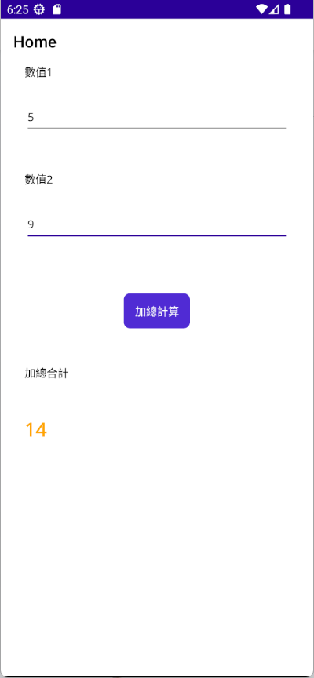

# .NET 8 MAUI 使用相依性注入設計模式進行 MVVM App 開發


在 .NET 8 MAUI 開發框架下，可以採用 MVVM 設計模式來進行開發，讓 View & ViewModel 兩者之間可以採用鬆散耦合的方式地進行開發專案，不過，若可以進一步搭配 Dependency Indection 相依性注入設計模式，可以進一步的將 ViewModel 內許多商業邏輯程式碼抽取出來，透過建構式注入方式，將需要用到的服務物件注入到 ViewModel 內，如此便可以享受到現今程式設計模式所帶來的好處。

所謂的相依性注入 (Dependency Injection) 設計模式，是指在開發專案時，將一些服務物件注入到需要用到的類別內，而不是在類別內部自行建立物件，這樣的好處是可以讓類別之間的耦合度降低，並且可以讓類別內的程式碼更加的乾淨，不會有太多的商業邏輯程式碼，而是將這些商業邏輯程式碼抽取出來，將需要用到的服務物件注入到類別內。

在 .NET 8 MAUI 開發框架下，可以透過建構式注入 (Constructor Injection) 的方式，將需要用到的服務物件注入到 ViewModel 內。

在這裡將會設計一個 App，可以讓使用者輸入兩個數值，並且將兩數相加起來，將相加結果顯示在螢幕上，在這裡要進行兩數相加的商業邏輯，將會透過相依性注入的方式，將這個計算兩數相加的處理邏輯物件，注入到 ViewModel 內來使用。

## 建立 .NET 8 MAUI 專案

* 打開 Visual Studio 2022 IDE 應用程式
* 從 [Visual Studio 2022] 對話窗中，點選右下方的 [建立新的專案] 按鈕
* 在 [建立新專案] 對話窗右半部
  * 切換 [所有語言 (L)] 下拉選單控制項為 [C#]
  * 切換 [所有專案類型 (T)] 下拉選單控制項為 [MAUI]
* 在中間的專案範本清單中，找到並且點選 [.NET MAUI 應用程式] 專案範本選項
  > 此專案可用於建立適用於 iOS、Android、Mac Catalyst、Tizen 和 WinUI 的 .NET MAUI 應用程式。
* 點選右下角的 [下一步] 按鈕
* 在 [設定新的專案] 對話窗
* 找到 [專案名稱] 欄位，輸入 `MA08` 作為專案名稱
* 在剛剛輸入的 [專案名稱] 欄位下方，確認沒有勾選 [將解決方案與專案至於相同目錄中] 這個檢查盒控制項
* 點選右下角的 [下一步] 按鈕
* 現在將會看到 [其他資訊] 對話窗
* 在 [架構] 欄位中，請選擇最新的開發框架，這裡選擇的 [架構] 是 : `.NET 8.0 (長期支援)`
* 請點選右下角的 [建立] 按鈕

稍微等候一下，這個主控台專案將會建立完成

## 安裝要用到的 NuGet 開發套件

因為開發此專案時會用到這些 NuGet 套件，請依照底下說明，將需要用到的 NuGet 套件安裝起來。

### 安裝 CommunityToolkit.Mvvm 套件

CommunityToolkit.Mvvm 是微軟官方提供的 MVVM 套件，提供了一些 MVVM 開發常用的功能，例如：ObservableObject、ObservableProperty、RelayCommand 等等，這些功能在 WPF、UWP、Xamarin.Forms 都可以使用，而且在 .NET 8 MAUI 也可以使用。

請依照底下說明操作步驟，將這個套件安裝到專案內

* 滑鼠右擊 [方案總管] 視窗內的 [專案節點] 下方的 [相依性] 節點
* 從彈出功能表清單中，點選 [管理 NuGet 套件] 這個功能選項清單
* 此時，將會看到 [NuGet: MA08] 視窗
* 切換此視窗的標籤頁次到名稱為 [瀏覽] 這個標籤頁次
* 在左上方找到一個搜尋文字輸入盒，在此輸入 `CommunityToolkit.Mvvm`
* 稍待一會，將會在下方看到這個套件被搜尋出來
* 點選 [CommunityToolkit.Mvvm] 套件名稱
* 在視窗右方，將會看到該套件詳細說明的內容，其中，右上方有的 [安裝] 按鈕
* 點選這個 [安裝] 按鈕，將這個套件安裝到專案內

## 建立 IValueAddService 介面型別

* 在專案內找到 [Services] 節點，滑鼠右擊此節點，從彈出的功能表清單中，點選 [加入] > [新增項目] 選項
* 在 [新增項目 - MA08] 對話窗中，點選對話窗左方的 [已安裝] > [C#] > [介面]
* 在對話窗的下方的名稱欄位，輸入 [IValueAddService.cs] 作為名稱
* 點選對話窗右下方的 [新增] 按鈕
* 現在將會看到 [IValueAddService.cs] 這個檔案，並且，這個檔案會被開啟在 Visual Studio 2022 的編輯器內
* 使用底下內容替換掉原來的檔案內容

```csharp
namespace MA08;

public interface IValueAddService
{
    int Add(int value1, int value2);
}
```

在這個 [IValueAddService] 介面內，將會有一個 [Add] 的方法成員，這個方法將會被傳入兩個整數數值，透過該實作方法後，將會回傳兩數相加的整數結果。

## 建立 ValueAddService 類別型別

在這裡需要建立一個兩數相加的具體實作類別

* 滑鼠右擊專案節點，從彈出的功能表清單中，點選 [加入] > [新增項目] 選項
* 在 [新增項目 - MA08] 對話窗中，點選對話窗左方的 [已安裝] > [C#] > [類別]
* 在對話窗的下方的名稱欄位，輸入 [ValueAddService.cs] 作為名稱
* 點選對話窗右下方的 [新增] 按鈕
* 現在將會看到 [ValueAddService.cs] 這個檔案，並且，這個檔案會被開啟在 Visual Studio 2022 的編輯器內
* 使用底下內容替換掉原來的檔案內容

```csharp
namespace MA08;

public class ValueAddService : IValueAddService
{
    public int Add(int value1, int value2)
    {
        return value1 + value2;
    }
}
```

在這個 [ValueAddService] 類別內，將會宣告實作 [IValueAddService] 介面，因此，在此具體實作類別內，將會有一個 [Add] 的方法成員，這個方法將會被傳入兩個整數數值，使用 `value1 + value2` 表示式，計算得到兩數相加的整數結果，並且回傳到呼叫這個方法的呼叫端。

## 對介面與實作類別註冊到 DI 容器內

為了要能夠透過建構式注入的方式進行解析需要介面的實作物件，必須要使用底下方式註冊到相依性注入容器內

* 在專案根結點內找到 [MauiProgram.cs] 這個檔案，並且，使用滑鼠雙擊這個檔案
* 找到 `#if DEBUG`
* 在這個程式碼前，加入底下的程式碼

```csharp
builder.Services.AddTransient<IValueAddService, ValueAddService>();
```

## 建立 MainPageViewModel ViewModel

在這個練習中，將會採用 MVVM 的設計模式，透過 View 來注入 ViewModel 物件，當相依性注入容器解析並且注入 ViewModel 物件的後，會透過該 ViewModel 建構式來注入 IValueAddService 實作物件，所以，先需要建立 MainPageViewModel 這個類別 

* 滑鼠右擊專案節點，從彈出的功能表清單中，點選 [加入] > [類別] 選項
* 在 [新增項目 - MA08] 對話窗中，點選對話窗左方的 [已安裝] > [.NET MAUI]
* 在對話窗的下方的名稱欄位，輸入 [MainPageViewModel.cs] 作為名稱
* 點選對話窗右下方的 [新增] 按鈕
* 現在將會看到 [MainPageViewModel.cs] 這個檔案，並且，這個檔案會被開啟在 Visual Studio 2022 的編輯器內
* 使用底下內容替換掉原來的檔案內容

```csharp
using CommunityToolkit.Mvvm.ComponentModel;
using CommunityToolkit.Mvvm.Input;

namespace MA08;

public partial class MainPageViewModel :ObservableObject
{
    [ObservableProperty]
    int value1=0;
    [ObservableProperty]
    int value2=0;
    [ObservableProperty]
    int value3=0;
    private readonly IValueAddService valueAddService;

    public MainPageViewModel(IValueAddService valueAddService)
    {
        this.valueAddService = valueAddService;
    }

    [RelayCommand]
    public void Add()
    {
        Value3 = valueAddService.Add(Value1, Value2);
    }
}
```

這是一個 .NET MAUI 頁面 View 會用到的 ViewModel 類別，其中將會使用 [CommunityToolkit.Mvvm] 這個套件來實作 MVVM 設計模式內容，來進行檢視 View 與 檢視模型 ViewModel 之間的鬆散耦合的設計。

這個類別需要繼承 [ObservableObject] 類別，並且宣告 partial 關鍵字在該類別，這是因為 [CommunityToolkit.Mvvm] 將會透過 .NET 提供的原始碼產生技術，動態生成出適用於 MVVM 設計模式中會用到的相關程式碼、屬性與方法，若沒有加入這個 partial 關鍵字，將會造成建置時候得到了 `CS0260	類型 'MainPageViewModel' 的宣告中遺漏 partial 修飾元; 還存在此類型的其他部分宣告	` 錯誤訊息。

在這個 ViewModel 類別中，宣告了 [value1], [value2], [value3] 這些可以用於 View 中進行資料綁定的屬性，雖然這三個是屬於私有的欄位成員，不過因為這裡使用了 `[ObservableProperty]` 這個 [CommunityToolkit.Mvvm] 這個套件提供的一個屬性，標註在每個欄位成員上，透過 Source Generator 原碼產生器來生成出進行 MVVM 設計模式會用到的相關程式碼，這包括了將會建立了 [Value1], [Value2], [Value3] 這三個公開屬性成員；有了這三個公開的屬性成員，就可以 View XAML 頁面內，使用 [資料綁定](https://learn.microsoft.com/zh-tw/dotnet/maui/fundamentals/data-binding/?view=net-maui-8.0&WT.mc_id=DT-MVP-5002220) Data Binding 技術，將 ViewModel 內的屬性綁定到 XAML 頁面中特定項目 (Element) 內的屬性 (Attribute) 標籤上。

在這個類別 MainPageViewModel 的建構式內，宣告了 IValueAddService 這個介面參數，一旦相依性注入容器要解析與注入這個物件前，會先透過相依性注入容器，解析與取得 IValueAddService 實作物件，並且傳入到這個建構式內。

有了這個 IValueAddService 實作物件，便可以進行設計 [Add] 這個方法，在該方法上，將會標註 `[RelayCommand]` 這個屬性，表示這個方法可以用於在 View 中進行 [Command] 屬性的綁定之用。在這個方法內，將會使用剛剛注入的物件，進行兩數相加的計算工作，使用這樣的敘述 `Value3 = valueAddService.Add(Value1, Value2);` ，最後將相加結果設定到 [Value3] 這個屬性上。

## 修正 MainPage View

現在可以進行 [MainPage.xaml] 這個頁面的修正

* 在專案根目錄下找到並且打開 [MainPage.xaml] 節點
* 使用底下內容替換掉原來的檔案內容

```xml
<?xml version="1.0" encoding="utf-8" ?>
<ContentPage xmlns="http://schemas.microsoft.com/dotnet/2021/maui"
             xmlns:x="http://schemas.microsoft.com/winfx/2009/xaml"
             xmlns:viewModels="clr-namespace:MA08"
             x:DataType="viewModels:MainPageViewModel"
             x:Class="MA08.MainPage">

    <Grid>
        <VerticalStackLayout
            Padding="30,0"
            Spacing="25">

            <Label Text="數值1"/>
            <Entry Text="{Binding Value1}"/>

            <Label Text="數值2" Margin="0,20,0,0"/>
            <Entry Text="{Binding Value2}"/>

            <Button Text="加總計算" Margin="0,40,0,0"
                    Command="{Binding AddCommand}"
                    HorizontalOptions="Center"/>

            <Label Text="加總合計" Margin="0,20,0,0"/>
            <Label Text="{Binding Value3}" Margin="0,20,0,0"
                   FontSize="24" FontAttributes="Bold"
                   TextColor="Orange"/>
        </VerticalStackLayout>
    </Grid>

</ContentPage>
```

在頁面的最上方，將會使用 [x:DataType] 來宣告 [編譯的綁定](https://learn.microsoft.com/zh-tw/dotnet/maui/fundamentals/data-binding/compiled-bindings?view=net-maui-8.0&WT.mc_id=DT-MVP-5002220)，這樣當在進行 XAML 設計的時候，便可以使用到 [Visual Studio 中的 IntelliSense](https://learn.microsoft.com/zh-tw/visualstudio/ide/using-intellisense?view=vs-2022&WT.mc_id=DT-MVP-5002220) 功能，方便設計與即時檢查是否有錯誤發生。

為了要使用這樣的機制，需要有個命名空間指向該 ViewModel 所在的命名空間內，在這裡將會使用底下的語法來做到這樣的設計需求。

```xml
xmlns:viewModels="clr-namespace:MA08"
x:DataType="viewModels:MainPageViewModel"
```

在這個頁面內將會設計兩個 [Entry] 控制項，並且在其 [Text] 屬性內，使用了 `{Binding Value1}` 與 `{Binding Value2}` 這樣的資料綁定語法，使得當使用者在這兩個 [Entry] 輸入內容後，將會透過資料綁定機制，分別更新到 ViewModel 內的 Value1 & Value2 這兩個屬性上。

這裡使用了 [Button] 這樣的標籤，宣告一個按鈕控制項，透過了 `Command="{Binding AddCommand}"` 這樣的語法，將此按鈕的命令屬性，綁定到 ViewModel 內的 Add RelayCommand ；雖然在 ViewModel 內設計了一個 [Add] 方法，透過原始碼生成機制，將會產生出一個型別為 [ICommand] 且可以用於命令綁定的 [AddCommand] 物件，因此，在這裡需要指定 [AddCommand] 而不是 [Add]。

這裡是生成可用於命令綁定的程式碼 `public global::CommunityToolkit.Mvvm.Input.IRelayCommand AddCommand => addCommand ??= new global::CommunityToolkit.Mvvm.Input.RelayCommand(new global::System.Action(Add));`

而在最下方的 [Label] 控制項的 [Text] 屬性，將會使用 `{Binding Value3}` 語法，將此文字標籤的文字綁定到 ViewModel 內的 Value3 屬性上，如此，便可以將兩數相加的結果顯示在螢幕上。

## 在 View 內注入 ViewModel 並且指派給該 View 的 BindingContext

* 首先，當 [MainPage.xaml] 這個 View 透過相依性注入容器解析出來之後，需要在這個 View 建構式內，同時注入這個 View 會用到的 ViewModel，也就是 [MainPageViewModel] 這個類別，並且將這個 ViewModel 物件，指定給這個 View 的 [BindingContext](https://learn.microsoft.com/zh-tw/dotnet/maui/fundamentals/data-binding/basic-bindings?view=net-maui-8.0&WT.mc_id=DT-MVP-5002220) 屬性，這樣，這個 ContentPage 頁面與其子項目 (Element)， 就可以使用這個 ViewModel 內的屬性與方法來進行資料綁定。
* 在專案根目錄中內找到 [MainPage.xaml.cs] 這個檔案，並且，使用滑鼠雙擊這個檔案
* 預設所產生出來的建構式是沒有任何參數的
* 修改這個建構式可以接受一個 [MainPageViewModel] 類別的參數，這裡加入 `MainPageViewModel viewModel` 這個參數
* 在 `InitializeComponent();` 這個程式碼的後面，加入 `BindingContext = viewModel;` 這個程式碼
* 底下是完成後這個頁面的 Code Behind 程式碼
  
```csharp
namespace MA08
{
    public partial class MainPage : ContentPage
    {
        public MainPage(MainPageViewModel viewModel)
        {
            InitializeComponent();
            BindingContext = viewModel;
        }
    }

}
```

## 註冊 View 與 ViewModel 到 DI 容器內

* 在專案根結點內找到 [MauiProgram.cs] 這個檔案，並且，使用滑鼠雙擊這個檔案
* 找到 `#if DEBUG`
* 在這個程式碼前，加入底下的程式碼

```csharp
builder.Services.AddTransient<MainPageViewModel>();
builder.Services.AddTransient<MainPage>();
```

## 執行並且驗證結果

* 底下畫面將會是這個專案在 Android 平台內執行的結果



在數值1 欄位中，輸入 5 ，在數值2 欄位中，輸入 9 ，最後，點選 [加總計算] 按鈕，將會在最下方看到兩數相加的結果為 14 。
