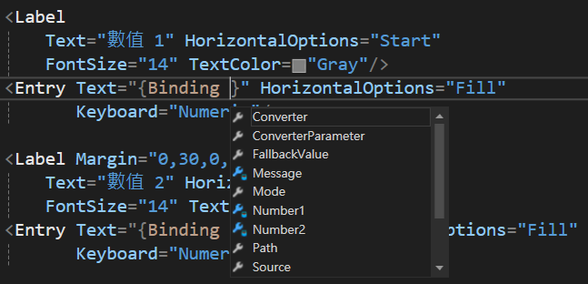
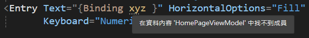
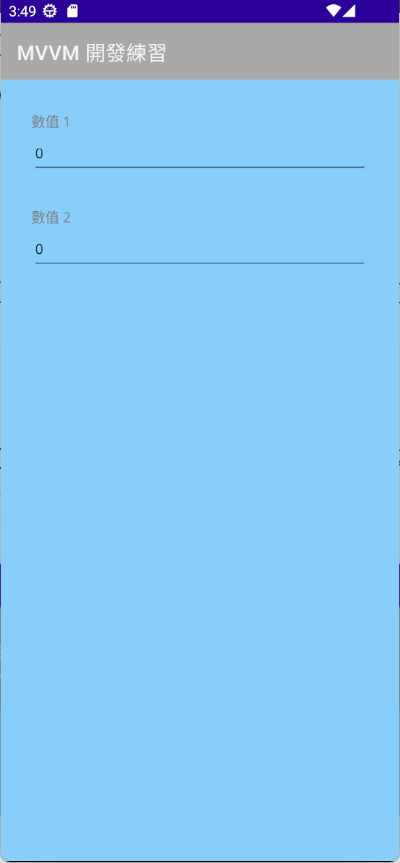
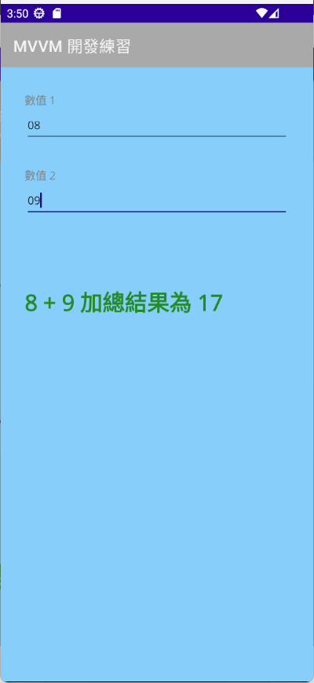
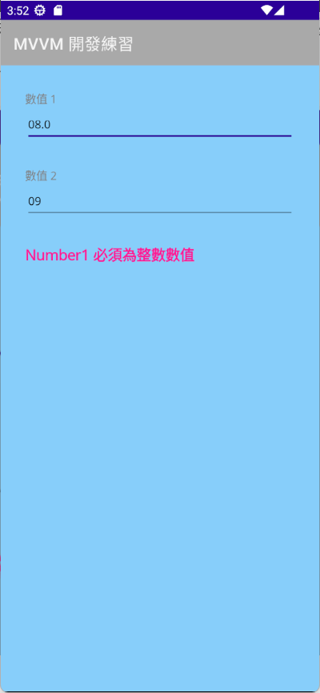

# .NET 8 MAUI 使用服務定位器 Service Locator 手動注入相依物件


## 建立 .NET 8 MAUI 專案

* 打開 Visual Studio 2022 IDE 應用程式
* 從 [Visual Studio 2022] 對話窗中，點選右下方的 [建立新的專案] 按鈕
* 在 [建立新專案] 對話窗右半部
  * 切換 [所有語言 (L)] 下拉選單控制項為 [C#]
  * 切換 [所有專案類型 (T)] 下拉選單控制項為 [MAUI]
* 在中間的專案範本清單中，找到並且點選 [.NET MAUI 應用程式] 專案範本選項
  > 此專案可用於建立適用於 iOS、Android、Mac Catalyst、Tizen 和 WinUI 的 .NET MAUI 應用程式。
* 點選右下角的 [下一步] 按鈕
* 在 [設定新的專案] 對話窗
* 找到 [專案名稱] 欄位，輸入 `MA07` 作為專案名稱
* 在剛剛輸入的 [專案名稱] 欄位下方，確認沒有勾選 [將解決方案與專案至於相同目錄中] 這個檢查盒控制項
* 點選右下角的 [下一步] 按鈕
* 現在將會看到 [其他資訊] 對話窗
* 在 [架構] 欄位中，請選擇最新的開發框架，這裡選擇的 [架構] 是 : `.NET 8.0 (長期支援)`
* 請點選右下角的 [建立] 按鈕

稍微等候一下，這個主控台專案將會建立完成

## 安裝要用到的 NuGet 開發套件

因為開發此專案時會用到這些 NuGet 套件，請依照底下說明，將需要用到的 NuGet 套件安裝起來。

### 安裝 CommunityToolkit.Mvvm 套件

CommunityToolkit.Mvvm 是微軟官方提供的 MVVM 套件，提供了一些 MVVM 開發常用的功能，例如：ObservableObject、ObservableProperty、RelayCommand 等等，這些功能在 WPF、UWP、Xamarin.Forms 都可以使用，而且在 .NET 8 MAUI 也可以使用。

請依照底下說明操作步驟，將這個套件安裝到專案內

* 滑鼠右擊 [方案總管] 視窗內的 [專案節點] 下方的 [相依性] 節點
* 從彈出功能表清單中，點選 [管理 NuGet 套件] 這個功能選項清單
* 此時，將會看到 [NuGet: MA07] 視窗
* 切換此視窗的標籤頁次到名稱為 [瀏覽] 這個標籤頁次
* 在左上方找到一個搜尋文字輸入盒，在此輸入 `CommunityToolkit.Mvvm`
* 稍待一會，將會在下方看到這個套件被搜尋出來
* 點選 [CommunityToolkit.Mvvm] 套件名稱
* 在視窗右方，將會看到該套件詳細說明的內容，其中，右上方有的 [安裝] 按鈕
* 點選這個 [安裝] 按鈕，將這個套件安裝到專案內

## MVVM 開發模式用到的資料夾

* 由於這個專案採用預設 .NET MAUI 專案範本所建立的專案，所以，專案內的資料夾結構，是採用預設的資料夾結構，為了要能夠讓專案內的資料夾結構，符合 MVVM 開發模式的資料夾結構，請依照底下的說明，將專案內的資料夾結構，修改成符合 MVVM 開發模式的資料夾結構。
* 滑鼠右擊專案節點，從彈出的功能表清單中，點選 [加入] > [新增資料夾] 選項
* 將剛剛建立的資料夾名稱，使用 [Views] 名稱來取代
* 滑鼠右擊專案節點，從彈出的功能表清單中，點選 [加入] > [新增資料夾] 選項
* 將剛剛建立的資料夾名稱，使用 [ViewModels] 名稱來取代
* 滑鼠右擊專案節點，從彈出的功能表清單中，點選 [加入] > [新增資料夾] 選項
* 將剛剛建立的資料夾名稱，使用 [Models] 名稱來取代
* 滑鼠右擊專案節點，從彈出的功能表清單中，點選 [加入] > [新增資料夾] 選項
* 將剛剛建立的資料夾名稱，使用 [Services] 名稱來取代
* 滑鼠右擊專案節點，從彈出的功能表清單中，點選 [加入] > [新增資料夾] 選項
* 將剛剛建立的資料夾名稱，使用 [Helpers] 名稱來取代

## 建立 HomePage View

* 在專案內找到 [Views] 節點，滑鼠右擊此節點，從彈出的功能表清單中，點選 [加入] > [新增項目] 選項
* 在 [新增項目 - MA07] 對話窗中，點選對話窗左方的 [已安裝] > [.NET MAUI]
* 在對話窗的中間，點選 [.NET MAUI ContentPage (XAML)] 節點
* 在對話窗的下方的名稱欄位，輸入 [HomePage.xaml] 作為名稱
* 點選對話窗右下方的 [新增] 按鈕
* 現在將會看到 [HomePage.xaml] 這個檔案，並且，這個檔案會被開啟在 Visual Studio 2022 的編輯器內
* 使用底下內容，替換掉這個檔案內的所有內容

```xml
<?xml version="1.0" encoding="utf-8" ?>
<ContentPage xmlns="http://schemas.microsoft.com/dotnet/2021/maui"
             xmlns:x="http://schemas.microsoft.com/winfx/2009/xaml"
             x:Class="MA07.Views.HomePage"
             Title="HomePage">

    <Grid>
        <VerticalStackLayout
            Padding="30"
            HorizontalOptions="Fill" VerticalOptions="Start">

            <Label 
                Text="數值 1" HorizontalOptions="Start"
                FontSize="14" TextColor="Gray"/>
            <Entry Text="" HorizontalOptions="Fill"
                   Keyboard="Numeric"/>

            <Label Margin="0,30,0,0"
                Text="數值 2" HorizontalOptions="Start"
                FontSize="14" TextColor="Gray"/>
            <Entry Text="" HorizontalOptions="Fill"
                   Keyboard="Numeric"/>

            <Label Margin="0,30,0,0"
                Text="操作錯誤警告訊息" HorizontalOptions="Start"
                FontSize="18" TextColor="DeepPink" FontAttributes="Bold"/>

            <Label Margin="0,30,0,0"
                Text="計算結果訊息" HorizontalOptions="Start"
                FontSize="28" TextColor="ForestGreen" FontAttributes="Bold"/>

        </VerticalStackLayout>
    </Grid>

</ContentPage>
```

## 建立 HomePage ViewModel

* 在專案內找到 [ViewModels] 節點，滑鼠右擊此節點，從彈出的功能表清單中，點選 [加入] > [類別] 選項
* 在 [新增項目 - MA07] 對話窗中，點選對話窗左方的 [已安裝] > [.NET MAUI]
* 在對話窗的下方的名稱欄位，輸入 [HomePageViewModel.cs] 作為名稱
* 點選對話窗右下方的 [新增] 按鈕
* 現在將會看到 [HomePageViewModel.cs] 這個檔案，並且，這個檔案會被開啟在 Visual Studio 2022 的編輯器內
* 底下將會是這個檔案的內容

```csharp
using System;
using System.Collections.Generic;
using System.Linq;
using System.Text;
using System.Threading.Tasks;

namespace MA07.Views
{
    internal class HomePageViewModel
    {
    }
}
```

* 由於在此專案中，我們將會使用到 CommunityToolkit.Mvvm 套件，所以，對於每個 ViewModel 類別，做些修正。
* 修正 [internal] 關鍵字修改成為 [public partial] ，表示這個類別是公開的，而且是一個 C# 部分類別(這是因為這個類別將會與原始碼產生器所建立的同樣名稱類別進行合併，因此，在這裡需要加註 [partial] 這個關鍵字，否則會造成編譯上的錯誤
* 最後，需要讓這個 ViewModel 繼承自 CommunityToolkit.Mvvm.ObservableObject 類別，所以要在類別名稱後面加上 `: ObservableObject` 這個繼承關鍵字
* 也移除不需要用到的 using 敘述
* 底下將會是完成後的程式碼

```csharp
using CommunityToolkit.Mvvm.ComponentModel;

namespace MA07.Views
{
    public partial class HomePageViewModel :ObservableObject
    {
    }
}
```

## 建立 View 與 ViewModel 的相依性容器註冊

* 在專案內找到 [MauiProgram.cs] 這個檔案，並且，使用滑鼠雙擊這個檔案
* 找到 `#if DEBUG`
* 在這個程式碼前，加入底下的程式碼

```csharp
builder.Services.AddTransient<HomePage>();
builder.Services.AddTransient<HomePageViewModel>();
```

* builder 這個變數屬於 [MauiAppBuilder] 型別，而這個型別是由 [Microsoft.Maui.Controls.Hosting] 套件所提供的，這個套件是 .NET MAUI 專案的主要套件，也是 .NET MAUI 專案的核心套件，這個套件提供了 .NET MAUI 專案的主要功能，例如：專案的啟動、專案的結束、專案的相依性容器等等。
* 對於 `builder.Services` 這個物件，是屬於 [IServiceCollection] 這個介面，而這個介面是由 [Microsoft.Extensions.DependencyInjection] 套件所提供的，這個套件是 .NET MAUI 專案的主要套件，也是 .NET MAUI 專案的核心套件，這個套件提供了 .NET MAUI 專案的主要功能，例如：專案的相依性容器等等。
* 因此，在這裡將會使用 IServiceCollection 實作物件，來建立 View 與 ViewModel 的相依性容器註冊。在此使用了 [AddTransient] 泛型方法，這個方法可以將指定的類別註冊到相依性容器內，而且，這個類別每次被要求時，都會建立一個新的實例。

## 在 View 內注入 ViewModel 並且指派給該 View 的 BindingContext

* 首先，當 [HomePage.xaml] 這個 View 透過相依性注入容器解析出來之後，需要在這個 View 建構式內，同時注入這個 View 會用到的 ViewModel，也就是 [HomePageViewModel] 這個類別，並且將這個 ViewModel 物件，指定給這個 View 的 [BindingContext] 屬性，這樣，這個 ContentPage 頁面與其子項目 (Element)， 就可以使用這個 ViewModel 內的屬性與方法。
* 在 [ViewModels] 節點內找到 [HomePage.xaml.cs] 這個檔案，並且，使用滑鼠雙擊這個檔案
* 預設所產生出來的建構式是沒有任何參數的
* 修改這個建構式可以接受一個 [HomePageViewModel] 類別的參數，這裡加入 `HomePageViewModel viewModel` 這個參數
* 在 `InitializeComponent();` 這個程式碼的後面，加入 `BindingContext = viewModel;` 這個程式碼
* 底下是完成後這個頁面的 Code Behind 程式碼
  
```csharp
using MA07.ViewModels;

namespace MA07.Views;

public partial class HomePage : ContentPage
{
	public HomePage(HomePageViewModel viewModel)
	{
		InitializeComponent();
		BindingContext = viewModel;
	}
}
```

## 在 ViewModel 內建立要用到的屬性與方法

* 在 [ViewModels] 節點內找到 [HomePageViewModel.cs] 這個檔案，並且，使用滑鼠雙擊這個檔案
* ViewModel 主要的目的是要提供該 View 所需要的商業邏輯程式碼，因此，在這裡，我們需要建立一些屬性與方法，讓 View 可以使用這些屬性與方法。這也就是 MVVM 的精神，讓 View 負責顯示 UI 元素，而 ViewModel 負責提供商業邏輯程式碼。
* 在該類別內首先加入底下程式碼

```csharp
  [ObservableProperty]
  string number1 = "0";
  [ObservableProperty]
  string number2 = "0";
  [ObservableProperty]
  string message = string.Empty;
  [ObservableProperty]
  string summary = string.Empty;
```

* 在這裡宣告四個欄位，不過，這四個欄位都有使用 `[ObservableProperty]` 屬性進行標註，這表示這四個欄位雖然是私有的，不過 [CommunityToolkit.MVVM] 套件將會透過原始碼產生器這個工具，產生出可以用於資料綁定的公開欄位，這樣，這四個欄位就可以用於資料綁定了。也就是說，若要在 View 內使用這 [number1] 個欄位，就可以使用 [Number1] 這個屬性來進行資料綁定的方式。
* 在這個頁面內的商業邏輯將會需要讓使用者輸入兩個數值，並且經過加總之後，將結果顯示在螢幕上
* 因此，在 ViewModel 內，就需要提供出這樣的服務，滿足這些商業邏輯處理需求。
* 為了要做到更好的使用者體驗，只要使用者輸入任何一個字元，便可以即時計算兩數相加的結果，面對這樣的需求，在以往是透過 [Entry.TextChanged] 事件來綁定到某個方法來完成這樣需求；可以，在 MVVM 設計模式下，是期望能夠讓 View 與 ViewModel 彼此間不會有相依關係，形成鬆散耦合方式。
* 對於 [CommunityToolkit.MVVM] 套件內，則提供了另外一種做法，在 ViewModel 內，依據規範設計出一個方法，只要所綁定的欄位內容值有異動的時候，就會呼叫這個方法，如此，便可以解決上面提到的問題。
* 所以，若在 ViewModel 內，若建立了一個方法，使用 `On屬性名稱Changed` 這樣的命名規範，一旦，所指定的 [屬性名稱] 內容變動了，就會呼叫這個 `On屬性名稱Changed` 方法
* 在這個類別內，加入底下程式碼

```csharp
  partial void OnNumber1Changed(string value)
  {
      FullNumberCheck();
  }

  partial void OnNumber2Changed(string value)
  {
      FullNumberCheck();
  }
```

*  如此，就把 Number1 與 Number2 這兩個屬性，當其內容值有異動的時候，就會呼叫 [OnNumber1Changed] 或 [OnNumber2Changed] 方法
* 最後，在這個內別內，加入 [FullNumberCheck] 這個私有方法，程式碼如下

```csharp
void FullNumberCheck()
{
    Message = string.Empty;
    Summary = string.Empty;

    // 檢查 Number1 是否為合法整數數值，若不成立，將訊息顯示在 Message 內
    if (int.TryParse(Number1, out int num1) == false)
    {
        Message = "Number1 必須為整數數值";
        return ;
    }

    // 檢查 Number2 是否為合法整數數值，若不成立，將訊息顯示在 Message 內
    if (int.TryParse(Number2, out int num2) == false)
    {
        Message = "Number2 必須為整數數值";
        return;
    }

    // 進行 Number1 與 Number2 的加總運算
    int number1 = int.Parse(Number1);
    int number2 = int.Parse(Number2);
    int summary = number1 + number2;

    // 將加總結果顯示在 Summary 內
    GenerateSummary(number1, number2);
}

void GenerateSummary(int paraNum1, int paraNum2)
{
    Summary = $"{paraNum1} + {paraNum2} 加總結果為 {paraNum1 + paraNum2}";
}
```

* 這裡首先將 [Message] 與 [Summary] 這兩個屬性文字內容清空
* 接著檢查 [Number1] 內容是否為合法的整數數值，若使用者所輸入的 [Number1] 內容不是一個正確的整數數值，則會將顯示錯誤訊息的 [Message] 這個屬性，設定為 "Number1 必須為整數數值"，如此，螢幕上將會看到這樣的錯誤訊息，告訴使用者輸入不正確的內容
* 若 [Number1] 輸入內容沒有問題，接下來會接著檢查 [Number2] 內容是否為合法的整數數值，若使用者所輸入的 [Number2] 內容不是一個正確的整數數值，則會將顯示錯誤訊息的 [Message] 這個屬性，設定為 "Number2 必須為整數數值"，如此，螢幕上將會看到這樣的錯誤訊息，告訴使用者輸入不正確的內容
* 一旦 [Number1] 與 [Number2] 輸入的都是整數，就要來進行 Number1 與 Number2 的加總運算，這裡先將兩個字串轉換成為整數變數，然後呼叫 [GenerateSummary] 方法，將正確結果設定到 [Summary] 屬性上，如此，就可以在螢幕上看到兩數相加的結果了。

## 進行 View 與 ViewModel 的綁定設定

* 現在可以來修正 View 的 XAML 內容，將資料綁定的宣告設定上去
* 在 [Views] 節點內找到 [HomePage.xaml] 這個檔案，並且，使用滑鼠雙擊這個檔案
* 在最上面找到 `<ContentPage` 這個節點，加入底下宣告

```xml
BackgroundColor="LightSkyBlue"
xmlns:viewModel="clr-namespace:MA07.ViewModels"
x:DataType="viewModel:HomePageViewModel">
```

* [BackgroundColor] 這個 [ContentPage] 的屬性，將會用於設定這個頁面的背景顏色為淡天空藍色
* 接下來需要使用 [編譯的綁定] 來指定這個 View 實際是綁定到哪個 ViewModel 型別，因此，需要先建立一個可以指向該 ViewModel 的命名空間；這裡將會使用 [xmlns] 來進行宣告，若想要參考 .NET 內的 [MA07.ViewModels] 命名空間，可以使用 [viewModel] 這個名稱；這裡使用語法為 `xmlns:viewModel="clr-namespace:MA07.ViewModels"`
* 對於 `x:DataType` 這個標記延伸用法，這是屬於 [編譯的綁定](https://learn.microsoft.com/zh-tw/dotnet/maui/fundamentals/data-binding/compiled-bindings?view=net-maui-8.0&WT.mc_id=DT-MVP-5002220) ，這個 [編譯的綁定] 可藉由在編譯時期解析系結運算式，而不是運行時間，來改善 .NET MAUI 應用程式中的數據綁定效能，另外，對於在操作資料綁定設定過程中，將可以有 ViewModel 內的綁定屬性來挑選。 
* 從下圖中，當在進行 [Entry.Text] 資料綁定宣告的時候，透過 [IntelliSense](https://learn.microsoft.com/zh-tw/visualstudio/ide/visual-csharp-intellisense) 機制，將可以看到現在可以用於資料綁定屬性有哪些，如下圖所示

  
* 若輸入不正確的綁定屬性名稱，則會在所指定用於綁定的欄位名稱下方，看到 `....` 這樣的符號，游標移到這個符號上，將會看到如下圖，顯示出 [在資料內容 'HomePageViewModel' 中找不到成員] 這樣的錯誤提示訊息。

  
* 現在可以在這個頁面指定 [編譯的綁定] 設定，透過 `x:DataType="viewModel:HomePageViewModel"` 這樣的宣告，指定 [HomePage.xaml] 這個 View 的 [編譯的綁定] 型別為 [MA07.ViewModels.HomePageViewModel]
* 搜尋 [Text="數值 1"] 文字，找到下方的 [Entry] 檢視控制項，將 [Text] 這個 [Entry] 檢視屬性，設定為 `Text="{Binding Number1}"`
* 這表示了，對於這個 [Entry.Text] 將會綁定到 [HomePageViewModel] 內的 Number1 這個屬性
* 搜尋 [Text="數值 2"] 文字，找到下方的 [Entry] 檢視控制項，將 [Text] 這個 [Entry] 檢視屬性，設定為 `Text="{Binding Number2}"`
* 這表示了，對於這個 [Entry.Text] 將會綁定到 [HomePageViewModel] 內的 Number2 這個屬性
* 搜尋 [Text="操作錯誤警告訊息"] 文字，將 [Text] 這個 [Label] 檢視屬性，設定為 `Text="{Binding Message}"`
* 這表示了，對於這個 [Label.Text] 將會綁定到 [HomePageViewModel] 內的 Message 這個屬性
* 搜尋 [Text="計算結果訊息"] 文字，將 [Text] 這個 [Label] 檢視屬性，設定為 `Text="{Binding Summary}"`
* 這表示了，對於這個 [Label.Text] 將會綁定到 [HomePageViewModel] 內的 Summary 這個屬性

## 執行結果

* 底下畫面將會是這個專案在 Android 平台內執行的結果

因為 App 一啟動之後，ViewModel 內的 Number1 與 Number2 預設直接為 0，所以，在中間將會顯示綠色文字的 [0 + 0 加總結果為 0] 的結果。



此時，在輸入數值 1 與 數值 2 的文字方塊內，分別輸入兩個整數數值 8 與 9，因為這兩個輸入的內容都是整數數值，所以，則會在中間顯示綠色文字的 [8 + 9 加總結果為 17] 的結果。



然而，若在數值 1 或 數值 2 的文字方塊內，輸入的內容不是整數數值(在此輸入內容為 8.0，是一個浮點數，並不是一個整數數值)，此時系統將會偵測出來，並且使用紅色文字，顯示錯誤訊息在螢幕上。




