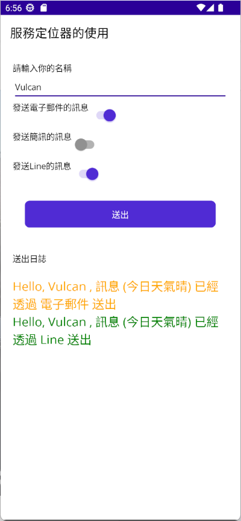
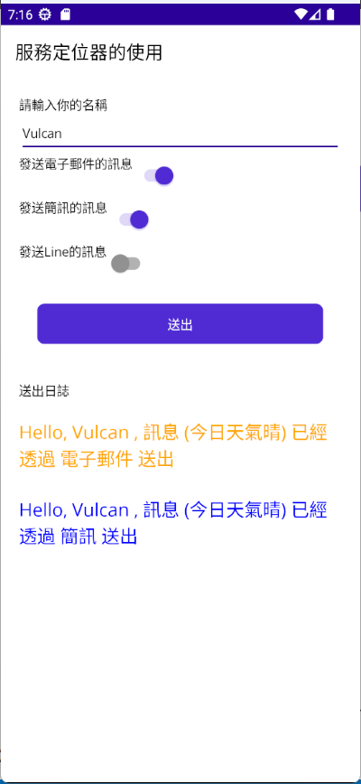

# .NET 8 MAUI 使用服務定位器 Service Locator 手動注入相依物件


在進行現代專案開發的時候，相依性注入 Dependency Injection 設計模式是必備的開發技能，對於想要注入服務物件的時候，可以使用建構式注入方式，輕鬆地將想要的服務物件注入到指定的類別物件內，然而，有些時候，無法直接使用相依性注入的建構式注入方式，來取得特定的服務物件，這個時候，可以選擇使用 服務定位器 這樣的設計模式來取代。

服務定位器（Service Locator）是一種設計模式，用於解耦程式中的組件和它們所依賴的服務。它提供了一個中央位置，從中可以獲取和使用應用程式所需的各種服務，而不是在程式的每個部分中直接創建對這些服務的依賴關係。

**何時使用服務定位器模式：**

1. **大型複雜應用程式**：在複雜或大型應用程式中，服務定位器可以幫助管理眾多的服務依賴關係。
2. **需要靈活地更換或更新服務**：當應用程式需要在運行時更換或更新其依賴的服務時，使用服務定位器可以使這些變更更加容易。
3. **避免依賴注入的複雜性**：在某些情況下，依賴注入可能導致過度複雜，服務定位器提供了一種更簡單的方法來處理依賴關係。

**優點：**

1. **減少依賴性**：服務定位器減少了組件之間的直接依賴，使得程式碼更加模塊化。
2. **提高靈活性**：允許輕鬆替換和升級服務，而無需修改使用這些服務的組件。
3. **集中管理服務**：為所有服務提供單一的入口點，方便管理和維護。

### 缺點：

1. **隱藏依賴**：由於依賴關係不是顯而易見的，因此可能會導致程式碼的理解和維護變得更加困難。
2. **全局狀態**：服務定位器可能引入全局狀態，這在多線程應用程式中可能會導致問題。
3. **單元測試挑戰**：由於依賴關係是在運行時解析的，這可能使單元測試變得更加困難。

總結來說，服務定位器模式在提供便利和彈性的同時，也可能引入了某些風險和挑戰，因此在選擇使用此模式時需要權衡利弊。

然而，服務定位器是一個反設計模式，也就是說在絕大多數情況下，不建議使用這樣的設計方式，可是對於一些情境下，還是需要使用這個設計模式，例如，背景服務、Android / iOS 原生專案的進入點內的方法，需要依照條件注入不同的服務物件，但是具有相同的介面。

在這裡需要設計一個工廠方法，依照傳入的字串參數，注入不同的服務物件，例如，傳入字串 A ，便會回傳一個可以使用電子郵件發送訊息的服務物，傳入字串 C ，便會回傳一個可以使用 Line 發送訊息的服務物件，不過，這些實作服務物件，都繪有著相同的介面。

下圖為完成後的應用程式 App，使用者可以輸入名字，接著選擇要使用哪種方式來發送訊息，在這裡將會勾選了 [發送電子郵件的訊息] 與 [發送Line的訊息] 這兩種，在螢幕的最下方，當使用者點選了送出按鈕之後，將會透過 [SendMessageFactory] 工廠方法與服務定位器呼叫，來決定要注入甚麼樣的實作物件出來，不論是取得了甚麼樣的物件，這些物件都具有相同的 [ISendMessageService] 介面，並且將顯示出傳送訊息服務實作物件執行結果。





## 建立 .NET 8 MAUI 專案

* 打開 Visual Studio 2022 IDE 應用程式
* 從 [Visual Studio 2022] 對話窗中，點選右下方的 [建立新的專案] 按鈕
* 在 [建立新專案] 對話窗右半部
  * 切換 [所有語言 (L)] 下拉選單控制項為 [C#]
  * 切換 [所有專案類型 (T)] 下拉選單控制項為 [MAUI]
* 在中間的專案範本清單中，找到並且點選 [.NET MAUI 應用程式] 專案範本選項
  > 此專案可用於建立適用於 iOS、Android、Mac Catalyst、Tizen 和 WinUI 的 .NET MAUI 應用程式。
* 點選右下角的 [下一步] 按鈕
* 在 [設定新的專案] 對話窗
* 找到 [專案名稱] 欄位，輸入 `MA07` 作為專案名稱
* 在剛剛輸入的 [專案名稱] 欄位下方，確認沒有勾選 [將解決方案與專案至於相同目錄中] 這個檢查盒控制項
* 點選右下角的 [下一步] 按鈕
* 現在將會看到 [其他資訊] 對話窗
* 在 [架構] 欄位中，請選擇最新的開發框架，這裡選擇的 [架構] 是 : `.NET 8.0 (長期支援)`
* 請點選右下角的 [建立] 按鈕

稍微等候一下，這個主控台專案將會建立完成

## 安裝要用到的 NuGet 開發套件

因為開發此專案時會用到這些 NuGet 套件，請依照底下說明，將需要用到的 NuGet 套件安裝起來。

### 安裝 CommunityToolkit.Mvvm 套件

CommunityToolkit.Mvvm 是微軟官方提供的 MVVM 套件，提供了一些 MVVM 開發常用的功能，例如：ObservableObject、ObservableProperty、RelayCommand 等等，這些功能在 WPF、UWP、Xamarin.Forms 都可以使用，而且在 .NET 8 MAUI 也可以使用。

請依照底下說明操作步驟，將這個套件安裝到專案內

* 滑鼠右擊 [方案總管] 視窗內的 [專案節點] 下方的 [相依性] 節點
* 從彈出功能表清單中，點選 [管理 NuGet 套件] 這個功能選項清單
* 此時，將會看到 [NuGet: MA07] 視窗
* 切換此視窗的標籤頁次到名稱為 [瀏覽] 這個標籤頁次
* 在左上方找到一個搜尋文字輸入盒，在此輸入 `CommunityToolkit.Mvvm`
* 稍待一會，將會在下方看到這個套件被搜尋出來
* 點選 [CommunityToolkit.Mvvm] 套件名稱
* 在視窗右方，將會看到該套件詳細說明的內容，其中，右上方有的 [安裝] 按鈕
* 點選這個 [安裝] 按鈕，將這個套件安裝到專案內

## MVVM 開發模式用到的資料夾

* 由於這個專案採用預設 .NET MAUI 專案範本所建立的專案，所以，專案內的資料夾結構，是採用預設的資料夾結構，為了要能夠讓專案內的資料夾結構，符合 MVVM 開發模式的資料夾結構，請依照底下的說明，將專案內的資料夾結構，修改成符合 MVVM 開發模式的資料夾結構。
* 滑鼠右擊專案節點，從彈出的功能表清單中，點選 [加入] > [新增資料夾] 選項
* 將剛剛建立的資料夾名稱，使用 [Enums] 名稱來取代
* 滑鼠右擊專案節點，從彈出的功能表清單中，點選 [加入] > [新增資料夾] 選項
* 將剛剛建立的資料夾名稱，使用 [Views] 名稱來取代
* 滑鼠右擊專案節點，從彈出的功能表清單中，點選 [加入] > [新增資料夾] 選項
* 將剛剛建立的資料夾名稱，使用 [ViewModels] 名稱來取代
* 滑鼠右擊專案節點，從彈出的功能表清單中，點選 [加入] > [新增資料夾] 選項
* 將剛剛建立的資料夾名稱，使用 [Models] 名稱來取代
* 滑鼠右擊專案節點，從彈出的功能表清單中，點選 [加入] > [新增資料夾] 選項
* 將剛剛建立的資料夾名稱，使用 [Services] 名稱來取代
* 滑鼠右擊專案節點，從彈出的功能表清單中，點選 [加入] > [新增資料夾] 選項
* 將剛剛建立的資料夾名稱，使用 [Helpers] 名稱來取代

## 建立 SendMessageTypeEnum 列舉型別

* 在專案內找到 [ViewModels] 節點，滑鼠右擊此節點，從彈出的功能表清單中，點選 [加入] > [新增項目] 選項
* 在 [新增項目 - MA07] 對話窗中，點選對話窗左方的 [已安裝] > [C#] > [介面]
* 在對話窗的下方的名稱欄位，輸入 [SendMessageTypeEnum.cs] 作為名稱
* 點選對話窗右下方的 [新增] 按鈕
* 現在將會看到 [SendMessageTypeEnum.cs] 這個檔案，並且，這個檔案會被開啟在 Visual Studio 2022 的編輯器內
* 使用底下內容替換掉原來的檔案內容

```csharp
namespace MA07.Enums;

public enum SendMessageTypeEnum
{
    Line,
    Sms,
    Email
}
```

從上述程式碼可以看到，這裡建立一個 [enum] 型別，其名稱為 [SendMessageTypeEnum] ，裡面有三個列舉成員，分別為 [Line], [Sms], [Email]，用來表示這次要解析的物件用來為 使用 Line、簡訊、電子郵件 來傳送訊息的服務物件。這個列舉型別將會用於工廠方法來生成物件區別之用。

## 建立 ISendMessageService 介面型別

* 在專案內找到 [Services] 節點，滑鼠右擊此節點，從彈出的功能表清單中，點選 [加入] > [新增項目] 選項
* 在 [新增項目 - MA07] 對話窗中，點選對話窗左方的 [已安裝] > [C#] > [介面]
* 在對話窗的下方的名稱欄位，輸入 [ISendMessageService.cs] 作為名稱
* 點選對話窗右下方的 [新增] 按鈕
* 現在將會看到 [ISendMessageService.cs] 這個檔案，並且，這個檔案會被開啟在 Visual Studio 2022 的編輯器內
* 使用底下內容替換掉原來的檔案內容

```csharp
namespace MA07.Services;

/// <summary>
/// 送出通知訊息介面
/// </summary>
public interface ISendMessageService
{
    string SayHello(string name, string message);
}
```

在這個 [ISendMessageService] 介面內，將會有一個 [SayHello] 的方法成員，這個方法將會被傳入兩個字串，第一個為使用者的姓名，第二個為要發送的訊息，當執行完成之後，將會回傳最終要送出訊息的文字內容。

## 建立 SendEmailService 實作類別型別

* 在專案內找到 [Services] 節點，滑鼠右擊此節點，從彈出的功能表清單中，點選 [加入] > [新增項目] 選項
* 在 [新增項目 - MA07] 對話窗中，點選對話窗左方的 [已安裝] > [C#] > [類別]
* 在對話窗的下方的名稱欄位，輸入 [SendEmailService.cs] 作為名稱
* 點選對話窗右下方的 [新增] 按鈕
* 現在將會看到 [SendEmailService.cs] 這個檔案，並且，這個檔案會被開啟在 Visual Studio 2022 的編輯器內
* 使用底下內容替換掉原來的檔案內容

```csharp
namespace MA07.Services;

/// <summary>
/// 實作電子郵件送出通知
/// </summary>
public class SendEmailService : ISendMessageService
{
    public string SayHello(string name, string message)
    {
        return $"Hello, {name} , 訊息 ({message}) 已經透過 電子郵件 送出";
    }
}
```

在這裡宣告一個 [SendEmailService] 類別，並且需要實作出 [ISendMessageService]，因此，在這個類別中，將僅會設計出一個方法， [SayHello] 其目的在於生成出要透過 電子郵件 方式送出訊息的文字內容。

## 建立 SendSmsService 實作類別型別

* 在專案內找到 [Services] 節點，滑鼠右擊此節點，從彈出的功能表清單中，點選 [加入] > [新增項目] 選項
* 在 [新增項目 - MA07] 對話窗中，點選對話窗左方的 [已安裝] > [C#] > [類別]
* 在對話窗的下方的名稱欄位，輸入 [SendSmsService.cs] 作為名稱
* 點選對話窗右下方的 [新增] 按鈕
* 現在將會看到 [SendSmsService.cs] 這個檔案，並且，這個檔案會被開啟在 Visual Studio 2022 的編輯器內
* 使用底下內容替換掉原來的檔案內容

```csharp
namespace MA07.Services;

/// <summary>
/// 實作 簡訊 送出通知
/// </summary>
public class SendSmsService : ISendMessageService
{
    public string SayHello(string name, string message)
    {
        return $"Hello, {name} , 訊息 ({message}) 已經透過 簡訊 送出";
    }
}
```

在這裡宣告一個 [SendSmsService] 類別，並且需要實作出 [ISendMessageService]，因此，在這個類別中，將僅會設計出一個方法， [SayHello] 其目的在於生成出要透過 簡訊 方式送出訊息的文字內容。

## 建立 SendLineService 實作類別型別

* 在專案內找到 [Services] 節點，滑鼠右擊此節點，從彈出的功能表清單中，點選 [加入] > [新增項目] 選項
* 在 [新增項目 - MA07] 對話窗中，點選對話窗左方的 [已安裝] > [C#] > [類別]
* 在對話窗的下方的名稱欄位，輸入 [SendLineService.cs] 作為名稱
* 點選對話窗右下方的 [新增] 按鈕
* 現在將會看到 [SendLineService.cs] 這個檔案，並且，這個檔案會被開啟在 Visual Studio 2022 的編輯器內
* 使用底下內容替換掉原來的檔案內容

```csharp
namespace MA07.Services;

/// <summary>
/// 實作 Line 送出通知
/// </summary>
public class SendLineService : ISendMessageService
{
    public string SayHello(string name, string message)
    {
        return $"Hello, {name} , 訊息 ({message}) 已經透過 Line 送出";
    }
}
```

在這裡宣告一個 [SendLineService] 類別，並且需要實作出 [ISendMessageService]，因此，在這個類別中，將僅會設計出一個方法， [SayHello] 其目的在於生成出要透過 Line 方式送出訊息的文字內容。

## 建立 ServiceHelper 支援類別型別

* 在專案內找到 [Helpers] 節點，滑鼠右擊此節點，從彈出的功能表清單中，點選 [加入] > [新增項目] 選項
* 在 [新增項目 - MA07] 對話窗中，點選對話窗左方的 [已安裝] > [C#] > [類別]
* 在對話窗的下方的名稱欄位，輸入 [ServiceHelper.cs] 作為名稱
* 點選對話窗右下方的 [新增] 按鈕
* 現在將會看到 [ServiceHelper.cs] 這個檔案，並且，這個檔案會被開啟在 Visual Studio 2022 的編輯器內
* 使用底下內容替換掉原來的檔案內容

```csharp
namespace MA07.Helpers;

public static class ServiceHelper
{
    /// <summary>
    /// 透過 IServiceProvider 來取得容器內定義的物件 - Service Locator Pattern 服務定位器
    /// </summary>
    /// <typeparam name="TService">傳入要注入的型別</typeparam>
    /// <returns></returns>
    public static TService GetService<TService>()
        => Current.GetService<TService>();

    public static IServiceProvider Current =>
#if WINDOWS10_0_17763_0_OR_GREATER
			MauiWinUIApplication.Current.Services;
#elif ANDROID
            MauiApplication.Current.Services;
#elif IOS || MACCATALYST
            MauiUIApplicationDelegate.Current.Services;
#else
			null;
#endif
}
```

這個支援類別，設計了一個泛型方法與一個屬性；對於這個靜態屬性 [Current] 將會取得一個有實作 [IServiceProvider] 介面的物件，在 .NET 8 的開發環境內，這代表是一個 Service Locator Pattern 服務定位器，一旦取得了這個服務定位器物件，便可以呼叫這個物件內的方法，取得或者說注入一個在 DI 相依性注入容器內定義的物件出來。

由於這個 [IServiceProvider] 實作物件，在不同的平台下，將會需要使用不同的方式來取得，在這裡將會使用了 #if #elif #endif 這些 [C# 前置處理器指示詞](https://learn.microsoft.com/zh-tw/dotnet/csharp/language-reference/preprocessor-directives?WT.mc_id=DT-MVP-5002220) 分別透過各平台進入點的物件，來取得這個服務定位器物件。

另外一個方式則是設計為 `public static TService GetService<TService>() => Current.GetService<TService>();` ，這表示了 [GetService] 這個泛型方法，將會收到一個型別，並且透過剛剛的 [Current] 這個服務定位器物件，解析相依性注入容器內是否有這樣的對應型別存在，並且將注入進來的物件回傳回去。

## 建立 SendMessageFactory 類別型別

* 在專案內找到 [Helpers] 節點，滑鼠右擊此節點，從彈出的功能表清單中，點選 [加入] > [新增項目] 選項
* 在 [新增項目 - MA07] 對話窗中，點選對話窗左方的 [已安裝] > [C#] > [類別]
* 在對話窗的下方的名稱欄位，輸入 [SendMessageFactory.cs] 作為名稱
* 點選對話窗右下方的 [新增] 按鈕
* 現在將會看到 [SendMessageFactory.cs] 這個檔案，並且，這個檔案會被開啟在 Visual Studio 2022 的編輯器內
* 使用底下內容替換掉原來的檔案內容

```csharp
using MA07.Services;

namespace MA07.Helpers;

/// <summary>
/// 依據 SendMessageType 產生對應的 SendMessageService
/// </summary>
public static class SendMessageFactory
{
    public static ISendMessageService Get(Enums.SendMessageTypeEnum sendMessageType)
    {
        switch (sendMessageType)
        {
            case Enums.SendMessageTypeEnum.Line:
                return ServiceHelper.GetService<SendLineService>();
            case Enums.SendMessageTypeEnum.Sms:
                return ServiceHelper.GetService<SendSmsService>();
            case Enums.SendMessageTypeEnum.Email:
                return ServiceHelper.GetService<SendEmailService>();
            default:
                throw new Exception("未知的 SendMessageType");
        }
    }
}
```

對於這個類別，屬於設計模式中的工廠方法，其提供一個方法 [Get] ，可以接收一個列舉值，在該方法內將會依據這個列舉值內容，使用剛剛設計的 `ServiceHelper.GetService<T>()` 這個方法，取得在容器中註冊的具體實作物件。

因此，一旦得到這個工廠方法回傳了傳送訊息的物件之後，便可以使用這個物件進行特定行為的訊息傳送工作了。

## 建立 ServiceLocatorPage ViewModel

* 在專案內找到 [ViewModels] 節點，滑鼠右擊此節點，從彈出的功能表清單中，點選 [加入] > [類別] 選項
* 在 [新增項目 - MA07] 對話窗中，點選對話窗左方的 [已安裝] > [.NET MAUI]
* 在對話窗的下方的名稱欄位，輸入 [ServiceLocatorPageViewModel.cs] 作為名稱
* 點選對話窗右下方的 [新增] 按鈕
* 現在將會看到 [ServiceLocatorPageViewModel.cs] 這個檔案，並且，這個檔案會被開啟在 Visual Studio 2022 的編輯器內
* 使用底下內容替換掉原來的檔案內容

```csharp
using CommunityToolkit.Mvvm.ComponentModel;
using CommunityToolkit.Mvvm.Input;
using MA07.Helpers;
using MA07.Services;

namespace MA07.ViewModels;

public partial class ServiceLocatorPageViewModel : ObservableObject
{
    private readonly IServiceProvider serviceProvider;
    [ObservableProperty]
    string name = string.Empty;
    [ObservableProperty]
    string echoEmailMessage = string.Empty;
    [ObservableProperty]
    string echoSmsMessage = string.Empty;
    [ObservableProperty]
    string echoLineMessage = string.Empty;
    [ObservableProperty]
    bool needSendEmail = false;
    [ObservableProperty]
    bool needSendSms = false;
    [ObservableProperty]
    bool needSendLine = false;

    public ServiceLocatorPageViewModel(IServiceProvider serviceProvider)
    {
        this.serviceProvider = serviceProvider;
    }

    [RelayCommand]
    public void SayHello()
    {
        EchoEmailMessage = string.Empty;
        EchoSmsMessage = string.Empty;
        EchoLineMessage = string.Empty;

        ISendMessageService sendHelloMessageService;
        if (NeedSendEmail)
        {
            //sendHelloMessageService = serviceProvider.GetService<SendEmailService>();
            sendHelloMessageService = SendMessageFactory.Get(Enums.SendMessageTypeEnum.Email);
            this.EchoEmailMessage = sendHelloMessageService.SayHello(Name, "今日天氣晴");
        }

        if (NeedSendSms)
        {
            //sendHelloMessageService = serviceProvider.GetService<SendSmsService>();
            sendHelloMessageService = SendMessageFactory.Get(Enums.SendMessageTypeEnum.Sms);
            this.EchoSmsMessage = sendHelloMessageService.SayHello(Name, "今日天氣晴");
        }

        if (NeedSendLine)
        {
            //sendHelloMessageService = serviceProvider.GetService<SendLineService>();
            sendHelloMessageService = SendMessageFactory.Get(Enums.SendMessageTypeEnum.Line);
            this.EchoLineMessage = sendHelloMessageService.SayHello(Name, "今日天氣晴");
        }

    }
}
```

這是一個 .NET MAUI 頁面 View 會用到的 ViewModel 類別，其中將會使用 [CommunityToolkit.Mvvm] 這個套件來實作 MVVM 設計模式內容，來進行檢視 View 與 檢視模型 ViewModel 之間的鬆散耦合的設計。

在這個 ViewModel 類別中，宣告了 [Name], [EchoEmailMessage], [EchoSmsMessage], [EchoLineMessage], [NeedSendEmail], [NeedSendSms], [NeedSendLine] 這些可以用於 View 中進行資料綁定的屬性，這裡使用了 `[ObservableProperty]` 這個 [CommunityToolkit.Mvvm] 這個套件提供的一個屬性，標註在每個欄位成員上，透過 Source Generator 原碼產生器來生成出進行 MVVM 設計模式會用到的相關程式碼。

對於 [SayHello] 這個方法，將會標註 `[RelayCommand]` 這個屬性，表示這個方法可以用於在 View 中進行 [Command] 屬性的綁定之用。在這個方法內，將會依據這三個布林值 [NeedSendEmail], [NeedSendSms], [NeedSendLine]，決定是否需要注入不同的傳送訊息的物件，並且在取得該物件之後，執行這個物件的 [SayHello] 方法。

```csharp
if (NeedSendEmail)
{
    //sendHelloMessageService = serviceProvider.GetService<SendEmailService>();
    sendHelloMessageService = SendMessageFactory.Get(Enums.SendMessageTypeEnum.Email);
    this.EchoEmailMessage = sendHelloMessageService.SayHello(Name, "今日天氣晴");
}
```

## 建立 ServiceLocatorPage View

* 在專案內找到 [Views] 節點，滑鼠右擊此節點，從彈出的功能表清單中，點選 [加入] > [新增項目] 選項
* 在 [新增項目 - MA07] 對話窗中，點選對話窗左方的 [已安裝] > [.NET MAUI]
* 在對話窗的中間，點選 [.NET MAUI ContentPage (XAML)] 節點
* 在對話窗的下方的名稱欄位，輸入 [ServiceLocatorPage.xaml] 作為名稱
* 點選對話窗右下方的 [新增] 按鈕
* 現在將會看到 [ServiceLocatorPage.xaml] 這個檔案，並且，這個檔案會被開啟在 Visual Studio 2022 的編輯器內
* 使用底下內容替換掉原來的檔案內容

```xml
<?xml version="1.0" encoding="utf-8" ?>
<ContentPage xmlns="http://schemas.microsoft.com/dotnet/2021/maui"
             xmlns:x="http://schemas.microsoft.com/winfx/2009/xaml"
             xmlns:viewModels="clr-namespace:MA07.ViewModels;assembly=MA07"
             x:DataType="viewModels:ServiceLocatorPageViewModel"
             x:Class="MA07.Views.ServiceLocatorPage"
             Title="服務定位器的使用">
    
    <VerticalStackLayout Padding="20">
        <Label 
            Text="請輸入你的名稱" HorizontalOptions="Start" />
        <Entry Text="{Binding Name}"/>

        <HorizontalStackLayout>
            <Label Text="發送電子郵件的訊息" HorizontalOptions="Start" />
            <Switch IsToggled="{Binding NeedSendEmail}" />
        </HorizontalStackLayout>

        <HorizontalStackLayout>
            <Label Text="發送簡訊的訊息" HorizontalOptions="Start" />
            <Switch IsToggled="{Binding NeedSendSms}" />
        </HorizontalStackLayout>
        <HorizontalStackLayout>
            <Label Text="發送Line的訊息" HorizontalOptions="Start" />
            <Switch IsToggled="{Binding NeedSendLine}" />
        </HorizontalStackLayout>
        
        <Button Margin="20" Text="送出" Command="{Binding SayHelloCommand}" />
        
        <Label Margin="0,20" Text="送出日誌" HorizontalOptions="Fill" />
        <Label 
            Text="{Binding EchoEmailMessage}"
            FontSize="20" TextColor="Orange" HorizontalOptions="Start" />
        <Label 
            Text="{Binding EchoLineMessage}"
            FontSize="20" TextColor="Green" HorizontalOptions="Start" />
        <Label 
            Text="{Binding EchoSmsMessage}"
            FontSize="20" TextColor="Blue" HorizontalOptions="Start" />
    </VerticalStackLayout>
    
</ContentPage>
```

## 建立 View 與 ViewModel 的相依性容器註冊

* 在專案內找到 [MauiProgram.cs] 這個檔案，並且，使用滑鼠雙擊這個檔案
* 找到 `#if DEBUG`
* 在這個程式碼前，加入底下的程式碼

```csharp
builder.Services.AddTransient<ServiceLocatorPage>();
builder.Services.AddTransient<ServiceLocatorPageViewModel>();
builder.Services.AddTransient<SendEmailService>();
builder.Services.AddTransient<SendSmsService>();
builder.Services.AddTransient<SendLineService>();
```

這裡除了將 View & ViewModel 進行註冊到 DI 容器內，還將三個傳送訊息的類別，也註冊到容器內。

## 在 View 內注入 ViewModel 並且指派給該 View 的 BindingContext

* 首先，當 [ServiceLocatorPage.xaml] 這個 View 透過相依性注入容器解析出來之後，需要在這個 View 建構式內，同時注入這個 View 會用到的 ViewModel，也就是 [ServiceLocatorPageViewModel] 這個類別，並且將這個 ViewModel 物件，指定給這個 View 的 [BindingContext] 屬性，這樣，這個 ContentPage 頁面與其子項目 (Element)， 就可以使用這個 ViewModel 內的屬性與方法。
* 在 [Views] 節點內找到 [ServiceLocatorPage.xaml.cs] 這個檔案，並且，使用滑鼠雙擊這個檔案
* 預設所產生出來的建構式是沒有任何參數的
* 修改這個建構式可以接受一個 [ServiceLocatorPageViewModel] 類別的參數，這裡加入 `ServiceLocatorPageViewModel viewModel` 這個參數
* 在 `InitializeComponent();` 這個程式碼的後面，加入 `BindingContext = viewModel;` 這個程式碼
* 底下是完成後這個頁面的 Code Behind 程式碼
  
```csharp
using MA07.ViewModels;

namespace MA07.Views;

public partial class ServiceLocatorPage : ContentPage
{
	public ServiceLocatorPage(ServiceLocatorPageViewModel viewModel)
	{
		InitializeComponent();
		BindingContext = viewModel;
	}
}
```

## 修正該 App 的第一個頁面為 

* 在專案根目錄下，找到並且開啟 [AppShell.xaml]
* 使用底下內容替換掉原來的檔案內容

```xml
<?xml version="1.0" encoding="UTF-8" ?>
<Shell
    x:Class="MA07.AppShell"
    xmlns="http://schemas.microsoft.com/dotnet/2021/maui"
    xmlns:x="http://schemas.microsoft.com/winfx/2009/xaml"
    xmlns:local="clr-namespace:MA07"
    xmlns:views="clr-namespace:MA07.Views"
    Shell.FlyoutBehavior="Disabled"
    Title="MA07">

    <ShellContent
        Title="Home"
        ContentTemplate="{DataTemplate views:ServiceLocatorPage}"
        Route="MainPage" />

</Shell>
```

在這裡使用了 `xmlns:views="clr-namespace:MA07.Views"` 標記宣告，定義了一個新的 XAML 命名空間，這個命名空間指向了 .NET MA07.Views 這個命名空間

將 [ContentTemplate] 屬性內容修改為 `ContentTemplate="{DataTemplate views:ServiceLocatorPage}"` 這樣的標記內容，表示當 App 啟動之後，第一個顯示的頁面將會是 [ServiceLocatorPage]
