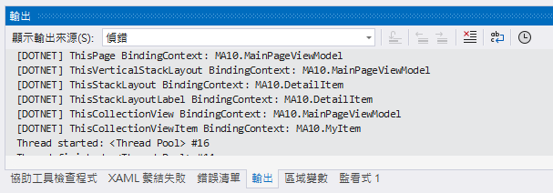

# .NET 8 MAUI 查看當前 BindingContext 使用的物件型別


在 .NET MAUI 開發環境中，透過 MVVM 設計模式與 XAML 資料綁定功能，可以將 ViewModel 與 View 進行綁定，這樣就可以在 ViewModel 內透過屬性與命令，來控制 View 的顯示與行為。不過，在使用 XAML 來進行資料綁定宣告與使用此功能時，有一個重要的觀念，就是 BindingContext，這個屬性可以讓 View 與 ViewModel 進行綁定，而且，BindingContext 屬性的型別，必須要與 View 的型別相同，否則，就無法進行綁定。

也就是說，當在 UI 控制項的屬性中，使用了標記延伸的資料綁定語法，例如：`{Binding Name}`，這個語法中的 `Name` 這個屬性，必須要存在於 BindingContext 的物件型別中，否則，就無法進行綁定。所以，了解到當前的 BindingContext 使用的物件型別，是件很重要的事情，因為這需要決定可以使用哪些屬性來進行資料綁定。

若沒有使用 [編譯的系結](https://learn.microsoft.com/zh-tw/dotnet/maui/fundamentals/data-binding/compiled-bindings?view=net-maui-8.0&WT.mc_id=DT-MVP-5002220) ，例如 `x:DataType` 這樣的語法，對於 `{Binding Name}` 這樣的資料綁定的宣告，需要等到執行時期的時候，才能夠知道資料綁定是否有成功，因為當前的 BindingContext 物件內，若沒有 Name 這個屬性，則會造成資料綁定失敗，但是， App 應用程式是不會閃退，但是會在螢幕上無法看到資料綁定對象的實際資料內容。

因此，若能夠在 .NET MAUI 專案設計過程中，使用 `x:DataType` 語法來指定編譯時期的資料綁定功能，在編譯時期就可以進行所宣告的資料綁定用法是否正確，指向的是否為所規劃的要綁定的對象，就變得相當重要，因為，這樣可以大幅提整個應用程式的開發速度與品質，不用甚麼事情都要等到執行時期才知道資料綁定的宣告用法是否正確。

對於 .NET MAUI 中的 XAML 內之每個頁面 Page 、版面配置 Layout、控制項/項目 Control / Element，都有個 BindingContext 屬性，而當在設計一個 XAML 文件的時候，其實就是在描述整體畫面的各個視覺控制項 VisualElement 之間的關係，這些關係將會使用呈現為一個樹狀結構的關係，也就是說，每個 頁面 Page 、版面配置 Layout、控制項/項目 Control / Element 都會有個父項目。

對於 BindingContext 這個屬性而言，它具有一個可以繼承屬性質的特性，也就是說，當在設計 XAML 文件的時候，可以在某個父項目上，設定 BindingContext 屬性，這樣，該父項目下的所有子項目，都會繼承該父項目的 BindingContext 屬性值，這樣，就可以讓所有子項目，都可以使用 BindingContext 屬性值所指定的物件型別，來進行資料綁定。當然，若在某個子項目想要強制覆蓋 BindingContext 屬性值，也是可以的。這樣的話，從這個子項目開始，就會使用新的 BindingContext 屬性值所指定的物件型別，來進行資料綁定。這樣的特性將會在 ListView 或者 CollectionView 這樣的控制項上，使用到 BindingContext 屬性時，變得相當重要。因為，對於要顯示的每個項目，其每個明細項目的 BindingContext 屬性值將會切換成為這個當時要顯示的明細物件所指定的物件型別，而不是這類集合物件當時所用的 BindingContext 物件。

在這裡將會透過一個範例來說明，當前的 BindingContext 使用的物件型別，是件很重要的事情，因為這需要決定可以使用哪些屬性來進行資料綁定。這裡將會使用編譯的綁定語法來進行說明。

## 建立 .NET 8 MAUI 專案

* 打開 Visual Studio 2022 IDE 應用程式
* 從 [Visual Studio 2022] 對話窗中，點選右下方的 [建立新的專案] 按鈕
* 在 [建立新專案] 對話窗右半部
  * 切換 [所有語言 (L)] 下拉選單控制項為 [C#]
  * 切換 [所有專案類型 (T)] 下拉選單控制項為 [MAUI]
* 在中間的專案範本清單中，找到並且點選 [.NET MAUI 應用程式] 專案範本選項
  > 此專案可用於建立適用於 iOS、Android、Mac Catalyst、Tizen 和 WinUI 的 .NET MAUI 應用程式。
* 點選右下角的 [下一步] 按鈕
* 在 [設定新的專案] 對話窗
* 找到 [專案名稱] 欄位，輸入 `MA10` 作為專案名稱
* 在剛剛輸入的 [專案名稱] 欄位下方，確認沒有勾選 [將解決方案與專案至於相同目錄中] 這個檢查盒控制項
* 點選右下角的 [下一步] 按鈕
* 現在將會看到 [其他資訊] 對話窗
* 在 [架構] 欄位中，請選擇最新的開發框架，這裡選擇的 [架構] 是 : `.NET 8.0 (長期支援)`
* 請點選右下角的 [建立] 按鈕

稍微等候一下，這個主控台專案將會建立完成

## 安裝要用到的 NuGet 開發套件

因為開發此專案時會用到這些 NuGet 套件，請依照底下說明，將需要用到的 NuGet 套件安裝起來。

### 安裝 CommunityToolkit.Mvvm 套件

CommunityToolkit.Mvvm 是微軟官方提供的 MVVM 套件，提供了一些 MVVM 開發常用的功能，例如：ObservableObject、ObservableProperty、RelayCommand 等等，這些功能在 WPF、UWP、Xamarin.Forms 都可以使用，而且在 .NET 8 MAUI 也可以使用。

請依照底下說明操作步驟，將這個套件安裝到專案內

* 滑鼠右擊 [方案總管] 視窗內的 [專案節點] 下方的 [相依性] 節點
* 從彈出功能表清單中，點選 [管理 NuGet 套件] 這個功能選項清單
* 此時，將會看到 [NuGet: MA10] 視窗
* 切換此視窗的標籤頁次到名稱為 [瀏覽] 這個標籤頁次
* 在左上方找到一個搜尋文字輸入盒，在此輸入 `CommunityToolkit.Mvvm`
* 稍待一會，將會在下方看到這個套件被搜尋出來
* 點選 [CommunityToolkit.Mvvm] 套件名稱
* 在視窗右方，將會看到該套件詳細說明的內容，其中，右上方有的 [安裝] 按鈕
* 點選這個 [安裝] 按鈕，將這個套件安裝到專案內


## 建立 DetailItem 類別

這裡需要建立一個新的類別，將會用於在等下的 XAML 頁面中的 [StackLayout] 版面配置項目中，重新指定 BindingContext 的屬性值為這個 [DetailItem] 類別的物件，因此，將會看到這個 [StackLayout] 內的所有子項目的 BindingContext 屬性值，都將會換成 [DetailItem] 類別的物件。

* 滑鼠右擊此專案節點，從彈出的功能表清單中，點選 [加入] > [新增項目] 選項
* 在 [新增項目 - MA10] 對話窗中，點選對話窗左方的 [已安裝] > [C#] > [類別]
* 在對話窗的下方的名稱欄位，輸入 [DetailItem.cs] 作為名稱
* 點選對話窗右下方的 [新增] 按鈕
* 現在將會看到 [DetailItem.cs] 這個檔案，並且，這個檔案會被開啟在 Visual Studio 2022 的編輯器內
* 使用底下內容替換掉原來的檔案內容

```csharp
namespace MA10;

public class DetailItem
{
    public string Now { get; set; } = DateTime.Now.ToString("yyyy-MM-dd HH:mm:ss");
}
```

## 建立 MyItem 類別

在這個範例中，將會建立一個 CollectionView 項目，用來顯示集合物件的內容，因此，需要建立一個類別，用來表示集合物件的內容，對於每個集合物件，將會透過 MyItem 這個類別來提供要顯示的內容。

* 滑鼠右擊此專案節點，從彈出的功能表清單中，點選 [加入] > [新增項目] 選項
* 在 [新增項目 - MA10] 對話窗中，點選對話窗左方的 [已安裝] > [C#] > [類別]
* 在對話窗的下方的名稱欄位，輸入 [MyItem.cs] 作為名稱
* 點選對話窗右下方的 [新增] 按鈕
* 現在將會看到 [MyItem.cs] 這個檔案，並且，這個檔案會被開啟在 Visual Studio 2022 的編輯器內
* 使用底下內容替換掉原來的檔案內容

```csharp
public class MyItem
{
    public string Name { get; set; }
    public int Age { get; set; }

    public static List<MyItem> GetAll()
    {
        List<MyItem> result = new List<MyItem>();
        for (int i = 0; i < 100; i++)
        {
            result.Add(new MyItem { Name = $"Name {i}", Age = i });
        }
        return result;
    }
}
```

在這個 [MyItem] 類別中，將會有兩個屬性， [Name] 與 [Age]，另外，這裡將會設計一個產生集合物件明細的靜態方法 [GetAll]，這裡將會產生出 100 個物件到集合物件內。

## 建立 MainPageViewModel ViewModel

* 滑鼠右擊專案節點，從彈出的功能表清單中，點選 [加入] > [類別] 選項
* 在 [新增項目 - MA10] 對話窗中，點選對話窗左方的 [已安裝] > [.NET MAUI]
* 在對話窗的下方的名稱欄位，輸入 [MainPageViewModel.cs] 作為名稱
* 點選對話窗右下方的 [新增] 按鈕
* 現在將會看到 [MainPageViewModel.cs] 這個檔案，並且，這個檔案會被開啟在 Visual Studio 2022 的編輯器內
* 使用底下內容替換掉原來的檔案內容

```csharp
using CommunityToolkit.Mvvm.ComponentModel;
using System.Collections.ObjectModel;

namespace MA10;

public partial class MainPageViewModel : ObservableObject
{
    [ObservableProperty]
    ObservableCollection<MyItem> allItems = new();
    [ObservableProperty]
    string appName = "應用程式名稱";
    [ObservableProperty]
    DetailItem detailItem = new();

    public MainPageViewModel()
    {
        AllItems = new ObservableCollection<MyItem>(MyItem.GetAll());
    }
}
```

在 MainPageViewModel 這個類別中，將會建立三個可用於資料綁定的成員，分別是 allItem、appName、detailItem 這三個私有欄位，不過因為這三個欄位的上面都有裝飾 `[ObservableProperty]` ，所以，透過 [CommunityToolkit.Mvvm] 與 原始碼產生器的幫助，將會產生出 AllItem、AppName、DetailItem 這三個公開屬性，這三個公開屬性將會用於資料綁定。

最後，在這個 ViewModel 內，將會設計一個預設建構式，也就是沒有參數的建構式，在這個建構式內，會呼叫 [MyItem.GetAll()] 這個靜態方法，取得預設產生的 100 個物件，並且將這些物件形成 [ObservableCollection] 類型的集合物件，最後指派給 AllItem。

這裡使用了 [ObservableCollection] 而不是 [List]呢?

若採使用 使用List 將會具有底下特色
* 無自動 UI 更新: List 沒有實作 INotifyCollectionChanged 介面。因此，當你更改清單內容時（新增、刪除、清除等），UI 不會自動更新。要更新 UI，你需要手動重新設定ItemsSource 或使用其他方式通知 UI 更新。
* 適用於靜態資料: 如果你的資料在初始化後不會改變，或者你不需要資料的每次更改都立即反映在 UI 上，那麼使用 List 是合適的。
* 效能考量: 對於大量資料且資料不經常變更的情況，使用 List 可能會更有效率，因為它不會在每次資料修改時觸發 UI 更新。

若採使用 ObservableCollection 將會有底下的好處
* 自動 UI 更新: ObservableCollection 實作了 INotifyCollectionChanged 接口，這表示當你新增、刪除或取代集合中的項目時，ObservableCollection 會自動通知 UI 進行更新。這是其最大的優勢，能夠確保 UI 始終與資料來源保持同步。
* 適用於動態資料: 如果你的資料會在運行時改變（例如，使用者可以新增或刪除項目），那麼 ObservableCollection 是最佳選擇。它適用於需要響應數據變化的場景。
* 效能考量: 對於大量資料的更新，ObservableCollection 可能會導致效能問題，因為每次新增或刪除項目時都會觸發 UI 更新。

## 修正 MainPage View

現在可以進行 [MainPage.xaml] 這個頁面的修正

* 在專案根目錄下找到並且打開 [MainPage.xaml] 節點
* 使用底下內容替換掉原來的檔案內容

```xml
<?xml version="1.0" encoding="utf-8" ?>
<ContentPage xmlns="http://schemas.microsoft.com/dotnet/2021/maui"
             xmlns:x="http://schemas.microsoft.com/winfx/2009/xaml"
             xmlns:local="clr-namespace:MA10"
             x:DataType="local:MainPageViewModel"
             x:Class="MA10.MainPage"
             x:Name="ThisPage"
             Title="MA10 探究 BindingContext">

    <Grid RowDefinitions="Auto,*">
        <VerticalStackLayout x:Name="ThisVerticalStackLayout"
            Padding="30,0" Spacing="25"
            VerticalOptions="Fill">
            <Label Text="頁面 的 BindingContext" />
            <Label Text="{Binding .}" TextColor="Orange"/>
            <Label Text="{Binding Path=AppName, StringFormat='顯示 BindingContext 下的綁定值 [{0}]'}"
                   TextColor="Green"
                   x:Name="ThisVerticalStackLayoutLabel"/>
            
            <StackLayout Orientation="Vertical"  x:Name="ThisStackLayout"
                         BindingContext="{Binding DetailItem}">
                <Label Text="StackLayout 的 BindingContext" />
                <Label Text="{Binding .}" TextColor="Orange"/>
                <Label Text="{Binding Path=Now, StringFormat='顯示 BindingContext 下的綁定值 [{0}]'}"
                   TextColor="Green" x:DataType="local:DetailItem"
                       x:Name="ThisStackLayoutLabel"/>
            </StackLayout>

            <Button x:Name="ShowBindingContextButton"
                    Text="顯示 BindingContext"
                    Clicked="ShowBindingContextButton_Clicked"/>

        </VerticalStackLayout>

        <CollectionView Grid.Row="1" ItemsSource="{Binding AllItems}" x:Name="ThisCollectionView">
            <CollectionView.ItemTemplate>
                <DataTemplate x:DataType="local:MyItem">
                    <StackLayout Orientation="Vertical" Margin="10" x:Name="ThisCollectionViewItem">
                        <Label Text="DataTemplate 的 BindingContext" />
                        <Label Text="{Binding .}" TextColor="Orange"/>
                        <Label Text="{Binding Path=Name, StringFormat='顯示 BindingContext 下的綁定值 [{0}]'}" TextColor="Green"/>
                        <Label Text="{Binding Path=Age, StringFormat='顯示 BindingContext 下的綁定值 [{0}]'}" TextColor="Green"/>
                    </StackLayout>
                </DataTemplate>
            </CollectionView.ItemTemplate>
        </CollectionView>

    </Grid>

</ContentPage>
```

在頁面的最上方，將會使用 [x:DataType] 來宣告 [編譯的綁定](https://learn.microsoft.com/zh-tw/dotnet/maui/fundamentals/data-binding/compiled-bindings?view=net-maui-8.0&WT.mc_id=DT-MVP-5002220)，這樣當在進行 XAML 設計的時候，便可以使用到 [Visual Studio 中的 IntelliSense](https://learn.microsoft.com/zh-tw/visualstudio/ide/using-intellisense?view=vs-2022&WT.mc_id=DT-MVP-5002220) 功能，方便設計與即時檢查是否有錯誤發生。

為了要使用這樣的機制，需要有個命名空間指向該 ViewModel 所在的命名空間內，在這裡將會使用底下的語法來做到這樣的設計需求。

```xml
xmlns:viewModels="clr-namespace:MA10"
x:DataType="viewModels:MainPageViewModel"
```

在這個 XAML 頁面中，各個視覺控制項的階層關係如下

透過這樣的描述個視覺項目的階層關係，將會更有助於理解與說明接下來的內容

```
ContentPage (ThisPage)
   Grid
      VerticalStackLayout (ThisVerticalStackLayout)
         Label (ThisVerticalStackLayoutLabel)
         StackLayout (ThisStackLayout)
            Label (ThisStackLayoutLabel)
         Button
      CollectionView
         ItemTemplate
            DataTemplate
               StackLayout (ThisCollectionViewItem)
                  Label
```

一般來說， [ContentPage] 的 BindingContext 的物件，就是這個頁面的 ViewModel 型別，也就是 [MainPageViewModel]，這是因為在 Code Behind 的建構式內，有底下的程式碼執行結果

```csharp
public MainPage(MainPageViewModel viewModel)
{
    InitializeComponent();
    BindingContext = viewModel;
}
```

在此 XAML 中，將會有些 [Label] 控制項，將會把當前的 BindingContext 物件型別顯示在螢幕上，例如在 [VerticalStackLayout] & [StackLayout] 內的子項目會有這樣的宣告 

```xml
<Label Text="{Binding .}" TextColor="Orange"/>
```

上述的 XAML 將會把當前的 BindingContext 物件，作為 [Text] 屬性要綁定的來源，在此將會直接使用該物件的 [.ToString()] 方法，將該方法的回傳字串文字內容，顯示在螢幕上，也就是該物件的型別敘述文字。

若在這個 XAML 頁面中沒有特別的宣告語法或者是遇到集合檢視項目，如 ListView 或者 CollectionView，在此頁面上的視覺項目的 BindingContext 物件，沒問題話，那就是 MainPageViewModel。

若想要在 XAML 上強制修正 BindingContext 的物件，可以宣告該視覺項目的 BindingContext 屬性值成為另外一個物件，例如，像是這樣 

```xml
<StackLayout Orientation="Vertical"  x:Name="ThisStackLayout"
             BindingContext="{Binding DetailItem}">
```

透過這樣的宣告，在此 [StackLayout] 裡面的子項目，其 BindingContext 將會是 DetailItem 這個型別的物件。

對於 XAML 或者 .NET MAUI 新手而言，接下來的觀念可能會比較難理解，不過，當看完這個範例之後，應該就可以理解這樣的觀念了。

對於這個頁面最下方將會有個 CollectionView 控制項，[CollectionView](https://learn.microsoft.com/zh-tw/dotnet/maui/user-interface/controls/collectionview/?view=net-maui-8.0&WT.mc_id=DT-MVP-5002220) 是一種檢視，可使用不同的版面配置規格來呈現數據清單。 其目標是提供更具彈性且高效能的 ListView替代方案。

```xml
<CollectionView Grid.Row="1" ItemsSource="{Binding AllItems}" x:Name="ThisCollectionView">
    <CollectionView.ItemTemplate>
        <DataTemplate x:DataType="local:MyItem">
            <StackLayout Orientation="Vertical" Margin="10" x:Name="ThisCollectionViewItem">
                <Label Text="DataTemplate 的 BindingContext" />
                <Label Text="{Binding .}" TextColor="Orange"/>
                <Label Text="{Binding Path=Name, StringFormat='顯示 BindingContext 下的綁定值 [{0}]'}" TextColor="Green"/>
                <Label Text="{Binding Path=Age, StringFormat='顯示 BindingContext 下的綁定值 [{0}]'}" TextColor="Green"/>
            </StackLayout>
        </DataTemplate>
    </CollectionView.ItemTemplate>
</CollectionView>
```

對於 CollectionView，可以指定 ViewModel 內的集合物件 [AllItems] 到 [ItemsSource] 這個控制項屬性內，如此，CollectionView 將會使用集合清單的方式，將該集合物件內的所有紀錄都顯示在螢幕上。

不過，對於在 [CollectionView] > [ItemTemplate] > [DataTemplate] 節點下，此時的 BindingContext 就不是 CollectionView 內的 BindingContext 指向的物件，在 CollectionView 內的 BindingContext 物件型別為 [MainPageViewModel]，而對於 [DataTemplate] 節點下的 BindingContext 物件型別卻是 [MyItem]。

會有這樣的差異在於 [DataTemplate] 節點下的各個子項目，將會用於顯示每個集合清單項目的值，因此 .NET MAUI 會自動切換 [DataTemplate] 節點的 BindingContext 使用每個集合清單項目的值，也就是說，其 BindingContext 物件型別為 [MyItem]。

## 在 View 內注入 ViewModel 並且指派給該 View 的 BindingContext

* 在專案根目錄中內找到 [MainPage.xaml.cs] 這個檔案，並且，使用滑鼠雙擊這個檔案
* 預設所產生出來的建構式是沒有任何參數的
* 修改這個建構式可以接受一個 [MainPageViewModel] 類別的參數，這裡加入 `MainPageViewModel viewModel` 這個參數
* 在 `InitializeComponent();` 這個程式碼的後面，加入 `BindingContext = viewModel;` 這個程式碼
* 底下是完成後這個頁面的 Code Behind 程式碼
  
```csharp
using System.Linq;
namespace MA10;

public partial class MainPage : ContentPage
{
    int count = 0;

    public MainPage(MainPageViewModel viewModel)
    {
        InitializeComponent();
        BindingContext = viewModel;
    }

    private void ShowBindingContextButton_Clicked(object sender, EventArgs e)
    {
        Console.WriteLine($"ThisPage BindingContext: {ThisPage.BindingContext}");
        Console.WriteLine($"ThisVerticalStackLayout BindingContext: {ThisVerticalStackLayout.BindingContext}");
        Console.WriteLine($"ThisStackLayout BindingContext: {ThisStackLayout.BindingContext}");
        Console.WriteLine($"ThisStackLayoutLabel BindingContext: {ThisStackLayoutLabel.BindingContext}");
        Console.WriteLine($"ThisCollectionView BindingContext: {ThisCollectionView.BindingContext}");

        StackLayout stackLayout = ThisCollectionView.GetVisualTreeDescendants()[1] as StackLayout;
        Console.WriteLine($"ThisCollectionViewItem BindingContext: {stackLayout.BindingContext}");
    }
}
```

當 [MainPage.xaml] 這個 View 透過相依性注入容器解析出來之後，需要在這個 View 建構式內，同時注入這個 View 會用到的 ViewModel，也就是 [MainPageViewModel] 這個類別，並且將這個 ViewModel 物件，指定給這個 View 的 [BindingContext](https://learn.microsoft.com/zh-tw/dotnet/maui/fundamentals/data-binding/basic-bindings?view=net-maui-8.0&WT.mc_id=DT-MVP-5002220) 屬性，這樣，這個 ContentPage 頁面與其子項目 (Element)， 就可以使用這個 ViewModel 內的屬性與方法來進行資料綁定。

在這個 [MainPage] 後置碼 [Code Behind] 程式區塊內，加入一個按鈕需要綁定的事件，在這個按鈕事件中，將會直接存取 XAML 頁面上有使用標記延伸語法 `x:Name` 的項目，一旦在 Code Behind 程式碼中，就可以直接使用這裡宣告的名稱，便可以存取在頁面中任何視覺項目。

在此將會簡單的僅將 XAML 中的項目之 BindingContext 屬性顯示在 Visual Studio 的輸出視窗內，例如對於 `Console.WriteLine($"ThisPage BindingContext: {ThisPage.BindingContext}");` 這個敘述，將會把 [ThisPage] 這個頁面物件的 BindingContext 的型別顯示出來。

對於 [CollectionView] 內的 [DataTemplate] 內的視覺項目，若有使用 [x:Name] 宣告，是無法在 Code Behind 內存取的，例如，若加入 `var foo = ThisCollectionViewItem;` 這樣的敘述，將會得到 `錯誤	CS0103	名稱 'ThisCollectionViewItem' 不存在於目前的內容中`

為了要解決此一問題，將會呼叫 CollectionView 這個視覺控制項內的 [GetVisualTreeDescendants] 方法，取得該控制項內的所有視覺控制項集合清單，這當然也包含了版面配置 Layout 項目。使用底下程式碼將可以取得集合物件內的第一個項目內的 [StackLayout]

```csharp
StackLayout stackLayout = ThisCollectionView.GetVisualTreeDescendants()[1] as StackLayout;
```

取得這個 [StackLayout] 項目之後，就可以將其 BindingContext 物件型別顯示在 Visual Studio 視窗內。


## 註冊 View 與 ViewModel 到 DI 容器內

* 在專案根結點內找到 [MauiProgram.cs] 這個檔案，並且，使用滑鼠雙擊這個檔案
* 找到 `#if DEBUG`
* 在這個程式碼前，加入底下的程式碼

```csharp
builder.Services.AddTransient<MainPageViewModel>();
builder.Services.AddTransient<MainPage>();
```

## 執行並且驗證結果

* 底下畫面將會是這個專案在 Android 平台內執行的結果


當點選了 [顯示 BindingContext] 按鈕之後，可以從 Visual Studio 輸出視窗中，看到底下的內容



```
[DOTNET] ThisPage BindingContext: MA10.MainPageViewModel
[DOTNET] ThisVerticalStackLayout BindingContext: MA10.MainPageViewModel
[DOTNET] ThisStackLayout BindingContext: MA10.DetailItem
[DOTNET] ThisStackLayoutLabel BindingContext: MA10.DetailItem
[DOTNET] ThisCollectionView BindingContext: MA10.MainPageViewModel
[DOTNET] ThisCollectionViewItem BindingContext: MA10.MyItem
```

從這裡可以驗證出，直接在 XAML 中所顯示的 BindingContext 物件型別，與直接透過 .NET 物件所取得的 BindingContext 物件型別是相同的。


