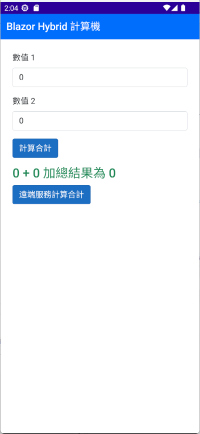
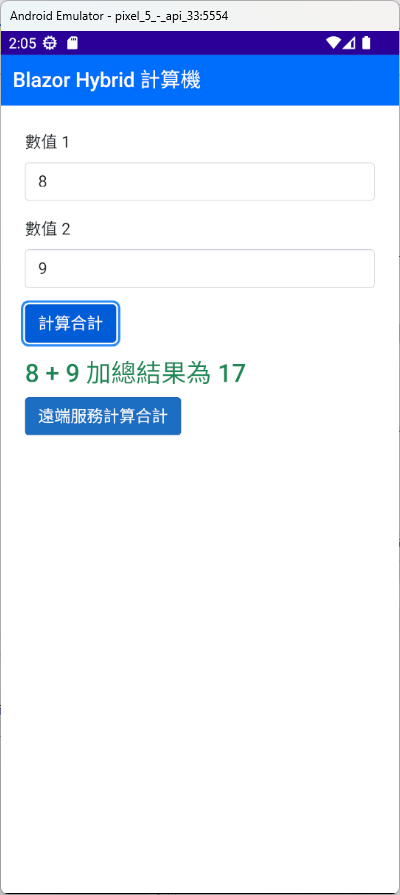
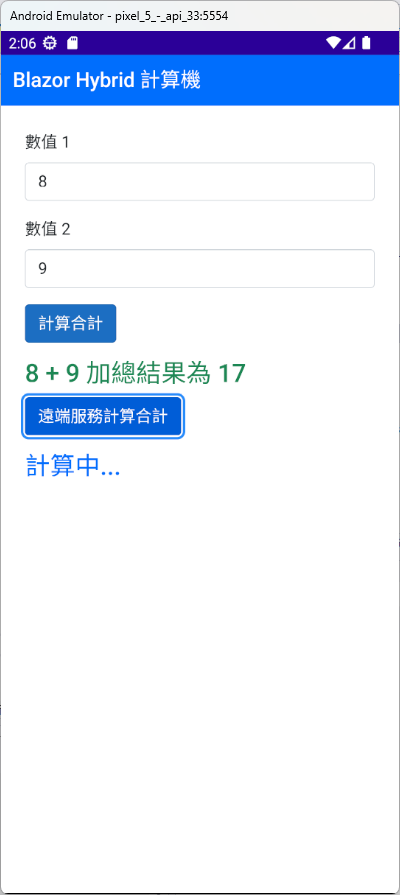
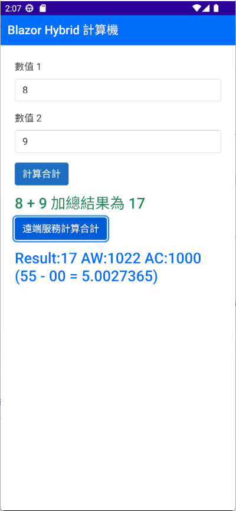

# .NET 8 MAUI 使用 Blazor Hybrid 架構設計計算機功能


在上一篇 [.NET 8 MAUI 建立與使用.NET MAUI Blazor Hybrid 應用程式](https://csharpkh.blogspot.com/2024/02/maui-blazor-hybrid-razor.html) 文章中，說明了在 .NET MAUI 的專案內，Blazor Hybrid 架構的應用程式是如何建立的，而在這篇文章中，則是要進一步的說明如何在 Blazor Hybrid 架構的應用程式中，加入一個簡單的計算機功能。

這裡的需求將會需要設計一個 Razor 頁面，在此 Razor 頁面內需要有兩個文字輸入盒，可以輸入兩個整數數值，接著在下方將會有兩個按鈕，第一個按鈕將會使用 C# 程式碼，在 Razor 檔案內直接取得這兩個整數值，並且加總起來後，將結果顯示在螢幕上，這裡將會需要用到 Razor 的資料綁定機制來做到。

對於第二個按鈕，則會需要透過該 Razor 頁面注入一個加法器的服務，只要使用者按下這個按鈕之後，將會把輸入的兩個整數傳入到該服務之方法內，該服務的方法將會呼叫遠端的 Web API，針對這兩個整數數值進行處理，接著將會回傳一個字串內容，最後要將這個字串內容顯示在螢幕上。

## 建立 .NET 8 MAUI 專案

* 打開 Visual Studio 2022 IDE 應用程式
* 從 [Visual Studio 2022] 對話窗中，點選右下方的 [建立新的專案] 按鈕
* 在 [建立新專案] 對話窗右半部
  * 切換 [所有語言 (L)] 下拉選單控制項為 [C#]
  * 切換 [所有專案類型 (T)] 下拉選單控制項為 [MAUI]
* 在中間的專案範本清單中，找到並且點選 [.NET MAUI Blazor 應用程式] 專案範本選項
  > 此專案可用於建立適用於 iOS、Android、Mac Catalyst、Tizen 和使用 Blazor 的 WinUI 的 .NET MAUI 應用程式。
* 點選右下角的 [下一步] 按鈕
* 在 [設定新的專案] 對話窗
* 找到 [專案名稱] 欄位，輸入 `MA15` 作為專案名稱
* 在剛剛輸入的 [專案名稱] 欄位下方，確認沒有勾選 [將解決方案與專案至於相同目錄中] 這個檢查盒控制項
* 點選右下角的 [下一步] 按鈕
* 現在將會看到 [其他資訊] 對話窗
* 在 [架構] 欄位中，請選擇最新的開發框架，這裡選擇的 [架構] 是 : `.NET 8.0 (長期支援)`
* 請點選右下角的 [建立] 按鈕

稍微等候一下，這個主控台專案將會建立完成

## 是否需要安裝 CommunityToolkit.Mvvm 套件

由於在這個練習專案中，將會採用 Blazor Hybrid 方式來進行 App 開發，相關的畫面將會設計到 Razor 頁面，因此，並不需要這個套件 [Microsoft.Toolkit.Mvvm](https://www.nuget.org/packages/Microsoft.Toolkit.Mvvm) ，這是因為當在進行 Blazor 元件開發的時候，採用的是 MVU 設計模式，並不是採用 MVVM 框架的設計模式。

在 Blazor 元件內，預設提供了資料綁定的機制，當 C# 內的物件屬性值有變動的時候，將會自動的更新到 Razor 頁面上，而當使用者在 Razor 頁面上的元件上有互動的時候，也會自動的更新到 C# 內的物件屬性值上。

## 可以呼叫遠端 Web API 的服務

在這個練習專案中，將會需要一個服務，這個服務將會用來呼叫遠端的 Web API，並且將兩個整數數值傳入到 Web API 的方法內，接著將會回傳一個字串內容，最後將這個字串內容顯示在螢幕上。

* 在這個專案中，請在 [MA15] 專案上按右鍵
* 從右鍵選單中，選擇 [加入] > [類別] 功能
* 在 [新增項目] 對話窗中
* 在左邊的範本清單中，選擇 [已安裝] > [C# 項目] > [類別] 範本
* 在下方的 [名稱] 欄位，輸入 `AddingCalculatorService` 作為類別名稱
* 點選 [新增] 按鈕
* 使用底下程式碼，取代掉原本的 `AddingCalculatorService` 類別內容

```csharp
namespace MA15;

public class AddingCalculatorService
{
    public async Task<string> AddAsync(int a, int b)
    {
        int estimate = 5000;
        string url = $"https://businessblazor.azurewebsites.net/api/RemoteService/" +
            $"Add/{a}/{b}/{estimate}";

        HttpClient client = new HttpClient();

        string result = await client.GetStringAsync(url);
        return result;
    }
}
```

在這個 [AddingCalculatorService] 類別內，有一個 [AddAsync] 方法，這個方法是一個非同步的方法，並且接受兩個整數數值，這兩個整數數值將會被傳入到遠端的 Web API 方法內，並且這個方法將會回傳一個字串內容。

## 將遠端加法器服務註冊到 DI 容器內

* 在這個專案中，請在 [MA15] 專案上找到並且打開 [MauiProgram.cs] 檔案
* 找到 `builder.Services.AddMauiBlazorWebView();` 敘述
* 在這個敘述的下一行，加入底下程式碼

```csharp
builder.Services.AddTransient<AddingCalculatorService>();
```

## 設計 Razor 頁面

* 在這個專案中，切換到 [Components] > [Pages] 資料夾
* 找到並且打開 [Home.razor] 檔案
* 使用底下程式碼，取代掉原本的 `Home.razor` 檔案內容

```html
@page "/"
@using MA15.Components.Layout
@layout EmptyLayout
@inject AddingCalculatorService AddingCalculatorService

<nav class="navbar bg-primary">
    <div class="container-fluid">
        <span class="navbar-brand mb-0 h1 text-white">Blazor Hybrid 計算機</span>
    </div>
</nav>

<div class="container p-4">
    <div class="mb-3">
        <label for="number1" class="form-label">數值 1</label>
        <input type="number" class="form-control" @bind-value="value1">
    </div>
    <div class="mb-3">
        <label for="number2" class="form-label">數值 2</label>
        <input type="number" class="form-control" @bind-value="value2">
    </div>
    <button class="btn btn-primary" @onclick="calculateSum">計算合計</button>
    <div class="mt-3 text-success h2">
        @value1 + @value2 加總結果為 @result
    </div>
    <button class="btn btn-primary" @onclick="calculateSumRemoteAsync">遠端服務計算合計</button>
    <div class="mt-3 text-primary h2">
        @remoteValue
    </div>
</div>

@code {
    int value1 = 0;
    int value2 = 0;
    int result = 0;
    string remoteValue = "";
    void calculateSum()
    {
        result = value1 + value2;
    }
    async Task calculateSumRemoteAsync()
    {
        remoteValue = "計算中...";
        remoteValue = await AddingCalculatorService.AddAsync(value1, value2);
    }
}
```

在這個 Razor 頁面內，有兩個文字輸入盒，可以輸入兩個整數數值，接著在下方將會有兩個按鈕，第一個按鈕將會使用 C# 程式碼，在 Razor 檔案內直接取得這兩個整數值，並且加總起來後，將結果顯示在螢幕上，這裡將會需要用到 Razor 的資料綁定機制來做到。第二個按鈕則會透過該 Razor 頁面注入一個加法器的服務，只要使用者按下這個按鈕之後，將會把輸入的兩個整數傳入到該服務之方法內，該服務的方法將會呼叫遠端的 Web API，針對這兩個整數數值進行處理，接著將會回傳一個字串內容，最後要將這個字串內容顯示在螢幕上。

由於注入進來的服務將會透過網路呼叫遠端的 Web API，因此，這個按鈕按下去之後，將會需要等待一段時間，才會有結果回傳回來，因此，這裡將會需要在按鈕按下去之後，先顯示一個文字 [計算中...] ，接著再等待一段時間，直到結果回傳回來，才會顯示在螢幕上。

## .NET MAUI Blazor 應用程式執行結果

底下為在 Android 模擬器上執行 [.NET MAUI Blazor 應用程式] 專案的執行結果：



接著請在數值1的文字輸入盒內輸入 8 ，然後在數值1的文字輸入盒內輸入 9

最後點選第一個按鈕 [計算合計] ，此時，就會看到這兩個整數的相加結果



現在再來點選 [遠端服務計算合計] 按鈕，此時，將會呼叫遠端的 Web API，並且至少需要 5 秒以上的時間，才會有結果回傳回來，因此，螢幕上將會顯示出 [計算中...] 文字，如下圖



一旦 Web API 執行完成後，將會回傳一串文字，並且顯示在螢幕上，如下圖所示




