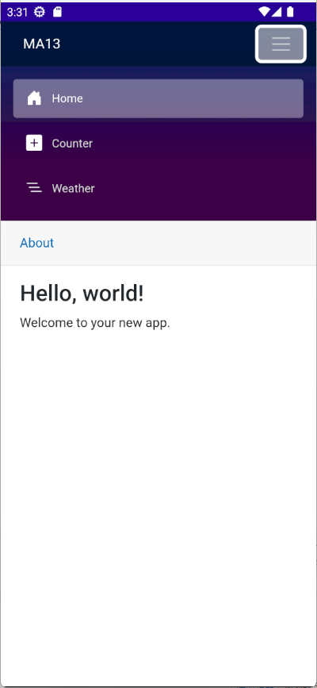

# 建立與使用.NET MAUI Blazor Hybrid 應用程式


## 建立 .NET 8 MAUI 專案

> **為了能夠完成這份文件所提到的事情，需要將電腦上的 Visual Studio 2022 升級到 17.8 以上的版本，也就是，這台電腦上必須要有安裝 .NET 8 SDK。**

* 打開 Visual Studio 2022 IDE 應用程式
* 從 [Visual Studio 2022] 對話窗中，點選右下方的 [建立新的專案] 按鈕
* 在 [建立新專案] 對話窗右半部
  * 切換 [所有語言 (L)] 下拉選單控制項為 [C#]
  * 切換 [所有專案類型 (T)] 下拉選單控制項為 [MAUI]
* 在中間的專案範本清單中，找到並且點選 [.NET MAUI Blazor 應用程式] 專案範本選項
  > 此專案可用於建立適用於 iOS、Android、Mac Catalyst、Tizen 和使用 Blazor 的 WinUI 的 .NET MAUI 應用程式。
* 點選右下角的 [下一步] 按鈕
* 在 [設定新的專案] 對話窗
* 找到 [專案名稱] 欄位，輸入 `MA13` 作為專案名稱
* 在剛剛輸入的 [專案名稱] 欄位下方，確認沒有勾選 [將解決方案與專案至於相同目錄中] 這個檢查盒控制項
* 點選右下角的 [下一步] 按鈕
* 現在將會看到 [其他資訊] 對話窗
* 在 [架構] 欄位中，請選擇最新的開發框架，這裡選擇的 [架構] 是 : `.NET 8.0 (長期支援)`
* 請點選右下角的 [建立] 按鈕

稍微等候一下，這個主控台專案將會建立完成

## 專案結構比較

在此先來比較一下，這個新建立的 [.NET MAUI Blazor 應用程式] 專案與一般的 [.NET MAUI 應用程式] 專案有何不同。

底下將會是當建立起一個 [.NET MAUI 應用程式] 專案之後，所看到的專案結構。


如同之前所看到的，一個 [.NET MAUI 應用程式] 專案結構呈現的相當精簡與清爽，兩個資料夾 [Platforms] 與 [Resources] 分別用來放置平台相關的程式碼與資源檔案。

在專案根目錄下的 [MauiProgram.cs] 是用來註冊與設定這個 MAUI 專案需要用到的相關服務，[App.xaml] 檔案則是用來定義應用程式的進入點，[AppShell.xaml] 則是用來定義應用程式的畫面關聯與結構，而[MainPage.xaml]則為一個 [ContentPage] 用來宣告這個頁面要使用甚麼內容顯示在螢幕上。

而當建立起一個 [.NET MAUI Blazor 應用程式] 專案之後，所看到的專案結構如下：


除了原本的 [.NET MAUI 應用程式] 專案結構之外( 不過，在預設專案內，[AppShell.xaml] 這個檔案是不再的。 )，多了一個 [wwwroot] 資料夾，這個資料夾是用來放置 Blazor 網頁應用程式的靜態資源檔案；也有個 [Components] 資料夾，這個資料夾是用來放置 Blazor 元件的程式碼，也就是 [.razor] 類型的檔案。

在 [Components] 資料夾下，將會有兩個資料夾，分別是 [Layout] 資料夾，這裡是用來放置 Blazor 元件的版面配置，另外一個是 [Pages] 資料夾，這裡是用來放置 Blazor 元件的頁面畫面宣告的內容。

## MauiProgram.cs 檔案的差異

在 [.NET MAUI 應用程式] 專案中，[MauiProgram.cs] 檔案的內容如下：

```csharp
using Microsoft.Extensions.Logging;

namespace MA13
{
    public static class MauiProgram
    {
        public static MauiApp CreateMauiApp()
        {
            var builder = MauiApp.CreateBuilder();
            builder
                .UseMauiApp<App>()
                .ConfigureFonts(fonts =>
                {
                    fonts.AddFont("OpenSans-Regular.ttf", "OpenSansRegular");
                    fonts.AddFont("OpenSans-Semibold.ttf", "OpenSansSemibold");
                });

#if DEBUG
    		builder.Logging.AddDebug();
#endif

            return builder.Build();
        }
    }
}
```

在 [.NET MAUI Blazor 應用程式] 專案中，[MauiProgram.cs] 檔案的內容如下：

```csharp
using Microsoft.Extensions.Logging;

namespace MA13
{
    public static class MauiProgram
    {
        public static MauiApp CreateMauiApp()
        {
            var builder = MauiApp.CreateBuilder();
            builder
                .UseMauiApp<App>()
                .ConfigureFonts(fonts =>
                {
                    fonts.AddFont("OpenSans-Regular.ttf", "OpenSansRegular");
                });

            builder.Services.AddMauiBlazorWebView();

#if DEBUG
    		builder.Services.AddBlazorWebViewDeveloperTools();
    		builder.Logging.AddDebug();
#endif

            return builder.Build();
        }
    }
}
```

可以看到，兩個檔案的內容有些許的不同，主要是在 [.NET MAUI Blazor 應用程式] 專案中，多了兩行程式碼：

```csharp
builder.Services.AddMauiBlazorWebView();
```

這行程式碼是用來註冊 Blazor WebView 服務，這樣才能夠在 MAUI 應用程式中使用 Blazor 元件。

```csharp
builder.Services.AddBlazorWebViewDeveloperTools();
```

這行程式碼是用來註冊 Blazor WebView 開發者工具，這樣才能夠在開發階段中，使用開發者工具來檢視 Blazor 元件的執行狀況。

## MainPage.xaml 檔案的差異

在 [.NET MAUI 應用程式] 專案中，[MainPage.xaml] 檔案將會用來宣告這個頁面中，要顯示的內容，因此，在這裡將會使用很多的 XAML 標記在這個檔案內，當然，也會使用 MVVM 設計模式，在 XAML 標記內使用資料綁定 Data Binding 標記延伸功能，將 View 內的屬性與 ViewModel 內的屬性進行綁定在一起；而在 [.NET MAUI Blazor 應用程式] 專案中，[MainPage.xaml] 檔案的內容如下：

```xml
<?xml version="1.0" encoding="utf-8" ?>
<ContentPage xmlns="http://schemas.microsoft.com/dotnet/2021/maui"
             xmlns:x="http://schemas.microsoft.com/winfx/2009/xaml"
             xmlns:local="clr-namespace:MA13"
             x:Class="MA13.MainPage"
             BackgroundColor="{DynamicResource PageBackgroundColor}">

    <BlazorWebView x:Name="blazorWebView" HostPage="wwwroot/index.html">
        <BlazorWebView.RootComponents>
            <RootComponent Selector="#app" ComponentType="{x:Type local:Routes}" />
        </BlazorWebView.RootComponents>
    </BlazorWebView>

</ContentPage>
```

可以看到，這個 [MainPage.xaml] 檔案的內容非常的簡單，只有一個 [BlazorWebView] 元件，這個元件是用來顯示 Blazor 網頁應用程式的畫面，而在這個元件內，有一個 [HostPage] 屬性，這個屬性是用來指定 Blazor 網頁應用程式的進入點，也就是 [index.html] 檔案。

而在 [BlazorWebView.RootComponents] 元素內，有一個 [RootComponent] 元素，這個元素是用來指定 Blazor 網頁應用程式的根元件，也就是 [Routes] 這個元件；對於 [Selector] 這個屬性指定了 [#app] ，它會定義 CSS 選取器字串，以指定應該放置元件檔中的位置。

這裡可以搭配 [wwwroot] > [index.html] 檔案中部分的內容，看到 [#app] 的定義：

```html
<body>

    <div class="status-bar-safe-area"></div>

    <div id="app">Loading...</div>

    <div id="blazor-error-ui">
        An unhandled error has occurred.
        <a href="" class="reload">Reload</a>
        <a class="dismiss">🗙</a>
    </div>

    <script src="_framework/blazor.webview.js" autostart="false"></script>

</body>
```

對於 [ComponentType] 這個屬性指定了 [Routes] 這個元件，這個元件是用來定義 Blazor 網頁應用程式的路由與對應的畫面，也就是定義根元件的型別。

## App.xaml 檔案的差異

這裡需要觀察 call behind 的程式碼，也就是 [App.xaml.cs] 檔案的內容，在 [.NET MAUI 應用程式] 專案中，[App.xaml.cs] 檔案的內容如下：

```csharp
namespace MA13
{
    public partial class App : Application
    {
        public App()
        {
            InitializeComponent();

            MainPage = new AppShell();
        }
    }
}
```

而在 [.NET MAUI Blazor 應用程式] 專案中，[App.xaml.cs] 檔案的內容如下：

```csharp
namespace MA13
{
    public partial class App : Application
    {
        public App()
        {
            InitializeComponent();

            MainPage = new MainPage();
        }
    }
}
```

可以看到，兩個檔案的內容有些許的不同，主要是在 [.NET MAUI Blazor 應用程式] 專案中，將 [MainPage] 這個頁面設定為這個應用程式的進入點，而在這個頁面內，將會使用了 [BlazorWebView] 這個 XAML 項目作為呈現 Blazor 頁面內容之用。

## Components 資料夾

在 [.NET MAUI Blazor 應用程式] 專案中，多了一個 [Components] 資料夾，這個資料夾是用來放置 Blazor 元件的程式碼，也就是 [.razor] 類型的檔案。對於有在使用 Blazor 的開發者來說，這裡存放的內容則是相當的熟悉，因為這裡存放的內容，就是 Blazor 網頁應用程式的元件程式碼。

## .NET MAUI Blazor 應用程式執行結果

底下為在 Android 模擬器上執行 [.NET MAUI Blazor 應用程式] 專案的執行結果：



