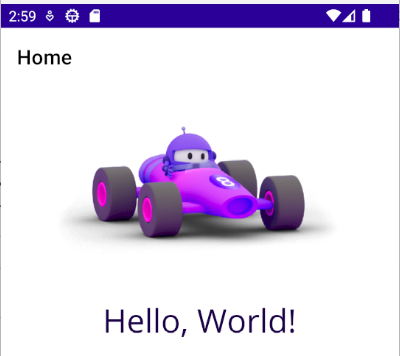
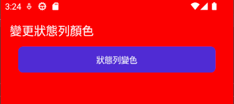
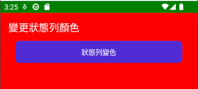

# .NET8 Maui 變更應用程式狀態列 Status Bar 的顏色


在 Android 或者 iOS 的應用程式中，狀態列 Status Bar 是一個很重要的元件，它會顯示出目前的網路狀態、電池電量、時間等等的資訊，而且，它的顏色也會影響到應用程式的外觀，所以，如果能夠變更狀態列的顏色，將會是一件很有趣的事情。



在上面的畫面截圖，為採用 .NET 8 MAUI 建立的專案，並且在 Android 模擬器上執行的結果，在螢幕畫面的最上方將會看到一條狀態列，可以看到，狀態列的背景顏色是紫色的，文字或者圖示的顏色則是白色的，此時，在這個預設的應用程式啟動的時候，是有導航頁面的，這裡可以從最上方有個 Home 文字所在的位置看到底色為白色的導航頁面所在位置，而在導航頁面的下方，則是這個當前頁面，也稱為 內容頁面 ContentPage 所顯示的區域，這裡會看到有個圖片與 Hello, World! 出現在手機螢幕上。

一般來說，導航頁面與內容頁面將會依據應用程式的設計，而有不同的顏色，有些時候會將這兩個頁面背景顏色設定為同一種顏色，想要做到這樣的效果，可以直接透過 ContentPage 內容頁面的 XAML 檔案內來做宣告，便可以變更成為不同的顏色，但是，狀態列的顏色，則是由應用程式的設定所決定的，而無法直接透過預設 XAML 提供的功能，來做到這樣的效果。

在這篇文章將會說明如何進行狀態列的顏色變更的設計方法。

這個範例程式一開始執行，將會出現如下圖



對於狀態列、導航頁面、內容頁面的顏色，都是採用紅色，而在內容頁面裡面，將會有個按鈕，按下這個按鈕，將會變更狀態列的顏色，變更為綠色，而導航頁面與內容頁面的顏色，則是不會變更；如下圖所示



## 建立測試專案

**為了能夠完成這份文件所提到的事情，需要將電腦上的 Visual Studio 2022 升級到 17.8 以上的版本，也就是，這台電腦上必須要有安裝 .NET 8 SDK。**

* 打開 Visual Studio 2022 IDE 應用程式
* 從 [Visual Studio 2022] 對話窗中，點選右下方的 [建立新的專案] 按鈕
* 在 [建立新專案] 對話窗右半部
  * 切換 [所有語言 (L)] 下拉選單控制項為 [C#]
  * 切換 [所有專案類型 (T)] 下拉選單控制項為 [MAUI]
* 在中間的專案範本清單中，找到並且點選 [.NET MAUI 應用程式] 專案範本選項
  > 此專案可用於建立適用於 iOS、Android、Mac Catalyst、Tizen 和 WinUI 的 .NET MAUI 應用程式。
* 點選右下角的 [下一步] 按鈕
* 在 [設定新的專案] 對話窗
* 找到 [專案名稱] 欄位，輸入 `MX01` 作為專案名稱
* 在剛剛輸入的 [專案名稱] 欄位下方，確認沒有勾選 [將解決方案與專案至於相同目錄中] 這個檢查盒控制項
* 點選右下角的 [下一步] 按鈕
* 現在將會看到 [其他資訊] 對話窗
* 在 [架構] 欄位中，請選擇最新的開發框架，這裡選擇的 [架構] 是 : `.NET 8.0 (長期支援)`
* 請點選右下角的 [建立] 按鈕

稍微等候一下，這個主控台專案將會建立完成

## 安裝要用到的 NuGet 開發套件

因為開發此專案時會用到這些 NuGet 套件，請依照底下說明，將需要用到的 NuGet 套件安裝起來。

### 安裝 CommunityToolkit.Mvvm 套件

CommunityToolkit.Mvvm 是一個現代、快速和模組化的 MVVM 庫，適用於 .NET。它是 .NET Community Toolkits 的一部分，這是由 .NET 社區開發的開源庫集合。CommunityToolkit.Mvvm 基於以下原則構建：

* 跨平台和運行時無關: CommunityToolkit.Mvvm 可與 .NET Standard 2.0、.NET Standard 2.1 和 net6.0 一起使用。它還適用於 WPF、Xamarin.Forms 和 UWP。
* 模塊化: CommunityToolkit.Mvvm 是一個模塊化庫，這意味著您只能包含庫中所需的部分。這使它成為一個輕量級且易於使用的庫。
* 可擴展: CommunityToolkit.Mvvm 是可擴展的，這意味著您可以為庫創建自己的擴展。這使它成為一個靈活的庫，可以根據您的特定需求進行調整。

CommunityToolkit.Mvvm 包括以下功能：

* 消息傳遞: CommunityToolkit.Mvvm 提供了一個消息傳遞系統，可讓您在應用程序的不同部分之間進行通信。
* 命令: CommunityToolkit.Mvvm 提供了一個命令系統，可讓您將 UI 元素綁定到視圖模型中的方法。
* 可觀察對象: CommunityToolkit.Mvvm 提供了一個 ObservableObject 類，可讓您創建可以通知其觀察者其屬性更改的對象。
* IObservableRecipient: CommunityToolkit.Mvvm 提供了一個 IObservableRecipient 接口，可讓您創建可以接收消息的視圖模型。

請依照底下說明操作步驟，將這個套件安裝到專案內

* 滑鼠右擊 [方案總管] 視窗內的 [專案節點] 下方的 [相依性] 節點
* 從彈出功能表清單中，點選 [管理 NuGet 套件] 這個功能選項清單
* 此時，將會看到 [NuGet: MX01] 視窗
* 切換此視窗的標籤頁次到名稱為 [瀏覽] 這個標籤頁次
* 在左上方找到一個搜尋文字輸入盒，在此輸入 `CommunityToolkit.Mvvm`
* 稍待一會，將會在下方看到這個套件被搜尋出來
* 點選 [CommunityToolkit.Mvvm] 套件名稱
* 在視窗右方，將會看到該套件詳細說明的內容，其中，右上方有的 [安裝] 按鈕
* 點選這個 [安裝] 按鈕，將這個套件安裝到專案內

### 安裝 CommunityToolkit.Maui 套件

CommunityToolkit.Maui 是為 .NET MAUI 開發的一個社群工具包，它包含了一系列可重複使用的元素，包括動畫、行為、轉換器、效果和協助程式。這些元素可以幫助開發人員更輕鬆地建立 .NET MAUI 應用程式，並提高應用程式的功能和可用性。

CommunityToolkit.Maui 的功能包括：

* 動畫：包含一系列動畫，可用於在應用程式中創建動態效果。
* 行為：包含一系列行為，可用於添加額外的功能到 .NET MAUI 元素。
* 轉換器：包含一系列轉換器，可用於將數據從一種格式轉換為另一種格式。
* 效果：包含一系列效果，可用於在應用程式中添加視覺效果。
* 協助程式：包含一系列協助程式，可用於簡化 .NET MAUI 開發。

請依照底下說明操作步驟，將這個套件安裝到專案內

* 滑鼠右擊 [方案總管] 視窗內的 [專案節點] 下方的 [相依性] 節點
* 從彈出功能表清單中，點選 [管理 NuGet 套件] 這個功能選項清單
* 此時，將會看到 [NuGet: MX01] 視窗
* 切換此視窗的標籤頁次到名稱為 [瀏覽] 這個標籤頁次
* 在左上方找到一個搜尋文字輸入盒，在此輸入 `CommunityToolkit.Maui`
* 稍待一會，將會在下方看到這個套件被搜尋出來
* 點選 [CommunityToolkit.Maui] 套件名稱
* 在視窗右方，將會看到該套件詳細說明的內容，其中，右上方有的 [安裝] 按鈕
* 點選這個 [安裝] 按鈕，將這個套件安裝到專案內
* 安裝完成後，將會出現視窗 [Readme.txt] 這個視窗，說明這個套件的設定用法

.NET MAUI Community Toolkit

Initializing

In order to use the .NET MAUI Community Toolkit you need to call the extension method in your `MauiProgram.cs` file as follows:

```csharp
using CommunityToolkit.Maui;

public static class MauiProgram
{
	public static MauiApp CreateMauiApp()
	{
		var builder = MauiApp.CreateBuilder();
		builder
			.UseMauiApp<App>()
			// Initialize the .NET MAUI Community Toolkit by adding the below line of code
			.UseMauiCommunityToolkit()
			// After initializing the .NET MAUI Community Toolkit, optionally add additional fonts
			.ConfigureFonts(fonts =>
			{
				fonts.AddFont("OpenSans-Regular.ttf", "OpenSansRegular");
				fonts.AddFont("OpenSans-Semibold.ttf", "OpenSansSemibold");
			});

		// Continue initializing your .NET MAUI App here

		return builder.Build();
	}
}
```

XAML usage

In order to make use of the toolkit within XAML you can use this namespace:

xmlns:toolkit="http://schemas.microsoft.com/dotnet/2022/maui/toolkit"

Further information

For more information please visit:

- Our documentation site: https://docs.microsoft.com/dotnet/communitytoolkit/maui

- Our GitHub repository: https://github.com/CommunityToolkit/Maui

## 進行變更狀態列顏色的程式設計

* 依據 CommunityToolkit.Maui 的說明文件
* 在專案根目錄下找到並且打開 `MauiProgram.cs` 檔案
* 找到 `.UseMauiApp<App>()` 表示式，在其下方加入這個表示式 `.UseMauiCommunityToolkit()` ，宣告 CommunityToolkit.Maui 會用到的相關服務，需要註冊到 DI Container 相依性注入容器內
* 滑鼠右擊專案節點
* 從功能表清單中，點選 [加入] > [類別] 的 選項
* 在 [新增項目] 對話窗內，確認要建立的型別為 [類別]
* 在該對話窗下方的名稱欄位，輸入 [MainPageViewModel.cs]
* 點選右下方的 [新增] 按鈕，建立起這個 ViewModel 類別
* 使用底下程式碼替換掉剛剛建立的類別檔案內容

```csharp
using CommunityToolkit.Mvvm.ComponentModel;
using CommunityToolkit.Mvvm.Input;

namespace MX01;

public partial class MainPageViewModel : ObservableObject
{
    [RelayCommand]
    void ChangeStatuBarColor()
    {
        CommunityToolkit.Maui.Core.Platform
            .StatusBar.SetColor(Colors.Green);
        CommunityToolkit.Maui.Core.Platform
            .StatusBar.SetStyle(CommunityToolkit.Maui.Core.StatusBarStyle.LightContent);
    }
}
```

* 在這裡，這個 MainPageViewModel 類別，依據 [CommunityToolkit.Mvvm] 套件規範，修正了類別為 [partial] 部分類別，並且繼承了 [ObservableObject] 這個類別
* 有了這個設定之後，就可以在這個類別內進行一般資料、命令、集合物件的資料綁定宣告了
* 在此，建立了一個方法 [void ChangeStatuBarColor()] ，並且在這個方法上方，加入了 `[RelayCommand]` 這個屬性宣告，表示這個方法將可以用於在 XAML 中進行綁定到 XAML 命令屬性上，此時，在 XAML 中，將會看到一個 [ChangeStatuBarColorCommand] 出現在 {Binding } 可以選擇清單內
* 這裡展示了，如何透過 C# 程式碼，進行狀態列的背景顏色設定 `CommunityToolkit.Maui.Core.Platform.StatusBar.SetColor(Colors.Green);` 與前景顏色設定 `CommunityToolkit.Maui.Core.Platform.StatusBar.SetStyle(CommunityToolkit.Maui.Core.StatusBarStyle.LightContent);`
* 現在要來這對 View & ViewModel 註冊到相依注入容器內
* 在專案根目錄下找到並且打開 `MauiProgram.cs` 檔案
* 找到 `#if DEBUG` 前置處理器敘述
* 在其上方加入底下程式碼，已完成 [MainPage] & [MainPageViewModel] 這兩個類別的注入註冊

```csharp
builder.Services.AddTransient<MainPageViewModel>();
builder.Services.AddTransient<MainPage>();
```
* 在專案根目錄下找到 [MainPage.xaml] 檔案，在這個檔案的下方有個 [MainPage.xaml.cs] 檔案，雙擊這個節點，打開這個檔案
* 將這個檔案內容 [MainPage.xaml.cs] 替換為底下程式碼

```csharp
namespace MX01;

public partial class MainPage : ContentPage
{
    public MainPage(MainPageViewModel mainPageViewModel)
    {
        InitializeComponent();

        BindingContext = mainPageViewModel;
    }
}
```

* 在這裡會將原先專案範本產生的事件與欄位都刪除掉，並且在建構式內，要求注入 [MainPageViewModel] 物件，而後將這個 [MainPageViewModel] 物件指定到該內容頁面的 [BindingContext] 屬性內
* 現在要來修正 [MainPage.xaml]
* 在專案根目錄下找到並且打開 [MainPage.xaml] 檔案
* 將這個檔案內容替換為底下程式碼

```xml
<?xml version="1.0" encoding="utf-8" ?>
<ContentPage xmlns="http://schemas.microsoft.com/dotnet/2021/maui"
             xmlns:x="http://schemas.microsoft.com/winfx/2009/xaml"
             x:Class="MX01.MainPage"
             Title="變更狀態列顏色"
             xmlns:vm="clr-namespace:MX01"
             x:DataType="vm:MainPageViewModel"
             xmlns:toolkit="http://schemas.microsoft.com/dotnet/2022/maui/toolkit"
             BackgroundColor="Red"
             Shell.BackgroundColor="Red"
             Shell.TitleColor="White">

    <ContentPage.Behaviors>
        <toolkit:StatusBarBehavior StatusBarColor="Red"
                                   StatusBarStyle="LightContent"/>
    </ContentPage.Behaviors>

    <Grid>
        <VerticalStackLayout
            Padding="30,0"
            Spacing="25">

            <Button
                Text="狀態列變色" 
                HorizontalOptions="Fill"
                Command="{Binding ChangeStatuBarColorCommand}"/>
        </VerticalStackLayout>
    </Grid>

</ContentPage>
```

* 對於這個內容頁面，將會在 [ContentPage] 節點內，使用 `BackgroundColor="Red"` 屬性宣告語法，宣告內容頁面的背景顏色為紅色
* 對於導航頁面的背景顏色，將會同樣在 [ContentPage] 節點內，使用 `Shell.BackgroundColor="Red"` 附加屬性語法，宣告導航頁面的背景顏色為紅色，另外，透過 `Shell.TitleColor="White"` 宣告導航頁面的文字為白色
* 在 [ContentPage] 內，加入一個行為宣告，這裡將會在 [ContentPage.Behaviors] 項目屬性內，加入 `<toolkit:StatusBarBehavior StatusBarColor="Red" StatusBarStyle="LightContent"/>` 這樣的敘述，這裡將會引用[CommunityToolkit.Maui] 套件內提供的一個行為，該行為可以用來設定狀態列的背景顏色與文字前景顏色
* 對於按鈕這個項目 `<Button Text="狀態列變色"  HorizontalOptions="Fill" Command="{Binding ChangeStatuBarColorCommand}"/>` 將會使用 [Command] 這個屬性，用來綁定到 ViewModel 內設計的 [ChangeStatuBarColorCommand] 命令


