# .NET 8 MAUI 使用客製化 MAUI 專案範本來進行開發


當要進行 .NET MAUI 專案開發時，通常會使用 Visual Studio 提供的預設專案範本來建立專案，這裡將會有兩種做法，一種是使用 Visual Studio 2022 來建立專案，另一種是使用 .NET CLI 來建立專案。

* 使用 Visual Studio 2022 來建立專案
  * 開啟 Visual Studio 2022 程式
  * 點選右下角的 **建立新的專案**
  * 當出現 [建立新的專案] 視窗時，在該對話窗中間上方的 [所有語言 (L)] 下拉式選單中，選擇 **C#**
  * 在對話窗最上方的右側的 [所有專案類型 (T)] 下拉式選單中，選擇 **MAUI**
  * 現在可以在這個對話窗中，看到 [.NET MAUI 應用程式] 的範本，對於該範本的描述為：此專案可用於建立適用於 iOS、Android、Mac Catalyst、Tizen和 Win UI 的 .NET MAUI 應用程式
  * 如便可以建立起一個 .NET MAUI 的開發專案，畫面如下所示
  
    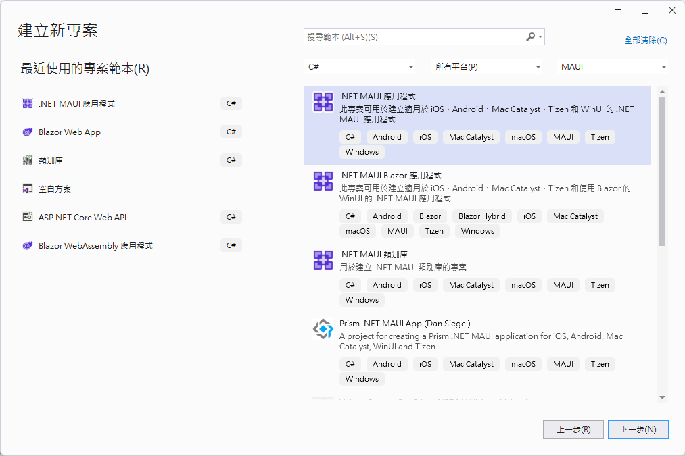

    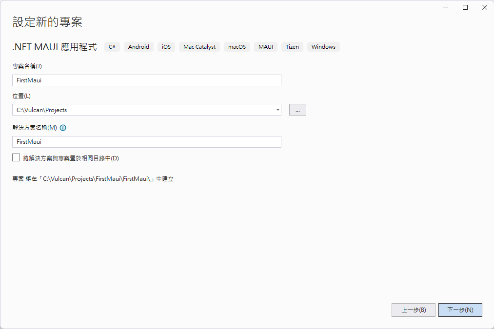

* 若要使用 .NET CLI 來建立專案
  * 請在命令提示字元視窗下，輸入下列指令來建立專案

```
dotnet new maui -o FirstMaui
```

不論是透過 GUI 或者 CLI 的方式來建立起來的專案，這些預設範本並不會包含 MVVM 的相關套件與相關的資料夾等等，因此當每次要建立一個 .NET MAUI 專案之後，就需要開始進行一下重複性的工作，現在，可以透過 [Vulcan.Maui.Template](https://www.nuget.org/packages/Vulcan.Maui.Template) 這個客製化的專案範本來建立 .NET MAUI 專案，這樣就可以省去後續繁複的開發時間。

現在來檢視使用預設 .NET MAUI 專案範本所建立起來的專案樣貌

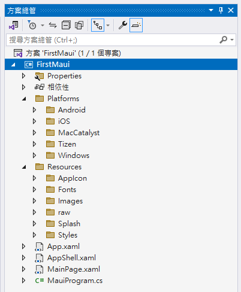

這裡將會使用 Visual Studio 2022 來開啟剛剛建立的專案，從方案總管中可以看到，這裡僅有兩個預設的 [Platforms] 與 [Resources] 資料夾，這兩個資料夾是 .NET MAUI 專案的必要資料夾。

對於 .NET MAUI 的程式進入點程式碼，將會用到 [MauiProgram.cs] / [App.xaml] / [AppShell.xaml] / [MainPage.xaml] 這四個檔案，這些檔案都是預設的範本檔案，這裡僅列出 [MauiProgram.cs] 的程式碼，如下所示

```csharp
using Microsoft.Extensions.Logging;

namespace FirstMaui
{
    public static class MauiProgram
    {
        public static MauiApp CreateMauiApp()
        {
            var builder = MauiApp.CreateBuilder();
            builder
                .UseMauiApp<App>()
                .ConfigureFonts(fonts =>
                {
                    fonts.AddFont("OpenSans-Regular.ttf", "OpenSansRegular");
                    fonts.AddFont("OpenSans-Semibold.ttf", "OpenSansSemibold");
                });

#if DEBUG
    		builder.Logging.AddDebug();
#endif

            return builder.Build();
        }
    }
}
```

## 安裝 Vulcan.Maui.Template 專案範本

* 首先，需要開啟命令提示字元視窗
* 接著輸入下列指令來查詢目前已經安裝的專案範本

```
dotnet new list
```

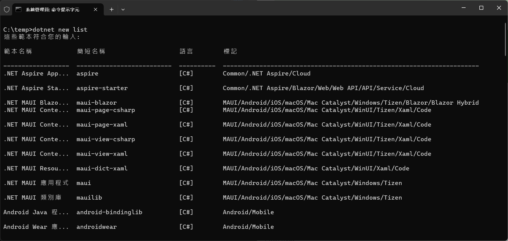

* 若發現到已經有安裝 [Vulcan.Maui.Template] 專案範本，可以著輸入下列指令來移除 Vulcan.Maui.Template 專案範本

```
dotnet new uninstall Vulcan.Maui.Template
```

* 接著輸入下列指令來安裝 [Vulcan.Maui.Template](https://www.nuget.org/packages/Vulcan.Maui.Template) 專案範本到這台開發機上

```
dotnet new install Vulcan.Maui.Template
```

底下是安裝完成的畫面

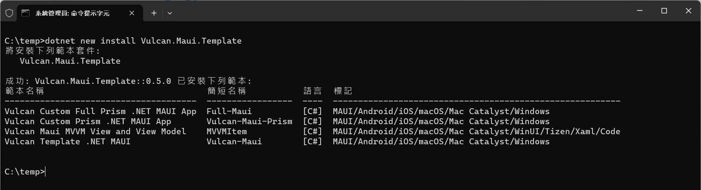

## 開始使用 Vulcan.Maui.Template 專案範本

* 想要使用 [Vulcan.Maui.Template] 專案範本來建立 .NET MAUI 專案，可以透過 CLI 操作方式，輸入下列指令來建立專案

```
c:
cd c:\temp
dotnet new Vulcan-Maui -o c:\Temp\MA12
```

* 底下為操作過程的畫面

  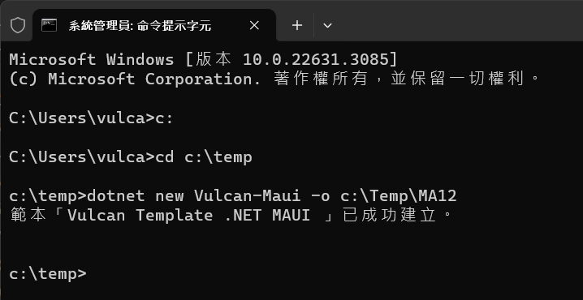

* 對於使用 CLI 方式建立的專案，其檔案結構與內容如下所示

  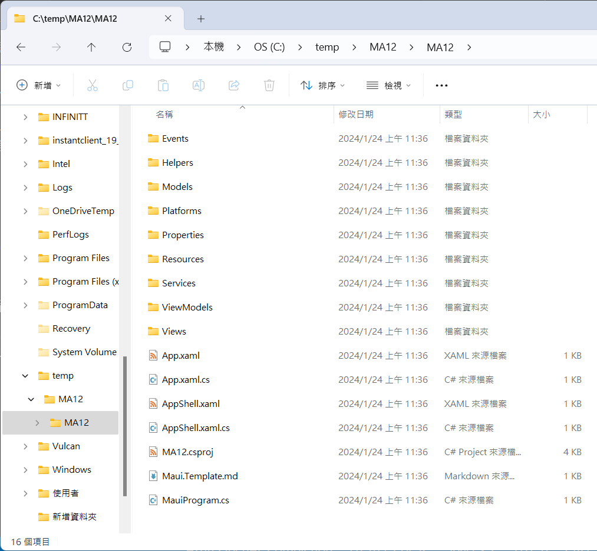

* 若想要使用 GUI 方式來建立專案，可以開啟 Visual Studio 2022 應用程式
* 在 Visual Studio 2022 對話視窗中，點選右下角的 **建立新的專案**
* 當出現 [建立新的專案] 對話視窗
* 在該對話窗中間上方的 [所有語言 (L)] 下拉式選單中，選擇 **C#**
* 在對話窗最上方的右側的 [所有專案類型 (T)] 下拉式選單中，選擇 **MAUI**
* 現在可以在這個對話窗中，看到 [Vulcan Template .NET MAUI (Vulcan)] 的範本，對於該範本的描述為：此專案可用於建立適用於 iOS、Android、Mac Catalyst、Tizen和 Win UI 的 .NET MAUI 應用程式，如下圖所示

   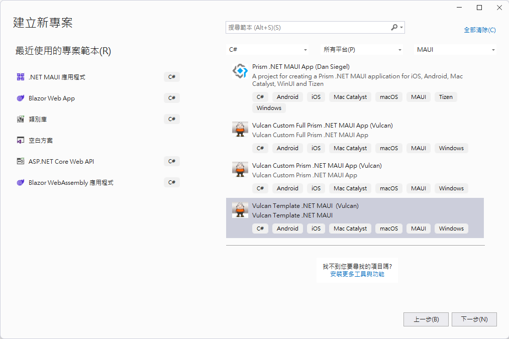
* 點選 [Vulcan Template .NET MAUI (Vulcan)] 的範本，接著點選 [下一步(N)] 按鈕
* 現在將會看到 [設定新的專案] 對話視窗
* 在 [專案名稱] 文字方塊中，輸入 **MA12**
* 點選螢幕右下方的 [建立] 按鈕
  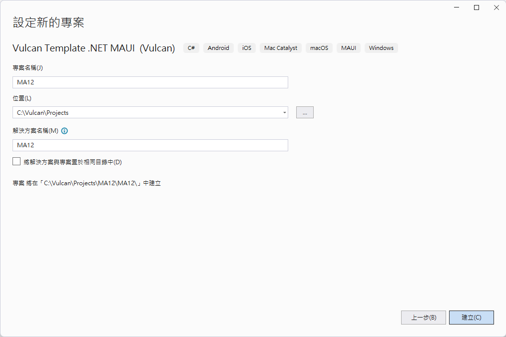
* 稍微等候一下，專案就會建立完成

## 檢視 Vulcan.Maui.Template 專案範本

現在使用 Visual Studio 2022 來打開剛剛建立的專案，從方案總管中可以看到，這裡有許多的資料夾，這些資料夾都是 .NET MAUI 專案的必要資料夾，這些資料夾的用途如下所示

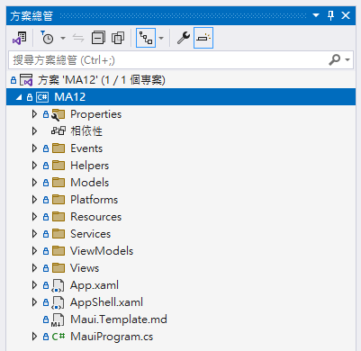

* [Views] 資料夾：用來放置所有的頁面，每一個頁面都是一個 .xaml 檔案，例如：[MainPage.xaml] / [AboutPage.xaml] / [SettingsPage.xaml] 等等
* [ViewModels] 資料夾：用來放置所有的 ViewModel，每一個 ViewModel 都是一個 .cs 檔案，例如：[MainPageViewModel.cs] / [AboutPageViewModel.cs] / [SettingsPageViewModel.cs] 等等
* [Services] 資料夾：用來放置所有的服務類別，每一個服務類別都是一個 .cs 檔案，例如：[IAppInfoService.cs] / [AppInfoService.cs] 等等
* [Models] 資料夾：用來放置所有的資料模型類別，每一個資料模型類別都是一個 .cs 檔案，例如：[MessageModel.cs] / [ProductModel.cs] 等等
* [Helpers] 資料夾：用來放置所有的輔助類別，每一個輔助類別都是一個 .cs 檔案，例如：[MagicValueHelper.cs] / [ApiHelper.cs] 等等
* [Events] 資料夾：用來放置所有的事件類別，每一個事件類別都是一個 .cs 檔案，例如：[MyValueChangedMessage.cs] 等等

使用滑鼠雙擊這個 .NET MAUI 專案節點，就可以看到專案的內容，如下圖所示

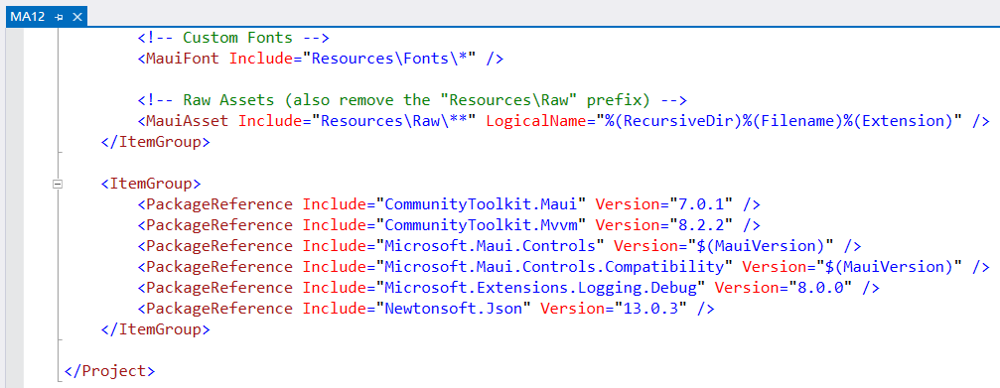

這表示了這個專案除了原先 .NET MAUI 專案範本會用到的專案之外，還多了一些額外的套件，這些額外的套件都是為了讓開發者可以更快速的進行開發，這些額外的套件如下所示

* [CommunityToolkit.Mvvm] 套件：這是一個社群開發的 MVVM 套件，透過原始碼產生器來生成在 MVVM 設計模式下會用到的額外程式碼，如此，讓整體 ViewModel 的原始碼看起來更加簡潔，並且可以讓開發者專注在 ViewModel 的商業邏輯上，而不是在繁瑣的程式碼上；另外一個好處將會是，可以大幅提升整體開發的速度與品質。
* [CommunityToolkit.Maui] 套件：這是一個社群開發的 .NET MAUI 套件，這個套件提供了許多 .NET MAUI 專案開發時會用到的額外功能，這些功能都是在 .NET MAUI 專案開發時會用到的功能，透過這個套件，可以讓開發者更加快速的進行開發。
* [Newtonsoft.Json] 套件：這是一個 JSON 處理的套件，這個套件可以讓開發者更加快速的進行 JSON 資料的序列化與反序列化，這個套件在 .NET MAUI 專案開發時會用到的功能。

## MVVM 設計慣例與新增新的 View / ViewModel

在 .NET MAUI 專案開發時，通常會使用 MVVM 設計模式來進行開發，這裡將會介紹一下 MVVM 設計模式的慣例，以及如何新增新的 View / ViewModel。

在這個專案內，已經預設建立兩個資料夾，分別是 [Views] 與 [ViewModels] 資料夾，任何頁面的 .xaml 檔案都需要放置在 [Views] 資料夾內，而任何 ViewModel 的 .cs 檔案都需要放置在 [ViewModels] 資料夾內，這是一個 MVVM 設計模式的慣例。

另外，預設 .NET MAUI 專案範本所建立專案的 [MainPage.xaml] 這個頁面，將會搬移到 [Views] 資料夾，當然，在這裡將也會建立該頁面會用到的 ViewModel，也就是這個  [MainPageViewModel.cs] 檔案，這個檔案將會存在於 [ViewModels] 資料夾內。

這裡還有兩個要符合 MVVM 設計模式所做的調整，那就是在頁面的 Code Behind 後置碼建構式內，自動注入 ViewModel 物件到頁面內，並且將這個 ViewModel 物件到這個頁面的 [BindingContext] 物件內。另外，還有修正 [MauiProgram.cs] 這個檔案，在這裡需要加入 View 與 ViewModel 的對應關係，也就是要將 View 與 ViewModel 註冊到 DI 容器內。

通常來說，會使用底下這種方式來進行調整

```csharp
builder.Services.AddTransient<MainPage>();
builder.Services.AddTransient<MainPageViewModel>();
```

不過，在這個專案範本中，已經有安裝了 [CommunityToolkit.Maui] 套件，這個套件提供了一個 [AddTransientWithShellRoute] 擴充方法，可以使用單一表示式來進行 View & ViewModel 對於 DI 容器的註冊與也會對 Shell 的 Route 進行註冊，這樣就可以省去一些重複性的工作。因此，在這個專案範本中，將不會使用上述的兩個敘述來進行註冊，而是使用底下的程式碼來進行註冊。

```csharp
builder.Services.AddTransientWithShellRoute<MainPage, MainPageViewModel>(MagicValueHelper.MainPage);
```

在 [MainPageViewModel] 類別中，將會使用 [ObservableObject] 類別來實作 INotifyPropertyChanged 介面，這個類別是 [CommunityToolkit.Mvvm] 套件所提供的類別，這個類別可以讓開發者更加快速的進行開發。

由於在 .NET MAUI 專案中選擇與採用了 MVVM 設計模式，所以，當有需要增加一個新的頁面，就需要在這個專案的 [Views] 資料夾內新增一個 [頁面名稱Page.xaml] 檔案，並且也需要在 [ViewModels] 資料夾內新增一個 [頁面名稱PageViewModel.cs] 檔案，這兩個檔案的頁面名稱必須要相同，只有副檔名不同，這是一個 MVVM 設計模式的慣例。

如同上面的說明對於新建立的 View 的頁面 .xaml 檔案，需要在其後置碼 Code Behind 中，使用建構式注入方式，注入該新頁面會用到的 ViewModel 物件，並且指派給這個新頁面內的 [BindingContext] 屬性；對於 ViewModel 的類別 .cs 檔案，需要讓這個類別繼承 [ObservableObject] 類別，並且在該類別使用 [partial] 修飾詞。

對於這樣繁瑣冗長程序，在這個專案範本中，將會提供另外一個命令來解決此一問題，這個命令將會使用 [dotnet new] 來進行執行，這個命令的格式如下所示

```
dotnet new MVVMItem --namespace MA12 --view-name MyFirst
```

其中，對於 `--namespace` 需要傳入這個專案的組件的主要命名空間，在這裡的範例，將會為 `MA12`

另外，對於 `--view-name` 需要指定這次新頁面的名稱，不過，在這裡並不需要附加 [Page] 文字到所傳入的引數後，這個命令會依據 MVVM 設計慣例準則，自動加入 [Page] 這個文字

操作過如說明如下：

* 滑鼠右擊專案節點
* 從彈出功能表中選擇最下方的 [在終端機開啟] 功能表選項
* 將這個命令 `dotnet new MVVMItem --namespace MA12 --view-name MyFirst` 輸入到終端機視窗內，在 Visual Studio 內看到的視窗名稱為 [開發人員 PowerShell]，並且執行該命令

  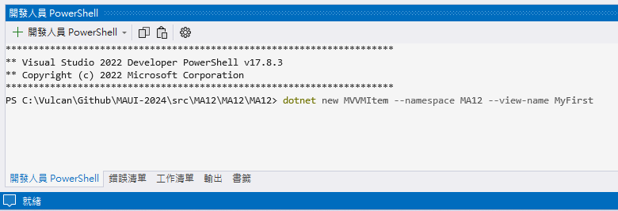
* 一旦執行完成之後，將會出現 `範本「Vulcan Maui MVVM View and View Model」已成功建立。` 訊息，表示已經成功在 [Views] 與 [ViewModels] 資料夾內建立好了頁面 XAML 檔案與頁面 ViewModel 的類別檔案。

  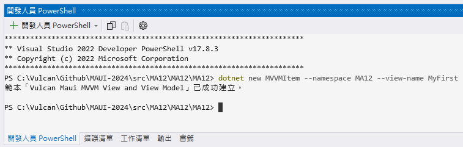
* 現在可以觀察這個專案的 [Views] 與 [ViewModels] 資料夾內，已經有了新建立的頁面 XAML 檔案與頁面 ViewModel 的類別檔案，如下圖所示

  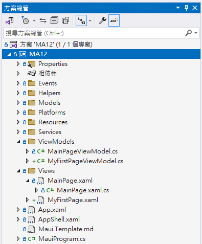

* [MyFirstPage.xaml] 檔案內容

```xml
<?xml version="1.0" encoding="utf-8" ?>
<ContentPage xmlns="http://schemas.microsoft.com/dotnet/2021/maui"
             xmlns:x="http://schemas.microsoft.com/winfx/2009/xaml"
             xmlns:viewModels="clr-namespace:MA12.ViewModels"
             xmlns:helpers="clr-namespace:MauiApp1.Helpers"
             Title="Page Title"
             x:Class="MA12.Views.MyFirstPage"
             x:DataType="viewModels:MyFirstPageViewModel">

  <Grid>
  </Grid>

</ContentPage>
```

* [MyFirstPage.xaml.cs] 檔案內容

```csharp
using MA12.ViewModels;

namespace MA12.Views;

public partial class MyFirstPage : ContentPage
{
    public MyFirstPage(MyFirstPageViewModel viewModel)
    {
        InitializeComponent();
        BindingContext = viewModel;
    }
}
```

* [MyFirstPageViewModel.cs] 檔案內容

```csharp
using CommunityToolkit.Mvvm.ComponentModel;
using CommunityToolkit.Mvvm.Input;

namespace MA12.ViewModels;

public partial class MyFirstPageViewModel : ObservableObject
{
    #region Field Member
    #endregion

    #region Property Member
    #endregion

    #region Constructor
    public MyFirstPageViewModel()
    {
    }
    #endregion

    #region Method Member
    #region Command Method
    #endregion

    #region Navigation Event
    #endregion

    #region Other Method
    #endregion
    #endregion
}
```

* 註冊剛剛建立的頁面與 ViewModel 到 DI 容器內
  * 在專案根目錄找到並且打開 [MauiProgram.cs] 檔案
  * 加入這行敘述 `builder.Services.AddTransientWithShellRoute<MyFirstPage, MyFirstPageViewModel>(nameof(MyFirstPage));`
  * 不過，對於這個方法要傳入的引數，建議使用 [MagicValueHelper] 類別內的靜態欄位來進行傳入，這樣可以避免打錯字的問題，例如：`builder.Services.AddTransientWithShellRoute<MyFirstPage, MyFirstPageViewModel>(MagicValueHelper.MyFirstPage);`
* 底下將會是 [MagicValueHelper] 修正後的內容
```csharp
namespace MA12.Helpers;

public class MagicValueHelper
{
    public const string FontName = "materialdesignicons";
    public const string MainPage = nameof(MainPage);
    public const string MyFirstPage = nameof(MyFirstPage);
}
```

## 其他補充說明

在使用這個專案範本所建立的專案中，對於 [Services] 資料夾將會用於設計該專案會用到的不同服務用途，在這裡將有提供一個服務的類別，其名稱為 [CounterService]，這個 [CounterService] 服務類別將會在 [MauiProgram] 類別中註冊到 DI 容器內，因此，在這個專案的任何 ViewModel 內，都可以使用建構式注入的方式來進行注入 [CounterService] 這個服務物件。

```csharp
namespace MA12.Services;

public class CounterService
{
    public string Get(int id) => $"訊息內容 : {id}";
}
```

對於 [Models] 資料夾，將是 MVVM Model-View-ViewModel 設計模式的資料模型資料夾，相關資料模型定義的類別，都將會儲存在這個資料夾內，在這專案範本所建立的專案中，將會有個 [MyMessage] 資料模型類別儲存在 [Models] 資料夾內，這個類別將會用於接下來的訊息傳遞(或稱之為事件聚合器設計模式)之用。

```csharp
namespace MA12.Models;

public class MyMessage
{
    public int Counter { get; set; }
}
```

在 [Events] 資料夾內，將會有一個 [MyValueChangedMessage] 類別，這個類別將會用於接下來的訊息傳遞(或稱之為事件聚合器設計模式)之用。這是一個具有鬆散耦合的訊息傳遞設計模式，是由 [CommunityToolkit.Mvvm] 套件所提供，在這個專案範本中將會展示出這個設計用法；在進行 .NET MAUI App 開發過程中，這是一項很重要的技術，因為可以提供不同頁面間的 ViewModel 可以進行訊息或者資料交換之用。

```csharp
using CommunityToolkit.Mvvm.Messaging.Messages;
using MA12.Models;

namespace MA12.Events;

public class MyValueChangedMessage : ValueChangedMessage<MyMessage>
{
    public MyValueChangedMessage(MyMessage myMessage) : base(myMessage)
    {
    }
}
```

在 MainPageViewModel 將會展示出訂閱與發佈訊息的做法。

在建構式內，使用底下程式碼來訂閱 [MyValueChangedMessage] 這個事件，一旦有其他程式碼發布 Publish 這個 [MyValueChangedMessage] 訊息，這裡所訂閱的委派方法，將會被觸發執行。

```csharp
WeakReferenceMessenger.Default
    .Register<MyValueChangedMessage>(this, (r, m) =>
{

    MessagerText = counterService.Get(m.Value.Counter);
});
```

而在同樣的類別內，對於可用於命令綁定的 [CounterClicked] 方法內，將會使用底下用法，送出這樣的訊息出去

```csharp
WeakReferenceMessenger.Default
    .Send(new MyValueChangedMessage(new Models.MyMessage()
    {
        Counter = Count
    }));
```

最後在這個專案內，將會有內建一個 [Google Material Design Icon] 字體檔案 (materialdesignicons-webfont.ttf)，可以用於顯示出向量品質的圖示在螢幕上，這將會透過 [MauiProgram.cs] 檔案內的 `fonts.AddFont("materialdesignicons-webfont.ttf", MagicValueHelper.FontName);` 敘述來加入到 .NET MAUI 專案內。

因此在 [Helpers] 資料夾內，會有一個 [IconFont] 類別，將這些圖示的對應代碼，可以使用文字符號來定義，讓整體程式碼更具有可閱讀性。例如，若想要顯示 [帳號] 這樣的符號，可以直接使用 [IconFont.Account]，其定義如下

```csharp
public const string Account = "\U000f0004";
```

更多的可用圖示與對應名稱，可以透過 [Webfont - Material Design Icons](https://pictogrammers.com/library/mdi/) 網頁來來查看到

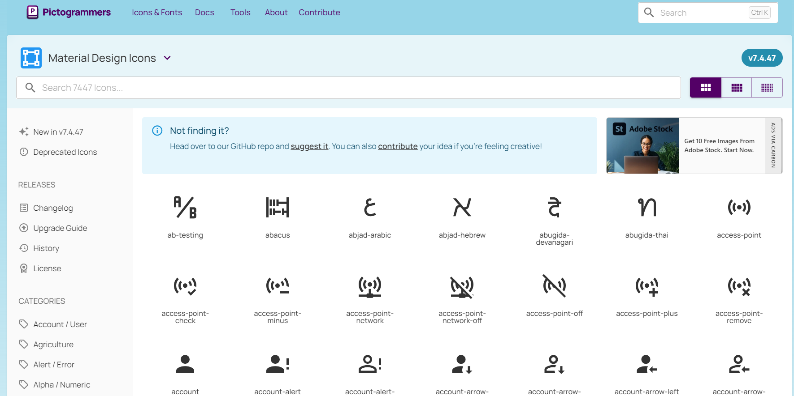

