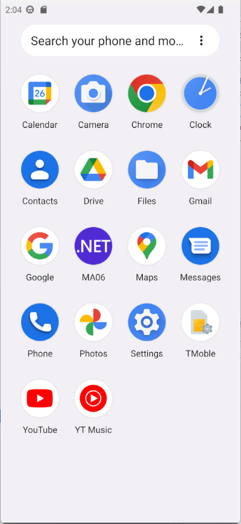
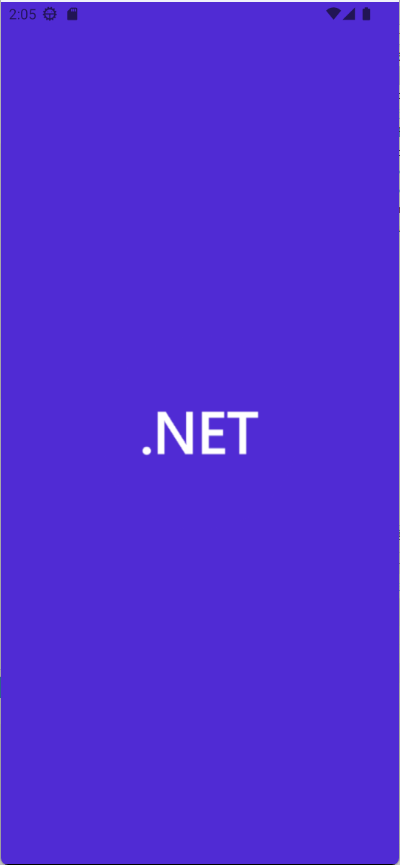
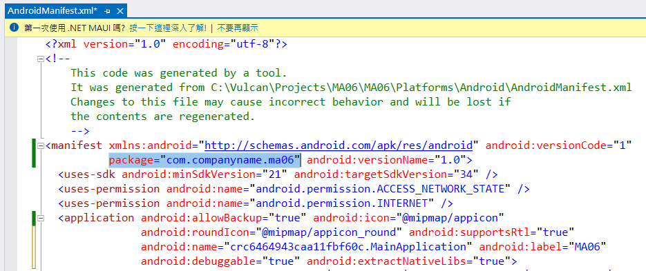
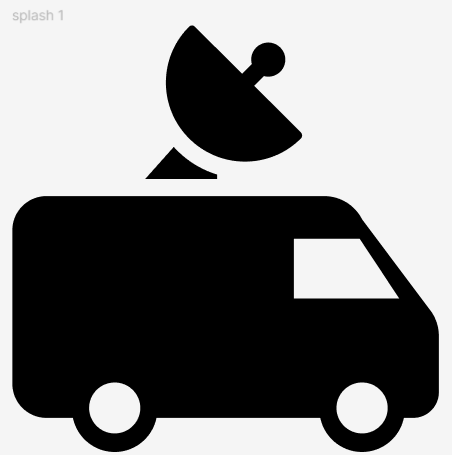
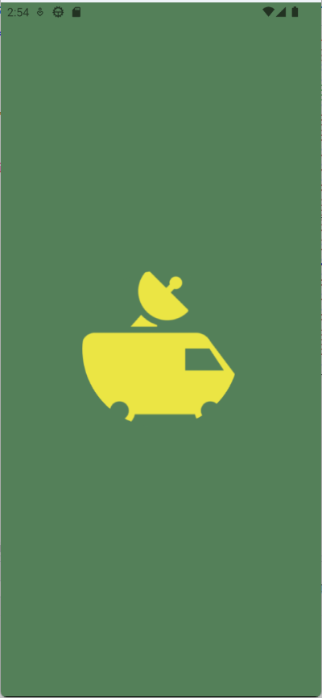
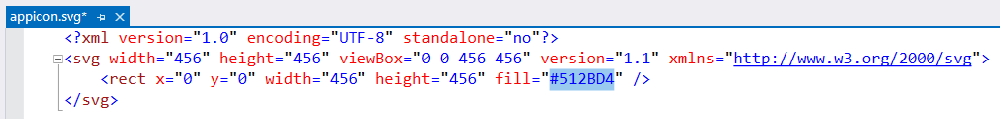
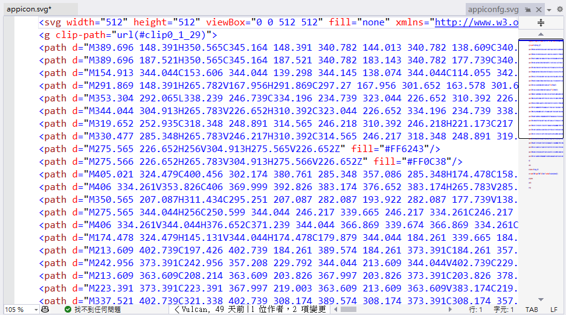
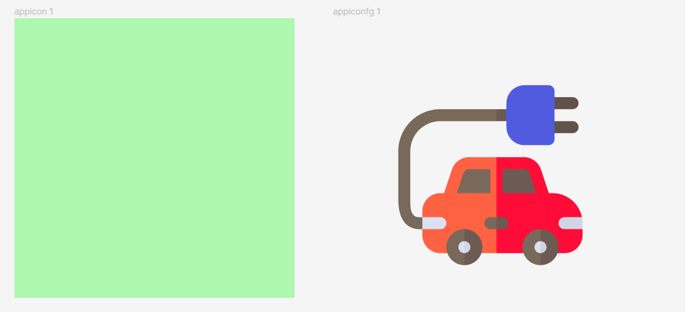
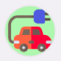
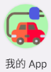

# .NET 8 MAUI 修正 SplashScreen 啟動顯示畫面 與 Icon 圖示 和應用程式名稱


當在進行 Android 和 iOS App 開發的時候，若採用的是 .NET MAUI 開發框架來進行開發，在建置完成並且執行後，在手機端將會看到的第一個畫面將會是 Splash screen ，這是應用程式啟動時顯示的第一個畫面，主要用途如下：

* **提供視覺上的吸引力**：Splash screen 可以使用圖片、動畫或文字等方式，來吸引使用者的注意力，並留下良好的第一印象。
* **隱藏應用程式啟動過程**：應用程式啟動時，需要完成許多初始化工作，例如載入資源、初始化元件等。Splash screen 可以顯示在這些工作完成之前，讓使用者在等待時不會感到無聊。
* **傳達應用程式資訊**：Splash screen 可以用來顯示應用程式的名稱、標誌或其他資訊，讓使用者快速了解應用程式的內容。

在 Android 中，Splash screen 可以使用 `AndroidManifest.xml` 檔案中的 `android:splashScreen` 屬性來指定。在 iOS 中，Splash screen 可以使用 `Info.plist` 檔案中的 `UILaunchStoryboardName` 屬性來指定。

不過，當在 .NET MAUI 中進行開發時，Splash screen 的設定方式與上述的方式有所不同，因為這些複雜與繁瑣的設定程序，都已經大幅度的簡化了，本文將會說明如何在 .NET MAUI 中設定 Splash screen。

不過，當在進行 Splash screen 需求設計的時候，需要特別關注一些事項，以下是一些 Splash screen 的設計注意事項：

* **Splash screen 的顯示時間不宜過長**：Splash screen 的顯示時間過長，會讓使用者感到不耐煩。一般來說，Splash screen 的顯示時間應在 2 到 5 秒之間。
* **Splash screen 的圖片或動畫應與應用程式本身相符**：Splash screen 應與應用程式的風格相一致，以營造一致的使用者體驗。
* **Splash screen 應使用高效能的圖片格式**：Splash screen 使用的圖片格式應盡量小巧，以節省記憶體和電量。

以下是一些 Splash screen 的設計範例：

* **使用圖片**：圖片是 Splash screen 最常見的設計方式。圖片可以使用應用程式的標誌、主題圖片或其他相關圖片。
* **使用動畫**：動畫可以讓 Splash screen 更加生動有趣。動畫可以使用靜態圖片或影片來製作。
* **使用文字**：文字可以用來傳達應用程式的資訊，例如名稱、標誌或版本號碼。

在實際應用中，Splash screen 的設計可以根據應用程式的具體需求來定制。

還有另外兩個議題，那就是應用程式的名稱和 Icon 圖示，因為當一個 App 佈署到手機上時，手機上的應用程式列表中，會顯示應用程式的名稱和 Icon 圖示，如何在 .NET MAUI 中設定應用程式的名稱和 Icon 圖示，也是一個需要關注的議題。

## 建立 .NET 8 MAUI 專案

* 打開 Visual Studio 2022 IDE 應用程式
* 從 [Visual Studio 2022] 對話窗中，點選右下方的 [建立新的專案] 按鈕
* 在 [建立新專案] 對話窗右半部
  * 切換 [所有語言 (L)] 下拉選單控制項為 [C#]
  * 切換 [所有專案類型 (T)] 下拉選單控制項為 [MAUI]
* 在中間的專案範本清單中，找到並且點選 [.NET MAUI 應用程式] 專案範本選項
  > 此專案可用於建立適用於 iOS、Android、Mac Catalyst、Tizen 和 WinUI 的 .NET MAUI 應用程式。
* 點選右下角的 [下一步] 按鈕
* 在 [設定新的專案] 對話窗
* 找到 [專案名稱] 欄位，輸入 `MA06` 作為專案名稱
* 在剛剛輸入的 [專案名稱] 欄位下方，確認沒有勾選 [將解決方案與專案至於相同目錄中] 這個檢查盒控制項
* 點選右下角的 [下一步] 按鈕
* 現在將會看到 [其他資訊] 對話窗
* 在 [架構] 欄位中，請選擇最新的開發框架，這裡選擇的 [架構] 是 : `.NET 8.0 (長期支援)`
* 請點選右下角的 [建立] 按鈕

稍微等候一下，這個主控台專案將會建立完成

## 安裝要用到的 NuGet 開發套件

因為開發此專案時會用到這些 NuGet 套件，請依照底下說明，將需要用到的 NuGet 套件安裝起來。

### 安裝 CommunityToolkit.Mvvm 套件

CommunityToolkit.Mvvm 是微軟官方提供的 MVVM 套件，提供了一些 MVVM 開發常用的功能，例如：ObservableObject、ObservableProperty、RelayCommand 等等，這些功能在 WPF、UWP、Xamarin.Forms 都可以使用，而且在 .NET 8 MAUI 也可以使用。

請依照底下說明操作步驟，將這個套件安裝到專案內

* 滑鼠右擊 [方案總管] 視窗內的 [專案節點] 下方的 [相依性] 節點
* 從彈出功能表清單中，點選 [管理 NuGet 套件] 這個功能選項清單
* 此時，將會看到 [NuGet: MA06] 視窗
* 切換此視窗的標籤頁次到名稱為 [瀏覽] 這個標籤頁次
* 在左上方找到一個搜尋文字輸入盒，在此輸入 `CommunityToolkit.Mvvm`
* 稍待一會，將會在下方看到這個套件被搜尋出來
* 點選 [CommunityToolkit.Mvvm] 套件名稱
* 在視窗右方，將會看到該套件詳細說明的內容，其中，右上方有的 [安裝] 按鈕
* 點選這個 [安裝] 按鈕，將這個套件安裝到專案內

## .NET MAUI 應用程式預設的 Splash screen、Icon 圖示和應用程式名稱

請切換到 Android 平台下來進行執行此專案，執行後，將會看到預設的 Splash screen、Icon 圖示和應用程式名稱



一旦應用程式佈署到手機上，手機上的應用程式列表中，將會顯示應用程式的名稱和 Icon 圖示，在這裡將會看到有個藍紫色的圖示，在該圖示上有個 `.NET` 白色字體文字，而應用程式的名稱，則是預設為該專案名稱，也就是 `MA06` 這個名稱。



而當應用程式啟動時，將會看到預設的 Splash screen，這個 Splash screen 會顯示一個藍紫色的圖示，並且在該圖示上有個 `.NET` 白色字體文字。

另外一個在開發新的 .NET MAUI 專案時，會遇到的問題，就是該開發專案的 套件名稱(在 Android 平台下的稱呼)或應用程式識別碼(在 iOS 平台下的稱呼)要如何修改。

對於 Android 的套件名稱和 iOS 的應用程式識別碼都是用來唯一識別一個應用程式。它們在應用程式開發和部署過程中都起著重要作用。

在 Android 中，套件名稱是一個字串，由字母、數字和連字符組成。它必須是唯一的，不能與其他應用程式的套件名稱重複。套件名稱主要用於以下目的：

* 在 Android 應用程式商店中識別應用程式。
* 在 Android 系統中安裝和卸載應用程式。
* 在 Android 應用程式之間進行通信。

在 iOS 中，應用程式識別碼是一個字串，由字母、數字和連字符組成。它必須是唯一的，不能與其他應用程式的應用程式識別碼重複。應用程式識別碼主要用於以下目的：

* 在 App Store 中識別應用程式。
* 在 iOS 系統中安裝和卸載應用程式。
* 在 iOS 應用程式之間進行通信。

以下是一些套件名稱或應用程式識別碼的具體用途：

* 在應用程式商店中，套件名稱或應用程式識別碼用來顯示應用程式的名稱和圖示。
* 在應用程式安裝時，套件名稱或應用程式識別碼用來識別應用程式並將其安裝到正確的位置。
* 在應用程式卸載時，套件名稱或應用程式識別碼用來識別應用程式並將其卸載。
* 在應用程式之間進行通信時，套件名稱或應用程式識別碼用來識別應用程式並建立安全的連接。

在實際應用中，套件名稱或應用程式識別碼應盡量簡潔明瞭，並能與應用程式的名稱或主題相符。

.NET MAUI 開發框架也把這些複雜與繁瑣的設定程序，都已經大幅度的簡化了，若要查看 Android 平台下的套件名稱設定是甚麼內容，首先需要先建置這個 .NET MAUI 專案，使用檔案總管來開啟該路徑 [專案名稱\obj\Debug\net8.0-android]，一旦切換到這個目錄下，將會看到有個 [AndroidManifest.xml] 檔案，請使用文字編輯器來開啟並檢視這個檔案內容，如下圖所示：



在最上方的 [manifest] 標籤內，將會看到有個 [package] 屬性，這個屬性值就是 Android 平台下的套件名稱，在這裡的範例中，將會是 [com.companyname.ma06] ；這個套件名稱是由 Visual Studio 2022 IDE 自動產生的，而且這個套件名稱是唯一的，不會與其他應用程式的套件名稱重複。

## .NET MAUI 應用程式的 Splash screen

對於 .NET MAUI 的 Splash screen ，將會是透過一個 SVG 檔案來設計，而這個 SVG 檔案將會是一個可以顯示出 NET 白色文字的向量圖片檔案。

在方案總管中，展開資料夾 [MA06] > [Resources] > [Splash]

點選這個 [splash.svg] 檔案

為了要簡化練習，因此，可以從網路上隨機找一個 SVG 檔案。

由於 SVG 檔案的內容就是一群 XML 文字內容，因此使用文字編輯器打開剛剛下載的 SVG 檔案，並且將這個 SVG 檔案的內容複製到剪貼簿中，接著，將會回到 Visual Studio 2022 IDE 應用程式中，找到 [Splash] 資料夾，並且點選 [splash.svg] 這個 SVG 檔案，接著，把剪貼簿的全部內容替換掉這個 SVG 檔案的內容。

現在可以來使用 Figma 工具，檢視與預覽這個 SVG 檔案，下圖將會是透過 Figma 看到的預覽畫面：



現在要來調整當 .NET MAUI App 啟動之後，要顯示的 Splash screen ，在這裡將會需要將背景顏色做些調整成為墨綠色，接著，將 Splash screen 上的圖示換成為一個圖片，並且希望能夠指定這台汽車的顏色。

為了要完成這樣的需求，可以透過底下的步驟來進行修正

使用滑鼠雙擊這個專案節點，將會看到 [MA06.csproj] 這個設定檔案出現在螢幕上，對於這個檔案，也是一個 XML 檔案內容

找到 [MauiSplashScreen] 這個標籤，其內容預設如下：

```xml
<MauiSplashScreen Include="Resources\Splash\splash.svg" Color="#512BD4" BaseSize="128,128" />
```

將這個標籤修正成為底下內容

```xml
<MauiSplashScreen Include="Resources\Splash\splash.svg" TintColor="#ebe544" Color="#548059" BaseSize="128,128" />
```

這裡將會宣告這個 .NET MAUI 的 Splash screen 的圖片顏色將會修正成為 [TintColor] 這裡所指定的色碼，也就是 黃色，這代表了將會顯示一部黃色車子出現在 Splash screen 上，而對於 [Color] 這個屬性，將會宣告這個 Splash screen 的背景顏色為 墨綠色。

底下將會是執行這個 .NET MAUI App 的 Splash screen 的畫面



## .NET MAUI 應用程式的 Icon 圖示

在 .NET MAUI 框架中，對於 App Icon 將會使用兩個 SVG 檔案來設計，對於 [appicon.svg] 這個 SVG 檔案，本身就是一個矩形區塊，其中這個矩形將會具有藍紫色，也就是說，整個 App Icon 將會形成為藍紫色底色畫面；另外一個 SVG 檔案則為 [appiconfg.svg] ，對於這個 SVG 檔案將會是顯示在 App Icon 中間區域的圖片，在 .NET MAUI 框架下所建立的專案，這個 SVG 檔案將會是一個可以顯示出 NET 白色文字的向量圖片檔案。

底下將會是一個 .NET MAUI 應用程式的 App Icon 範例，這個 App Icon 將會是一個藍紫色底色畫面，並且在中間區域顯示出 NET 白色文字，如下圖所示：


首先來了解如何修正 .NET MAUI 應用程式的 App Icon ，在這裡將會需要將背景顏色做些調整成為淡綠色，接著，將 App Icon 上的 NET 字樣移除，最後，將 Splash screen 上的圖示換成為一個圖片。

在方案總管中，展開資料夾 [MA06] > [Resources] > [AppIcon]

在 [AppIcon] 資料夾中，找到並且點選 [appicon.svg] 這個 SVG 檔案，接著，將會看到這個 SVG 檔案的內容，如下圖所示：



```xml
<?xml version="1.0" encoding="UTF-8" standalone="no"?>
<svg width="456" height="456" viewBox="0 0 456 456" version="1.1" xmlns="http://www.w3.org/2000/svg">
    <rect x="0" y="0" width="456" height="456" fill="#512BD4" />
</svg>
```

這個 SVG 檔案的內容是一個矩形，並且矩形的顏色是藍紫色，接著，將這個矩形的顏色改成為淡綠色，如下圖所示：

```xml
<?xml version="1.0" encoding="UTF-8" standalone="no"?>
<svg width="456" height="456" viewBox="0 0 456 456" version="1.1" xmlns="http://www.w3.org/2000/svg">
    <rect x="0" y="0" width="456" height="456" fill="#adf7ae" />
</svg>
```

在此將會找到 [fill] 這個屬性，將原先的 [#512BD4] 色碼，修改成為 [#adf7ae]，這樣就完成了 App Icon 的背景顏色修正工作

接下來，可以自行設計出要顯示在 App Icon 畫面上的圖形，不過，為了展示方便，將會從網路上隨機找到一個 SVG 圖片檔案，並且將這個新的 SVG 檔案內容 (對於 SVG 圖形檔案而言，該檔案的內容就是一群 XML 文字內容) 使用任何種類的文字編輯器打開，並且將這個 SVG 檔案的內容複製到剪貼簿中，接著，將會回到 Visual Studio 2022 IDE 應用程式中，找到 [AppIcon] 資料夾，並且點選 [appiconfg.svg] 這個 SVG 檔案，接著，將會看到這個 SVG 檔案的內容，如下圖所示：



現在可以來使用 Figma 工具，檢視與預覽這兩個 SVG 檔案，下圖將會是透過 Figma 看到的預覽畫面：



若實際執行這個專案，將會看到 App Icon 的畫面如下圖所示：



## .NET MAUI 應用程式的 應用程式名稱與套件名稱

之前有完成了這個 App Icon 圖片的修正，最後，要來修正 .NET MAUI App 的應用程式名稱的修正，這樣使用者便可以在行動裝置上看到這個 App 的實際名稱。

同樣的，使用滑鼠雙擊專案節點，也就是 [MA06] 這個節點

現在可以看到這個 .NET MAUI 專案的 XML 設定內容

找到 [ApplicationTitle] 這個標籤，其內容如下

```xml
<!-- Display name -->
<ApplicationTitle>MA06</ApplicationTitle>
```

將 [MA06] 這個文字，修改成為 [我的 App]，底下將會是完成的 XML 內容

```xml
<!-- Display name -->
<ApplicationTitle>我的 App</ApplicationTitle>
```

現在要來修正該應用程式的套件名稱，搜尋並且找到 [ApplicationId] 這個標籤，其內容如下

```xml
<!-- App Identifier -->
<ApplicationId>com.companyname.ma06</ApplicationId>
```

將 [com.companyname.ma06] 這個文字，修改成為 [com.vulcan.minicar]，底下將會是完成的 XML 內容

```xml
<!-- App Identifier -->
<ApplicationId>com.vulcan.minicar</ApplicationId>
```

完成後，可以重新建置並且執行這個專案，接著，將會看到行動裝置桌面上看到這個 .NET MAUI App 的應用程式名稱與套件名稱已經完成修正



