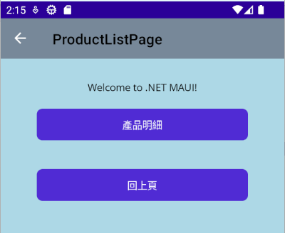

# .NET 8 MAUI 透過 Shell 路由來切換頁面


在 .NET 8 MAUI 應用程式內，可以透過 [.NET MAUI Shell 瀏覽](https://learn.microsoft.com/zh-tw/dotnet/maui/fundamentals/shell/navigation?view=net-maui-8.0&WT.mc_id=DT-MVP-5002220) 路由來切換頁面，這裡將會透過 Shell 路由來切換頁面，並且在每個頁面內，都會有一個按鈕，當按下這個按鈕之後，將會切換到另一個頁面，並且在這個頁面內，也會有一個按鈕，當按下這個按鈕之後，將會切換回到上一個頁面。

底下為這個練習中的頁面設計：

[HomePage] > [ProductListPage] > [ProductDetailPage]

當 .NET MAUI 應用程式啟動之後，將會看到 [HomePage] 的頁面，由於這是第一個最先出現的頁面，因此，這個頁面上僅會有一個按鈕，當按下這個按鈕之後，將會切換到另一個頁面。

在這裡為了要能夠區分不同頁面，因此，這裡將會使用不同的背景顏色來區分不同的頁面，並且在導航工具列頁面上，將會看到這個頁面的名稱。


第二個頁面將會是產品清單頁面 [ProductListPage]，在這個頁面上，將會有一個按鈕 [產品明細]，當按下這個按鈕之後，將會切換到第三個頁面，另外一個按鈕則是 [回上頁] ，按下這個按鈕之後，便會回到上一個頁面，也就是 [HomePage] 頁面。



第三個頁面將會是產品明細頁面 [ProductDetailPage]，在這個頁面上，將會有一個按鈕 [回上頁] ，按下這個按鈕之後，便會回到上一個頁面，也就是 [ProductListPage] 頁面。

由於在這個頁面之後，便不再有其他的頁面，因此，這個頁面上並沒有 [回上頁] 的按鈕，因此，在這裡將會提供一個 [回首頁] 的按鈕，一旦觸發這個按鈕之後，將會導致路由 [HomePage] 頁面。


這是一個非常典型的 App 操作流程，當使用者在 App 上進行操作的時候，將會透過 Shell 路由來切換頁面，並且在每個頁面內，都會有一個按鈕，當按下這個按鈕之後，將會切換到另一個頁面，並且在這個頁面內，也會有一個按鈕，當按下這個按鈕之後，將會切換回到上一個頁面。

## 建立 .NET 8 MAUI 專案

* 打開 Visual Studio 2022 IDE 應用程式
* 從 [Visual Studio 2022] 對話窗中，點選右下方的 [建立新的專案] 按鈕
* 在 [建立新專案] 對話窗右半部
  * 切換 [所有語言 (L)] 下拉選單控制項為 [C#]
  * 切換 [所有專案類型 (T)] 下拉選單控制項為 [MAUI]
* 在中間的專案範本清單中，找到並且點選 [.NET MAUI 應用程式] 專案範本選項
  > 此專案可用於建立適用於 iOS、Android、Mac Catalyst、Tizen 和 WinUI 的 .NET MAUI 應用程式。
* 點選右下角的 [下一步] 按鈕
* 在 [設定新的專案] 對話窗
* 找到 [專案名稱] 欄位，輸入 `MA03` 作為專案名稱
* 在剛剛輸入的 [專案名稱] 欄位下方，確認沒有勾選 [將解決方案與專案至於相同目錄中] 這個檢查盒控制項
* 點選右下角的 [下一步] 按鈕
* 現在將會看到 [其他資訊] 對話窗
* 在 [架構] 欄位中，請選擇最新的開發框架，這裡選擇的 [架構] 是 : `.NET 8.0 (長期支援)`
* 請點選右下角的 [建立] 按鈕

稍微等候一下，這個主控台專案將會建立完成

## 安裝要用到的 NuGet 開發套件

因為開發此專案時會用到這些 NuGet 套件，請依照底下說明，將需要用到的 NuGet 套件安裝起來。

### 安裝 CommunityToolkit.Mvvm 套件

CommunityToolkit.Mvvm 是微軟官方提供的 MVVM 套件，提供了一些 MVVM 開發常用的功能，例如：ObservableObject、ObservableProperty、RelayCommand 等等，這些功能在 WPF、UWP、Xamarin.Forms 都可以使用，而且在 .NET 8 MAUI 也可以使用。

請依照底下說明操作步驟，將這個套件安裝到專案內

* 滑鼠右擊 [方案總管] 視窗內的 [專案節點] 下方的 [相依性] 節點
* 從彈出功能表清單中，點選 [管理 NuGet 套件] 這個功能選項清單
* 此時，將會看到 [NuGet: MA10] 視窗
* 切換此視窗的標籤頁次到名稱為 [瀏覽] 這個標籤頁次
* 在左上方找到一個搜尋文字輸入盒，在此輸入 `CommunityToolkit.Mvvm`
* 稍待一會，將會在下方看到這個套件被搜尋出來
* 點選 [CommunityToolkit.Mvvm] 套件名稱
* 在視窗右方，將會看到該套件詳細說明的內容，其中，右上方有的 [安裝] 按鈕
* 點選這個 [安裝] 按鈕，將這個套件安裝到專案內

## MVVM 開發模式用到的資料夾

* 由於這個專案採用預設 .NET MAUI 專案範本所建立的專案，所以，專案內的資料夾結構，是採用預設的資料夾結構，為了要能夠讓專案內的資料夾結構，符合 MVVM 開發模式的資料夾結構，請依照底下的說明，將專案內的資料夾結構，修改成符合 MVVM 開發模式的資料夾結構。
* 滑鼠右擊專案節點，從彈出的功能表清單中，點選 [加入] > [新增資料夾] 選項
* 將剛剛建立的資料夾名稱，使用 [Views] 名稱來取代
* 滑鼠右擊專案節點，從彈出的功能表清單中，點選 [加入] > [新增資料夾] 選項
* 將剛剛建立的資料夾名稱，使用 [ViewModels] 名稱來取代
* [Models] 資料夾在這個練習中，並不需要，因此，不需要建立此資料夾

## 建立 HomePage ViewModel

* 在專案內找到 [ViewModels] 節點，滑鼠右擊此節點，從彈出的功能表清單中，點選 [加入] > [類別] 選項
* 在 [新增項目 - MA04] 對話窗中，點選對話窗左方的 [已安裝] > [.NET MAUI]
* 在對話窗的下方的名稱欄位，輸入 [HomePageViewModel.cs] 作為名稱
* 點選對話窗右下方的 [新增] 按鈕
* 現在將會看到 [HomePageViewModel.cs] 這個檔案，並且，這個檔案會被開啟在 Visual Studio 2022 的編輯器內
* 底下將會是這個檔案的內容

```csharp
using CommunityToolkit.Mvvm.ComponentModel;
using CommunityToolkit.Mvvm.Input;

namespace MA03.ViewModels;

public partial class HomePageViewModel : ObservableObject
{
    [RelayCommand]
    void GoToProductListPage()
    {
        Shell.Current.GoToAsync("ProductListPage");
    }
}
```

為了要實作出 MVVM 設計模式，這裡使用了 [CommunityToolkit.Mvvm](https://www.nuget.org/packages/Microsoft.Toolkit.Mvvm) 套件，這個套件提供了一些 MVVM 開發常用的功能，這些功能在 WPF、UWP、Xamarin.Forms 都可以使用，而且在 .NET 8 MAUI 也可以使用。

因此，對於 ViewModel 的類別，需要加入 [partial] 修飾詞 (詳情請參閱 [部分類別和方法](https://learn.microsoft.com/zh-tw/dotnet/csharp/programming-guide/classes-and-structs/partial-classes-and-methods?WT.mc_id=DT-MVP-5002220))，並且需要讓這個類別繼承自 [ObservableObject] 類別，這個類別是 [CommunityToolkit.Mvvm.ComponentModel] 命名空間內的類別，這個類別提供了一些 MVVM 開發常用的功能，例如：ObservableObject、ObservableProperty、RelayCommand 等等。

這個 ViewModel 將會是提供 [HomePage] View 來進行資料綁定的資料來源，並且在這個 ViewModel 內，提供了一個 [GoToProductListPage] 方法，這個方法將會在按下按鈕之後，導航到 [ProductListPage] 頁面，在此使用了 `Shell.Current.GoToAsync("ProductListPage")` 這個敘述來做到，對於這個 "ProductListPage" 路由名稱，將會於稍後進行定義 。

## 建立 HomePage View

* 在專案內找到 [Views] 節點，滑鼠右擊此節點，從彈出的功能表清單中，點選 [加入] > [新增項目] 選項
* 在 [新增項目 - MA04] 對話窗中，點選對話窗左方的 [已安裝] > [.NET MAUI]
* 在對話窗的中間，點選 [.NET MAUI ContentPage (XAML)] 節點
* 在對話窗的下方的名稱欄位，輸入 [HomePage.xaml] 作為名稱
* 點選對話窗右下方的 [新增] 按鈕
* 現在將會看到 [HomePage.xaml] 這個檔案，並且，這個檔案會被開啟在 Visual Studio 2022 的編輯器內
* 使用底下內容，替換掉這個檔案內的所有內容

```xml
<?xml version="1.0" encoding="utf-8" ?>
<ContentPage xmlns="http://schemas.microsoft.com/dotnet/2021/maui"
             xmlns:x="http://schemas.microsoft.com/winfx/2009/xaml"
             x:Class="MA03.Views.HomePage"
             xmlns:vm="clr-namespace:MA03.ViewModels"
             x:DataType="vm:HomePageViewModel"
             BackgroundColor="LightGray"
             Title="HomePage">

    <Grid>
        <VerticalStackLayout Padding="30">
            <Label 
            Text="Welcome to .NET MAUI!"
            VerticalOptions="Center" 
            HorizontalOptions="Center" />

            <Button Text="產品清單" Command="{Binding GoToProductListPageCommand}"
                    Margin="20"/>
        </VerticalStackLayout>
    </Grid>
</ContentPage>
```

在這個 [HomePage] 頁面的根結點，使用了 `Title="HomePage"` 標記表示了這個頁面的名稱，這裡的文字將會顯示在該頁面上方的導航工具列上，用於讓使用者知道這個頁面的用途；另外，這裡也使用了 `BackgroundColor="LightGray"` 標記來註明這個頁面的背景顏色為淡灰色，這裡使用這個標記的目的在於可以快速區分現在是在哪個頁面上。

另外，這裡使用 `xmlns:vm="clr-namespace:MA03.ViewModels"` 標記宣告一個命名空間，指向到 .NET CLR 中的 [MA03.ViewModels] 這個命名間，這裡的用法如同在 C# 程式語言中使用了 [using 指示詞](https://learn.microsoft.com/zh-tw/dotnet/csharp/language-reference/keywords/using-directive?WT.mc_id=DT-MVP-5002220)；接著，使用了 `x:DataType="vm:HomePageViewModel"` 這個標記來宣告 [編譯時期的資料綁定](https://learn.microsoft.com/zh-tw/dotnet/maui/fundamentals/data-binding/compiled-bindings?view=net-maui-8.0?WT.mc_id=DT-MVP-5002220)，如此，當在進行這個專案的開發時，將會在編譯時期，檢查這個頁面上的資料綁定是否正確，若沒有這樣的機制存在，一旦 App 啟動之後，在執行時期階段，若所指定的資料綁定屬性不存在，則會造成資料綁定失敗。當發生這樣現象之後，將不會造成 App 當掉，而是會造成螢幕上無法正常顯示或更新最新的資料，通常來說，發生這樣問題的時候，會造成除錯上的困擾與開發時程的延誤。

該頁面的 XAML 內容相當的簡單，就是有一個 [Label] 標籤和一個 [Button] 按鈕，在這個按鈕上的 [Command] 命令屬性將會使用了 [{Binding} 標記延伸](https://learn.microsoft.com/zh-tw/windows/uwp/xaml-platform/binding-markup-extension?WT.mc_id=DT-MVP-5002220)語法，`Command="{Binding GoToProductListPageCommand}"`，宣告當使用者按下這個命令之後，將會觸發 ViewModel 內的 [GoToProductListPageCommand] 命令物件 (其本身是個實作 [ICommand 介面](https://learn.microsoft.com/zh-tw/dotnet/api/system.windows.input.icommand?view=net-8.0&WT.mc_id=DT-MVP-5002220) )，也就是會要去執行 [GoToProductListPage] 這個方法

## 指定 HomePageViewModel 到 HomePage 的 BindingContext

* 在 [Views] 資料夾內
* 找到並且開啟 [HomePage.xaml.cs] 檔案節點
* 使用底下程式碼替換掉原有程式碼

```csharp
using MA03.ViewModels;

namespace MA03.Views;

public partial class HomePage : ContentPage
{
	public HomePage(HomePageViewModel viewModel)
	{
		InitializeComponent();
		BindingContext = viewModel;
	}
}
```

在這裡將會使用建構式注入方式，注入指定的 ViewModel 物件到 [viewModel] 這個參數內，並且指定這個參數到該頁面的 BindingContext 屬性上，這裡使用 `BindingContext = viewModel` 語法。

## 建立 ProductListPage ViewModel

* 在專案內找到 [ViewModels] 節點，滑鼠右擊此節點，從彈出的功能表清單中，點選 [加入] > [類別] 選項
* 在 [新增項目 - MA04] 對話窗中，點選對話窗左方的 [已安裝] > [.NET MAUI]
* 在對話窗的下方的名稱欄位，輸入 [ProductListPageViewModel.cs] 作為名稱
* 點選對話窗右下方的 [新增] 按鈕
* 現在將會看到 [ProductListPageViewModel.cs] 這個檔案，並且，這個檔案會被開啟在 Visual Studio 2022 的編輯器內
* 底下將會是這個檔案的內容

```csharp
using CommunityToolkit.Mvvm.ComponentModel;
using CommunityToolkit.Mvvm.Input;

namespace MA03.ViewModels;

public partial class ProductListPageViewModel :ObservableObject
{
    [RelayCommand]
    void GoToProductDetailPage()
    {
        Shell.Current.GoToAsync("ProductDetailPage");
    }

    [RelayCommand]
    void GoBack()
    {
        Shell.Current.GoToAsync("..");
    }
}
```

由於在這個 [ProductListPage] 頁面中將會設計兩個按鈕，一個會往前導航，回到 [HomePage] 頁面，一個會往後導航，切換到 [ProductDetialPage] 頁面，所以，這裡將會需要提供兩個方法。

對於 [GoBack()] 方法將會使用 `Shell.Current.GoToAsync("..");` 敘述，通知 Shell 導航到前一個頁面，而 [GoToProductDetailPage()] 方法將會使用了 `Shell.Current.GoToAsync("ProductDetailPage");` 敘述，導航到路由名稱為 [ProductDetailPage] 的頁面。

## 建立 ProductListPage View

* 在專案內找到 [Views] 節點，滑鼠右擊此節點，從彈出的功能表清單中，點選 [加入] > [新增項目] 選項
* 在 [新增項目 - MA04] 對話窗中，點選對話窗左方的 [已安裝] > [.NET MAUI]
* 在對話窗的中間，點選 [.NET MAUI ContentPage (XAML)] 節點
* 在對話窗的下方的名稱欄位，輸入 [ProductListPage.xaml] 作為名稱
* 點選對話窗右下方的 [新增] 按鈕
* 現在將會看到 [ProductListPage.xaml] 這個檔案，並且，這個檔案會被開啟在 Visual Studio 2022 的編輯器內
* 使用底下內容，替換掉這個檔案內的所有內容

```xml
<?xml version="1.0" encoding="utf-8" ?>
<ContentPage xmlns="http://schemas.microsoft.com/dotnet/2021/maui"
             xmlns:x="http://schemas.microsoft.com/winfx/2009/xaml"
             x:Class="MA03.Views.ProductListPage"
             xmlns:vm="clr-namespace:MA03.ViewModels;assembly=MA03"
             x:DataType="vm:ProductListPageViewModel"
             BackgroundColor="LightBlue"
             Title="ProductListPage">

    <Grid>
        <VerticalStackLayout Padding="30">
            <Label 
            Text="Welcome to .NET MAUI!"
            VerticalOptions="Center" 
            HorizontalOptions="Center" />

            <Button Text="產品明細" Command="{Binding GoToProductDetailPageCommand}"
                    Margin="20"/>
            <Button Text="回上頁" Command="{Binding GoBackCommand}"
                    Margin="20"/>
        </VerticalStackLayout>
    </Grid>
</ContentPage>
```

在這個頁面中，提供了兩個按鈕 [產品明細] 與 [回上頁]
* [產品明細] 按鈕：透過 `Command="{Binding GoToProductDetailPageCommand}"`標記，將這個按鈕的點擊動作綁定到 ViewModel 上的 [GoToProductDetailPageCommand] 命令物件 (這個物件將會由 CommunityToolkit.Mvvm 透過 [來源產生器](https://learn.microsoft.com/zh-tw/dotnet/csharp/roslyn-sdk/source-generators-overview?WT.mc_id=DT-MVP-5002220) 在編譯時期產生出來) ，也就是會去執行 ViewModel 上的 [GoToProductDetailPage] 方法。
* [回上頁] 按鈕：透過 `Command="{Binding GoBackCommand}"`標記，將這個按鈕的點擊動作綁定到 ViewModel 上的 [GoBackCommand] 命令物件，也就是會去執行 ViewModel 上的 [GoBack] 方法。

## 指定 ProductListPageViewModel 到 ProductListPage 的 BindingContext

* 在 [Views] 資料夾內
* 找到並且開啟 [ProductListPage.xaml.cs] 檔案節點
* 使用底下程式碼替換掉原有程式碼

```csharp
using MA03.ViewModels;

namespace MA03.Views;

public partial class ProductListPage : ContentPage
{
	public ProductListPage(ProductListPageViewModel viewModel)
	{
		InitializeComponent();
		BindingContext = viewModel;
	}
}
```

## 建立 ProductDetialPage ViewModel

* 在專案內找到 [ViewModels] 節點，滑鼠右擊此節點，從彈出的功能表清單中，點選 [加入] > [類別] 選項
* 在 [新增項目 - MA04] 對話窗中，點選對話窗左方的 [已安裝] > [.NET MAUI]
* 在對話窗的下方的名稱欄位，輸入 [ProductDetialPageViewModel.cs] 作為名稱
* 點選對話窗右下方的 [新增] 按鈕
* 現在將會看到 [ProductDetialPageViewModel.cs] 這個檔案，並且，這個檔案會被開啟在 Visual Studio 2022 的編輯器內
* 底下將會是這個檔案的內容

```csharp
using CommunityToolkit.Mvvm.ComponentModel;
using CommunityToolkit.Mvvm.Input;

namespace MA03.ViewModels;

public partial class ProductDetailPageViewModel : ObservableObject
{
    [RelayCommand]
    void GoBack()
    {
        Shell.Current.GoToAsync("..");
    }

    [RelayCommand]
    void GoToHomePage()
    {
        Shell.Current.GoToAsync("//Home");
    }
}
```

由於在這個 [ProductDetailPage] 頁面中將會設計兩個按鈕，一個會往前導航，回到 [ProductListPage] 頁面，一個會直接跳回到最初的 [HomePage] (因為沒有繼續往下導航需求了) 並且要清除導航 [堆疊紀錄](https://learn.microsoft.com/zh-tw/dotnet/maui/user-interface/pages/navigationpage?view=net-maui-8.0#manipulate-the-navigation-stack&WT.mc_id=DT-MVP-5002220)，所以，這裡將會需要提供兩個方法。

對於 [GoBack()] 方法將會使用 `Shell.Current.GoToAsync("..");` 敘述，通知 Shell 導航到前一個頁面，而 [GoToHomePage()] 方法將會使用了 `Shell.Current.GoToAsync("//Home");` 敘述，導航到路由名稱為 [HomePage] 的頁面。

## 建立 ProductDetialPage View

* 在專案內找到 [Views] 節點，滑鼠右擊此節點，從彈出的功能表清單中，點選 [加入] > [新增項目] 選項
* 在 [新增項目 - MA04] 對話窗中，點選對話窗左方的 [已安裝] > [.NET MAUI]
* 在對話窗的中間，點選 [.NET MAUI ContentPage (XAML)] 節點
* 在對話窗的下方的名稱欄位，輸入 [ProductDetialPage.xaml] 作為名稱
* 點選對話窗右下方的 [新增] 按鈕
* 現在將會看到 [ProductDetialPage.xaml] 這個檔案，並且，這個檔案會被開啟在 Visual Studio 2022 的編輯器內
* 使用底下內容，替換掉這個檔案內的所有內容

```xml
<?xml version="1.0" encoding="utf-8" ?>
<ContentPage xmlns="http://schemas.microsoft.com/dotnet/2021/maui"
             xmlns:x="http://schemas.microsoft.com/winfx/2009/xaml"
             x:Class="MA03.Views.ProductDetailPage"
             xmlns:vm="clr-namespace:MA03.ViewModels;assembly=MA03"
             x:DataType="vm:ProductDetailPageViewModel"
             BackgroundColor="LightPink"
             Title="ProductDetailPage">

    <Grid>
        <VerticalStackLayout Padding="30">
            <Label 
            Text="Welcome to .NET MAUI!"
            VerticalOptions="Center" 
            HorizontalOptions="Center" />

            <Button Text="回上頁" Command="{Binding GoBackCommand}"
                    Margin="20"/>
            <Button Text="回首頁" Command="{Binding GoToHomePageCommand}"
                    Margin="20"/>
        </VerticalStackLayout>
    </Grid>
</ContentPage>
```

在這個頁面中，提供了兩個按鈕 [回上頁] 與 [回首頁]
* [回上頁] 按鈕：透過 `Command="{Binding GoBackCommand}"` 標記，將這個按鈕的點擊動作綁定到 ViewModel 上的 [GoBackCommand] 命令物件，也就是會去執行 ViewModel 上的 [GoBack] 方法。
* [回首頁] 按鈕：透過 `Command="{Binding GoToHomePageCommand}"` 標記，將這個按鈕的點擊動作綁定到 ViewModel 上的 [GoToHomePageCommand] 命令物件，也就是會去執行 ViewModel 上的 [GoToHomePage] 方法。

## 指定 ProductDetialPageViewModel 到 ProductDetialPage 的 BindingContext

* 在 [Views] 資料夾內
* 找到並且開啟 [ProductDetialPage.xaml.cs] 檔案節點
* 使用底下程式碼替換掉原有程式碼

```csharp
using MA03.ViewModels;

namespace MA03.Views;

public partial class ProductDetailPage : ContentPage
{
	public ProductDetailPage(ProductDetailPageViewModel viewModel)
	{
		InitializeComponent();
		BindingContext = viewModel;
	}
}
```

## 定義路由

* 在專案根結點下，找到並且打開 [AppShell.xaml.cs] 檔案
* 在 [InitializeComponent();] 敘述之後，加入底下程式碼

```csharp
Routing.RegisterRoute(nameof(ProductDetailPage), typeof(ProductDetailPage));
Routing.RegisterRoute(nameof(ProductListPage), typeof(ProductListPage));
Routing.RegisterRoute(nameof(HomePage), typeof(HomePage));

shellContent.ContentTemplate = new DataTemplate(() => homePage);
```

在這裡將會分別註冊三個路由名稱 [ProductDetailPage] , [ProductListPage] , [HomePage] 將會對應到 [ProductDetailPage] , [ProductListPage] , [HomePage] 頁面上。

對於 `shellContent.ContentTemplate = new DataTemplate(() => homePage);` 敘述，則是修正這個 App 第一個要顯示的頁面為 [HomePage] 這個頁面，這個物件是透過建構式注入的方式來取得。

## 修正 DI 容器需要用到的服務

* 在專案根結點下，找到並且打開 [MauiProgram.cs] 檔案
* 找到 `#if DEBUG` 敘述
* 在此敘述前加入底下程式碼

```csharp
builder.Services.AddTransient<AppShell>();
builder.Services.AddTransient<HomePage>();
builder.Services.AddTransient<HomePageViewModel>();
builder.Services.AddTransient<ProductListPage>();
builder.Services.AddTransient<ProductListPageViewModel>();
builder.Services.AddTransient<ProductDetailPage>();
builder.Services.AddTransient<ProductDetailPageViewModel>();
```

在此針對剛剛新增的三個頁面 View 與 頁面模型 ViewModel，將其型別註冊到 DI 容器內

## 修正 App.xaml.cs

* 在專案根節點下，找到並且打開 [App.xaml.cs] 檔案
* 使用底下程式碼替換定這個檔案內容

```csharp
namespace MA03;

public partial class App : Application
{
    public App()
    {
        InitializeComponent();

        AppShell appShell = MauiProgram.Current.Services.GetService<AppShell>()!;
        MainPage mainPage = DependencyService.Resolve<MainPage>();
        AppShell appShell1 = DependencyService.Resolve<AppShell>();
        MainPage = appShell;
    }
}
```

在這裡將會透過服務定位器設計模式，使用 [MauiProgram.Current.Services] 物件來取得 [MainPage] 與 [AppShell] 這兩個物件，並且指定這個 App 的第一個頁面 (使用 [MainPage] 屬性) 為 AppShell 這個物件，也就是第一個要顯示的頁面為 [HomePage]。


